<!-- _footer: "" -->


<!-- Scoped style -->
<style scoped>
section {
  font-size: 21px;
}
span.date {
  font-size: 15px;
}
span.program {
  font-size: 18px;
}
</style>

<style>
span.footnote {
    border-top: 0.1em dotted #555;
    font-size: 60%;
    margin-top: auto;
    position:absolute;
    bottom:0;
    width:100%;
    height:60px;    
}
</style>

# **Introdução à Assimilação de Dados (MET 563-3)**

### Motivação - Equação de Análise Empírica (Parte II)

<p>Dr. Carlos Frederico Bastarz
<br />
Dr. Dirceu Luis Herdies
<br />
<br />
<span class="program">Programa de Pós-Graduação em Meteorologia (PGMET) do INPE</span>
<br />
<br />
<span class="date">24 de Setembro de 2025</span>
</p>

---

<!-- Scoped style -->
<style scoped>
section {
  font-size: 21px;
}
.columns {
  display: grid;
  grid-template-columns: repeat(2, minmax(0, 1fr));
  gap: 1rem;
}
</style>

# Equação de Análise Empírica (Parte II)
 
<br /> 
<br /> 

## **Motivação**

<br /> 

- Esta é uma primeira aproximação para o problema de análise multivariado
- Isto significa que, na prática, estamos tratando de um conjunto (ou uma série) de observações de quantidades diferentes (e.g., temperatura, vento e pressão)
- Quanto maior a quantidade de variáveis, mais complexo torna-se a determinação da análise

---

<!-- _footer: "" -->

<!-- Scoped style -->
<style scoped>
section {
  font-size: 21px;
}
.columns {
  display: grid;
  grid-template-columns: repeat(2, minmax(0, 1fr));
  gap: 1rem;
}
</style>

# Equação de Análise Empírica (Parte II)
 
<br /> 

## **Motivação**

- No problema multivariado, procuramos uma solução ("análise") que represente o melhor ajustamento do background às observações
- No exemplo mais simples da equação de análise empírica, tínhamos apenas uma equação de análise para uma única variável
- Para que possamos extrapolar o problema para $n$ variáveis, será necessário calcular $n$ análises, uma para cada **variável de estado**:

$$
\mathbf{x_{a}^{\textit{n}}} = \alpha^{n}\mathbf{y_{o}^{\textit{n}}} + (1 - \alpha^{n})\mathbf{x_{b}^{\textit{n}}}
$$

- Onde:
  * $\mathbf{x_{a}^{\textit{n}}}$: é o vetor análise da enésima variável
  * $\mathbf{x_{b}^{\textit{n}}}$: é o vetor background da enésima variável
  * $\mathbf{y_{o}^{\textit{n}}}$: é o vetor observação da enésima variável
  * $\alpha^{n}$: é um vetor com os pesos dado à observação 
  * $1 - \alpha^{n}$: é um vetor com os pesos dado ao background)

---

<!-- Scoped style -->
<style scoped>
section {
  font-size: 21px;
}
.columns {
  display: grid;
  grid-template-columns: repeat(2, minmax(0, 1fr));
  gap: 1rem;
}
</style>

# Equação de Análise Empírica (Parte II)
 
<br /> 

## **Motivação**
  
- O problema de análise meteorológica multivariada considera uma modelo real
- Aqui iremos considerar três vetores de quantidades diferentes ($n \in [1,3]$), com 100 elementos cada:

```
# Background da Temperatura do Ar [C]

xb1 = 40. + (15. - 40.) * np.random.randn(100)
```
```
# Background do Vento horizontal [m/s]

xb2 = 10. + (5. - 10.) * np.random.randn(100)
```
```
# Background da Pressão atmosférica [hPa]

xb3 = 1000. + (900. - 1000.) * np.random.randn(100)
```
  
---

<!-- Scoped style -->
<style scoped>
section {
  font-size: 21px;
}
.columns {
  display: grid;
  grid-template-columns: repeat(2, minmax(0, 1fr));
  gap: 1rem;
}
</style>

# Equação de Análise Empírica (Parte II)
 
<br /> 

<div class="columns">
<div>

## **Como é $\mathbf{x_{b}^\text{1}}$?**

<br /> 

```
xb1 = 
array([19.54359935, 28.02021832, 30.98934044, 21.29726065, 32.56254133,
       31.8798683 , 34.13027803, 21.33664531, 21.96966767, 21.87727694,
       26.41032294, 22.99802959, 19.86384305, 21.32748374, 30.38724682,
       21.3261903 , 18.16201694, 24.57677935, 18.0893644 , 30.58842399,
       16.75320872, 21.63775359, 21.11443669, 19.0322476 , 18.37576997,
       33.01617276, 34.70433601, 16.31712342, 32.13082557, 17.82616606,
       26.66327265, 21.91639599, 20.23068034, 15.43864126, 30.34930418,
       23.11258195, 26.86457668, 24.09901207, 20.45145304, 28.0368117 ,
       25.87652879, 29.05946519, 28.61622933, 15.91877439, 21.39591895,
       34.21444117, 25.44670878, 20.83541226, 34.27741552, 12.99872417,
       32.75729193, 15.91613634, 23.78639266, 18.42468865, 24.74387703,
       38.95803083, 24.68469212, 22.02186921, 22.65711468, 23.23432154,
       34.25743876, 25.09714219, 22.96486527, 26.08260443, 23.15910244,
       21.98108886, 22.31604543, 22.92486911, 22.99488973, 21.81249145,
       32.57957489, 33.68072417, 30.42811791, 23.79145663, 21.97971722,
       25.6181129 , 30.68512111, 24.47503308, 25.25955577, 28.11589535,
       21.35453516, 38.56106636, 37.53606813, 29.09164144, 26.36495428,
       24.80991689, 25.01314896, 21.70033864, 21.80864972, 19.19196652,
       32.08225608, 24.80684239, 25.06585103, 28.95608575, 23.01383423,
       27.62959653, 23.19876776, 31.23178029, 25.12522783, 32.70664654])
```

</div>
<div>

<br /> 
<br /> 
<br /> 

<div align="center">
  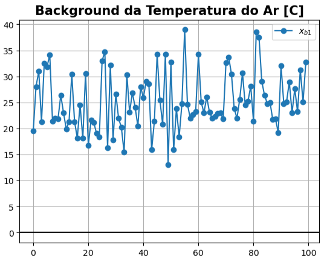
</div> 

</div>
</div>

---

<!-- Scoped style -->
<style scoped>
section {
  font-size: 21px;
}
.columns {
  display: grid;
  grid-template-columns: repeat(2, minmax(0, 1fr));
  gap: 1rem;
}
</style>

# Equação de Análise Empírica (Parte II)
 
<br /> 

<div class="columns">
<div>

## **Como é $\mathbf{x_{b}^\text{2}}$?**

<br /> 

```
xb2 = 
array([ 7.89139469, 11.31710662, 11.25834407,  9.22292483, 13.26257547,
       12.04543631, 10.23465704, 10.36606995, 11.76295757,  7.99277442,
        9.80580539,  8.19489576,  7.54437886, 10.77591642, 10.39955475,
        9.74753976,  4.40891481, 10.06259102,  7.3239466 ,  6.40381252,
        9.46414692, 12.86896694, 10.69276845, 14.36733922, 11.97592713,
        9.73146508, 10.05474521,  8.27184444,  8.75321919,  8.80315983,
       10.85022741,  8.91140828,  9.58006867,  7.72998353, 11.46220732,
       11.43792601, 12.36487809,  9.21566116,  8.44912914, 11.61916852,
       10.90650476,  6.34443491, 12.49797447,  6.137198  , 11.31107992,
       13.1470192 , 11.44730413,  8.71090181,  9.67011543, 11.48149101,
        9.75057685, 11.23484438, 11.59826051, 10.82835328, 12.11049565,
        9.45548633, 12.33087288,  9.73940959,  8.09861212, 12.55259241,
        7.18805016,  9.87995869,  5.67240723, 10.94419448,  6.92951379,
        9.70143301,  9.08007802, 12.14802447, 10.19793865, 10.65233924,
       10.963924  , 11.55152817,  4.6441757 , 11.63745689, 11.90119717,
       11.95825119,  9.24286262, 13.58813583, 14.1642769 , 12.37186956,
        9.28553247,  9.31752349,  9.51763214, 13.34954962,  8.8345092 ,
       10.39238047, 11.3412283 , 12.399684  ,  8.90520432, 12.40032624,
        7.96678845,  9.26881557, 11.5502632 ,  9.96591038, 10.74955336,
       11.52074654, 12.65951626, 12.83326151, 10.69785151,  9.89670125])
```

</div>
<div>

<br />
<br />
<br /> 

<div align="center">
  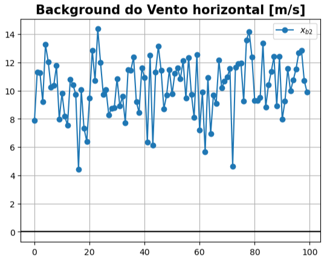
</div> 

</div>
</div>

  
---

<!-- Scoped style -->
<style scoped>
section {
  font-size: 21px;
}
.columns {
  display: grid;
  grid-template-columns: repeat(2, minmax(0, 1fr));
  gap: 1rem;
}
</style>

# Equação de Análise Empírica (Parte II)
 
<br /> 
<br /> 

<div class="columns">
<div>

## **Como é $\mathbf{x_{b}^\text{3}}$?**

<br /> 

```
xb3 = 
array([ 996.8880361 , 1003.08115118,  999.97617233, 1000.13327105,
        991.48361216,  995.84976209,  996.30653723, 1009.25491845,
        996.80281331, 1000.99401558,  998.82142829, 1004.24289653,
        996.85664595, 1013.77033688, 1003.30592647, 1005.52232586,
        999.20686366,  994.62184684, 1005.62742472, 1001.21459687,
       1000.35459829,  998.23323007,  999.64235681, 1001.87986157,
       1000.74507721,  998.31270317,  996.75214155,  990.52501866,
       1000.13389647,  990.90515357,  999.29005444, 1000.16553518,
...
       1002.3361858 , 1001.92798636,  989.55063344,  996.0905916 ,
       1002.60934246, 1011.72141294, 1010.22879591,  998.3758843 ,
        994.29775049,  994.11825428, 1005.92686155, 1006.06681313,
        994.25509972, 1003.12838654, 1001.28261554,  997.71676649,
       1004.9775312 ,  998.53027327,  995.86847976,  999.47741406,
        997.51047478,  997.69112758, 1007.13809055,  999.19446492,
        996.51733075,  997.52204916, 1005.22600936,  994.10177179])
```

</div>
<div>

<br /> 
<br /> 

<div align="center">
  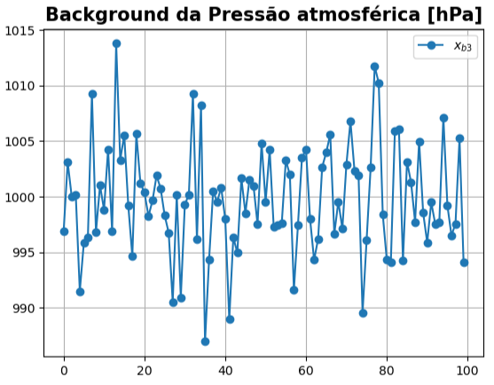
</div> 

</div>
</div>

---

<!-- Scoped style -->
<style scoped>
section {
  font-size: 21px;
}
.columns {
  display: grid;
  grid-template-columns: repeat(2, minmax(0, 1fr));
  gap: 1rem;
}
</style>

# Equação de Análise Empírica (Parte II)
 
<br /> 

## **As observações**

- O vetor observação $\mathbf{y_{o}^{\textit{n}}}$ para cada variável, pode ser definido de forma semelhante ao vetor background $\mathbf{x_{b}^{\textit{n}}}$ ($n \in [1,3]$), também com 100 elementos cada:

```
# Observações da Temperatura do Ar [C]

yo1 = xb1 + np.random.randn(100) * 3
```
```
# Observações do Vento Horizontal [m/s]

yo2 = xb2 + np.random.randn(100) * 2
```
```
# Observações da Pressão Atmosférica [hPa]

yo3 = xb3 + np.random.randn(100) * 4
```
  
---

<!-- Scoped style -->
<style scoped>
section {
  font-size: 21px;
}
.columns {
  display: grid;
  grid-template-columns: repeat(2, minmax(0, 1fr));
  gap: 1rem;
}
</style>

# Equação de Análise Empírica (Parte II)
 
<br /> 

<div class="columns">
<div>

## **Como é $\mathbf{y_{o}^\text{1}}$?**

<br /> 

```
yo1 = 
array([22.0712393 , 26.58791013, 28.14805192, 26.98159477, 35.23399823,
       33.40008597, 35.02158103, 21.64167556, 23.09235864, 26.7581439 ,
       25.60250411, 22.2851952 , 21.60054999, 19.41337962, 33.7859359 ,
       18.53437012, 21.64275727, 27.34204402, 12.81279131, 34.61906076,
       18.6932917 , 18.81008501, 21.40062741, 24.91801653, 20.4940796 ,
       34.1893406 , 30.95190393, 17.3819934 , 37.31104736, 18.46502053,
       28.05084568, 20.2676145 , 21.5593682 , 19.7744258 , 24.96566195,
       21.62261741, 27.08820325, 29.31410656, 18.47973529, 24.25416472,
       23.12769184, 25.10136771, 30.06111044, 17.24273538, 21.58330026,
       32.09020677, 27.56474563, 20.99475289, 37.04195311, 12.30406384,
       33.76675972, 15.56992676, 19.0061655 , 17.73779978, 24.84337806,
       38.15450086, 26.43742924, 20.82705709, 22.167535  , 25.75664848,
       34.35961501, 27.05852421, 18.23826217, 28.72354137, 22.2294522 ,
       25.26755696, 19.3101514 , 20.79101783, 26.64385568, 22.23610238,
       33.97735421, 34.55946135, 25.60156092, 20.78207244, 22.35560579,
       27.30155886, 29.82928653, 28.50606377, 24.75882271, 25.58798664,
       17.42761893, 39.6890225 , 39.15795835, 28.94022484, 22.60972549,
       20.20794155, 26.31603038, 19.99710402, 22.62536126, 21.65909853,
       32.96625744, 23.24176136, 26.33734637, 27.40711608, 25.58098425,
       22.14474225, 25.83748607, 24.34837869, 23.21031925, 33.13453801])
```

</div>
<div>

<br /> 
<br /> 
<br /> 

<div align="center">
  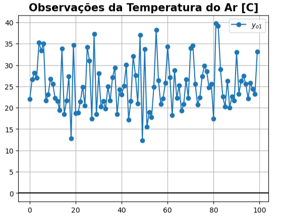
</div> 

</div>
</div>  

---

<!-- Scoped style -->
<style scoped>
section {
  font-size: 21px;
}
.columns {
  display: grid;
  grid-template-columns: repeat(2, minmax(0, 1fr));
  gap: 1rem;
}
</style>

# Equação de Análise Empírica (Parte II)
 
<br /> 

<div class="columns">
<div>

## **Como é $\mathbf{y_{o}^\text{2}}$?**

<br /> 

```
yo2 = 
array([ 4.18988815,  9.37460392, 10.7679655 ,  8.08458289, 16.24926569,
       14.30108474,  6.34047062, 10.11426126, 14.09465821,  8.26598524,
        6.19730716,  8.29706497,  4.0623404 ,  8.03324816, 11.85340907,
       13.14495454,  8.00195819, 11.57660517,  8.1154758 ,  6.32452072,
        9.64820965, 14.46329132,  9.24828971, 14.83472054, 15.1515784 ,
        9.33063813, 11.66734283, 10.20817894, 10.98699244,  6.04775072,
        9.31817934,  7.31846018,  9.42840878,  7.70830378, 12.93872419,
        9.33040986, 14.71326609,  8.86910384,  9.87305228, 15.76476408,
       13.24045813,  7.08111694, 14.1661612 ,  9.66428437, 11.87480323,
       16.97683911, 14.41572863,  8.94345535,  7.70911464, 11.02959723,
        9.99683187, 14.25997444, 10.43025165,  6.48407951,  9.6280322 ,
        9.71360869, 12.4138513 , 12.55751427,  9.99558739, 13.94852094,
        7.24681151, 12.98547236,  5.09213004, 14.8447996 , 10.14896282,
        6.4149297 , 11.43117218, 10.8370425 , 10.57713658, 13.51488394,
        7.37022493,  8.27861087,  8.87446208, 11.36219167,  9.73951402,
       12.8774461 ,  9.18332148, 11.28477962, 12.60024827, 11.91527289,
       10.96071101, 11.54910071,  7.75694468, 14.38380282,  9.82274468,
        9.92127001, 10.45692836, 12.44088767,  9.28426727, 12.27024771,
        8.43691615,  7.58471303, 13.33268913,  9.08476341,  9.67142117,
       13.02589387, 13.91438012,  9.00037576,  8.02441626,  8.72835341])
```

</div>
<div>

<br /> 
<br /> 
<br /> 

<div align="center">
  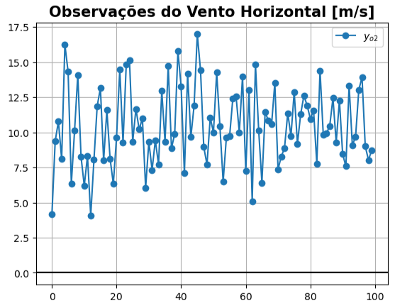
</div> 

</div>
</div>  

---

<!-- Scoped style -->
<style scoped>
section {
  font-size: 21px;
}
.columns {
  display: grid;
  grid-template-columns: repeat(2, minmax(0, 1fr));
  gap: 1rem;
}
</style>

# Equação de Análise Empírica (Parte II)
 
<br /> 

<div class="columns">
<div>

## **Como é $\mathbf{y_{o}^\text{3}}$?**

<br /> 

```
yo3 = 
array([ 995.46316584, 1001.83815365, 1002.60629618, 1002.882721  ,
        983.82955436,  998.42540759,  993.19980189, 1008.50573968,
        991.63923891, 1002.76353549, 1005.29946407, 1003.01109624,
        996.67824433, 1016.21970947, 1001.89346797, 1006.87587711,
        999.56306358,  992.52894043, 1003.81577561, 1005.3324725 ,
       1000.09066672,  995.57530359,  995.84004824,  999.35118141,
        999.74341359, 1000.98364998,  998.16868078,  995.22958019,
       1000.61306458, 1002.91621345,  997.41256208,  996.78433782,
       1005.76732347, 1001.16371745, 1004.98966941,  984.96552927,
        996.72893495, 1009.66660445, 1000.3310859 ,  992.31033854,
...
       1002.8943125 , 1001.618645  , 1009.0051308 ,  989.95562809,
        999.31630638,  994.19262375, 1002.59573404, 1002.29933836,
       1007.97648708, 1002.54962032,  989.61380801,  997.25814489,
        999.72884701, 1016.03008064, 1012.93582964,  996.65227536,
        999.88912342,  995.78890099, 1004.14727779, 1000.75434206,
        994.37429118, 1001.94229288, 1003.77489436,  995.0048657 ,
       1006.63879362, 1001.15311692,  995.76838989,  994.02725587,
        999.48654633,  998.64811864, 1005.76593828,  997.35828967,
        995.42593429,  997.83286157, 1007.4028775 ,  989.8213993 ])
```

</div>
<div>

<br /> 
<br /> 
<br /> 
<br /> 

<div align="center">
  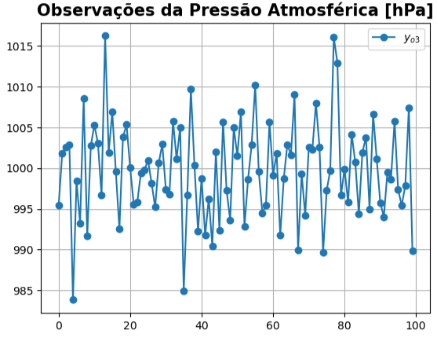
</div> 

</div>
</div>  

---

<!-- Scoped style -->
<style scoped>
section {
  font-size: 21px;
}
.columns {
  display: grid;
  grid-template-columns: repeat(2, minmax(0, 1fr));
  gap: 1rem;
}
</style>

# Equação de Análise Empírica (Parte II)
 
<br /> 

## **Distribuição Normal**

- Observe que $\mathbf{x_{b}^\text{1}}$ e $\mathbf{y_{o}^\text{1}}$ possuem distribuições próximas da normal:

<div align="center">
  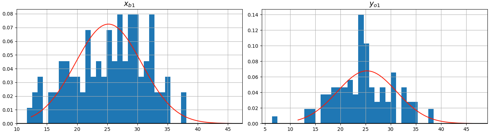
</div> 

---

<!-- Scoped style -->
<style scoped>
section {
  font-size: 21px;
}
.columns {
  display: grid;
  grid-template-columns: repeat(2, minmax(0, 1fr));
  gap: 1rem;
}
</style>

# Equação de Análise Empírica (Parte II)
 
<br /> 

## **Distribuição Normal**

- Observe que $\mathbf{x_{b}^\text{2}}$ e $\mathbf{y_{o}^\text{2}}$ possuem distribuições próximas da normal:

<div align="center">
  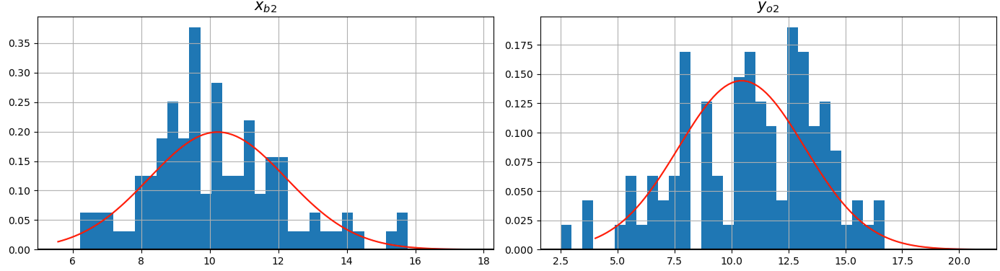
</div> 

---

<!-- Scoped style -->
<style scoped>
section {
  font-size: 21px;
}
.columns {
  display: grid;
  grid-template-columns: repeat(2, minmax(0, 1fr));
  gap: 1rem;
}
</style>

# Equação de Análise Empírica (Parte II)
 
<br /> 

## **Distribuição Normal**

- Observe que $\mathbf{x_{b}^\text{3}}$ e $\mathbf{y_{o}^\text{3}}$ possuem distribuições próximas da normal:

<div align="center">
  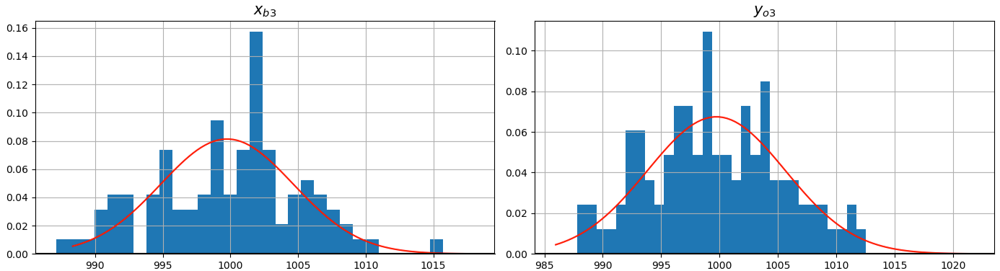
</div> 

---

<!-- Scoped style -->
<style scoped>
section {
  font-size: 21px;
}
.columns {
  display: grid;
  grid-template-columns: repeat(2, minmax(0, 1fr));
  gap: 1rem;
}
</style>

# Equação de Análise Empírica (Parte II)
 
<br /> 

## **Séries de $\mathbf{x_{b}^\textit{n}}$ e $\mathbf{y_{o}^\textit{n}}$**

- Com $\mathbf{x_{b}^\textit{n}}$ e $\mathbf{y_{o}^\textit{n}}$ definidos, podemos plotar os seus elementos:

<br />

<div align="center">
  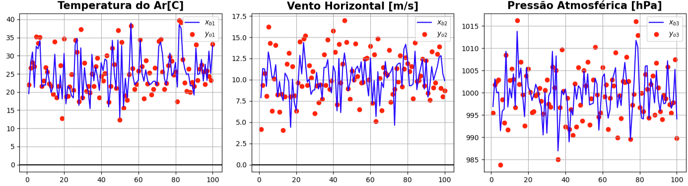
</div> 

---

<!-- Scoped style -->
<style scoped>
section {
  font-size: 21px;
}
.columns {
  display: grid;
  grid-template-columns: repeat(2, minmax(0, 1fr));
  gap: 1rem;
}
</style>

# Equação de Análise Empírica (Parte II)
 
<br /> 

## **Determinação de $\alpha^{n}$ (continua...)**

- Antes de determinarmos o parâmetro $\alpha^{n}$, precisamos saber o que ele é e como pode ser definido
- $\alpha^{n}$ é um parâmetro que relaciona as medidas das variâncias do background e das observações:

$$
\alpha^{n} = \frac{\sigma^2_{b,n}}{\sigma^2_{b,n} + \sigma^2_{o,n}}
$$

- Onde:
  * $\sigma^2_{b,n}$: é o enésimo vetor com as variâncias do background
  * $\sigma^2_{o,n}$: é o enésimo vetor com as variâncias das observações

* Os valores destes vetores são obtidos a partir das **matrizes de covariâncias** dos erros de background e observação
* Então, para calcular $\alpha^{n}$, precisamos determinar as matrizes de covariâncias dos erros de $\mathbf{x_{b}^\textit{n}}$ e $\mathbf{y_{o}^\textit{n}}$, as quais denominaremos $\mathbf{B}$ e $\mathbf{R}$, respectivamente

---

<!-- Scoped style -->
<style scoped>
section {
  font-size: 21px;
}
.columns {
  display: grid;
  grid-template-columns: repeat(2, minmax(0, 1fr));
  gap: 1rem;
}
</style>

# Equação de Análise Empírica (Parte II)
 
<br /> 
<br /> 
<br /> 

## **Erros $E(\mathbf{x_{b}^\textit{n}})$ e $E(\mathbf{y_{o}^\textit{n}})$**

<br /> 

- Vamos considerar que os erros dos elementos dos vetores $\mathbf{x_{b}^\textit{n}}$ e $\mathbf{y_{o}^\textit{n}}$ são randômicos, ou seja:
  * Não há relação entre os elementos dos dois vetores $\mathbf{x_{b}^\textit{n}}$ e $\mathbf{y_{o}^\textit{n}}$
  * Os erros dos elementos dos vetores $\mathbf{x_{b}^\textit{n}}$ e $\mathbf{y_{o}^\textit{n}}$ são randômicos, ou seja, não há relação entre os erros dos elementos do vetor background e entre os elementos do vetor observação
- Manteremos a distribuição destes erros de forma conhecida, vamos manter uma distribuição próxima à normal de forma que possamos controlar a média e o desvio padrão

---

<!-- Scoped style -->
<style scoped>
section {
  font-size: 21px;
}
.columns {
  display: grid;
  grid-template-columns: repeat(2, minmax(0, 1fr));
  gap: 1rem;
}
</style>

# Equação de Análise Empírica (Parte II)

<br />

## **Erros $E(\mathbf{x_{b}^\textit{n}})$ e $E(\mathbf{y_{o}^\textit{n}})$**

<br />

<div class="columns">
<div>

```
# Erro da Temperatura do ar [C]

errot = mdot + dpot * np.random.randn(len(x0)) # mdot = 1;   dpot = 1.5
errbt = mdbt + dpbt * np.random.randn(len(x0)) # mdbt = 2.5; dpbt = 4
```

```
# Erro do Vento horizontal [m/s]

errov = mdov + dpov * np.random.randn(len(x0)) # mdov = 1;   dpov = 1.5
errbv = mdbv + dpbv * np.random.randn(len(x0)) # mdbv = 3.2; dpbv = 1.5
```

```
# Erro da Pressão atmosférica [hPa]

errop = mdop + dpop * np.random.randn(len(x0)) # mdop = 1;   dpop = 1.5
errbp = mdbp + dpbp * np.random.randn(len(x0)) # mdbp = 2.8; dpbp = 2.1
```

</div>
<div>

<br />

- Onde:
  * $mdo[t,v,p]$: é a média dos erros da observação ($\mu_{o}^{n}$)
  * $mdb[t,v,p]$: é a média dos erros do background ($\mu_{b}^{n}$)
  * $dpo[t,v,p]$: é o desvio padrão dos erros da observação ($\sigma_{o}^{n}$)
  * $dpb[t,v,p]$: é o desvio padrão dos erros do background ($\sigma_{b}^{n}$)
 
</div>
</div>
  
---

<!-- Scoped style -->
<style scoped>
section {
  font-size: 21px;
}
.columns {
  display: grid;
  grid-template-columns: repeat(2, minmax(0, 1fr));
  gap: 1rem;
}
</style>

# Equação de Análise Empírica (Parte II)
 
<br />
<br />
 
## **Determinação de $\alpha^{n}$ (continuação)**

<br />
<br />

<div align="center">
  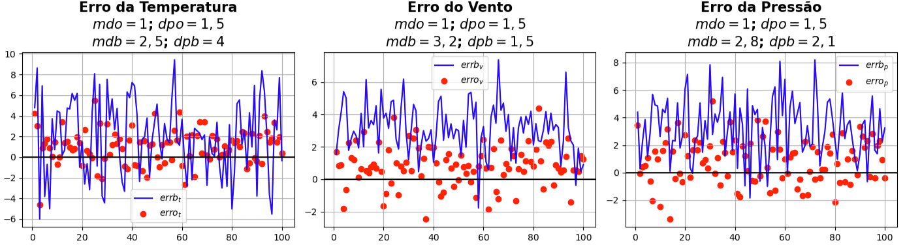
</div> 

---

<!-- Scoped style -->
<style scoped>
section {
  font-size: 21px;
}
.columns {
  display: grid;
  grid-template-columns: repeat(2, minmax(0, 1fr));
  gap: 1rem;
}
</style>

# Equação de Análise Empírica (Parte II)
 
## **Determinação de $\alpha^{n}$**
 
<br /> 
 
### Matrizes de covariâncias $\mathbf{B}$ e $\mathbf{R}$

- Utilizaremos os vetores $E(\mathbf{x_{b}^\textit{n}})$ e $E(\mathbf{y_{o}^\textit{n}})$ para montar a matriz de erros de $\mathbf{x_{b}^\textit{n}}$ e $\mathbf{y_{o}^\textit{n}}$:

```
xberr = [errbt, errbv, errbp]
yerr = [errot, errov, errop]
```

- O objetivo é calcular os pesos ($\alpha^{n}$ e $1-\alpha^{n}$) para cada uma das variáveis
- $\alpha^{n}$ depende das variâncias dos erros de observação e background
- Portanto, precisamos calcular as variâncias de $\mathbf{x_{b}^\textit{n}}$ e $\mathbf{y_{o}^\textit{n}}$

<div style="
  background-color: #f8d7da; 
  color: #721c24; 
  padding: 20px; 
  border-radius: 10px; 
  text-align: center;
  max-width: 600px;
  margin: 0 auto;
  margin-top:20px;
  font-size: 18px;
">
Por que as variâncias são extraídas das matrizes de covariâncias dos erros de <b>B</b> e <b>R</b>?
</div>

---

<!-- _footer: "" -->

<!-- Scoped style -->
<style scoped>
section {
  font-size: 21px;
}
.columns {
  display: grid;
  grid-template-columns: repeat(2, minmax(0, 1fr));
  gap: 1rem;
}
</style>

# Equação de Análise Empírica (Parte II)
 
## **Determinação de $\alpha^{n}$**
 
### Matrizes de covariâncias $\mathbf{B}$ e $\mathbf{R}$

```
B = np.cov(xberr)
B =
array([[13.60650668, -0.31684168, -0.51769936],
       [-0.31684168,  2.28237194, -0.28122762],
       [-0.51769936, -0.28122762,  4.61157545]])
```

```
R = np.cov(yerr)
R = 
array([[ 2.75319186,  0.32594188,  0.16132722],
       [ 0.32594188,  1.54012175, -0.04601199],
       [ 0.16132722, -0.04601199,  2.59092547]])
```

``` 
xbvar = np.diag(B)
xbvar = array([13.60650668,  2.28237194,  4.61157545])

yvar = np.diag(R)
yvar = array([2.75319186, 1.54012175, 2.59092547])
```

---

<!-- Scoped style -->
<style scoped>
section {
  font-size: 21px;
}
.columns {
  display: grid;
  grid-template-columns: repeat(2, minmax(0, 1fr));
  gap: 1rem;
}
</style>

# Equação de Análise Empírica (Parte II)

<br />
<br />

## **Determinação de $\alpha^{n}$**

<br />

- Cálculo de $\alpha$ para cada uma das variáveis (temperatura, vento e pressão):

```
alphat = xbvar[0] / (xbvar[0] + yvar[0])
alphat = 0.8317088881282084
```

```
alphav = xbvar[1] / (xbvar[1] + yvar[1])
alphav = 0.5970897856560147
```

```
alphap = xbvar[2] / (xbvar[2] + yvar[2])
alphap = 0.6402741905463747
``` 

---

<!-- Scoped style -->
<style scoped>
section {
  font-size: 21px;
}
.columns {
  display: grid;
  grid-template-columns: repeat(2, minmax(0, 1fr));
  gap: 1rem;
}
</style>

# Equação de Análise Empírica (Parte II)
 
<br /> 
<br /> 
 
## **Cálculo de $\mathbf{x_{a}^\textit{n}}$** 

<br /> 

- Observando novamente a equação da análise, notamos que todos os parâmetros estão determinados:

$$
\mathbf{x_{a}^{\textit{n}}} = \alpha^{n}\mathbf{y_{o}^{\textit{n}}} + (1 - \alpha^{n})\mathbf{x_{b}^{\textit{n}}}
$$

- Onde:
  * $\mathbf{x_{a}^{\textit{n}}}$: é o vetor análise da enésima variável
  * $\mathbf{x_{b}^{\textit{n}}}$: é o vetor background da enésima variável
  * $\mathbf{y_{o}^{\textit{n}}}$: é o vetor observação da enésima variável
  * $\alpha^{n}$: é um vetor com os pesos dado à observação 
  * $1 - \alpha^{n}$: é um vetor com os pesos dado ao background)

---

<!-- Scoped style -->
<style scoped>
section {
  font-size: 21px;
}
.columns {
  display: grid;
  grid-template-columns: repeat(2, minmax(0, 1fr));
  gap: 1rem;
}
</style>

# Equação de Análise Empírica (Parte II)
 
## **Cálculo de $\mathbf{x_{a}^\text{1}}$** 

```
xat = alphat * yo1 + (1 - alphat) * xb1

xat = 
array([21.64585996, 26.82895487, 28.62621553, 26.02497186, 34.78441578,
       33.14424685, 34.87158266, 21.59034168, 22.90341972, 25.93673737,
       25.73845284, 22.40515889, 21.30827765, 19.73550633, 33.21396673,
       19.00420864, 21.05697961, 26.87667455, 13.70079166, 33.94074042,
       18.36679298, 19.2859565 , 21.35246406, 23.92749393, 20.13758692,
       33.99190688, 31.5834049 , 17.20278525, 36.43926208, 18.35750701,
       27.81732948, 20.54508977, 21.33576184, 19.0447518 , 25.87168108,
       21.8733652 , 27.05056888, 28.43645251, 18.81155787, 24.89075059,
       23.59029667, 25.76748034, 29.81794979, 17.01992451, 21.55176565,
       32.44769654, 27.20829886, 20.96793727, 36.576706  , 12.420969  ,
       33.59687526, 15.62819075, 19.81063524, 17.85339707, 24.82663292,
       38.28972781, 26.14245916, 21.02813335, 22.24992691, 25.33216327,
       34.34241965, 26.72844105, 19.03370746, 28.27909516, 22.38590408,
       24.71447359, 19.81601665, 21.15012603, 26.02976714, 22.16481243,
       33.74212037, 34.4115777 , 26.41382757, 21.28852505, 22.29234708,
       27.01824987, 29.97331588, 27.82767713, 24.84309164, 26.01341121,
       18.08848403, 39.49919751, 38.88500865, 28.96570691, 23.24169712,
       20.9824131 , 26.09676702, 20.28374327, 22.48791597, 21.24390214,
       32.81748786, 23.50515058, 26.123365  , 27.66779391, 25.14895572,
       23.06779448, 25.39341323, 25.506794  , 23.53258134, 33.06252768])
```
    
---

<!-- Scoped style -->
<style scoped>
section {
  font-size: 21px;
}
.columns {
  display: grid;
  grid-template-columns: repeat(2, minmax(0, 1fr));
  gap: 1rem;
}
</style>

# Equação de Análise Empírica (Parte II)
 
## **Cálculo de $\mathbf{x_{a}^\text{2}}$** 

```
xav = alphav * yo2 + (1 - alphav) * xb2

xav = 
array([ 5.68126295, 10.1572581 , 10.96554403,  8.54323248, 15.04589769,
       13.39226095,  7.90947811, 10.21571755, 13.1551922 ,  8.15590581,
        7.65120796,  8.25589995,  5.46528926,  9.13829722, 11.26763631,
       11.77610142,  6.55428431, 10.9665934 ,  7.7965606 ,  6.35646819,
        9.57404889, 13.82092174,  9.83028495, 14.64640784, 13.87207607,
        9.4921354 , 11.01761077,  9.42800999, 10.08698238,  7.15793319,
        9.93545716,  7.96027524,  9.4895141 ,  7.71703878, 12.34382046,
       10.17954964, 13.76707657,  9.00873533,  9.2993391 , 14.09446129,
       12.30008448,  6.78430023, 13.49403173,  8.24318524, 11.64767335,
       15.43376555, 13.21972008,  8.84975715,  8.49922189, 11.21166985,
        9.89761321, 13.04111864, 10.90085435,  8.23443179, 10.62824208,
        9.60960856, 12.38041845, 11.42207111,  9.23127668, 13.38608708,
        7.22313596, 11.73422918,  5.32592965, 13.27320596,  8.85181392,
        7.73909545, 10.48389233, 11.36525053, 10.42435386, 12.36153544,
        8.81816299,  9.59730268,  7.17003649, 11.47309884, 10.61047824,
       12.50709308,  9.20731121, 12.21282537, 13.23041138, 12.09924035,
       10.28576446, 10.64997545,  8.46634364, 13.96709164,  9.42457451,
       10.11108523, 10.81322184, 12.42428629,  9.13153894, 12.32265768,
        8.2474969 ,  8.26325515, 12.61453152,  9.43978652, 10.10581164,
       12.41945464, 13.40878265, 10.54468458,  9.10157063,  9.19909269])
```       

---

<!-- Scoped style -->
<style scoped>
section {
  font-size: 21px;
}
.columns {
  display: grid;
  grid-template-columns: repeat(2, minmax(0, 1fr));
  gap: 1rem;
}
</style>

# Equação de Análise Empírica (Parte II)
 
## **Cálculo de $\mathbf{x_{a}^\text{3}}$** 

```
xap = alphap * yo3 + (1 - alphap) * xb3

xap = 
array([ 995.97572845, 1002.28529195, 1001.66017275, 1001.89367289,
        986.5829165 ,  997.49888143,  994.31737477, 1008.77523862,
        993.49670989, 1002.12699351, 1002.96914741, 1003.45420659,
        996.74242   , 1015.33860694, 1002.40156575, 1006.38896979,
        999.43492928,  993.28181289, 1004.46747255, 1003.85116636,
       1000.18560972,  996.53142834,  997.20783677, 1000.26081293,
       1000.10373785, 1000.02284147,  997.65911506,  993.53722799,
       1000.44069544,  998.59552522,  998.08794454,  998.00064178,
       1007.02729788,  999.3498906 , 1006.16150425,  985.67556906,
...
       1000.96499715, 1000.43367156,  992.66057211,  997.83467532,
       1002.80930211, 1002.4613988 , 1007.78060607,  992.36485176,
        999.39430704,  995.24780232, 1002.70102879, 1003.91223628,
       1005.94752513, 1002.32600254,  989.59108249,  996.83814584,
       1000.76503557, 1014.48014166, 1011.96203974,  997.27230198,
        997.87776226,  995.18792625, 1004.78744   , 1002.66537502,
        994.33141494, 1002.36896138, 1002.87835734,  995.98040641,
       1006.04119465, 1000.20961237,  995.8043948 ,  995.98781844,
        998.77570239,  998.30386426, 1006.25953686,  998.0188093 ,
        995.81853777,  997.72105433, 1006.61980185,  991.36115976])
```        

---

<!-- Scoped style -->
<style scoped>
section {
  font-size: 21px;
}
.columns {
  display: grid;
  grid-template-columns: repeat(2, minmax(0, 1fr));
  gap: 1rem;
}
</style>

# Equação de Análise Empírica (Parte II)
 
<br /> 
<br />  
 
## **Cálculo de $\mathbf{x_{a}^\text{1}}$**

<br /> 

<div align="center">
  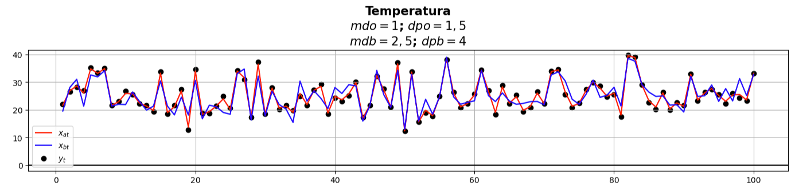
</div> 

---

<!-- Scoped style -->
<style scoped>
section {
  font-size: 21px;
}
.columns {
  display: grid;
  grid-template-columns: repeat(2, minmax(0, 1fr));
  gap: 1rem;
}
</style>

# Equação de Análise Empírica (Parte II)

<br /> 
<br /> 

## **Cálculo de $\mathbf{x_{a}^\text{2}}$**

<br /> 

<div align="center">
  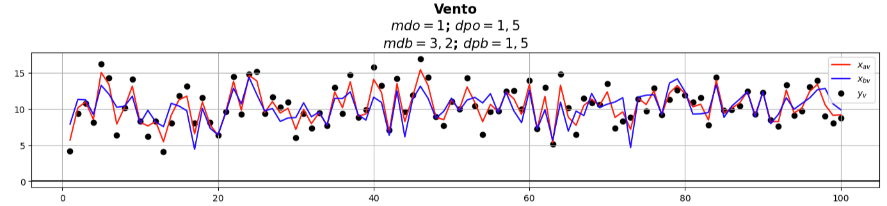
</div> 

---

<!-- Scoped style -->
<style scoped>
section {
  font-size: 21px;
}
.columns {
  display: grid;
  grid-template-columns: repeat(2, minmax(0, 1fr));
  gap: 1rem;
}
</style>

# Equação de Análise Empírica (Parte II)

<br /> 
<br /> 
 
## **Cálculo de $\mathbf{x_{a}^\text{3}}$** 

<br /> 

<div align="center">
  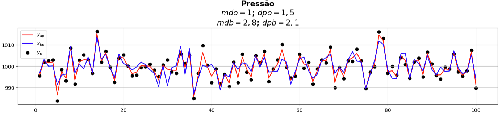
</div> 

---

<!-- Scoped style -->
<style scoped>
section {
  font-size: 21px;
}
.columns {
  display: grid;
  grid-template-columns: repeat(2, minmax(0, 1fr));
  gap: 1rem;
}
</style>

# Equação de Análise Empírica (Parte II)

<br /> 

## **Conclusão**

- Realizamos um ajustamento de curvas utilizando valores randômicos distribuídos normalmente para simular quantidades físicas 
- Em ambos os casos, univariado e multivariado, conseguimos fazer com que o background se ajustasse às observações, de forma que parte do ruído do background foi filtrado
- Mesmo de forma bastante simples, estes dois exemplos mostram o que se pretende fazer com a assimilação de dados: 
  * Utilizar o máximo de informações observacionais disponíveis para minimizar os efeitos do ruído no modelo (no sentido do método dos mínimos quadrados)
  * Corrigir e/ou atualizar o estado do background utilizando as observações

<br />  
  
🎲 Notebook com <a href="https://colab.research.google.com/github/cfbastarz/MET563-3/blob/main/atividade_02_equacao_de_analise_empirica.ipynb" target="_blank">Atividade Prática 2</a>

---

<!-- Scoped style -->
<style scoped>
section {
  font-size: 21px;
}
</style>


# :thinking: Dúvidas

<br />
<br />
<br />
<br />
<br />
<br />
<br />

:link: https://cfbastarz.github.io/met563-3/
:octopus: https://github.com/cfbastarz/MET563-3
:email: carlos.bastarz@inpe.br
