<!-- _footer: "" -->


<!-- Scoped style -->
<style scoped>
section {
  font-size: 21px;
}
span.date {
  font-size: 15px;
}
span.program {
  font-size: 18px;
}
</style>

<style>
span.footnote {
    border-top: 0.1em dotted #555;
    font-size: 60%;
    margin-top: auto;
    position:absolute;
    bottom:0;
    width:100%;
    height:60px;    
}
</style>

# **Introdução à Assimilação de Dados (MET 563-3)**

### Motivação - Equação de Análise Empírica (Parte I)

<p>Dr. Carlos Frederico Bastarz
<br />
Dr. Dirceu Luis Herdies
<br />
<br />
<span class="program">Programa de Pós-Graduação em Meteorologia (PGMET) do INPE</span>
<br />
<br />
<span class="date">22 de Setembro de 2025</span>
</p>

---

<!-- Scoped style -->
<style scoped>
section {
  font-size: 21px;
}
.columns {
  display: grid;
  grid-template-columns: repeat(2, minmax(0, 1fr));
  gap: 1rem;
}
</style>

# Equação de Análise Empírica
 
<br /> 

## **Motivação**

<br /> 
 
<div class="columns">
<div>

- Esta é uma primeira aproximação para o problema de análise univariada
- Isto significa, na prática, que estamos tratando de um conjunto (ou uma série) de observações de uma mesma quantidade (e.g., temperatura)
- Considere um modelo matemático simples:

$$
f(x) = \sin(x) + \varepsilon, \quad \varepsilon \sim \mathcal{N}(0, \sigma^2), \quad -\pi \le x \le \pi
$$

* A função seno com a adição de um ruído normalmente distribuído


</div>
<div>

<div align="center">
  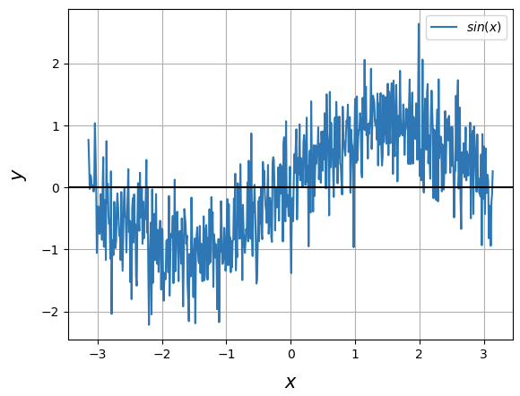
</div> 

</div>
</div> 
 
---

<!-- Scoped style -->
<style scoped>
section {
  font-size: 21px;
}
</style>

# Equação de Análise Empírica 
 
<br /> 

## **Motivação**

<br />   
 
- Suponha que possamos utilizar este modelo para ajustar uma curva produzida a partir de uma distribuição normal randômica utilizando uma **equação de análise empírica**:

$$
x_{a} = \alpha y_{o} + (1-\alpha)x_{b}
$$

- Onde:
  - $x_{a}$: é o vetor análise
  - $x_{b}$: é o vetor background
  - $y_{o}$: é o vetor observação
  - $\alpha$: é um peso escalar dado à observação e ao background
  
---

<!-- _footer: "" -->

<!-- Scoped style -->
<style scoped>
section {
  font-size: 21px;
}
.columns {
  display: grid;
  grid-template-columns: repeat(2, minmax(0, 1fr));
  gap: 1rem;
}
</style>

# Equação de Análise Empírica  

<div class="columns">
<div>

## **O modelo**

- Já sabemos que o nosso modelo é a função seno. Então, vamos definir um domínio para a nossa função. Seja $x_{0}$ um vetor com 629 elementos de 1 a 629:

```
x0 = np.arange(1,630,1)
```

- Como nosso modelo é a função seno, vamos aplicar a função aos elementos do nosso domínio e vamos nomear de $x_{b}$ o vetor com a imagem da nossa função, ou melhor, $x_{b}$ é o nosso background:

```
xb = np.sin(x0) + ruido
```

</div>
<div>

## **Como é $x_{b}$?**

```
xb = 
array([ 1.60624883e+00,  1.32688359e+00,  1.36485484e-01, -5.28018657e-01, ...
       -1.70776972e+00, -1.23210461e+00, -4.33982552e-01, 8.86349535e-01])
```

<div align="center">
  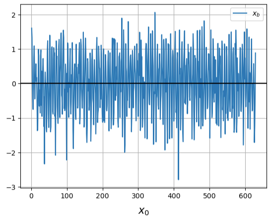
</div> 

</div>
</div>

---

<!-- Scoped style -->
<style scoped>
section {
  font-size: 21px;
}
.columns {
  display: grid;
  grid-template-columns: repeat(2, minmax(0, 1fr));
  gap: 1rem;
}
</style>

# Equação de Análise Empírica

<br />

<div class="columns">
<div>

## **As observações**

- O vetor observação $y_{o}$, pode ser definido de forma semelhante ao vetor background $x_{b}$:

```
mu_true = 0
sigma_true = 1
s = np.random.normal(mu_true, sigma_true, 629)
y = xb + np.sin(s)
```

## **Como é $y_{o}$?** 

```
y = 
array([ 8.63703635e-01,  1.61015360e+00,  5.87457172e-01, -1.50481750e+00, ...
       -9.50091116e-01, -1.64829028e+00,  5.60348293e-01, 5.84897816e-02])
``` 

</div>
<div>

<br />
<br />
<br />

<div align="center">
  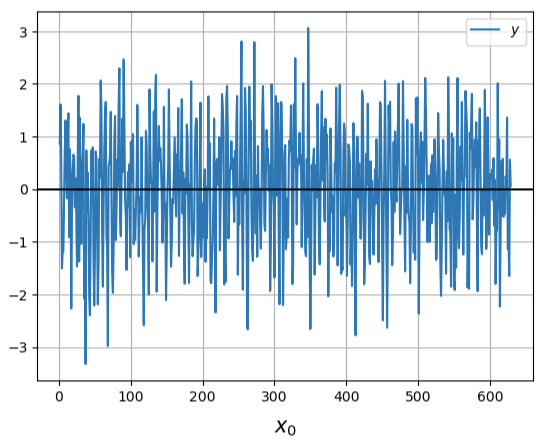
</div> 

</div>
</div>

---

<!-- Scoped style -->
<style scoped>
section {
  font-size: 21px;
}
</style>

# Equação de Análise Empírica   
 
<br />
 
## **Distribuição Normal**

- Observe que ambos, $x_{b}$ e $y_{o}$, possuem distribuição normal, isto é, ambos são representados por valores aleatórios distribuídos sobre uma curva normal com $\mu_{xb} = 0,0019$ e $\sigma_{xb} = 0,8909$ e $\mu_{y} = -0.011$ e $\sigma_{y} = 0.8563$:
 
 
<div align="center">
  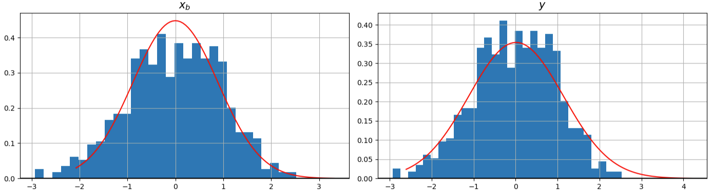
</div> 

---

<!-- Scoped style -->
<style scoped>
section {
  font-size: 21px;
}
.columns {
  display: grid;
  grid-template-columns: repeat(2, minmax(0, 1fr));
  gap: 1rem;
}
</style>

# Equação de Análise Empírica  

<div class="columns">
<div>

<br />

## **Distribuição Normal**

- Estamos mantendo as distribuições de $x_{b}$ e $y_{o}$ próximas à distribuição normal, porque esta distribuição possui as seguintes propriedades:

$$
f(\psi) = \frac{1}{\sigma\sqrt{2\pi}}{e}^{-\frac{(\psi-\mu)^{2}}{2\sigma^{2}}}
$$

* ~68% dos valores encontram-se a uma distância da média inferior a um desvio-padrão
* ~95% dos valores encontram-se a uma distância da média inferior a duas vezes o desvio-padrão
* ~99,7% dos valores encontram-se a uma distância da média inferior a três vezes o desvio-padrão

</div>
<div>

<br />
<br />
<br />
<br />
<br />
<br />

<div align="center">
  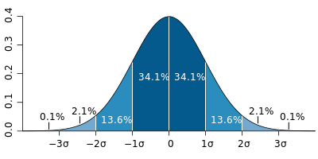
</div> 

</div>
</div>

---

<!-- _footer: "" -->

<!-- Scoped style -->
<style scoped>
section {
  font-size: 21px;
}
</style>

# Equação de Análise Empírica  
 
<br />
 
## **Séries de $x_{b}$ e $y_{o}$**

- Com $x_{b}$ e $y_{o}$ definidos, podemos plotar os seus elementos:

<br />

<div align="center">
  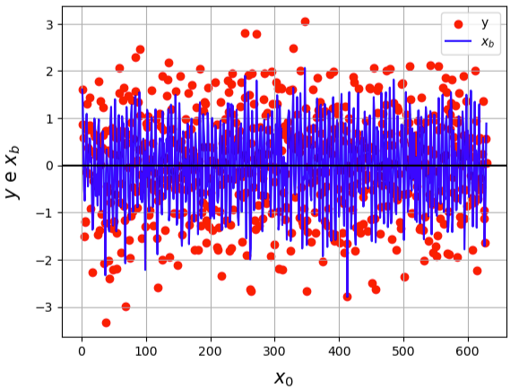
</div> 

---

<!-- Scoped style -->
<style scoped>
section {
  font-size: 21px;
}
</style>

# Equação de Análise Empírica  
 
<br /> 
<br /> 
 
## **Equação de Análise Empírica**

- Olhando para nossa equação de análise empírica, percebemos que os elementos $x_{b}$ e $y_{o}$ já estão definidos
- Ainda precisamos determinar o parâmetro $\alpha$, que é o peso a ser atribuído às observações
- $1-\alpha$ é um outro peso que será atribuído ao background - **por que?**
- Uma vez determinado o valor de $\alpha$, determinaremos $1-\alpha$ e, consequentemente, o valor de $x_{a}$, o vetor análise (representado da mesma forma que $x_{b}$ e $y_{o}$):

<br /> 

$$
x_{a} = \alpha  y_{o} + (1-\alpha)  x_{b}
$$

---

<!-- Scoped style -->
<style scoped>
section {
  font-size: 21px;
}
</style>

# Equação de Análise Empírica
 
<br /> 
<br /> 
 
## **Determinação de $\alpha$**

<br />

- Antes de determinarmos o parâmetro $\alpha$, precisamos saber o que ele é e como pode ser definido
- $\alpha$ é um parâmetro que relaciona as medidas das variâncias das parcelas:

$$
\alpha = \frac{\sigma_{b}^{2}}{\sigma_{b}^{2}+\sigma_{o}^{2}}
$$

- Onde:
  - $\sigma_{b}^{2}$ e $\sigma_{o}^{2}$ são as variâncias do background e das observações
- Para calcular $\alpha$, precisamos calcular as variâncias dos vetores $x_{b}$ e $y_{o}$ 
  

---

<!-- Scoped style -->
<style scoped>
section {
  font-size: 21px;
}
.columns {
  display: grid;
  grid-template-columns: repeat(2, minmax(0, 1fr));
  gap: 1rem;
}
</style>

# Equação de Análise Empírica 
 
<br /> 
<br /> 
 
## **Erros $E(x_{b})$ e $E(y_{o})$**  
 
<br />  
 
<div class="columns">
<div> 
 
- A variância é uma medida de dispersão
- Ela pode ser calculada com base no erro da distribuição dos valores
- Vamos fazer as seguintes considerações:
  1. Não há relação entre os elementos dos dois vetores $x_{b}$ e $y_{o}$
  2. Os erros dos elementos dos vetores $x_{b}$ e $y_{o}$ são radômicos, ou seja, não há relação entre os erros dos elementos do vetor background e entre os elementos do vetor observação 
</div>
<div>

<div>

```
errb = mdb + dpb * np.random.randn(len(x0))
erro = mdo + dpo * np.random.randn(len(x0))
```
  
- Onde:
  - $mdo$: média da observação ($\mu_{o}$)
  - $mdb$: média do background ($\mu_{b}$)
  - $dpo$: desvio-padrão da observação ($\sigma_{o}$)
  - $dpb$: desvio-padrão do background ($\sigma_{b}$)
  
</div>
</div>
  
---

<!-- Scoped style -->
<style scoped>
section {
  font-size: 21px;
}
.columns {
  display: grid;
  grid-template-columns: repeat(2, minmax(0, 1fr));
  gap: 1rem;
}
</style>

# Equação de Análise Empírica 

<br />

## **Testando alguns valores de $\sigma_{b}$ e $\sigma_{o}$**

- Exemplo da série dos erros de background $E(x_{b})$ e observação $E(y_{o})$:

<br />

<div class="columns">
<div>

<div align="center">
  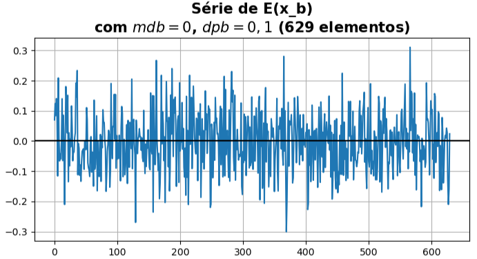
</div> 

</div>
<div>

<div align="center">
  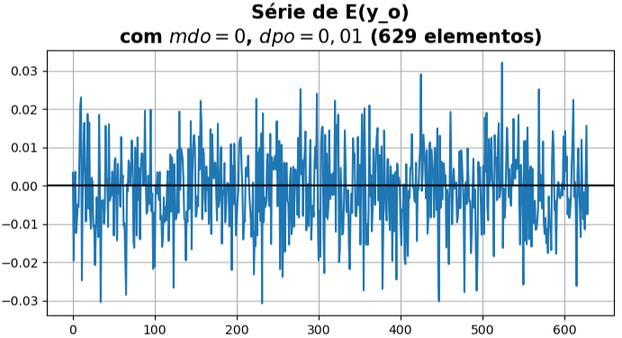
</div> 

</div>
</div>
 
---

<!-- Scoped style -->
<style scoped>
section {
  font-size: 21px;
}
.columns {
  display: grid;
  grid-template-columns: repeat(2, minmax(0, 1fr));
  gap: 1rem;
}
</style>

# Equação de Análise Empírica 

<br />

## **Testando alguns valores de $\sigma_{b}$ e $\sigma_{o}$**

- Exemplo da distribuição dos erros de background $E(x_{b})$ e observação $E(y_{o})$:

<br />

<div class="columns">
<div>

<div align="center">
  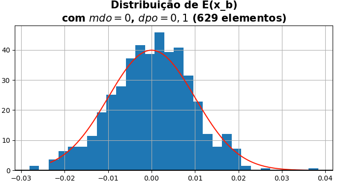
</div> 

</div>
<div>

<div align="center">
  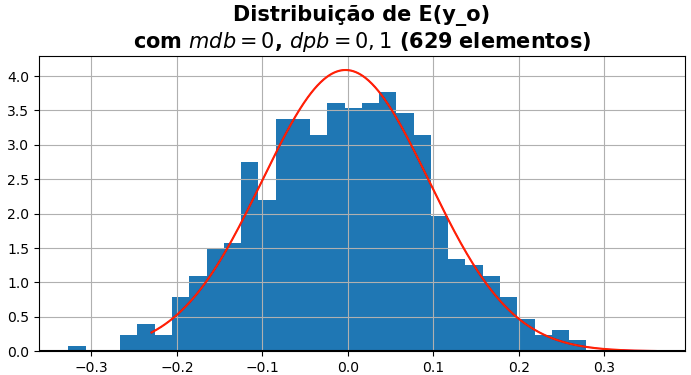
</div> 

</div>
</div> 

---
 
<!-- Scoped style -->
<style scoped>
section {
  font-size: 21px;
}
.columns {
  display: grid;
  grid-template-columns: repeat(2, minmax(0, 1fr));
  gap: 1rem;
}
</style>

# Equação de Análise Empírica 

<br />

## **Variância dos erros $\sigma_{b}^2$ e $\sigma_{o}^2$**

- Dado que $\alpha$ depende dos valores das variâncias das distribuições dos erros de background e observação, calculamos $\sigma_{b}^2$ e $\sigma_{o}^2$:

```
sigmab2 = np.var(errb)
sigmao2 = np.var(erro)
```

- Partindo-se dos valores das distribuições de $E(x_{b})$ e $E(y_{o})$, obtemos as seguintes variâncias:

```
sigmab2 = 0.0095226361060977
sigmao2 = 0.00011333207595536619
```
 
<div style="
  background-color: #f8d7da; 
  color: #721c24; 
  padding: 20px; 
  border-radius: 10px; 
  text-align: center;
  max-width: 600px;
  margin: 0 auto;
  margin-top:20px;
  font-size: 18px;
">
A variância dos erros de observação é muito menor do que a variância dos erros de background
</div>
 
---
 
<!-- Scoped style -->
<style scoped>
section {
  font-size: 21px;
}
.columns {
  display: grid;
  grid-template-columns: repeat(2, minmax(0, 1fr));
  gap: 1rem;
}
</style>

# Equação de Análise Empírica  

<br /> 
<br /> 

## **Cálculo de $\alpha$**

<br /> 
 
- Com os valores de $\sigma_{b}^2$ e $\sigma_{o}^2$, o valor de $\alpha$ é calculado:

```
alpha = sigmab2 / (sigmab2 + sigmao2)
alpha = 0.9882386415340758
```
 
- Da equação de análise empírica, observamos que 99% do peso é dado para as observações, enquanto que 1% $(1-\alpha)$ de peso é dado para o background

<br /> 

$$
x_{a} = \alpha y_{o} + (1-\alpha) x_{b}
$$
 
---
 
<!-- Scoped style -->
<style scoped>
section {
  font-size: 21px;
}
.columns {
  display: grid;
  grid-template-columns: repeat(2, minmax(0, 1fr));
  gap: 1rem;
}
</style>

# Equação de Análise Empírica 

<br /> 
<br /> 

## **Cálculo de $x_{a}$**

<br />
 
- Observando novamente a equação da análise, notamos que todos os parâmetros estão determinados:

<br />

$$
x_{a} = \alpha y_{o} + (1-\alpha) x_{b}
$$

<br />

- $\alpha$: é um valor único ($\alpha \approx 0,99$)
- $y_{o}$: é um vetor com valores "observados" de apenas uma grandeza (e.g., temperatura)
- $x_{b}$: é um vetor com valores produzidos (calculados) por um modelo matemático (neste caso, a função seno adicionada de um ruído de distribuição próxima da normal)
 
---
 
<!-- Scoped style -->
<style scoped>
section {
  font-size: 21px;
}
.columns {
  display: grid;
  grid-template-columns: repeat(2, minmax(0, 1fr));
  gap: 1rem;
}
</style>

# Equação de Análise Empírica

<br /> 
<br />

<div class="columns">
<div>

## **Cálculo de $x_{a}$**

<br />


$$
x_{a} = \alpha y_{o} + (1-\alpha) x_{b}
$$

<br />

```
xa = alpha * y + (1 - alpha) * xb

xa = 
array([-2.97708719e-01,  9.10349665e-01,  4.99888690e-01, -3.03402470e-01, ...
       -2.54933099e-02, -6.02816581e-01,  2.19151299e-01, 3.04442057e-01])
```

</div>
<div>

<div align="center">
  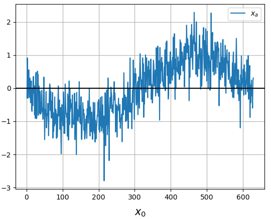
</div> 

</div>
</div>

---
 
<!-- _footer: "" --> 
 
<!-- Scoped style -->
<style scoped>
section {
  font-size: 21px;
}
.columns {
  display: grid;
  grid-template-columns: repeat(2, minmax(0, 1fr));
  gap: 1rem;
}
</style>

# Equação de Análise Empírica

## **Plotando todos os resultados juntos**

<br /> 

<div class="columns">
<div>

<div align="center">
  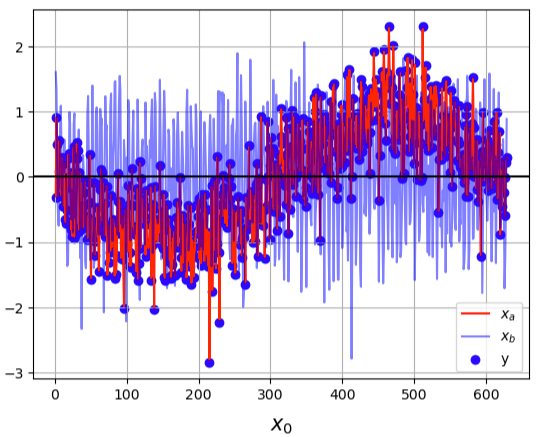
</div> 

</div>
<div>

<br />
<br />

- Observe que a análise (curva vermelha) representa o ajuste do background (curva azul) às observações (pontos azuis)
- Quanto mais precisa a observação, melhor o ajuste

<br />

🎲 Notebook com <a href="https://colab.research.google.com/github/cfbastarz/MET563-3/blob/main/atividade_01_equacao_de_analise_empirica.ipynb" target="_blank">Atividade Prática 1</a>

</div>
</div>

---

<!-- Scoped style -->
<style scoped>
section {
  font-size: 21px;
}
</style>


# :thinking: Dúvidas

<br />
<br />
<br />
<br />
<br />
<br />
<br />

:link: https://cfbastarz.github.io/met563-3/
:octopus: https://github.com/cfbastarz/MET563-3
:email: carlos.bastarz@inpe.br
