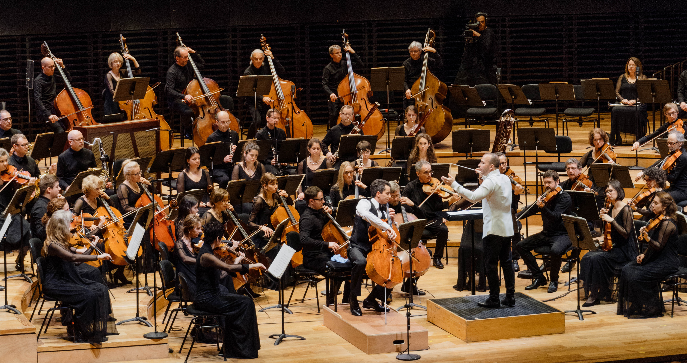
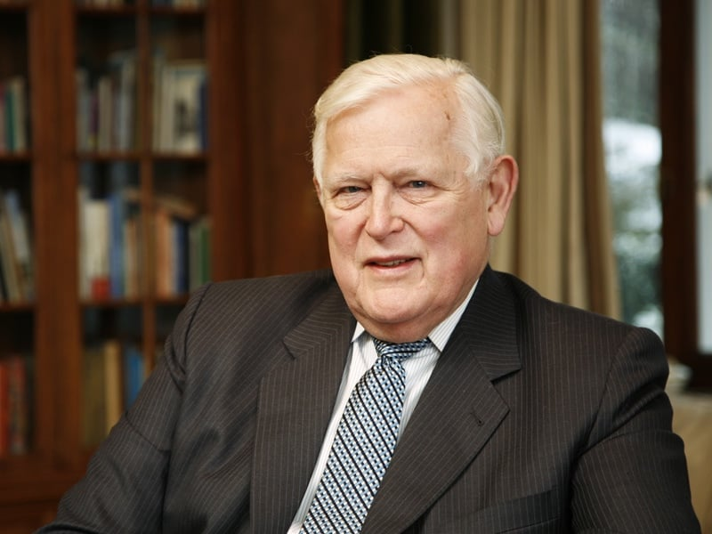
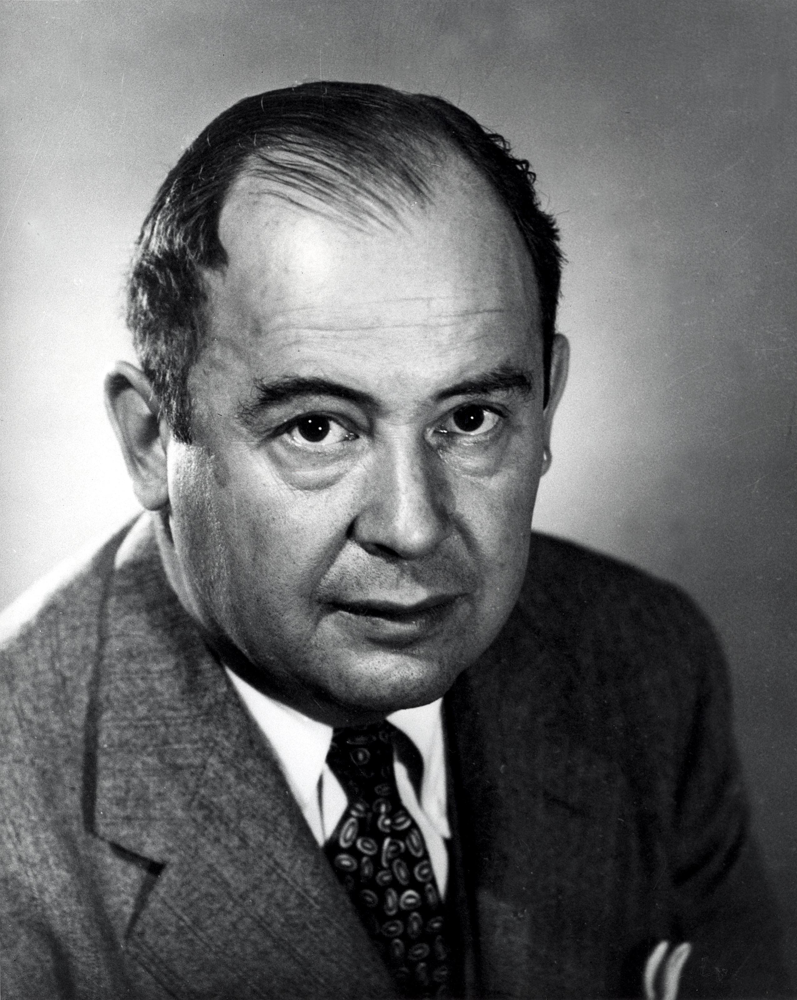
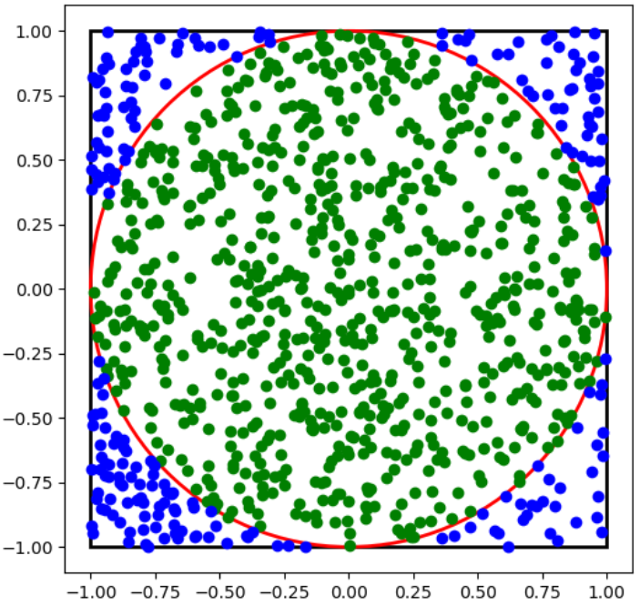
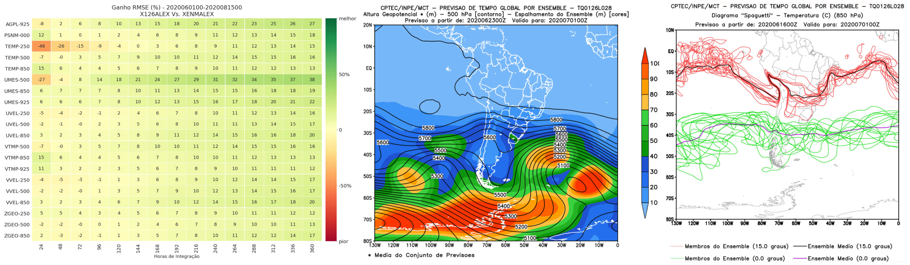
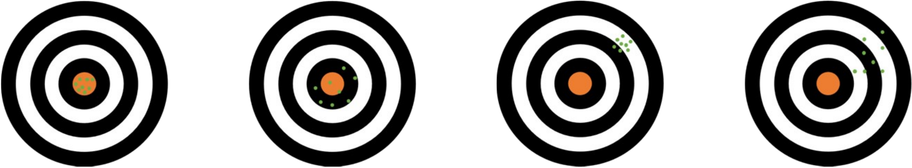
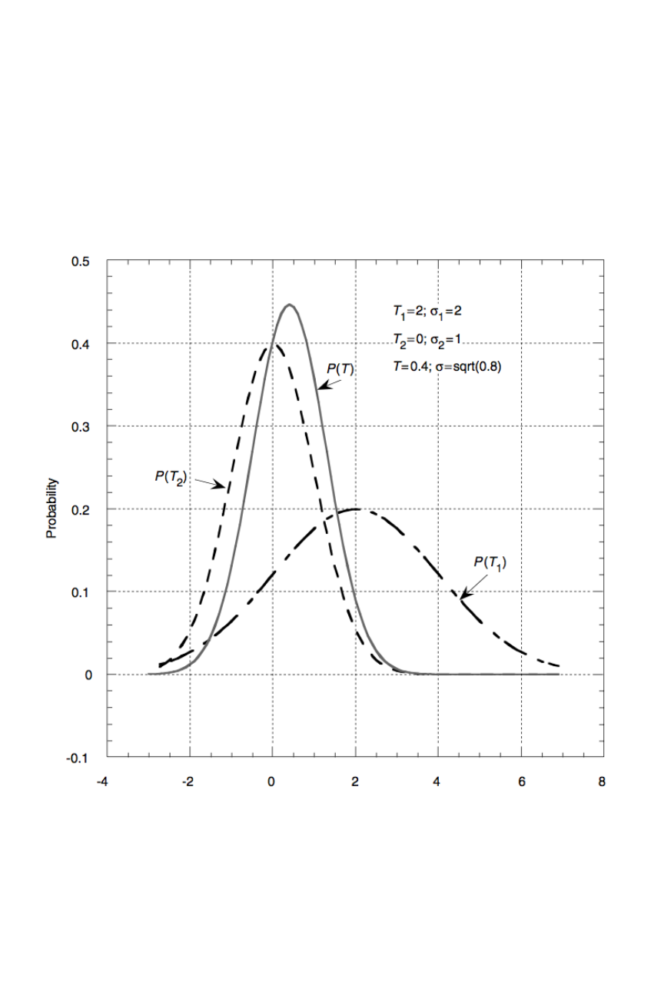
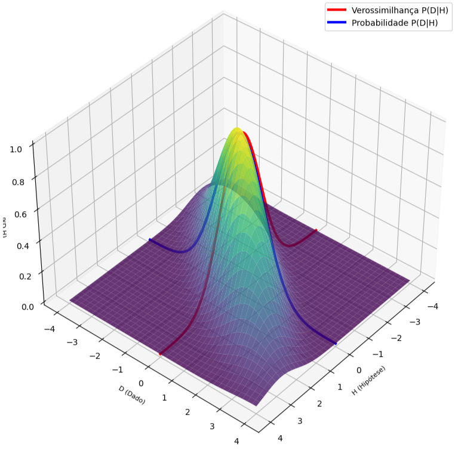
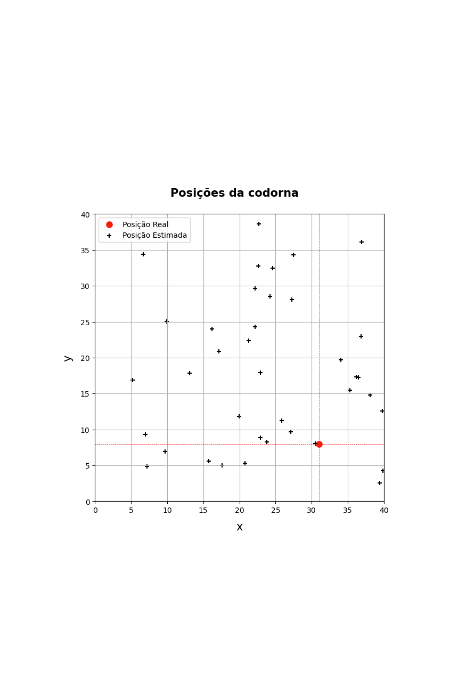

<!-- _footer: "" -->


<!-- Scoped style -->
<style scoped>
section {
  font-size: 21px;
}
span.date {
  font-size: 15px;
}

span.program {
  font-size: 18px;
}
</style>

<style>
span.footnote {
    border-top: 0.1em dotted #555;
    font-size: 60%;
    margin-top: auto;
    position:absolute;
    bottom:0;
    width:100%;
    height:60px;    
}
</style>

# **Introdução à Assimilação de Dados (MET 563-3)**

### Motivação - Métodos Baseados em Conjuntos

<p>Dr. Carlos Frederico Bastarz
<br />
Dr. Dirceu Luis Herdies
<br />
<br />
<span class="program">Programa de Pós-Graduação em Meteorologia (PGMET) do INPE</span>
<br />
<br />
<span class="date">05 de Outubro de 2025</span>
<br />
<br />
🥷  🐦
</p>

---



<!-- Scoped style -->
<style scoped>
section {
  font-size: 21px;
}
</style>

# Métodos Baseados em Conjuntos

<br />

## **Sumário**

<br />

1. Filtro de Kalman linear
2. Método de Monte-Carlo
3. Ensembles
4. Ensemble Kalman Filter
  4.1 Histórico e desenvolvimento
  4.2 Características principais
  4.3 _Inflation_
  4.4 Localização
5. Visão geral sobre os esquemas derivados
6. Atividades realizadas no CPTEC com o método LETKF
7. Atividade - Filtro de Bayes Recursivo

---



<!-- Scoped style -->
<style scoped>
section {
  font-size: 19px;
}
.columns {
  display: grid;
  grid-template-columns: repeat(2, minmax(0, 1fr));
  gap: 1rem;
}
</style>

# Métodos Baseados em Conjuntos

<br />

## **1. Filtro de Kalman linear**

<br />


<div class="columns">
<div>

- O Filtro de Kalman calcula analiticamente a atualização do estado e da covariância, assumindo:
  * Linearidade
  * Ruído gaussiano
  
- Processo é realizado em duas etapas
  * Previsão
  * Correção

</div>
<div>

- Na etapa de previsão
  * Ocorre a extrapolação do estado do modelo e da incerteza

- Na etapa da correção
  * Ocorre o cálculo da matriz ganho de Kalman (matriz peso, tal como na Interpolação Ótima)
  * Ocorre a atualização da estimativa do estado com as observações
  * Ocorre a atualização da estimativa da incerteza

</div>
</div>

---

<!-- Scoped style -->
<style scoped>
section {
  font-size: 19px;
}
.columns {
  display: grid;
  grid-template-columns: repeat(2, minmax(0, 1fr));
  gap: 1rem;
}
</style>

# Métodos Baseados em Conjuntos

<br />

## **1. Filtro de Kalman linear**
 
<br /> 

<div class="columns">
<div>

- Na etapa de previsão
  - 👉 Extrapolação do estado do modelo e da incerteza
  
  $$
  \mathbf{x}_{k}^{b} = \mathbf{M}_{k-1}(\mathbf{x}_{k-1}^{a})+\mathbf{w}_{k-1}
  $$
  
  $$
  \mathbf{P}^{b}_{k} = \mathbf{M}_{k-1}\mathbf{P}_{k-1}^{a}\mathbf{M}_{k-1}^{\text{T}}+\mathbf{Q}_{k-1}
  $$
  
  - Onde:
    - $\mathbf{x}_{k}^{b}$ é o vetor background no tempo $k$
    - $\mathbf{M}_{k-1}$ é o modelo de previsão (linear), integrado do tempo $k-1$ até $k$
    - $\mathbf{x}_{k-1}^{a}$ é o vetor análise no tempo $k-1$
    - $\mathbf{w}_{k-1}$ é o erro do modelo, com covariância $\mathbf{Q}_{k-1}$
    - $\mathbf{P}_{k}^{b}$ é a covariância do background no tempo $k$
  
</div>
<div>


- Na etapa da correção
  - 👉 Cálculo da matriz ganho de Kalman (matriz peso, tal como na Interpolação Ótima)
  
  $$
  \mathbf{K}_{k}=\mathbf{P}_{k}^{b}\mathbf{H}_{k}^{\text{T}}(\mathbf{H}_{k}\mathbf{P}_{k}^{b}\mathbf{H}_{k}^{\text{T}}+\mathbf{R}_{k})^{-1}
  $$
  
  - 👉 Atualização da estimativa do estado com as observações
  
  $$
  \mathbf{x}_{k}^{a}=\mathbf{x}_{k}^{b}+\mathbf{K}_{k}[\mathbf{y}_{k}-\mathbf{H}_{k}(\mathbf{x}_{k}^{b})]
  $$
  
  - 👉 Atualização da estimativa da incerteza
  
  $$
  \mathbf{P}_{k}^{a}=(\mathbf{I}-\mathbf{K}_{k}\mathbf{H}_{k})\mathbf{P}_{k}^{b}
  $$

  - Onde:
    - $\mathbf{x}_{k}^{b}$ é o vetor análise no tempo $k$
    - $\mathbf{P}_{k}^{a}$ é a covariância da análise no tempo $k$
  
</div>
</div> 

---

<!-- Scoped style -->
<style scoped>
section {
  font-size: 19px;
}
.columns {
  display: grid;
  grid-template-columns: repeat(2, minmax(0, 1fr));
  gap: 1rem;
}
</style>

# Métodos Baseados em Conjuntos

<br />

## **1. Filtro de Kalman linear**

<br />

- ✅ Vantagens do Filtro de Kalman linear:
  * Além de estimar o estado do sistema (análise), estima analiticamente a covariância (incerteza)
    * Permite quantificar a confiança na análise
    
      $$
      \mathbf{x}_{k}^{a}=\mathbf{x}_{k}^{b}+\mathbf{K}_{k}[\mathbf{y}_{k}-\mathbf{H}_{k}(\mathbf{x}_{k}^{b})], \quad \mathbf{P}_{k}^{a}=(\mathbf{I}-\mathbf{K}_{k}\mathbf{H}_{k})\mathbf{P}_{k}^{b}
      $$
    
    * A matriz $\mathbf{K}$ (ganho de Kalman) ajusta a contribuição do modelo e da observação
    
<br />

* ❌ Limitações do Filtro de Kalman linear:
  * Não é adequado para sistemas de alta dimensão (e.g., atmosfera, oceado), pois as matrizes de covariâncias ($\mathbf{P}^{b}$ e $\mathbf{P}^{a}$) são explícitas e enormes
  * Requer que o modelo dinâmico seja linear

---



<!-- Scoped style -->
<style scoped>
section {
  font-size: 21px;
}
.columns {
  display: grid;
  grid-template-columns: repeat(2, minmax(0, 1fr));
  gap: 1rem;
}
.github-code {
  font-family: ui-monospace, SFMono-Regular, Menlo, Consolas, monospace;
  font-size: 0.95em;
  background-color: #323742;
  color: #f6f8fa;
  padding: 0.2em 0.4em;
  border-radius: 6px;
}
</style>

# Métodos Baseados em Conjuntos

<br />

## **2. Método Monte-Carlo**

<br />

- O método Monte-Carlo foi introduzido nos anos 1940:
  * Jon von Neumman, durante o desenvolvimento do projeto Manhattan (bomba atômica)
  * Se não é possível calcular algo diretamente, pode-se estimar o resultado por meio de simulações aleatórias
  
---

<!-- Scoped style -->
<style scoped>
section {
  font-size: 21px;
}
.columns {
  display: grid;
  grid-template-columns: repeat(2, minmax(0, 1fr));
  gap: 1rem;
}
.github-code {
  font-family: ui-monospace, SFMono-Regular, Menlo, Consolas, monospace;
  font-size: 0.95em;
  background-color: #323742;
  color: #f6f8fa;
  padding: 0.2em 0.4em;
  border-radius: 6px;
}
</style>

# Métodos Baseados em Conjuntos

<br />

## **2. Método Monte-Carlo**

<br />

<div class="columns">
<div>

- 🎲 Exemplo simples
  - Estimar o valor de $\pi$ contando quantos pontos caem dentro de um quadrado que contém um círculo inscrito (a razão entre os pontos dentro do círculo e o total é $\approx \frac{\pi}{4}$)

</div>
<div>

<br />

<div align="center">
  
</div>

</div>
</div>  
  
---

<!-- Scoped style -->
<style scoped>
section {
  font-size: 21px;
}
.columns {
  display: grid;
  grid-template-columns: repeat(2, minmax(0, 1fr));
  gap: 1rem;
}
.github-code {
  font-family: ui-monospace, SFMono-Regular, Menlo, Consolas, monospace;
  font-size: 0.95em;
  background-color: #323742;
  color: #f6f8fa;
  padding: 0.2em 0.4em;
  border-radius: 6px;
}
</style>

# Métodos Baseados em Conjuntos

<br />

## **2. Método Monte-Carlo**
  
<br />  
  
<div class="columns">
<div>

  - 🎲 Exemplo simples:
  
    ```python
    import numpy as np

    np.random.seed(42)
    
    N = 1000000
    x = np.random.rand(N)
    y = np.random.rand(N)
    dentro_circulo = (x**2 + y**2) <= 1

    estima_pi = 4 * np.sum(dentro_circulo) / N
    print(estima_pi)
    ```  
  
</div>
<div style="margin-left:110px; margin-top:-50px;">

* 👉 Resultados:

  | Valores de <span class="github-code">N</span> | Valores de $\pi$ |
  |-----------------------------------------------|------------------|
  | 1                                             | 0,0              |
  | 10                                            | 2,8              |
  | 100                                           | 3,2              |
  | 1.000                                         | 3,112            |
  | 10.000                                        | 3,1556           |
  | 100.000                                       | 3,1376           |
  | 1.000.000                                     | 3,141864         |
  | 10.000.000                                    | 3,1415772        |

</div>
</div>
   
---

<!-- Scoped style -->
<style scoped>
section {
  font-size: 19px;
}
.columns {
  display: grid;
  grid-template-columns: repeat(2, minmax(0, 1fr));
  gap: 1rem;
}
</style>

# Métodos Baseados em Conjuntos

<br />

## **3. Ensembles**

- Ensemble ou conjunto (de análises ou previsões) representam múltiplas simulações para a mesma data alvo
  * O objetivo é tentar amostrar a incerteza do modelo 
* Diferentes técnicas podem ser utilizadas para se construir um ensemble
  * O mais simples: utilizar previsões de diferentes modelos (superensemble)
    * A desvantagem: pós-processar diferentes previsões de diferentes modelos
  * O mais complexo: utilizar assimilação de dados
    * A vantagem: fornece um ensemble de análises e previsões
  * Outras técnicas:
    * _Poor man's ensemble_: utiliza análises defasadas para gerar um ensemble inicial de previsões
    * Perturbação de física: utiliza diferentes parametrizações físicas do modelo para construir o ensemble
    * EOF: Funções Ortogonais Empíricas, utilizado pelo CPTEC
    * _Singular Vectors_: utilizado pelo ECMWF
    * _Bred Vectors_: utilizado pelo NCEP (passado)
    * EnKF: Ensemble Kalman Filter para assimilação de dados (e técnicas derivadas)
---

<!-- _footer: "" -->

<!-- Scoped style -->
<style scoped>
section {
  font-size: 19px;
}
.columns {
  display: grid;
  grid-template-columns: repeat(2, minmax(0, 1fr));
  gap: 1rem;
}
</style>

# Métodos Baseados em Conjuntos

## **3. Ensembles**

- **Benefícios**:
  - Em geral, a média de um ensemble (bem construído) fornece uma boa estimativa em relação à previsão determinística (o skill tende a ser melhor)
  - Fornece também a incerteza da previsão (_spread_ ou espalhamento do ensemble)
  
  <br />
  
<div align="center">
  
</div>

---

<!-- Scoped style -->
<style scoped>
section {
  font-size: 21px;
}
.columns {
  display: grid;
  grid-template-columns: repeat(2, minmax(0, 1fr));
  gap: 1rem;
}
</style>

# Métodos Baseados em Conjuntos

## **3. Ensembles**

- **Dificuldades**:
  * Custo computacional (relação tamanho do ensemble X resolução espacial)
  * Armazenamento
  * Subestimativa da incerteza (_undersampling_) devido ao tamanho do ensemble
  * Acurácia e precisão
 
    <br />
    
    <div align="center">
      
    </div> 

    <br />

* 👉 Qual destas situações é acurada e precisa?

---

<!-- Scoped style -->
<style scoped>
section {
  font-size: 18px;
}
.columns {
  display: grid;
  grid-template-columns: repeat(2, minmax(0, 1fr));
  gap: 1rem;
}
</style>

# Métodos Baseados em Conjuntos

<br />

## **4. Ensemble Kalman Filter**

<br />

### **4.1 Histórico e desenvolvimento**

<br />

- 📖 O Kalman Filter linear foi introduzido em 1960:
  * _A New Approach to Linear Filtering and Prediction Problems_ (Kalman, 1960)
  * https://x.gd/VlIfX
- 📖 O Ensemble Kalman Filter foi introduzido em 1994:
  * _Sequential data assimilation with a nonlinear quasi-geostrophic model using Monte Carlo methods to forecast error statistics_ (Evensen, 1994)
  * https://x.gd/VsQ1V
- 💾 Com a evolução dos computadores e o aumento da complexidade do sistema de observação global, novas técnicas derivadas do EnKF surgiram:
  * ETKF - _Ensemble Transform Kalman Filter_
  * LETKF - _Local Ensemble Transform Kalman Filter_
  * Muitos outros...

---

<!-- Scoped style -->
<style scoped>
section {
  font-size: 19px;
}
.columns {
  display: grid;
  grid-template-columns: repeat(2, minmax(0, 1fr));
  gap: 1rem;
}
</style>

# Métodos Baseados em Conjuntos

<br />

## **4. Ensemble Kalman Filter**

<br />

### **4.1 Histórico e desenvolvimento**

<br />

- 👉 O Filtro de Kalman por conjunto é um filtro do tipo Monte-Carlo
  * Assume que os erros são gaussianos
  * Assume que as relações entre os estados são lineares
  * Usa as matrizes de covariâncias para quantificar as incertezas
  
* 💔 O problema
  * Em sistemas reais (e.g., atmosfera, oceano), é impossível armazenar e propagar a matriz de covariâncias completa  
 
* 🧠 A solução
  * Ao invés de armazenar as matrizes de covariâncias (teóricas) gigantes, o EnKF estima estas matrizes a partir de um conjunto de amostras (ensemble)
 
---

<!-- Scoped style -->
<style scoped>
section {
  font-size: 21px;
}
.columns {
  display: grid;
  grid-template-columns: repeat(2, minmax(0, 1fr));
  gap: 1rem;
}
</style>

# Métodos Baseados em Conjuntos

<br />

## **4. Ensemble Kalman Filter**

<br />

### **4.1 Histórico e desenvolvimento**

<br />

- O EnKF foi desenvolvido mantendo as principais características do filtro de Kalman linear, mas com as diferenças:
  * 👉 Estimativa das covariâncias feita com base nos membros do ensemble e não via matriz explícitas
  * 👉 Matriz ganho de Kalman é conceitualmente igual, mas também calculada a partir do ensemble
      
    $$
    \mathbf{K}_{k}=\mathbf{P}_{k}^{b}\mathbf{H}_{k}^{\text{T}}(\mathbf{H}_{k}\mathbf{P}_{k}^{b}\mathbf{H}_{k}^{\text{T}}+\mathbf{R}_{k})^{-1}
    $$
    
  * O espaço do ensemble (i.e., o tamanho do ensemble), é o que define os seus graus de liberdade:
    * 💡 A propagação das covariâncias é feita pela propagação do ensemble
    * 💡 Permite tratar a não linearidade, pois cada membro do ensemble pode evoluir pelo modelo não linear completo  
  
---

<!-- Scoped style -->
<style scoped>
section {
  font-size: 21px;
}
</style>

# Métodos Baseados em Conjuntos

<br />

## **4. Ensemble Kalman Filter**

<br />

## **4.1 Histórico e desenvolvimento**

<br />

- O KF original é aplicado a problemas com dinâmica linear
  * Extensões do KF original foram desenvolvidas para serem aplicadas a problemas com dinâmica não linear (EKF - _Extended Kalman Filter_)
  * O EKF lineariza a solução sucessiva da trajetória do modelo através da aplicação de um modelo tangente linear (tal como o 4DVar)
* O EnKF original é estocástico, no sentido de que as observações são perturbadas para gerar um conjunto de análises
    
---

<!-- Scoped style -->
<style scoped>
section {
  font-size: 20px;
}
</style>

# Métodos Baseados em Conjuntos

<br />

## **4. Ensemble Kalman Filter**

<br />

## **4.2 Características principais**

<br />

- No EnKF, a covariância dos erros de previsão ($\mathbf{P}^{b}_{k} = \mathbf{M}_{k-1}\mathbf{P}_{k-1}^{a}\mathbf{M}_{k-1}^{\text{T}}+\mathbf{Q}_{k-1}$) é substituída pela covariância do conjunto
  
  $$
  \mathbf{P}_{k}^{b} = \frac{1}{N-1} \mathbf{X}_{k}^{b}(\mathbf{X}_{k})^{\text{T}}
  $$
  
  * Onde:
    * $\mathbf{X}_{k}^{b}$ é a matriz de perturbação do ensemble (desvio em relação à média)
      * $\mathbf{X}_{k}^{b(i)} = \mathbf{x}_{k}^{b(i)} - \bar{\mathbf{x}}_{k}^{b}$
      * $\bar{\mathbf{x}}_{k}^{b} = \frac{1}{N} \sum_{i=1}^{N}{\mathbf{x}_{k}^{b(i)}}$

  * 🧠 Por que $\mathbf{P}^{b}$ é calculada considerando $N-1$ membros (fator de correção de Bessel)?
      
---

<!-- Scoped style -->
<style scoped>
section {
  font-size: 20px;
}
</style>

# Métodos Baseados em Conjuntos

<br />

## **4. Ensemble Kalman Filter**

## **4.2 Características principais**

- Se o conjunto for pequeno, as covariâncias são subestimadas
- Quanto maior o conjunto, melhor será a representação das covariâncias
  * 🧠 Qual é o tamanho ideal de um conjunto para que se tenha a melhor estimativa das covariâncias do ("erro") do modelo?    
- Perturbação das observações
  * Cada observação $\mathbf{y}_k$ é perturbada com um ruído aleatório, extraído da distribuição do erro de observação com covariância $\mathbf{R}_k$
  
  $$
  \mathbf{y}_{k}^{(i)} = \mathbf{y}_{k} + \epsilon_{k}^{(i)}, \quad \epsilon_{k}^{(i)} \sim \mathcal{N}(0,\mathbf{R}_{k})
  $$
  
  * Cada membro $i$ do ensemble recebe uma versão ligeiramente diferente das observações reais
  * O ruído $\epsilon_{k}^{(i)}$ é independente entre os membros e com média zero e covariância $\mathbf{R}_{k}$
  * 👉 Isso é o que garante que o EnKF não colapse, pois garante a dispersão (da covariância) do ensemble
 
---

<!-- Scoped style -->
<style scoped>
section {
  font-size: 21px;
}
</style>

# Métodos Baseados em Conjuntos

<br />

## **4. Ensemble Kalman Filter**

<br />

## **4.3 _Inflation_**

<br />

- 🏃‍♂️‍➡️ No ciclo de assimilação de dados do EnKF, as observações são utilizadas para corrigir o estado do modelo
  * 💡 Mas o EnKF perturba o modelo para amostrar a sua incerteza 
  * 🃏 Ambiguidade: ao mesmo tempo que se perturba do estado, tenta-se corrigí-lo
  * 👉 Então, ao longo do tempo, a tendência é a de a incerteza do EnKF seja cada vez mais subestimada, de forma que é necessário inflar a incerteza do conjunto 
 
---

<!-- _footer: "" -->

<!-- Scoped style -->
<style scoped>
section {
  font-size: 18px;
}
.columns {
  display: grid;
  grid-template-columns: repeat(2, minmax(0, 1fr));
  gap: 1rem;
}
</style>

# Métodos Baseados em Conjuntos

<br />

<div class="columns">
<div>

## **4. Ensemble Kalman Filter**

<br />

## **4.3 _Inflation_**

<br />

- No EnKF, $\mathbf{P}^f$ é estimada a partir de um número finito de membros
  * Como consequência, a estimativa da incerteza do modelo é subestimada
  * Isso faz com que o filtro confie mais nas previsões e menos nas observações!
  * Problemas podem ocorrer com a divergência do filtro 
    * ⏳ Com o tempo, o modelo se afasta das observações
    
      $$
      \mathbf{x}_{i}^{\text{I}} = \bar{\mathbf{x}} + \sqrt{\lambda} (\mathbf{x}_{i} - \bar{\mathbf{x}})
      $$
      
  * 💡 O _inflation_ é um mecanismo artificial para aumentar a variância do ensemble
  
</div>
<div>

<br />
<br />
<br />
<br />

* Cada membro é "inflado" em torno da média do ensemble $\to$ é empírico!

* Onde:
  * $\mathbf{x}_{i}^{\text{I}}$ é o membro do ensemble com variância inflada
  * $\bar{\mathbf{x}}$ é a média do ensemble
  * $\lambda$ é o fator de inflação ($\lambda \in \mathbb{R}$)
* $\lambda = 1$: não inflaciona o ensemble
* $\lambda > 1$: aumenta a dispersão do ensemble $\to$ aumenta a incerteza $\to$ aumenta a variância
* $\lambda < 1$: diminui a dispersão do ensemble $\to$ diminui a incerteza $\to$ diminui a variância

* Se o ensemble for pequeno, maior é o valor de $\lambda$

</div>
</div> 
 
---

<!-- _footer: "" -->

<!-- Scoped style -->
<style scoped>
section {
  font-size: 21px;
}
.columns {
  display: grid;
  grid-template-columns: repeat(2, minmax(0, 1fr));
  gap: 1rem;
}
</style>

# Métodos Baseados em Conjuntos

<br />

## **4. Ensemble Kalman Filter**

<br />

## **4.3 _Inflation_**

<br />

- A escolha de um valor para $\lambda$ é empírica e depende do tamanho do ensemble
  * Quanto menor o ensemble, maior pode ser o valor de $\lambda$
- O _inflation_ pode ser implementado de forma que seja adaptativo
  * Pode variar em função do spread e do erro da análise
 
---

<!-- Scoped style -->
<style scoped>
section {
  font-size: 21px;
}
</style>

# Métodos Baseados em Conjuntos

<br />

## **4. Ensemble Kalman Filter**

## **4.3 Localização**

- A localização é utilizada para compensar o efeito cíclico de correções sobre o espalhamento do conjunto de previsões devido ao seu tamanho, para evitar:
  * Covariâncias espúrias
    * Se o ensemble for pequeno, a amostragem das covariâncias é ruim, o que faz com que covariâncias distantes não reflitam as relações físicas reais
  * Custo computacional alto
    * A localização limita a covariância entre variáveis de estado que estão muito longe umas das outras
      
      $$
      \mathbf{P}_{f}^{\text{L}} = \mathbf{P}_{f} \circ \mathbf{L}
      $$

    * Onde:
      * $\mathbf{L}$ é uma função de correlação (funciona como um raio de influência)
      
---

<!-- Scoped style -->
<style scoped>
section {
  font-size: 21px;
}
</style>

# Métodos Baseados em Conjuntos

<br />

## **5. Visão geral sobre os esquemas derivados**

<br />

---

<!-- Scoped style -->
<style scoped>
section {
  font-size: 21px;
}
</style>

# Métodos Baseados em Conjuntos

<br />

## **6. Atividades realizadas no CPTEC com o método LETKF**

<br />

- Por volta de 2009, o grupo de assimilação de dados do CPTEC vinha estudando a aplicação do LETKF como método substituto para a sua análise operacional em domínio global
  * Resolução: TQ0126L028 (aproximadamente 100 km de resolução espacial horizontal e 28 níveis verticais em coordenada sigma)
  * 80 membros
* Desafios: 
  * Desempenho computacional para um conjunto grande de membros (aumento da resolução ficou limitado ao tamanho do conjunto)
  * Assimilação de radiâncias (necessidade de desenvolvimento de diferentes operadores $H$ para diferentes tipos de observações não convencionais)


---

<!-- _transition: drop -->

<!-- Scoped style -->
<style scoped>
section {
  font-size: 18px;
}
</style>

# Métodos Baseados em Conjuntos

<br />

## **6. Atividades realizadas no CPTEC com o método LETKF**

<br />

* LETKF permaneceu como método de pesquisa do CPTEC:
  * **2010** - Tese Rosângela Cintra: "ASSIMILAÇÃO DE DADOS COM REDES NEURAIS ARTIFICIAIS EM MODELO DE CIRCULAÇÃO GERAL DA ATMOSFERA"
  * **2010** - Pós-Doutorado José Aravéquia: "Evaluation of a Strategy for the Assimilation of Satellite Radiance Observations
with the Local Ensemble Transform Kalman Filter"  
  * **2011** - Dissertação Maria Medeiros: "IMPACTO DO USO DE RADIÂNCIA NA ASSIMILAÇÃO DE DADOS USANDO 4D-LETKF NA REGIÃO DA AMÉRICA DO SUL"
  * **2013** - Bolsa PCI Lucas Avanço: "ASSIMILAÇÃO DE DADOS DE RÁDIO OCULTAÇÃO GNSS NO LETKF: DISPONIBILIDADE DE DADOS E IMPLEMENTAÇÃO DE UM OPERADOR"
  * **2018** - Tese Helena Barbieri: "AJUSTE DINÂMICO PARA ANÁLISE HÍBRIDA ENTRE UM SISTEMA VARIACIONAL E FILTRO DE KALMAN POR CONJUNTO"
  * **2018** - Tese Leonardo Lima: "ESTUDO DAS INCERTEZAS NA SIMULAÇÃO POR CONJUNTOS E NO USO DA ASSIMILAÇÃO DE DADOS NO OCEANO ATLÂNTICO SUDOESTE"
  * Entre outros...  
  
---

<!-- _footer: "" -->

<!-- Scoped style -->
<style scoped>
section {
  font-size: 21px;
}
p {
  text-align: center;
  font-size: 100px;
}
</style>

<br />
<br />
  
**Ninja Vs. Codorna**

🥷  🐦

---

<!-- _footer: "" -->

<!-- Scoped style -->
<style scoped>
section {
  font-size: 19px;
}
</style>

# Métodos Baseados em Conjuntos

<br />

## **7. Atividade - Filtro de Bayes Recursivo**

<br />
<!--  -->
<div style="
  text-align: center;
  max-width: 600px;
  margin: 0 auto;
  margin-top:0px;
  font-size: 50px;
  font-weight: bold;
">
Ninja Vs. Codorna

🥷  🐦
</div>

* Uma codorna :bird: pia no meio da mata
* Um ninja 🥷 escuta...
* A codorna pia mais uma vez
* O ninja escuta novamente...
* O ninja quer saber **onde está a codorna**
* A codorna pia novamente...
* E ela faz isso mais 100 vezes
* **Pergunta:** será o ninja capaz de descobrir a posição da codorna no meio da mata? (continua...)

---

<!-- Scoped style -->
<style scoped>
section {
  font-size: 21px;
}
</style>

# Métodos Baseados em Conjuntos

<br />

## **7. Atividade - Filtro de Bayes Recursivo**

<br />

### Palavras-chave

* **Hipótese:** uma pergunta - uma teoria seria uma afirmação?
* **"Dado":** uma informação, uma observação
* **Verossimilhança:** (ou _likelihood_) o grau de veracidade de uma determinada informação
* **Informação à _priori_:** (ou _prior_) aquilo que se conhece a princípio
* **Informação à _posteriori_:** (ou _posterior_) aquilo que se conclui a partir da informação à _priori_
* **Probabilidade conjunta:** probabilidade de dois ou mais eventos ocorrerem simultaneamente

### Conceito-chave

* **Probabilidade condicional:** ocorrência de um evento dada uma informação à _priori_

---

<!-- _footer: "" -->

<!-- Scoped style -->
<style scoped>
section {
  font-size: 19px;
}
</style>

# Métodos Baseados em Conjuntos

<br />

## **7. Atividade - Filtro de Bayes Recursivo**

$$
P(H|D) = \frac{P(H)P(D|H)}{P(D)}
$$

- $H$: é a hipótese
- $D$: é o dado observado (uma informação observada)
- $P(H|D)$: é o _posterior_ (ou posteriori, é a probabilidade da hipotese após observar o dado)
- $P(H)$: é o _prior_ (é a probabilidade atribuída à hipótese antes de ver o dado)
- $P(D)$: é a probabilidade do dado (constante de normalização)
- $P(D|H)$: verossimilhança (é a probabilidade da observar o dado, considerando-se a hipótese verdadeira)

<br />

👉 Normaliza-se a probabilidade da hipótese (_prior_) e a verossimilhança pela probabilidade do dado. **Por que?**

$$
P(H|D) \propto P(H)P(D|H)
$$

<br />

<div style="
  background-color: #f8d7da; 
  color: #721c24; 
  padding: 20px; 
  border-radius: 10px; 
  text-align: center;
  max-width: 600px;
  margin: 0 auto;
  margin-top:0px;
  font-size: 18px;
">
O que significa "máxima verossimilhança"?
</div>

---

<!-- Scoped style -->
<style scoped>
section {
  font-size: 21px;
}
</style>

# Métodos Baseados em Conjuntos

<br />

## **7. Atividade - Filtro de Bayes Recursivo**

<br />

### Probabilidade Vs. Verossimilhança

<br />

- **Probabilidade:** é a chance de ocorrência de um determinado evento possível
- **Verossimilhança:** é provável (ou possível) que este evento exista? Este evento é plausível?

<br />

Para que um determinado evento ocorra, é necessário que ele evista e que pertença a um determinado conjunto de eventos possíveis. A máxima verossimilhança destaca, portanto, o quão verossímil é a probabilidade do evento.

---

<!-- Scoped style -->
<style scoped>
section {
  font-size: 21px;
}
</style>

# Métodos Baseados em Conjuntos

<br />

## **7. Atividade - Filtro de Bayes Recursivo**

<br />

### Verossimilhança

<br />

* Considere que você observa o lançamento de 20 dados :dice: sobre uma mesa e deseja saber qual é a verossimilhança desta observação. Todos os dados apresentam os mesmos valores
* Para isto, consideramos duas hipóteses:
  1. Dado viciado
  2. Dado não viciado

---

<!-- _footer: "" -->

<!-- Scoped style -->
<style scoped>
section {
  font-size: 21px;
}
</style>

# Métodos Baseados em Conjuntos

<br />

## **7. Atividade - Filtro de Bayes Recursivo**

<br />

### 🎲 Dado viciado

* Neste cado, os 20 dados apresentam o mesmo valor (e.g., 5). A probabilidade conjunta destes eventos $P(dado_{1}) \times P(dado_{2}) \times ... \times P(dado_{20})$ é $({\frac{1}{1}})^{20}=1$


### 🎲 Dado não viciado

* Neste caso, cada um dos 20 dados possui a mesma probabilidade de apresentar um dos 6 números possíveis. A probabilidade conjunta neste caso é $({\frac{1}{6}})^{20} \approxeq 0$
  
<br />  
  
  <div style="
    background-color: #f8d7da; 
    color: #721c24; 
    padding: 20px; 
    border-radius: 10px; 
    text-align: center;
    max-width: 600px;
    margin: 0 auto;
    margin-top:0px;
    font-size: 18px;
  ">
  Portanto, é muito mais verossímil que o dado seja viciado dada a observação inicial
  </div>
  
---

<!-- Scoped style -->
<style scoped>
section {
  font-size: 21px;
}
</style>

# Métodos Baseados em Conjuntos

<br />

## **7. Atividade - Filtro de Bayes Recursivo**

<br />

### Provabilidade Vs. Verossimilhança

#### Exemplo

- $D$: o ninja 🥷 ouve um canto na mata
- $H$: há uma codorna :bird: na mata
- $L(H|D)$: é a verossimilhança

* $P(D|H) \neq P(H|D)$: o fato de o ninja ouvir um canto na mata, dado que há uma codorna na mata, não significa que dado que há uma codorna na mata, o ninja ouvirá um canto - ela pode estar dormindo 💤
* $P(H|D)$, então $L(H|D)$ é baixa: se há uma codorna na mata, não necessariamente ela está cantando e o que o ninja ouve não é uma codorna, mas sim um pardal &#128038;
* $P(D|H)$, então $L(H|D)$ é alta: se há uma codorna na mata, então há um canto ecoando na mata

---

<!-- Scoped style -->
<style scoped>
section {
  font-size: 21px;
}
</style>

# Métodos Baseados em Conjuntos

<br />

## **7. Atividade - Filtro de Bayes Recursivo**

<br />

### Estimativa de Máxima Verossimilhança

<br />

* Permite estimar, por exemplo, os momentos estatísticos de uma determinada distribuição. Por exemplo:
  * Quais são os valores de média ($\mu$) e desvio-padrão ($\sigma$) que maximizam a probabilidade de um determinado evento (ou hipótese) ou dado observado?
  * Em outras palavras, quais são os valores de $\mu$ e $\sigma$ que tornam os dados observados mais prováveis (considerando que os dados vem de uma distribuição normal $N(\mu,\sigma^{2})$)?
  
---

<!-- _footer: "" -->

<!-- Scoped style -->
<style scoped>
section {
  font-size: 21px;
}
</style>

# Métodos Baseados em Conjuntos

<br />

## **7. Atividade - Filtro de Bayes Recursivo**

<br />

### Exemplo de Inferência Bayesiana (ou Filtro Bayesiano)

<br />

- Kalnay (2002)<sup>&#128312;</sup>: dadas duas observações independentes $T_{1}$ e $T_{2}$, as quais são assumidas possuírem distribuição normal e erros com desvios-padrão $\sigma_{1}$ e $\sigma_{2}$, qual é o valor mais provável de $T$? Neste caso, define-se a análise como sendo o valor mais provável de $T$ dadas as observações e as suas estatísticas de erro:

$$
P(T|T_{1},T_{2}) = \frac{P(T)P(T_{1},T_{2}|T)}{P(T_{1},T_{2})}
$$
  
<span class="footnote">
<sup>&#128312;</sup>Kalnay, E. (2002). Atmospheric Modeling, Data Assimilation and Predictability. Cambridge: Cambridge University Press.
</span>  
  
---

<!-- _footer: "" -->

<!-- Scoped style -->
<style scoped>
section {
  font-size: 20px;
}
</style>



# Métodos Baseados em Conjuntos

<br />

## **7. Atividade - Filtro de Bayes Recursivo**
  
- Distribuição Normal - ou Gaussiana:

$$
p_{\sigma_{1}}(T_{1}|T) = \frac{1}{\sqrt{2\pi}\sigma_{1}}{e}^{-\frac{(T_{1}-T)^{2}}{2\sigma_{1}^{2}}}
$$
  

$$
p_{\sigma_{2}}(T_{2}|T) = \frac{1}{\sqrt{2\pi}\sigma_{2}}{e}^{-\frac{(T_{2}-T)^{2}}{2\sigma_{2}^{2}}}
$$  
  
- O valor mais provável (_likely_) de $T$ dadas as observações independentes $T_{1}$ e $T_{2}$, é aquele que maximiza a **probabilidade conjunta**, ou seja, o produto de $p_{\sigma_{1}}$ e $p_{\sigma_{2}}$:

$$
p_{\sigma_{1}}(T_{1}|T)p_{\sigma_{2}}(T_{2}|T) = \frac{1}{2\pi\sigma_{1}\sigma_{2}}{e}^{-\frac{(T_{1}-T)^{2}}{2\sigma_{1}^{2}}-\frac{(T_{2}-T)^{2}}{2\sigma_{2}^{2}}}
$$
  
---

<!-- _footer: "" -->

<!-- Scoped style -->
<style scoped>
section {
  font-size: 20px;
}
.columns {
  display: grid;
  grid-template-columns: repeat(2, minmax(0, 1fr));
  gap: 1rem;
}
</style>

<div class="columns">
<div>

# Métodos Baseados em Conjuntos

<br />

## **7. Atividade - Filtro de Bayes Recursivo**

<br />

### Prior, posterior, likelihood, distribuição de probabilidade...

<br />

- Teorema de Bayes: 

$$
P(H|D)=\frac{P(H)P(D|H)}{P(D)}
$$

- Distrbuição Gaussiana: 

$$
p_{\sigma_{1}}(T_{1}|T) = \frac{1}{\sqrt{2\pi}\sigma_{1}}{e}^{-\frac{(T_{1}-T)^{2}}{2\sigma_{1}^{2}}}
$$

</div>
<div>

<div align="center">
  
</div>


</div>
</div>

---

<!-- _footer: "" -->

<!-- Scoped style -->
<style scoped>
section {
  font-size: 20px;
}
.columns {
  display: grid;
  grid-template-columns: repeat(2, minmax(0, 1fr));
  gap: 1rem;
}
</style>

<div id="plotly-div" style="width: 100%; height: 700px;"></div>

<script src="https://cdn.plot.ly/plotly-latest.min.js"></script>
<script>
var H = [];
for(var i=-4; i<=4; i+=0.04){ H.push(i); }

var D = H.slice();  // mesma discretização
var P_H = H.map(h => Math.exp(-0.5*(h/1.5)*(h/1.5)));

// Superfície simples (só exemplo)
var z = [];
for(var i=0;i<H.length;i++){
    var row = [];
    for(var j=0;j<D.length;j++){
        row.push(Math.exp(-0.5*((D[j]-H[i])/1.0)**2)*P_H[i]);
    }
    z.push(row);
}

var data = [{
    z: z,
    x: H,
    y: D,
    type: 'surface',
    colorscale: 'Viridis'
}];

Plotly.newPlot('plotly-div', data);
</script>

---

<!-- _transition: drop -->

<!-- Scoped style -->
<style scoped>
section {
  font-size: 21px;
}
p {
  text-align: center;
  font-size: 100px;
}
</style>

# Métodos Baseados em Conjuntos

<br />

## **7. Atividade - Filtro de Bayes Recursivo**

<br />

### Inferência Bayesiana Recursiva (ou "Filtro de Bayes Recursivo")

* Um ninja ouve o canto intermitente de uma codorna (ela está parada). A cada canto, ele tenta descobrir a posição da codorna. **Como o ninja pode inferir a posição da codorna?**
  * Brincadeira do "quente-frio"
* Um outro problema real poderia ser: ajustar um modelo aos valores observados a cada ciclo de análise (iterativamente)
  * Como isso pode ser feito?
* Qualquer algorítmo de ajuste iterativo pode ser realizado como uma inferência Bayesiana recursiva? 
  
---

<!-- _footer: "" -->

<!-- Scoped style -->
<style scoped>
section {
  font-size: 21px;
}
p {
  text-align: center;
  font-size: 100px;
}
</style>

<br />
<br />
  
**Ninja Vs. Codorna**

🥷  🐦
  
---



<!-- Scoped style -->
<style scoped>
section {
  font-size: 19px;
}
</style>

# Métodos Baseados em Conjuntos

<br />

## **7. Atividade - Filtro de Bayes Recursivo**
  
<br />  
  
### Exemplo prático: Ninja Vs. Codorna
  
- Método Monte-Carlo  
- 🔴 posição real da codorna
- ➕ posição da codorna, segundo o ninja ($N=100$)
  
* A cada canto da codorna, o ninja tenta descobrir a posição real da ave
* O ninja pode modelar a situação e, com um número finitor de tentativas, pode estimar a posição mais provável da codorna
  
---

<!-- _footer: "" -->

<!-- Scoped style -->
<style scoped>
section {
  font-size: 20px;
}
.columns {
  display: grid;
  grid-template-columns: repeat(2, minmax(0, 1fr));
  gap: 1rem;
}
.github-code {
  font-family: ui-monospace, SFMono-Regular, Menlo, Consolas, monospace;
  font-size: 0.7em;
  background-color: #323742;
  color: #f6f8fa;
  padding: 0.2em 0.4em;
  border-radius: 6px;
}
</style>

# Métodos Baseados em Conjuntos

<br />

## **7. Atividade - Filtro de Bayes Recursivo**
  
<br />

<div class="columns">
<div>

<br />
<br />
<br />

<video width="500" controls>
  <source src="./figs/bayes_recursivo.mp4" type="video/mp4">
  Seu navegador não suporta vídeo.
</video>

</div>
<div>

Para cada posição inferida pelo ninja, a "função iterativa de Bayes", calcula a verossimilhança da posição:

<span class="github-code">
m[i,j] =  norm * np.exp(np.matmul(-(x[:,n] - me), np.matmul(inv, (x[:,n] - me) / 2.)))
</span>

ou seja, 

$$
p_{\sigma_{1}}(T_{1}|T) = \frac{1}{\sqrt{2\pi}\sigma_{1}}{e}^{-\frac{(T_{1}-T)^{2}}{2\sigma_{1}^{2}}}
$$

<div style="
  background-color: #f8d7da; 
  color: #721c24; 
  padding: 20px; 
  border-radius: 10px; 
  text-align: center;
  max-width: 600px;
  margin: 0 auto;
  margin-top:20px;
  font-size: 18px;
">
A melhor estimativa obtida pelo ninja utilizando-se a inferência Bayesiana recursiva, é chamada de "Estimativa de Máxima Verossimilhança" e representa o valor mais provável a ser obtido (cores mais quentes na superfície) da posição da cordona
</div>

</div>
</div>
 
---

<!-- Scoped style -->
<style scoped>
section {
  font-size: 21px;
}
.columns {
  display: grid;
  grid-template-columns: repeat(2, minmax(0, 1fr));
  gap: 1rem;
}
</style>

# Métodos Baseados em Conjuntos

<br />

## **7. Atividade - Filtro de Bayes Recursivo**

<br />

🎲 Notebook com <a href="https://colab.research.google.com/github/cfbastarz/MET563-3/blob/main/atividade_07_filtro_bayes_recursivo.ipynb" target="_blank">Atividade Prática 7</a> 

---

<!-- Scoped style -->
<style scoped>
section {
  font-size: 21px;
}
</style>


# :thinking: Dúvidas

<br />
<br />
<br />
<br />
<br />
<br />
<br />

:link: https://cfbastarz.github.io/met563-3/
:octopus: https://github.com/cfbastarz/MET563-3
:email: carlos.bastarz@inpe.br
