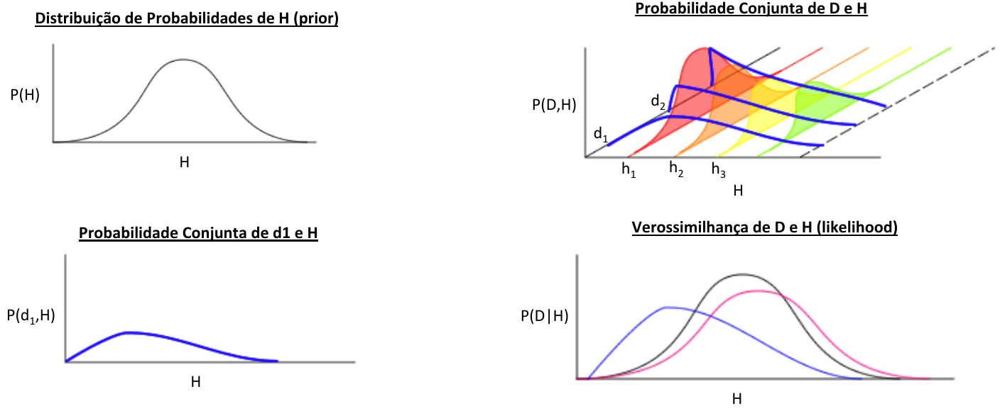

<!-- _footer: "" -->

<!-- Scoped style -->

# **Introdução à Assimilação de Dados (MET 563-3)**

### Motivação - Métodos Baseados em Conjuntos

Dr. Carlos Frederico Bastarz
 
Dr. Dirceu Luis Herdies
 
 
Programa de Pós-Graduação em Meteorologia (PGMET) do INPE
 
 
05 de Outubro de 2025

---

<!-- Scoped style -->

# Métodos Baseados em Conjuntos

 

## **Sumário**

 

1. Introdução ao método EnKF
2. Histórico e desenvolvimento
3. Características principais
4. _Inflation_ e _Localization_
5. Visão geral sobre os esquemas derivados
6. Atividades realizadas no CPTEC com o método LETKF
7. Filtro de Bayes Recursivo

---

<!-- Scoped style -->

# Métodos Baseados em Conjuntos

 

## **1. Introdução ao método EnKF**

 

---

<!-- Scoped style -->

# Métodos Baseados em Conjuntos

 

## **2. Histórico e desenvolvimento**

 

---

<!-- Scoped style -->

# Métodos Baseados em Conjuntos

 

## **3. Características principais**

 

---

<!-- Scoped style -->

# Métodos Baseados em Conjuntos

 

## **4. _Inflation_ e _Localization_**

 

---

<!-- Scoped style -->

# Métodos Baseados em Conjuntos

 

## **5. Visão geral sobre os esquemas derivados**

 

---

<!-- _transition: drop -->

<!-- Scoped style -->

# Métodos Baseados em Conjuntos

 

## **6. Atividades realizadas no CPTEC com o método LETKF**

 

---

<!-- _footer: "" -->

<!-- Scoped style -->

 
 
  
**Ninja Vs. Codorna**

🥷  🐦

---

<!-- _footer: "" -->

<!-- Scoped style -->

# Métodos Baseados em Conjuntos

 

## **7. Filtro de Bayes Recursivo**

 
<!--  -->

Ninja Vs. Codorna

🥷  🐦

* Uma codorna :bird: pia no meio da mata
* Um ninja 🥷 escuta...
* A codorna pia mais uma vez
* O ninja escuta novamente...
* O ninja quer saber **onde está a codorna**
* A codorna pia novamente...
* E ela faz isso mais 100 vezes
* **Pergunta:** será o ninja capaz de descobrir a posição da codorna no meio da mata? (continua...)

---

<!-- Scoped style -->

# Métodos Baseados em Conjuntos

 

## **7. Filtro de Bayes Recursivo**

 

### Palavras-chave

* **Hipótese:** uma pergunta - uma teoria seria uma afirmação?
* **"Dado":** uma informação, uma observação
* **Verossimilhança:** (ou _likelihood_) o grau de veracidade de uma determinada informação
* **Informação à _priori_:** (ou _prior_) aquilo que se conhece a princípio
* **Informação à _posteriori_:** (ou _posterior_) aquilo que se conclui a partir da informação à _priori_
* **Probabilidade conjunta:** probabilidade de dois ou mais eventos ocorrerem simultaneamente

### Conceito-chave

* **Probabilidade condicional:** ocorrência de um evento dada uma informação à _priori_

---

<!-- _footer: "" -->

<!-- Scoped style -->

# Métodos Baseados em Conjuntos

 

## **7. Filtro de Bayes Recursivo**

$$
P(H|D) = \frac{P(H)P(D|H)}{P(D)}
$$

- $H$: é a hipótese
- $D$: é o dado observado (uma informação observada)
- $P(H|D)$: é o _posterior_ (ou posteriori, é a probabilidade da hipotese após observar o dado)
- $P(H)$: é o _prior_ (é a probabilidade atribuída à hipótese antes de ver o dado)
- $P(D)$: é a probabilidade do dado (constante de normalização)
- $P(D|H)$: verossimilhança (é a probabilidade da observar o dado, considerando-se a hipótese verdadeira)

 

👉 Normaliza-se a probabilidade da hipótese (_prior_) e a verossimilhança pela probabilidade do dado. **Por que?**

$$
P(H|D) \propto P(H)P(D|H)
$$

 

O que significa "máxima verossimilhança"?

---

<!-- Scoped style -->

# Métodos Baseados em Conjuntos

 

## **7. Filtro de Bayes Recursivo**

 

### Probabilidade Vs. Verossimilhança

 

- **Probabilidade:** é a chance de ocorrência de um determinado evento possível
- **Verossimilhança:** é provável (ou possível) que este evento exista? Este evento é plausível?

 

Para que um determinado evento ocorra, é necessário que ele evista e que pertença a um determinado conjunto de eventos possíveis. A máxima verossimilhança destaca, portanto, o quão verossímil é a probabilidade do evento.

---

<!-- Scoped style -->

# Métodos Baseados em Conjuntos

 

## **7. Filtro de Bayes Recursivo**

 

### Verossimilhança

 

* Considere que você observa o lançamento de 20 dados :dice: sobre uma mesa e deseja saber qual é a verossimilhança desta observação. Todos os dados apresentam os mesmos valores
* Para isto, consideramos duas hipóteses:
  1. Dado viciado
  2. Dado não viciado

---

<!-- _footer: "" -->

<!-- Scoped style -->

# Métodos Baseados em Conjuntos

 

## **7. Filtro de Bayes Recursivo**

 

### 🎲 Dado viciado

* Neste cado, os 20 dados apresentam o mesmo valor (e.g., 5). A probabilidade conjunta destes eventos $P(dado_{1}) \times P(dado_{2}) \times ... \times P(dado_{20})$ é $({\frac{1}{1}})^{20}=1$

### 🎲 Dado não viciado

* Neste caso, cada um dos 20 dados possui a mesma probabilidade de apresentar um dos 6 números possíveis. A probabilidade conjunta neste caso é $({\frac{1}{6}})^{20} \approxeq 0$
  
   
  
  

  Portanto, é muito mais verossímil que o dado seja viciado dada a observação inicial
  

  
---

<!-- Scoped style -->

# Métodos Baseados em Conjuntos

 

## **7. Filtro de Bayes Recursivo**

 

### Provabilidade Vs. Verossimilhança

#### Exemplo

- $D$: o ninja 🥷 ouve um canto na mata
- $H$: há uma andorinha :bird: na mata
- $L(H|D)$: é a verossimilhança

* $P(D|H) \neq P(H|D)$: o fato de o ninja ouvir um canto na mata, dado que há uma andorinha na mata, não significa que dado que há uma andorinha na mata, o ninja ouvirá um canto - ela pode estar dormindo 💤
* $P(H|D)$, então $L(H|D)$ é baixa: se há uma andorinha na mata, não necessariamente ela está cantando e o que o ninja ouve não é uma andorinha, mas sim um pardal &#128038;
* $P(D|H)$, então $L(H|D)$ é alta: se há uma andorinha na mata, então há um canto ecoando na mata

---

<!-- Scoped style -->

# Métodos Baseados em Conjuntos

 

## **7. Filtro de Bayes Recursivo**

 

### Estimativa de Máxima Verossimilhança

 

* Permite estimar, por exemplo, os momentos estatísticos de uma determinada distribuição. Por exemplo:
  * Quais são os valores de média ($\mu$) e desvio-padrão ($\sigma$) que maximizam a probabilidade de um determinado evento (ou hipótese) ou dado observado?
  * Em outras palavras, quais são os valores de $\mu$ e $\sigma$ que tornam os dados observados mais prováveis (considerando que os dados vem de uma distribuição normal $N(\mu,\sigma^{2})$)?
  
---

<!-- _footer: "" -->

<!-- Scoped style -->

# Métodos Baseados em Conjuntos

 

## **7. Filtro de Bayes Recursivo**

 

### Exemplo de Inferência Bayesiana (ou Filtro Bayesiano)

 

- Kalnay (2002)&#128312;: dadas duas observações independentes $T_{1}$ e $T_{2}$, as quais são assumidas possuírem distribuição normal e erros com desvios-padrão $\sigma_{1}$ e $\sigma_{2}$, qual é o valor mais provável de $T$? Neste caso, define-se a análise como sendo o valor mais provável de $T$ dadas as observações e as suas estatísticas de erro:

$$
P(T|T_{1},T_{2}) = \frac{P(T)P(T_{1},T_{2}|T)}{P(T_{1},T_{2})}
$$
  

&#128312;Kalnay, E. (2002). Atmospheric Modeling, Data Assimilation and Predictability. Cambridge: Cambridge University Press.
  
  
---

<!-- _footer: "" -->

<!-- Scoped style -->

# Métodos Baseados em Conjuntos

 

## **7. Filtro de Bayes Recursivo**
  
- Distribuição Normal - ou Gaussiana:

$$
p_{\sigma_{1}}(T_{1}|T) = \frac{1}{\sqrt{2\pi}\sigma_{1}}{e}^{-\frac{(T_{1}-T)^{2}}{2\sigma_{1}^{2}}}
$$
  

$$
p_{\sigma_{2}}(T_{2}|T) = \frac{1}{\sqrt{2\pi}\sigma_{2}}{e}^{-\frac{(T_{2}-T)^{2}}{2\sigma_{2}^{2}}}
$$  
  
- O valor mais provável (_likely_) de $T$ dadas as observações independentes $T_{1}$ e $T_{2}$, é aquele que maximiza a **probabilidade conjunta**, ou seja, o produto de $p_{\sigma_{1}}$ e $p_{\sigma_{2}}$:

$$
p_{\sigma_{1}}(T_{1}|T)p_{\sigma_{2}}(T_{2}|T) = \frac{1}{2\pi\sigma_{1}\sigma_{2}}{e}^{-\frac{(T_{1}-T)^{2}}{2\sigma_{1}^{2}}-\frac{(T_{2}-T)^{2}}{2\sigma_{2}^{2}}}
$$
  
---

<!-- _footer: "" -->

<!-- Scoped style -->

# Métodos Baseados em Conjuntos

 

## **7. Filtro de Bayes Recursivo**

 

### Prior, posterior, likelihood, distribuição de probabilidade...

 

 

- Teorema de Bayes: 

$$
P(H|D)=\frac{P(H)P(D|H)}{P(D)}
$$

- Distrbuição Gaussiana: 

$$
p_{\sigma_{1}}(T_{1}|T) = \frac{1}{\sqrt{2\pi}\sigma_{1}}{e}^{-\frac{(T_{1}-T)^{2}}{2\sigma_{1}^{2}}}
$$

 
 
 

  

---

<!-- _transition: drop -->

<!-- Scoped style -->

# Métodos Baseados em Conjuntos

 

## **7. Filtro de Bayes Recursivo**

 

### Inferência Bayesiana Recursiva (ou "Filtro de Bayes Recursivo")

* Um ninja ouve o canto intermitente de uma codorna (ela está parada). A cada canto, ele tenta descobrir a posição da codorna. **Como o ninja pode inferir a posição da codorna?**
  * Brincadeira do "quente-frio"
* Um outro problema real poderia ser: ajustar um modelo aos valores observados a cada ciclo de análise (iterativamente)
  * Como isso pode ser feito?
* Qualquer algorítmo de ajuste iterativo pode ser realizado como uma inferência Bayesiana recursiva? 
  
---

<!-- _footer: "" -->

<!-- Scoped style -->

 
 
  
**Ninja Vs. Codorna**

🥷  🐦
  
---

<!-- Scoped style -->

# Métodos Baseados em Conjuntos

 

## **7. Filtro de Bayes Recursivo**
  
   
  
### Exemplo prático: Ninja Vs. Codorna
  
- 🔴 posição real da codorna
- ➕ posição da codorna, segundo o ninja ($N=100$)
  
* A cada canto da codorna, o ninja tenta descobrir a posição real da ave
* O ninja pode modelar a situação e, com um número finitor de tentativas, pode estimar a posição mais provável da codorna
  
---

<!-- _footer: "" -->

<!-- Scoped style -->

# Métodos Baseados em Conjuntos

 

## **7. Filtro de Bayes Recursivo**
  
 

 
 
 

<video width="500" controls>
  <source src="./figs/bayes_recursivo.mp4" type="video/mp4">
  Seu navegador não suporta vídeo.
</video>

Para cada posição inferida pelo ninja, a "função iterativa de Bayes", calcula a verossimilhança da posição:

m[i,j] =  norm * np.exp(np.matmul(-(x[:,n] - me), np.matmul(inv, (x[:,n] - me) / 2.)))

ou seja, 

$$
p_{\sigma_{1}}(T_{1}|T) = \frac{1}{\sqrt{2\pi}\sigma_{1}}{e}^{-\frac{(T_{1}-T)^{2}}{2\sigma_{1}^{2}}}
$$

A melhor estimativa obtida pelo ninja utilizando-se a inferência Bayesiana recursiva, é chamada de "Estimativa de Máxima Verossimilhança" e representa o valor mais provável a ser obtido (cores mais quentes na superfície) da posição da cordona

 
---

<!-- Scoped style -->

# Métodos Baseados em Conjuntos

 

## **7. Filtro de Bayes Recursivo**

 

🎲 Notebook com  
 
---

<!-- Scoped style -->

# :thinking: Dúvidas

 
 
 
 
 
 
 

:link: https://cfbastarz.github.io/met563-3/
:octopus: https://github.com/cfbastarz/MET563-3
:email: carlos.bastarz@inpe.br
