<!-- _footer: "" -->

<!-- Scoped style -->

# **Introdução à Assimilação de Dados (MET 563-3)**

### Apresentação da Disciplina

Dr. Carlos Frederico Bastarz
 
Dr. Dirceu Luis Herdies
 
 
Programa de Pós-Graduação em Meteorologia (PGMET) do INPE
 
 
22 de Setembro de 2025

---

<!-- Scoped style -->

# :memo: Sumário

 
 
 
 

1. Finalidade
2. Instrutores
3. Pré-requisitos
4. Assuntos Abordados
5. Bibliografia Recomendada 
6. Forma de avaliação
7. Grupo de Assimilação de Dados
8. Dúvidas

---

<!-- Scoped style -->

# :dart: Finalidade

 

## **Objetivos**

- Fornecer aos alunos uma visão geral sobre o que é a assimilação de dados, quais são os seus métodos principais e quais as técnicas utilizadas para a sua aplicação
- Experimentar os esquemas principais de assimilação de dados por meio de **toy models** em ambiente controlado

 

## **Escopo**

- Assimilação de Dados Atmosféricos
- As mesmas técnicas podem ser pensadas para aplicações em outros fluídos, levendo-se em consderação as peculiaridades e as especificidades de outros modelos

---

<!-- Scoped style -->

# :busts_in_silhouette: Instrutores

 

## **Dr. Carlos Frederico Bastarz**

- Graduação em Licenciatura em Matemática (UNESP, 2005)
- Mestrado e Doutorado em Meteorologia (INPE, 2010 e 2017)
* _Assimilação de Dados Variacional e por Conjunto_

 

## **Dr. Dirceu Luis Herdies**

- Graduação em Física (UFSM, 1983)
- Mestrado em Meteorologia (INPE, 1991)
- Doutorado em Meteorologia (USP, 2002)
* _Assimilação de Dados regional_
  
--- 

<!-- _footer: "" -->

<!-- Scoped style -->

# :gear: Pré-requisitos

 

## **Parte teórica&#128312;**

- Meteorologia Dinâmica I (MET 225-3)
- Métodos Matemáticos em Meteorologia (MET 560-3)
- Modelagem Numérica da Atmosfera (MET 576-4)

 

## **Parte prática&#128312;**

- Bash
- Fortran
- Python
- Containers

&#128312;Desejável

---

<!-- _footer: "" -->

<!-- Scoped style -->

# :books: Assuntos Abordados&#128312;

 
 

1. Motivação
2. O Sistema Global de Observações Meteorológicas
3. Métodos Clássicos (Esquemas de Interpolação Estatística)
4. Método Variacional
5. Métodos Baseados em Conjuntos (EnKF et al.)
6. Métodos Híbridos (Ensemble-Variacional)
7. Frameworks de Assimilação de Dados
8. Assimilação de Dados Regional
9. Impacto e Experimentos de Sistemas Observacionais
10. Assimilação de Dados de Superfície
11. Reanálises

&#128312;São 11 assuntos, incluindo as aulas práticas (sujeito a alterações e ajustes)

---

<!-- Scoped style -->

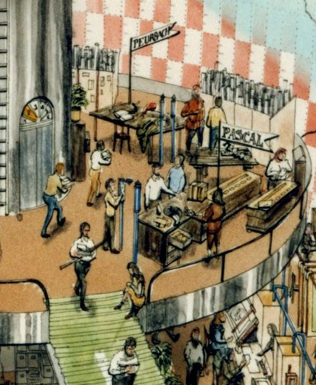

# :books: Assuntos Abordados

 
 

## **1. Motivação**

- Por que a assimilação de dados fornece uma estimativa ótima?
- Histórico da Assimilação de Dados
  - Revisão do histórico da assimilação de dados e das motivações para o seu desenvolvimento, passando pelos métodos tradicionais/clássicos até o estabelecimento dos métodos operacionais para modelos massivamente paralelos

---

<!-- Scoped style -->

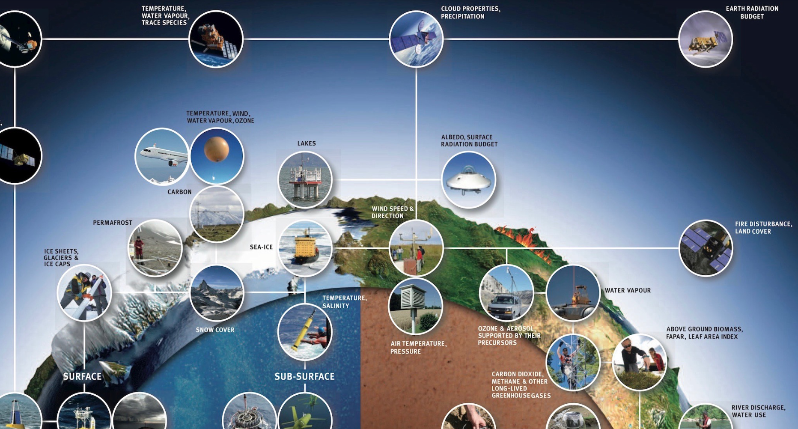

# :books: Assuntos Abordados

 
 

## **2. O Sistema Global de Observações Meteorológicas**

- O que é o Sistema Global de Observações Meteorlógicas
- Os diferentes tipos de observações (_in situ_, por sensoriamento remoto e plataformas oceânicas) 
- O fluxo de dados operacional no CPTEC para a Assimilação de Dados
- Controle de Qualidade das Observações

---

<!-- Scoped style -->

# :books: Assuntos Abordados

 
 

## **3. Métodos Clássicos (Esquemas de Interpolação Estatística)**

- Revisão dos métodos clássicos de assimilação de dados baseados em interpolação estatística
  - Análise de Cressman
  - Interpolação Ótima

---

<!-- _footer: "" -->

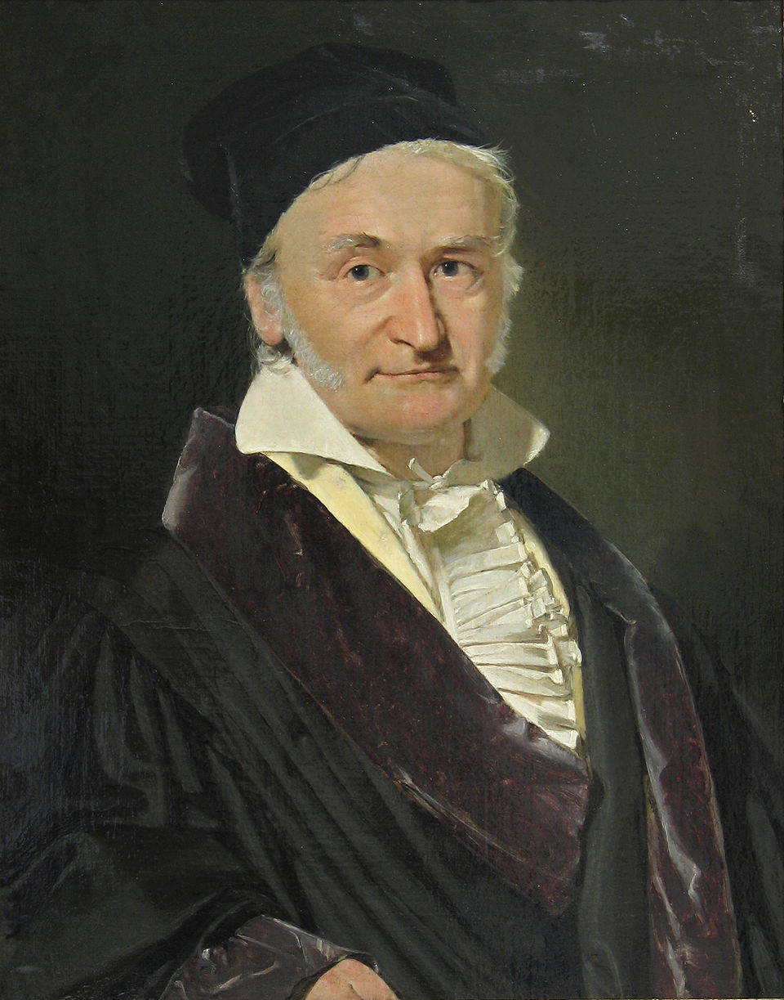

<!-- Scoped style -->

# :books: Assuntos Abordados

## **4. Método Variacional**

- Revisão de Álgebra Linear (Operações com Matrizes)
- Introdução do método 3DVar
  - Histórico e desenvolvimento 
  - Características principais 
  - PSAS&#128312;
  - FGAT&#128313;
- Componentes 
  - Método de minimização da função custo do 3DVar
  - Matriz de Covariâncias dos Erros de Previsão
  - Modelo de Transferência Radiativa
  - Controle de Qualidade
- Visão geral sobre o método 4DVar
- Atividades realizadas no CPTEC com o método 3DVar

&#128312;PSAS: <i>Physical-space Statistical Analysis System</i>
 
&#128313;FGAT: <i>First Guess at Appropriate Time</i>

---

<!-- _footer: "" -->

<!-- Scoped style -->

# :books: Assuntos Abordados

 
 

## **5. Métodos Baseados em Conjuntos (EnKF et al.)**

- Introdução ao método EnKF&#128312;
- Histórico e desenvolvimento
- Características principais 
- Inflation e Localization
- Visão geral sobre os esquemas derivados
- Atividades realizadas no CPTEC com o método LETKF&#128313;

&#128312;EnKF: <i>Ensemble Kalman Filter</i> 
&#128313;LETKF: <i>Local Ensemble Transform Kalman Filter</i>

 
---

<!-- Scoped style -->

# :books: Assuntos Abordados

 
 

## **6. Métodos Híbridos (Ensemble-Variacional)**

- Introdução ao método híbrido ensemble-variacional 3DEnVar
- Histórico e desenvolvimento
- Características principais
- Atividades realizadas no CPTEC com o método ensemble-variacional 3DEnVar

---

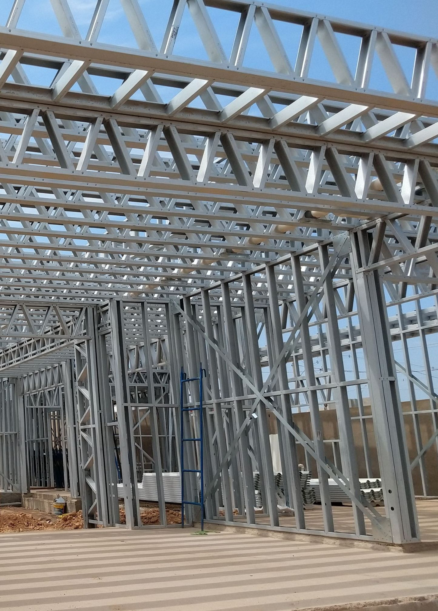

<!-- Scoped style -->

# :books: Assuntos Abordados

 
 

## **7. Frameworks de Assimilação de Dados**

- Apresentação dos principais frameworks abertos para a assimilação de dados operacional: GSI e JEDI
- Paradigmas de desenvolvimento do JEDI 
- Atividades realizadas no CPTEC com o GSI e JEDI

---

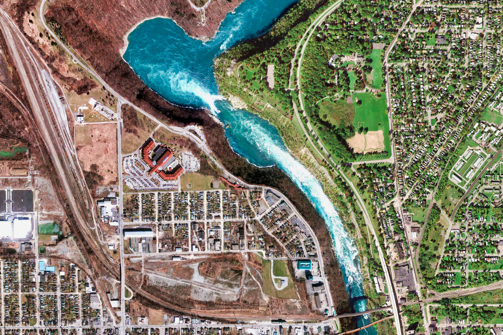

<!-- Scoped style -->

# :books: Assuntos Abordados

 
 

## **8. Assimilação de Dados Regional**

- Apresentação sobre as particularidades de um sistema de assimilação de dados regional
- Assimilação de Dados de Radar
- Desenvolvimentos realizados no CPTEC

---

<!-- Scoped style -->

# :books: Assuntos Abordados

 
 

## **9. Impacto e Experimentos de Sistemas Observacionais**

- Visão geral sobre a metodologia e a ferramenta para o estudo de impacto das observações empregada no sistema de assimilação de dados do CPTEC
- Impacto da Assimilação das Observações
- Observing System Experiment (OSE) e Observing System Simulation Experiment (OSSE)

---

# :books: Assuntos Abordados

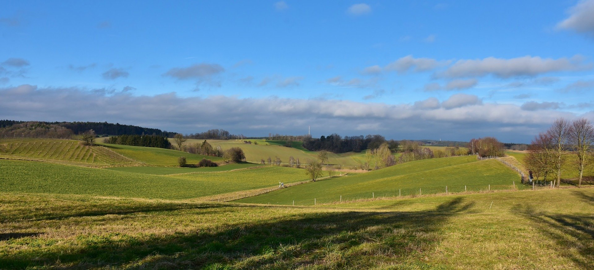

<!-- Scoped style -->

 
 

## **10. Assimilação de Dados de Superfície**

- Apresentação sobre a assimilação de dados de superfície, seus impactos e desafios
- Desenvolvimentos realizados no CPTEC

---

# :books: Assuntos Abordados

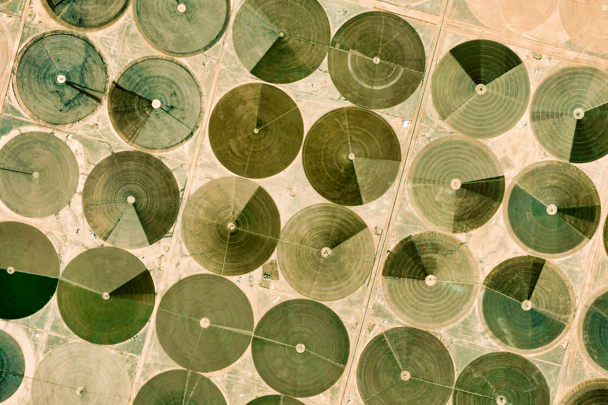

<!-- Scoped style -->

 
 

## **11. Reanálises**

- O que é reanálise
- Reanálise como ferramenta de validação de modelos numéricos
- Desenvolvimentos realizados no CPTEC com reanálise regional

---

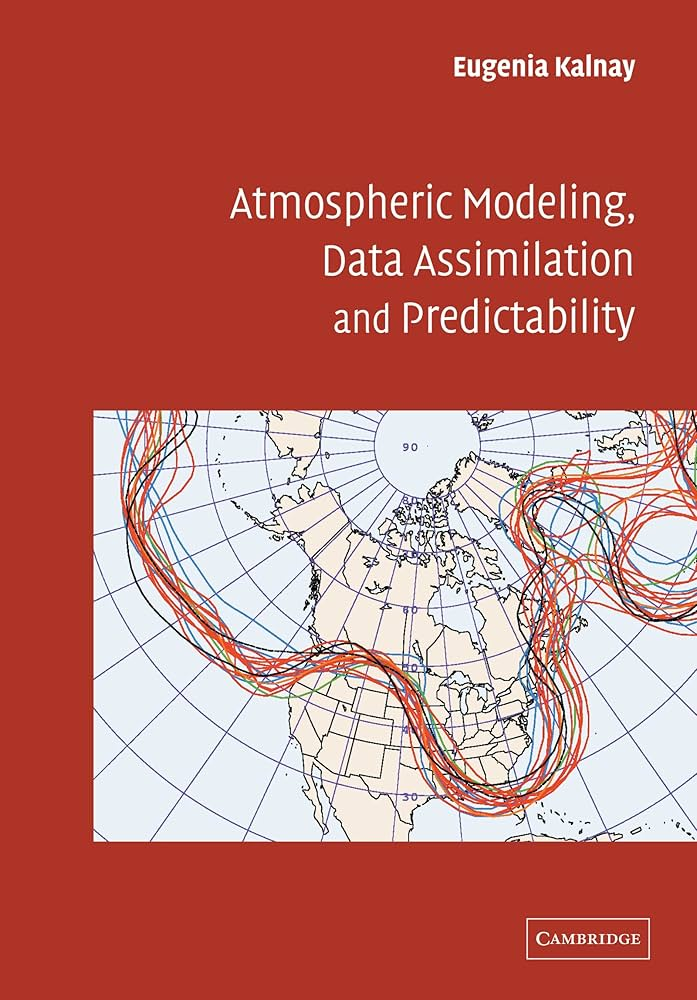

<!-- Scoped style -->

# :books: Bibliografia Recomendada

 
 

## **Livros**

Kalnay, E. (2002). Atmospheric Modeling, Data Assimilation and Predictability. Cambridge: Cambridge University Press.

- https://www.cambridge.org/highereducation/books/atmospheric-modeling-data-assimilation-and-predictability/C5FD207439132836E85027754CE9BC1A#overview

---

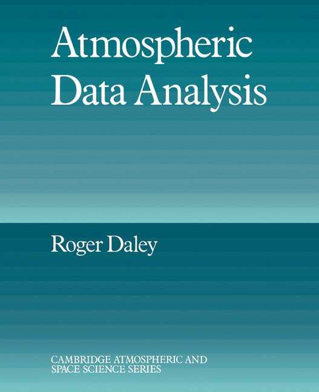

<!-- Scoped style -->

# :books: Bibliografia Recomendada

 
 

## **Livros**

Daley, R. (1991). Atmospheric Data Analysis. Cambridge Atmospheric and Space Science Series, Cambridge University Press.

- https://www.cambridge.org/pm/universitypress/subjects/earth-and-environmental-science/atmospheric-science-and-meteorology/atmospheric-data-analysis

---

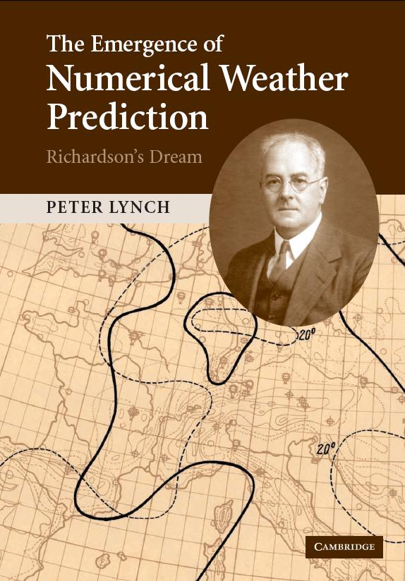

<!-- Scoped style -->

# :books: Bibliografia Recomendada

 
 

## **Livros**

Lynch, P. (2006). The Emergence of Numerical Weather Prediction: Richardson's Dream, Cambridge University Press.

- https://maths.ucd.ie/~plynch/Dream/Dream.html

---

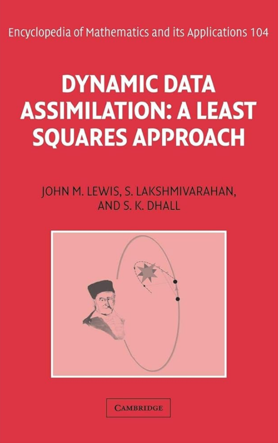

<!-- Scoped style -->

# :books: Bibliografia Recomendada

 
 

## **Livros**

Lewis,  J. M., Lakshmivarahan S., Dhall S. (2006). Dynamic Data Assimilation: A Least Squares Approach. Cambridge University Press.

- https://www.cambridge.org/core/books/dynamic-data-assimilation/91BD4736A2CD99B575002A89518DB63C

---

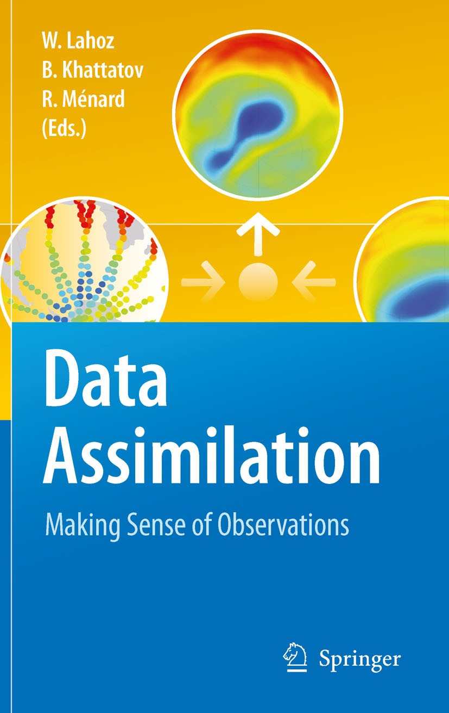

<!-- Scoped style -->

# :books: Bibliografia Recomendada

 
 

## **Livros**

Lahoz, W., Khattatov, B., and Ménard, R. (2010). Data Assimilation: Making Sense of Observations. Springer-Verlag, Heidelberg.

- https://link.springer.com/book/10.1007/978-3-540-74703-1

---

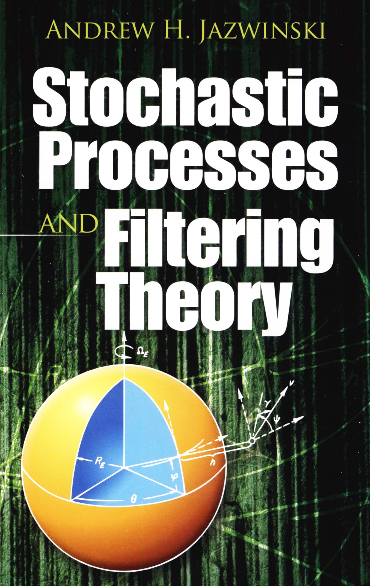

<!-- Scoped style -->

# :books: Bibliografia Recomendada

 
 

## **Livros**

A. Jazwinski (1970). Stochastic Processes and Filtering Theory. Mathematics in Science and Engineering, Vol. 64, Academic Press.

- https://store.doverpublications.com/products/9780486462745?srsltid=AfmBOopDWzwg5wKhLva9kk5dmEhQW0tH-aYP-jKL9_468Aj7UP8gNzEj

---

<!-- _footer: "" -->

<!-- Scoped style -->

# :scream: Forma de avaliação

## **Trabalhos práticos com relatórios&#128312;**

- Experimentos com **toy models** e os sistemas de assimilação de dados com a produção de relatórios
  - Uso de containers Apptainer e Docker e notebooks do Jupyter
  
 

## **Apresentação de artigos para discussão em sala de aula&#128312;**

- Cada aluno fará uma apresentação (explicação de um artigo em assimilação de dados)
  - Alunos podem escolher um artigo em assimilação de dados relacionado com a sua dissertação/tese

 

## **Interação durante as aulas**

- Dúvidas, perguntas e respostas

&#128312;Individual

--- 

<!-- _footer: "" -->

<!-- Scoped style -->

# :busts_in_silhouette: Grupo de Assimilação de Dados

 
 
 

## **Atividades de Pesquisa e Desenvolvimento**

- Desenvolvimento em assimilação de dados e técnicas de previsão por conjuntos para os modelos do CPTEC:
  - _Brazilian Atmospheric Model_ (BAM/GSI&#128312;)
  - _Model for Ocean-LaNd-Atmosphere PredictionN_ (MONAN/JEDI&#128313;)
- Pesquisas relacionadas com a assimilação de dados GNSS _Radio Occultation_, Radar e Radiâncias Hiperespectrais
- Desenvolvimento de software para o suporte às atividades de pesquisa
- Mais informações em :octopus: https://github.com/GAD-DIMNT-CPTEC

&#128312;GSI: <i>Gridpoint Statistical Interpolation</i>
 
&#128313;JEDI: <i>Joint Effort for Data Assimilation Integration</i>

---

<!-- _footer: "" -->

<!-- Scoped style -->

# :busts_in_silhouette: Grupo de Assimilação de Dados

 
<!--## Equipe-->

## **Dr. João Gerd Zell de Mattos&#128312;**

- Graduação em Meteorologia (UFPel, 2003)
- Mestrado e Doutorado em Meteorologia (INPE, 2006 e 2016)
* _Assimilação de Dados de Superfície_

 

## **Dr. Luiz Fernando Sapucci**

- Graduação em Licenciatura em Matemática (UNESP, 1998)
- Mestrado e Doutorado em Ciências Cartográficas (UNESP, 2001 e 2005)
* _Assimilação de dados GNSS-RO_

&#128312;Coordenador do GAD

--- 

<!-- _footer: "" -->

<!-- Scoped style -->

# :busts_in_silhouette: Grupo de Assimilação de Dados

 

## **Dr. Éder Paulo Vendrasco&#128312;**

- Graduação em Meteorologia (USP, 2003)
- Mestrado em Meteorologia (USP, 2006)
- Doutorado em Meteorologia (INPE, 2015)
* _Assimilação de Dados de Radar_

 

## **Dr. Sérgio Henrique Ferreira Soares**

- Graduação em Física (UNITAU, 1984)
- Mestrado e Doutorado em Meteorologia (INPE, 2003 e 2013)
* _Observações Meteorológicas e Controle de Qualidade_

&#128312;Coordenador da PGMET

--- 

<!-- Scoped style -->

# :busts_in_silhouette: Grupo de Assimilação de Dados

 

## **Dra. Helena Barbieri de Azevedo**

- Graduação em Meteorologia (UFPel, 2010)
- Mestrado e Doutorado em Meteorologia (INPE, 2014 e 2018)
* _Assimilação de Dados de Radiâncias_

 

## **Dra. Liviany Pereira Viana**

- Graduação em Meteorologia (UEA, 2012)
- Mestrado e Doutorado em Meteorologia (INPE, 2015 e 2021)
* _Impacto das Observações na Assimilação de Dados_

---

<!-- Scoped style -->

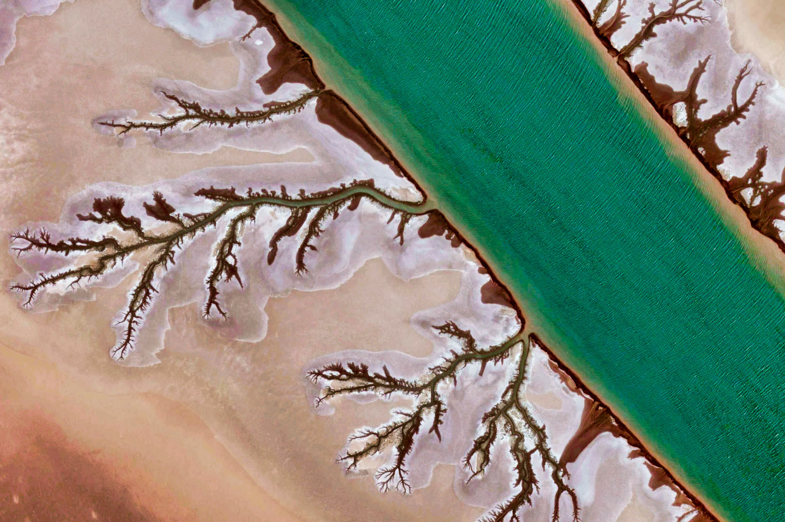

# :thinking: Dúvidas

 
 
 
 
 
 
 

:link: https://cfbastarz.github.io
:email: carlos.bastarz@inpe.br
:octopus: https://github.com/cfbastarz
