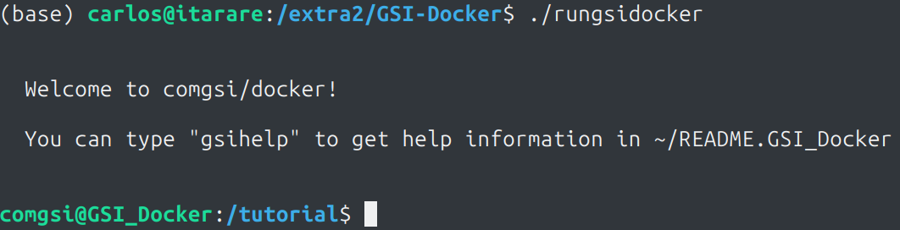
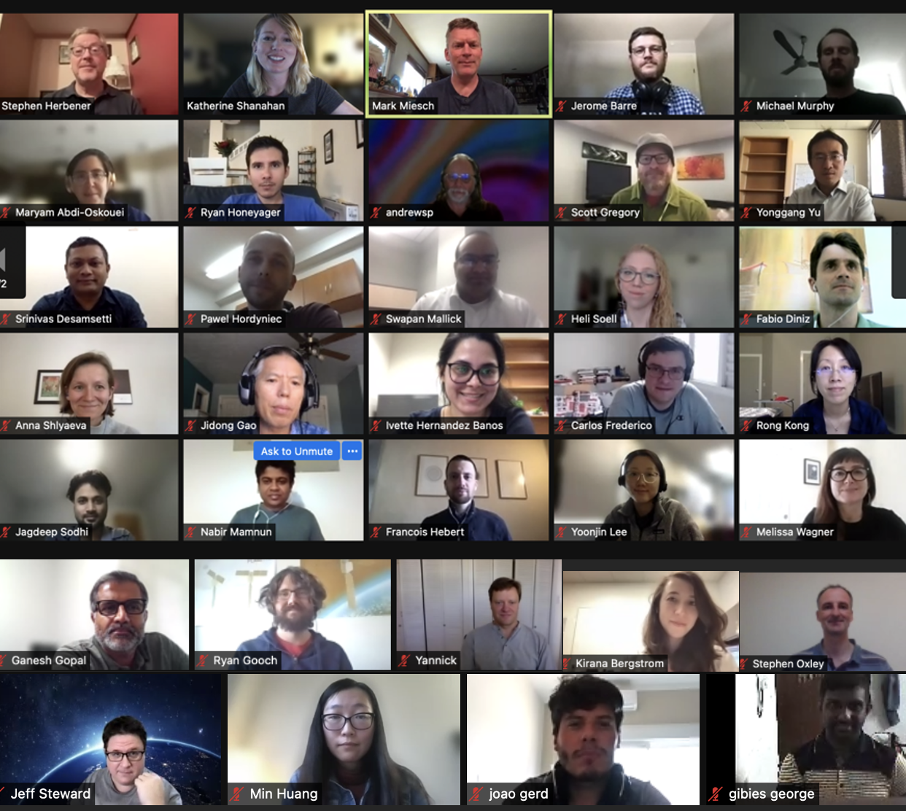
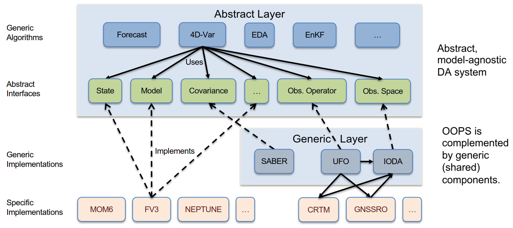

<!-- _footer: "" -->


<!-- Scoped style -->
<style scoped>
section {
  font-size: 21px;
}
span.date {
  font-size: 15px;
}
span.program {
  font-size: 18px;
}
</style>

<style>
span.footnote {
    border-top: 0.1em dotted #555;
    font-size: 60%;
    margin-top: auto;
    position:absolute;
    bottom:0;
    width:100%;
    height:60px;    
}

span.footnote2 {
    border-top: 0.1em dotted #555;
    font-size: 60%;
    margin-top: auto;
    position:absolute;
    bottom:0;
    width:100%;
    height:90px;    
}
</style>

<br />

# **Introdução à Assimilação de Dados (MET 563-3)**

### Frameworks de Assimilação de Dados

<br />
<p>Dr. Carlos Frederico Bastarz
<br />
<br />
<br />
<span class="program">Programa de Pós-Graduação em Meteorologia (PGMET) do INPE</span>
<br />
<br />
<span class="date">14 de Novembro de 2025</span>
</p>

---

<!-- Scoped style -->
<style scoped>
section {
  font-size: 21px;
}
.columns {
  display: grid;
  grid-template-columns: repeat(2, minmax(0, 1fr));
  gap: 1rem;
}
</style>

# Frameworks de Assimilação de Dados

<br />

## **Sumário**

<br />

1. Informações sobre containers
   1.1 Docker
   1.2 Singularity
2. GSI
   2.1 Exercícios em sala
3. JEDI
   3.1 Paradigmas de desenvolvimento do JEDI
   3.2 Instruções para exercícios em casa
4. Atividades realizadas no CPTEC com o GSI e JEDI

---


<!-- _footer: "" -->

<!-- Scoped style -->
<style scoped>
section {
  font-size: 17px;
}
.columns {
  display: grid;
  grid-template-columns: repeat(2, minmax(0, 1fr));
  gap: 1rem;
}
</style>

# Frameworks de Assimilação de Dados

<br />

## **1. Informações sobre containers**

<br />

- Um container é um artefato que contém toda a estrutura de software necessária para a execução de outros software em outros computadores
  * É um tipo de virtualização multiplataforma (no Mac OS a virtualização pode ser feita em duas camadas)
  * Foco em portabilidade e reprodutibilidade (mesmo em outras plataformas com processadores diferentes)
  * Elimina a necessidade de configuração do ambiente para a execução do software (mas é necessário instalar o genrenciador do container)
  * Permite o acesso aos dados do host com permissões de acesso que variam de acordo com o tipo de container

- Duas insfraestruturas de containeres mais comnuns são o Docker e o Singularity
  * Apptainer/Singularity foi pensado para ambientes de HPC<sup>&#128312;</sup>
  * Docker tem um propósito mais geral
  * Ambos podem ser utilizados para a maioria das tarefas (e.g., executar um software pela linha de comando ou com interface gráfica; executar um modelo)

<span class="footnote">
<sup>&#128312;</sup>HPC: <i>High Performance Computing</i>
</span>

---

<!-- _footer: "" -->

<!-- Scoped style -->
<style scoped>
section {
  font-size: 21px;
}
.columns {
  display: grid;
  grid-template-columns: repeat(2, minmax(0, 1fr));
  gap: 1rem;
}
/* Garante que elementos absolutos sejam posicionados em relação ao slide */
section {
  position: relative;
}

/* Imagem flutuante no canto inferior direito */
.floating {
  position: absolute;
  top: 200px;
  right: 80px;
  width: 200px;
  opacity: 0.9;
  pointer-events: none; /* evita interferir com seleção de texto */
}

/* Exemplo flex: texto + imagem lado a lado */
.row {
  display: flex;
  align-items: center;
  gap: 120px;
}
.row .left-img {
  width: 200px;
  flex-shrink: 0;
}
</style>

# Frameworks de Assimilação de Dados

<br />

## **1. Informações sobre containers**

<br />

### 1.1 Docker

<br />

- Foco é a execução de programas pequenos, aplicações em nuvem em ambienytes corporativos, servidores e redes
* Containeres do Docker são executados como processos do usuário root e requer permissões elevadas e não permitido em ambientes multiusuário (não é permitido o compartilhamento do container por questões de segurança)
* A imagem do container é isolada, i.e., não há ações diretas entre os arquivos de dentro do container e da máquina host
* Requer configurações adicionais para funcionar com MPI<sup>&#128312;</sup> e CUDA<sup>&#128313;</sup>
 
<div>
  
</div>

<span class="footnote">
<sup>&#128312;</sup>MPI: <i>Message Passing Interface</i>
<br />
<sup>&#128313;</sup>CUDA: <i>Compute Unified Device Architecture</i>
</span>

---

<!-- _footer: "" -->

<!-- Scoped style -->
<style scoped>
section {
  font-size: 21px;
}
.columns {
  display: grid;
  grid-template-columns: repeat(2, minmax(0, 1fr));
  gap: 1rem;
}
/* Garante que elementos absolutos sejam posicionados em relação ao slide */
section {
  position: relative;
}

/* Imagem flutuante no canto inferior direito */
.floating {
  position: absolute;
  top: 200px;
  right: 80px;
  width: 200px;
  opacity: 0.9;
  pointer-events: none; /* evita interferir com seleção de texto */
}

/* Exemplo flex: texto + imagem lado a lado */
.row {
  display: flex;
  align-items: center;
  gap: 120px;
}
.row .left-img {
  width: 200px;
  flex-shrink: 0;
}
</style>

# Frameworks de Assimilação de Dados

<br />

## **1. Informações sobre containers**

<br />

### 1.2 Apptainer/Singularity<sup>&#128312;</sup>

- Foco está na área científica e ambientes de HPC atendendo a requisitos de execução de programas grandes (e.g., um modelo numérico)
* Containeres do Apptainer/Singularity, por serem compatíveis com ambientes HPC
  * Não requerem permissões de root
  * São compatíveis com MPI para simulações paralelizadas
  * Possui suporte a CUDA
* A imagem do container é isolada da máquina host, mas pode ser compartilhada e movida livremente 
* Permite o uso de imagens do Docker

<div>
  
</div>

<span class="footnote">
<sup>&#128312;</sup>O Singularity era gerenciado por uma empresa privada (Sylabs), a qual passou a sua tutela para a Linux Foundation - a partir disso, o software foi renomeado para Apptainer
</span>

---

<!-- _footer: "" -->

<!-- Scoped style -->
<style scoped>
section {
  font-size: 19px;
}
.columns {
  display: grid;
  grid-template-columns: repeat(2, minmax(0, 1fr));
  gap: 1rem;
}
</style>

# Frameworks de Assimilação de Dados

<br />

## **2. GSI<sup>&#128312;</sup>**

- O GSI é um framework de assimilação de dados desenvolvido pelo NCEP
  * Fornece a implementação de software para todas as componentes relacionadas à assimilação de dados
    * Métodos variacional (3D/4DVar, híbrido-variacional e 3D/4DEnVar)
    * Métodos baseados em conjuntos (EnKF, EnSRF, LETKF)
    * Métodos de minimização da função custo variacional
    * Operador $H$ (Modelo de Transferência Radiativa)
    * Suporte para modelos globais (espectrais) e regionais (em ponto de grade)
* Foco em sistemas operacionais
* Mantido pelo DTC<sup>&#128313;</sup>/NCAR
  * Centraliza as contribuições, faz o gerenciamento do código, distribui releases e realiza tutoriais para a comunidade de usuários
* Recebe contribuições da NASA, NCEP e universidades  

<span class="footnote">
<sup>&#128312;</sup>GSI: <i>Gridpoint Statistical Interpolation</i>
<br />
<sup>&#128313;</sup>DTC: <i>Developmental Testbed Center</i>
</span>

---

<!-- Scoped style -->
<style scoped>
section {
  font-size: 21px;
}
.columns {
  display: grid;
  grid-template-columns: repeat(2, minmax(0, 1fr));
  gap: 1rem;
}
</style>

# Frameworks de Assimilação de Dados

<br />

## **2.1 Exercícios em sala**

<br />

- Utilização do container Docker do GSI (fornecido pelo DTC) para a realização dos sistemas 3DVar, 4DVar e híbrido-variacional 3DVar
* Teste com a assimilação de uma única variável
* Verificação da minimização da função custo por meio da verificação dos outer e inner loops
* Verificação da assimilação de dados por meio da redução do erro da análise durante a minimização da função custo

---

<!-- _footer: "" -->

<!-- Scoped style -->
<style scoped>
section {
  font-size: 18px;
}
.columns {
  display: grid;
  grid-template-columns: repeat(2, minmax(0, 1fr));
  gap: 1rem;
}
/* Garante que elementos absolutos sejam posicionados em relação ao slide */
section {
  position: relative;
}

/* Imagem flutuante no canto inferior direito */
.floating {
  position: absolute;
  top: 200px;
  right: 80px;
  width: 200px;
  opacity: 0.9;
  pointer-events: none; /* evita interferir com seleção de texto */
}

/* Exemplo flex: texto + imagem lado a lado */
.row {
  display: flex;
  align-items: center;
  gap: 120px;
}
.row .left-img {
  width: 200px;
  flex-shrink: 0;
}
</style>

# Frameworks de Assimilação de Dados

<br />

## **2.1 Exercícios em sala**

<br />

### Instalação do Docker

- Referência Ubuntu Linux (v22.04 +) - [Instalação](https://docs.docker.com/engine/install/ubuntu/) | [Pós-instalação](https://docs.docker.com/engine/install/linux-postinstall)

```bash
# Add Docker's official GPG key:
sudo apt-get update
sudo apt-get install ca-certificates curl
sudo install -m 0755 -d /etc/apt/keyrings
sudo curl -fsSL https://download.docker.com/linux/ubuntu/gpg -o /etc/apt/keyrings/docker.asc
sudo chmod a+r /etc/apt/keyrings/docker.asc

# Add the repository to Apt sources:
echo \
  "deb [arch=$(dpkg --print-architecture) signed-by=/etc/apt/keyrings/docker.asc] https://download.docker.com/linux/ubuntu \
  $(. /etc/os-release && echo "${UBUNTU_CODENAME:-$VERSION_CODENAME}") stable" | \
  sudo tee /etc/apt/sources.list.d/docker.list > /dev/null
sudo apt-get update
```
- Em seguida

```bash
sudo apt-get install docker-ce docker-ce-cli containerd.io docker-buildx-plugin docker-compose-plugin
```

<div>
  
</div>

---

<!-- _footer: "" -->

<!-- Scoped style -->
<style scoped>
section {
  font-size: 21px;
}
.columns {
  display: grid;
  grid-template-columns: repeat(2, minmax(0, 1fr));
  gap: 1rem;
}
/* Garante que elementos absolutos sejam posicionados em relação ao slide */
section {
  position: relative;
}

/* Imagem flutuante no canto inferior direito */
.floating {
  position: absolute;
  top: 200px;
  right: 80px;
  width: 200px;
  opacity: 0.9;
  pointer-events: none; /* evita interferir com seleção de texto */
}

/* Exemplo flex: texto + imagem lado a lado */
.row {
  display: flex;
  align-items: center;
  gap: 120px;
}
.row .left-img {
  width: 200px;
  flex-shrink: 0;
}
</style>

# Frameworks de Assimilação de Dados

<br />

## **2.1 Exercícios em sala**

<br />

### Instalação do Docker

- Verificação da instalação

```bash
sudo systemctl status docker
```

- Se o serviço do Docker não estiver em execução

```bash
sudo systemctl start docker
```

- Em seguida

```bash
sudo docker run hello-world
```

<div>
  
</div>

---

<!-- _footer: "" -->

<!-- Scoped style -->
<style scoped>
section {
  font-size: 20px;
}
.columns {
  display: grid;
  grid-template-columns: repeat(2, minmax(0, 1fr));
  gap: 1rem;
}
/* Garante que elementos absolutos sejam posicionados em relação ao slide */
section {
  position: relative;
}

/* Imagem flutuante no canto inferior direito */
.floating {
  position: absolute;
  top: 200px;
  right: 80px;
  width: 200px;
  opacity: 0.9;
  pointer-events: none; /* evita interferir com seleção de texto */
}

/* Exemplo flex: texto + imagem lado a lado */
.row {
  display: flex;
  align-items: center;
  gap: 120px;
}
.row .left-img {
  width: 200px;
  flex-shrink: 0;
}
</style>

# Frameworks de Assimilação de Dados

<br />

## **2.1 Exercícios em sala**

<br />

### Pós-instalação

- Permitir a execução como usuário normal

```bash
sudo groupadd docker
sudo usermod -aG docker $USER
```

- Em seguida

```bash
newgrp docker
```

- Finalmente

```bash
docker run hello-world
```

<div>
  
</div>

---

<!-- Scoped style -->
<style scoped>
section {
  font-size: 21px;
}
.columns {
  display: grid;
  grid-template-columns: repeat(2, minmax(0, 1fr));
  gap: 1rem;
}
/* Garante que elementos absolutos sejam posicionados em relação ao slide */
section {
  position: relative;
}

/* Imagem flutuante no canto inferior direito */
.floating {
  position: absolute;
  top: 200px;
  right: 80px;
  width: 200px;
  opacity: 0.9;
  pointer-events: none; /* evita interferir com seleção de texto */
}

/* Exemplo flex: texto + imagem lado a lado */
.row {
  display: flex;
  align-items: center;
  gap: 120px;
}
.row .left-img {
  width: 200px;
  flex-shrink: 0;
}
</style>

# Frameworks de Assimilação de Dados

<br />

## **2.1 Exercícios em sala**

<br />

### ✨ EXTRA - Instalação do Apptainer/Singularity

<br />

- Forma simples para o Ubuntu Linux e derivados

```bash
wget -c https://github.com/apptainer/apptainer/releases/download/v1.4.2/apptainer_1.4.2_amd64.deb
wget -c https://github.com/apptainer/apptainer/releases/download/v1.4.2/apptainer-suid_1.4.2_amd64.deb
sudo dpkg -i apptainer_1.4.2_amd64.deb
sudo dpkg -i apptainer-suid_1.4.2_amd64.deb
sudo apt install -f
```

- Há pacotes pré-compilados disponíveis para outras distribuições Linux

<div>
  
</div>

---

<!-- Scoped style -->
<style scoped>
section {
  font-size: 21px;
}
.columns {
  display: grid;
  grid-template-columns: repeat(2, minmax(0, 1fr));
  gap: 1rem;
}
/* Garante que elementos absolutos sejam posicionados em relação ao slide */
section {
  position: relative;
}

/* Imagem flutuante no canto inferior direito */
.floating {
  position: absolute;
  top: 200px;
  right: 80px;
  width: 200px;
  opacity: 0.9;
  pointer-events: none; /* evita interferir com seleção de texto */
}

/* Exemplo flex: texto + imagem lado a lado */
.row {
  display: flex;
  align-items: center;
  gap: 120px;
}
.row .left-img {
  width: 200px;
  flex-shrink: 0;
}
</style>

# Frameworks de Assimilação de Dados

<br />

## **2.1 Exercícios em sala**

<br />

### Exercícios com o GSI (Docker)

- Arquivos disponíveis no 🔗 [link](https://dataserver.cptec.inpe.br/dataserver_dimnt/das/carlos.bastarz/GSITutorialDTC/)

---

<!-- Scoped style -->
<style scoped>
section {
  font-size: 21px;
}
.columns {
  display: grid;
  grid-template-columns: repeat(2, minmax(0, 1fr));
  gap: 1rem;
}
/* Garante que elementos absolutos sejam posicionados em relação ao slide */
section {
  position: relative;
}

/* Imagem flutuante no canto inferior direito */
.floating {
  position: absolute;
  top: 200px;
  right: 80px;
  width: 200px;
  opacity: 0.9;
  pointer-events: none; /* evita interferir com seleção de texto */
}

/* Exemplo flex: texto + imagem lado a lado */
.row {
  display: flex;
  align-items: center;
  gap: 120px;
}
.row .left-img {
  width: 200px;
  flex-shrink: 0;
}
</style>

# Frameworks de Assimilação de Dados

<br />

## **2.1 Exercícios em sala**

<br />

<div class="columns">
<div>

### Instruções

0. Instalação do Docker ✅
1. Escolher um diretório na máquina local (com pelo menos 10GB ) e executar
```bash
mkdir GSI-Docker
cd GSI-Docker
```
2. Download do GSI
  ```bash
  docker pull comgsi/docker
  ```
</div>
<div>

👉 Alternativamente
  ```bash
  wget -c https://dataserver.cptec.inpe.br/dataserver_dimnt/das/carlos.bastarz/GSITutorialDTC/comgsi_docker.tar.gz
  ```
3. Desempacotar
```bash
gunzip comgsi_docker.tar.gz
```
4. Carregar o container
```bash
docker load -i comgsi_docker.tar
```
</div>
</div>

---

<!-- _footer: "" -->

<!-- Scoped style -->
<style scoped>
section {
  font-size: 21px;
}
.columns {
  display: grid;
  grid-template-columns: repeat(2, minmax(0, 1fr));
  gap: 1rem;
}
/* Garante que elementos absolutos sejam posicionados em relação ao slide */
section {
  position: relative;
}

/* Imagem flutuante no canto inferior direito */
.floating {
  position: absolute;
  top: 530px;
  right: 350px;
  width: 600px;
  opacity: 0.9;
  pointer-events: none; /* evita interferir com seleção de texto */
}

/* Exemplo flex: texto + imagem lado a lado */
.row {
  display: flex;
  align-items: center;
  gap: 120px;
}
.row .left-img {
  width: 200px;
  flex-shrink: 0;
}
.github-code {
  font-family: ui-monospace, SFMono-Regular, Menlo, Consolas, monospace;
  font-size: 0.7em;
  background-color: #323742;
  color: #f6f8fa;
  padding: 0.2em 0.4em;
  border-radius: 6px;
}
</style>

# Frameworks de Assimilação de Dados

<br />

## **2.1 Exercícios em sala**

<br />

### Instruções

5. Inicializar o container
```bash
echo 'docker run -h GSI_Docker -v "$(pwd)":/tutorial -ti --rm comgsi/docker' > rungsidocker; chmod +x rungsidocker
```

👉 Execute <span class="github-code">./rungsidocker</span> para inicializar o container

<div align="center">
  
</div>

---

<!-- Scoped style -->
<style scoped>
section {
  font-size: 21px;
}
.columns {
  display: grid;
  grid-template-columns: repeat(2, minmax(0, 1fr));
  gap: 1rem;
}
/* Garante que elementos absolutos sejam posicionados em relação ao slide */
section {
  position: relative;
}

/* Imagem flutuante no canto inferior direito */
.floating {
  position: absolute;
  top: 450px;
  right: 350px;
  width: 690px;
  opacity: 0.9;
  pointer-events: none; /* evita interferir com seleção de texto */
}

/* Exemplo flex: texto + imagem lado a lado */
.row {
  display: flex;
  align-items: center;
  gap: 120px;
}
.row .left-img {
  width: 200px;
  flex-shrink: 0;
}
.github-code {
  font-family: ui-monospace, SFMono-Regular, Menlo, Consolas, monospace;
  font-size: 0.7em;
  background-color: #323742;
  color: #f6f8fa;
  padding: 0.2em 0.4em;
  border-radius: 6px;
}
</style>

# Frameworks de Assimilação de Dados

<br />

## **2.1 Exercícios em sala**

<br />

### Instruções

- Para abrir um novo shell do GSI Docker, execute
```bash
docker ps
```

- Anote o número referente à instância do docker em execução (e.g., ed09947d9d92) e execute

```bash
docker exec -it ed09947d9d92 bash
```

---

<!-- _footer: "" -->

<!-- Scoped style -->
<style scoped>
section {
  font-size: 21px;
}
.columns {
  display: grid;
  grid-template-columns: repeat(2, minmax(0, 1fr));
  gap: 1rem;
}
/* Garante que elementos absolutos sejam posicionados em relação ao slide */
section {
  position: relative;
}

/* Imagem flutuante no canto inferior direito */
.floating {
  position: absolute;
  top: 450px;
  right: 350px;
  width: 690px;
  opacity: 0.9;
  pointer-events: none; /* evita interferir com seleção de texto */
}

/* Exemplo flex: texto + imagem lado a lado */
.row {
  display: flex;
  align-items: center;
  gap: 120px;
}
.row .left-img {
  width: 200px;
  flex-shrink: 0;
}
.github-code {
  font-family: ui-monospace, SFMono-Regular, Menlo, Consolas, monospace;
  font-size: 0.7em;
  background-color: #323742;
  color: #f6f8fa;
  padding: 0.2em 0.4em;
  border-radius: 6px;
}
</style>

# Frameworks de Assimilação de Dados

<br />

## **2.1 Exercícios em sala**

### Compilação do GSI

1. Dentro do diretório <span class="github-code">/tutorial</span>, faça o download do arquivo <span class="github-code">comGSIv3.7_EnKFv1.3.tar.gz</span>

```bash
wget -c https://dataserver.cptec.inpe.br/dataserver_dimnt/das/carlos.bastarz/GSITutorialDTC/comGSIv3.7_EnKFv1.3.tar.gz
```

2. Desempacotar o arquivo baixado
```bash
tar -zxvf comGSIv3.7_EnKFv1.3.tar.gz
```
3. Execute os comandos
```bash
cd build
cmake ../comGSIv3.7_EnKFv1.3
make
```

---

<!-- Scoped style -->
<style scoped>
section {
  font-size: 21px;
}
.columns {
  display: grid;
  grid-template-columns: repeat(2, minmax(0, 1fr));
  gap: 1rem;
}
/* Garante que elementos absolutos sejam posicionados em relação ao slide */
section {
  position: relative;
}

/* Imagem flutuante no canto inferior direito */
.floating {
  position: absolute;
  top: 450px;
  right: 350px;
  width: 690px;
  opacity: 0.9;
  pointer-events: none; /* evita interferir com seleção de texto */
}

/* Exemplo flex: texto + imagem lado a lado */
.row {
  display: flex;
  align-items: center;
  gap: 120px;
}
.row .left-img {
  width: 200px;
  flex-shrink: 0;
}
.github-code {
  font-family: ui-monospace, SFMono-Regular, Menlo, Consolas, monospace;
  font-size: 0.7em;
  background-color: #323742;
  color: #f6f8fa;
  padding: 0.2em 0.4em;
  border-radius: 6px;
}
</style>

# Frameworks de Assimilação de Dados

<br />

## **2.1 Exercícios em sala**

<br />

### Compilação do GSI

1. Entrar no diretório <span class="github-code">/tutorial/run</span> e executar os comandos
```bash
cd /tutorial/run
ln -s ../build/bin/gsi.x .
ln -sf ../build/bin/enkf_wrf.x .
```

---

<!-- _footer: "" -->

<!-- Scoped style -->
<style scoped>
section {
  font-size: 19px;
}
.columns {
  display: grid;
  grid-template-columns: repeat(2, minmax(0, 1fr));
  gap: 1rem;
}
/* Garante que elementos absolutos sejam posicionados em relação ao slide */
section {
  position: relative;
}

/* Imagem flutuante no canto inferior direito */
.floating {
  position: absolute;
  top: 450px;
  right: 350px;
  width: 690px;
  opacity: 0.9;
  pointer-events: none; /* evita interferir com seleção de texto */
}

/* Exemplo flex: texto + imagem lado a lado */
.row {
  display: flex;
  align-items: center;
  gap: 120px;
}
.row .left-img {
  width: 200px;
  flex-shrink: 0;
}
.github-code {
  font-family: ui-monospace, SFMono-Regular, Menlo, Consolas, monospace;
  font-size: 0.7em;
  background-color: #323742;
  color: #f6f8fa;
  padding: 0.2em 0.4em;
  border-radius: 6px;
}
</style>

# Frameworks de Assimilação de Dados

<br />

## **2.1 Exercícios em sala**

<br />

### Download do testcase

1. Entrar no diretório <span class="github-code">/tutorial/case_data</span> e executar os comandos
```bash
wget -c https://dataserver.cptec.inpe.br/dataserver_dimnt/das/carlos.bastarz/GSITutorialDTC/data/2018081212.tar.gz
wget -c https://dataserver.cptec.inpe.br/dataserver_dimnt/das/carlos.bastarz/GSITutorialDTC/data/2018081218.tar.gz
wget -c https://dataserver.cptec.inpe.br/dataserver_dimnt/das/carlos.bastarz/GSITutorialDTC/data/CRTM_v2.3.0.tar.gz
wget -c https://dataserver.cptec.inpe.br/dataserver_dimnt/das/carlos.bastarz/GSITutorialDTC/data/T62.gfs.tar.gz
wget -c https://dataserver.cptec.inpe.br/dataserver_dimnt/das/carlos.bastarz/GSITutorialDTC/data/chemdata.tar.gz
```
2. Desempacotar os arquivos
```bash
tar -zxvf 2018081212.tar.gz
tar -zxvf 2018081218.tar.gz
tar -zxvf CRTM_v2.3.0.tar.gz
tar -zxvf T62.gfs.tar.gz
tar -zxvf chemdata.tar.gz
```

---

<!-- _footer: "" -->

<!-- Scoped style -->
<style scoped>
section {
  font-size: 19px;
}
.columns {
  display: grid;
  grid-template-columns: repeat(2, minmax(0, 1fr));
  gap: 1rem;
}
/* Garante que elementos absolutos sejam posicionados em relação ao slide */
section {
  position: relative;
}

/* Imagem flutuante no canto inferior direito */
.floating {
  position: absolute;
  top: 450px;
  right: 350px;
  width: 690px;
  opacity: 0.9;
  pointer-events: none; /* evita interferir com seleção de texto */
}

/* Exemplo flex: texto + imagem lado a lado */
.row {
  display: flex;
  align-items: center;
  gap: 120px;
}
.row .left-img {
  width: 200px;
  flex-shrink: 0;
}
.github-code {
  font-family: ui-monospace, SFMono-Regular, Menlo, Consolas, monospace;
  font-size: 0.7em;
  background-color: #323742;
  color: #f6f8fa;
  padding: 0.2em 0.4em;
  border-radius: 6px;
}
</style>

# Frameworks de Assimilação de Dados

<br />

## **2.1 Exercícios em sala**

<br />

### Preparação do script de execução

- Usar como referência as instruções em 🔗 [link](https://dataserver.cptec.inpe.br/dataserver_dimnt/das/carlos.bastarz/GSITutorialDTC/tutorial/00.PrepareBaseRunScript/Prepare%20Base%20Run%20Script.pdf)
- Realize as modificações e execute o script <span class="github-code">run_gsi_regional.ksh_basic</span>
```bash
./run_gsi_regional.ksh_basic
```
- Neste primeiro teste, verifique o conteúdo do diretório <span class="github-code">/tutorial/run/basic</span>

### Realização dos casos

- 11 casos, descritos 🔗 [link](https://dataserver.cptec.inpe.br/dataserver_dimnt/das/carlos.bastarz/GSITutorialDTC/tutorial/01.ARWPracticeCases/ARW%20Practice%20Cases.pdf)
  - Para cada caso, será necessário fazer ajustes no script de submissão
  - Crie os diretórios necessários para a realização dos experimentos e execute o script a partir deles

---

<!-- _footer: "" -->


<!-- Scoped style -->
<style scoped>
section {
  font-size: 19px;
}
.columns {
  display: grid;
  grid-template-columns: repeat(2, minmax(0, 1fr));
  gap: 1rem;
}
/* Garante que elementos absolutos sejam posicionados em relação ao slide */
section {
  position: relative;
}

/* Imagem flutuante no canto inferior direito */
.floating {
  position: absolute;
  top: 200px;
  right: 80px;
  width: 200px;
  opacity: 0.9;
  pointer-events: none; /* evita interferir com seleção de texto */
}

/* Exemplo flex: texto + imagem lado a lado */
.row {
  display: flex;
  align-items: center;
  gap: 120px;
}
.row .left-img {
  width: 200px;
  flex-shrink: 0;
}
</style>

# Frameworks de Assimilação de Dados

<br />

## **3. JEDI<sup>&#128312;</sup>**

- É um esforço conjunto liderado pelo JCSDA<sup>&#128313;</sup> para o desenvolvimento de um novo sistema de assimilação de dados unificado 🔗 [link](https://www.jcsda.org/jcsda-project-jedi)
* Novo framework de assimilação de dados
  * Mais moderno: escrito do zero, com abordagem de separação de conceitos
  * Implementa os métodos de assimilação de dados mais utilizados (variacionais e por conjuntos)
  * Implementa interfaces para diversos modelos (globais, regionais, atmosféricos e oceânicos)
* Foco é a operação e a colaboração de desenvolvimento com a comunidade de usuários
  * Anualmente são oferecidas as _JEDI Academies_ 

<span class="footnote">
<sup>&#128312;</sup>JEDI: <i>Joint Effort for Data Assimilation Integration</i>
<br />
<sup>&#128313;</sup>JCSDA: <i>Joint Center for Satellite Data Assimilation</i>
</span>

---

<!-- Scoped style -->
<style scoped>
section {
  font-size: 21px;
}
.columns {
  display: grid;
  grid-template-columns: repeat(2, minmax(0, 1fr));
  gap: 1rem;
}
/* Garante que elementos absolutos sejam posicionados em relação ao slide */
section {
  position: relative;
}

/* Imagem flutuante no canto inferior direito */
.floating {
  position: absolute;
  top: 200px;
  right: 100px;
  width: 500px;
  opacity: 0.9;
  pointer-events: none; /* evita interferir com seleção de texto */
}

/* Exemplo flex: texto + imagem lado a lado */
.row {
  display: flex;
  align-items: center;
  gap: 120px;
}
.row .left-img {
  width: 200px;
  flex-shrink: 0;
}
</style>

# Frameworks de Assimilação de Dados

## **3. JEDI**

<br />

### _JEDI Academy_

<br />
<br />

-  7a Jedi Academy 
  - 4 a 8 de outurbo de 2021
  - Formato virtual
  - Página da JEDI Academy: 🔗 [link](https://www.jcsda.org/jedi-academies)
  - Conteúdo do curso: 🔗 [link](http://academy.jcsda.org/2021-10/index.html)

<div>
  
</div>

---

<!-- Scoped style -->
<style scoped>
section {
  font-size: 21px;
}
.columns {
  display: grid;
  grid-template-columns: repeat(2, minmax(0, 1fr));
  gap: 1rem;
}
/* Garante que elementos absolutos sejam posicionados em relação ao slide */
section {
  position: relative;
}

/* Imagem flutuante no canto inferior direito */
.floating {
  position: absolute;
  top: 290px;
  right: 250px;
  width: 800px;
  opacity: 0.9;
  pointer-events: none; /* evita interferir com seleção de texto */
}

/* Exemplo flex: texto + imagem lado a lado */
.row {
  display: flex;
  align-items: center;
  gap: 120px;
}
.row .left-img {
  width: 200px;
  flex-shrink: 0;
}
</style>

# Frameworks de Assimilação de Dados

<br />

## **3. JEDI**

<br />

### Paradigmas de desenvolvimento do JEDI - Principais Componentes

- OOPS (_Object-Oriented Prediction System_)
  * É o núcleo do JEDI (implementa os métodos e algorítmos de assimilação)

- SABER (_System-Agnostic Background Error Representation_)
  * Parte responsável pela modelagem de covariâncias dos erros de previsão (matriz $\mathbf{B}$)

- UFO (_Unified Forward Operator_)
  * Parte responsável pelos operadores de observação (operador $H$ e matriz $\mathbf{R}$)

- IODA (_Interface for Observation Data Access_)
  * Responsável pela manipulação das observações para tratamento interno (padroniza as observações para uso com o UFO e OOPS)

---

<!-- _footer: "" -->

<!-- Scoped style -->
<style scoped>
section {
  font-size: 21px;
}
.columns {
  display: grid;
  grid-template-columns: repeat(2, minmax(0, 1fr));
  gap: 1rem;
}
/* Garante que elementos absolutos sejam posicionados em relação ao slide */
section {
  position: relative;
}

/* Imagem flutuante no canto inferior direito */
.floating {
  position: absolute;
  top: 290px;
  right: 250px;
  width: 800px;
  opacity: 0.9;
  pointer-events: none; /* evita interferir com seleção de texto */
}

/* Exemplo flex: texto + imagem lado a lado */
.row {
  display: flex;
  align-items: center;
  gap: 120px;
}
.row .left-img {
  width: 200px;
  flex-shrink: 0;
}
</style>

# Frameworks de Assimilação de Dados

## **3. JEDI**

### Paradigmas de desenvolvimento do JEDI - Separação de Conceitos

<div>
  
</div>

---

<!-- Scoped style -->
<style scoped>
section {
  font-size: 19px;
}
.columns {
  display: grid;
  grid-template-columns: repeat(2, minmax(0, 1fr));
  gap: 1rem;
}
/* Garante que elementos absolutos sejam posicionados em relação ao slide */
section {
  position: relative;
}

/* Imagem flutuante no canto inferior direito */
.floating {
  position: absolute;
  top: 290px;
  right: 250px;
  width: 800px;
  opacity: 0.9;
  pointer-events: none; /* evita interferir com seleção de texto */
}

/* Exemplo flex: texto + imagem lado a lado */
.row {
  display: flex;
  align-items: center;
  gap: 120px;
}
.row .left-img {
  width: 200px;
  flex-shrink: 0;
}
</style>

# Frameworks de Assimilação de Dados

## **3. JEDI**

### Paradigmas de desenvolvimento do JEDI - Separação de Conceitos

<br />

<div class="columns">
<div>

- Cada parte do sistema pode ser desenvolvida independente da outra

- Foco em engenharia de software
  * Modularidade
  * Reprodutibilidade
  * Escalabilidade
  * Interoperabilidade

- Implementação de interfaces abstratas
  * Não implementa os modelos de forma direta (código reutilizável)
  * Permite que os códigos implementados sejam utilizados para qualquer modelo que esteja sendo utilizado

</div>
<div>

- Utiliza orientação a objetos (C++)
  * Mais moderno que o Fortran tradicional

- Testes unitários
  * Todas as componentes implementadas podem ser testadas
  * Permite checar se e como modificações em uma parte do sistema afeta as demais 

- Configurações por meio de arquivos YAML
  * Evita configurações no meio do código (o GSI e o BAM tem coisas assim!)
  * Evita recompilar o código

- Entre outros

</div>
</div>

---

<!-- Scoped style -->
<style scoped>
section {
  font-size: 21px;
}
.columns {
  display: grid;
  grid-template-columns: repeat(2, minmax(0, 1fr));
  gap: 1rem;
}
</style>

# Frameworks de Assimilação de Dados

<br />

## **5. Atividades realizadas no CPTEC com o GSI e JEDI**

<br />

- **2012-2016:** G3DVar (_Global 3DVar_)
  - GSI (3.2) + MCGA, TQ0299L064, coordenada vertical sigma, modelo de superfície SSiB
  - Marcou o início dos trabalhos com o framework do GSI no CPTEC
  - Executado na máquina Tupã
  - Treinamento Carlos Bastarz e Bruna Silveira no NCAR
    - Bruna passou mais 1 semana na NASA para configurar o GSI junto com o Ricardo Todling
  - Operacional entre 2013 e 2015
  - Último commit no código do G3DVar que está no SVN data de 2016, quando Carlos finalizou a tese de doutorado
    - Mesmo não sendo mais operacional, foi implementado e testado o sistema híbrido 3DVar utilizando o EnKF e EnSRF

---

<!-- Scoped style -->
<style scoped>
section {
  font-size: 21px;
}
.columns {
  display: grid;
  grid-template-columns: repeat(2, minmax(0, 1fr));
  gap: 1rem;
}
</style>

# Frameworks de Assimilação de Dados

<br />

## **5. Atividades realizadas no CPTEC com o GSI e JEDI**

<br />

- **2016-2021:** SMG (Sistema de Modelagem Global)
  - GSI (3.4) + BAM, TQ0299OL064, coordenada vertical sigma, modelo de superfície SSiB
  - Executado na máquina XC50
  - Marcou um novo início para o G3DVar, sendo rebatizado como SMG
    - Atualização do modelo atmosférico para o BAM
    - Revisão completa e reescrita da interface entre o BAM e o GSI
    - Nova matriz de covariâncias

---

<!-- Scoped style -->
<style scoped>
section {
  font-size: 21px;
}
.columns {
  display: grid;
  grid-template-columns: repeat(2, minmax(0, 1fr));
  gap: 1rem;
}
</style>

# Frameworks de Assimilação de Dados

<br />

## **5. Atividades realizadas no CPTEC com o GSI e JEDI**

<br />

- **2021-2025:** SMNA (Sistema de Modelagem Numérica e Assimilação de dados)
  - GSI (3.7) + BAM, TQ0299L064, coordenada vertical híbrida, modelo de superfície IBIS
  - Executado na máquina XC50 (operacional) e portado para a máquina Egeon (P&D)
  - Marcou um novo início para o SMG, sendo rebatizado como SMNA
    - Recebeu contribuições do grupo de desenvolvimento do modelo BAM (nova coordenada vertical, modelo de superfície IBIS)
    - Revisão completa do sistema e atualização para a última versão disponível do GSI
    - Nova matriz de covariâncias

---

<!-- Scoped style -->
<style scoped>
section {
  font-size: 21px;
}
.columns {
  display: grid;
  grid-template-columns: repeat(2, minmax(0, 1fr));
  gap: 1rem;
}
</style>

# Frameworks de Assimilação de Dados

<br />

## **5. Atividades realizadas no CPTEC com o GSI e JEDI**

<br />

- **2024-presente:** Início dos trabalhos com o JEDI para prover o MONAN com a sua própria análise
  - 2024 ocorreu o tutorial oferecido pelo NCAR no CPTEC
  - Compilação do JEDI na máquina Egeon
  - Treinamento inicial do grupo de assimilação de dados para o entendimento da estrutura de software para assimilação de dados

- 🔗 Links
  - [Site Treinamento NCAR/CPTEC](https://www.cptec.inpe.br/treinamento-monan-2024/)
  - [Programação e Apresentações](https://monanadmin.github.io/trainings_1_MONAN.html)
  - [Tutorial MPAS](https://dataserver.cptec.inpe.br/dataserver_dimnt/monan/trainings_1_MONAN_2024_08_12a16/mpas-a_lectures/mpas_tutorial_practice_session_guide.html)
  - [Tutotial JEDI](https://dataserver.cptec.inpe.br/dataserver_dimnt/monan/trainings_1_MONAN_2024_08_12a16/jedi_lectures/mpas_jedi_tutorial_practice_session_guide.html)

---

<!-- Scoped style -->
<style scoped>
section {
  font-size: 21px;
}
</style>


# :thinking: Dúvidas

<br />
<br />
<br />
<br />
<br />
<br />
<br />

:link: https://cfbastarz.github.io/met563-3/
:octopus: https://github.com/cfbastarz/MET563-3
:email: carlos.bastarz@inpe.br

<br />
<br />
<br />
<br />
<br />

<p style="font-size:13px;">
👉 This work is licensed under <a href="https://creativecommons.org/licenses/by-nc-sa/4.0/">CC BY-NC-SA 4.0</a>
<p>

