<!-- _footer: "" -->

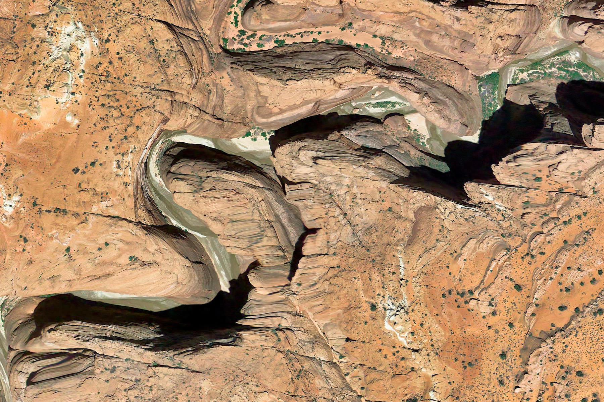

<!-- Scoped style -->

 

# **Introdução à Assimilação de Dados (MET 563-3)**

### Métodos Híbridos 

 

Dr. Carlos Frederico Bastarz
 
 
 
Programa de Pós-Graduação em Meteorologia (PGMET) do INPE
 
 
07 de Novembro de 2025

---

<!-- Scoped style -->

# Métodos Híbridos 

 

## **Sumário**

 

1. Introdução aos métodos híbridos 
2. Histórico e desenvolvimento
3. Sistema 3DVar híbrido
  3.1 Características principais
  3.2 Extensão da variável de controle
  3.3 Ciclo de assimilação de dados 3DVar híbrido
4. 3DVar híbrido baseado no modelo BAM e no GSI
  4.1 Determinação do conjunto de previsões inicial
  4.2 Cálculo da matriz $\mathbf{B}$ climatológica
  4.3 Experimentos com observação única
  4.4 Experimentos com o sistema 3DVar híbrido

---

<!-- _footer: "" -->

<!-- Scoped style -->

# Métodos Híbridos (Ensemble-Variacional)

 

## **1. Introdução aos métodos híbridos**

 

- Métodos híbridos&#128312;
  * Combina duas técnicas, **variacional** e **ensemble** em um único framework de assimilação de dados
  * Pode utilizar alguma técnica baseado no **EnKF** combinada com o variacional (3D ou 4D)
  * Pode utilizar alguma técnica de ensemble combinada com o variacional - **EnVar** (3D ou 4D)

   
  
* São métodos que trouxeram melhorias para o framework variacional
  * 3DVar $\to$ 3DVar híbrido $\to$ 3DEnVar
  * 4DVar $\to$ 4DVar híbrido $\to$ 4DEnVar
  

&#128312;Recommended Nomenclature for EnVar Data Assimilation Methods (<a href="https://x.gd/U67hq" target="_blank">link</a>)</i>
    
 
---

<!-- Scoped style -->

# Métodos Híbridos (Ensemble-Variacional)

 

## **1. Introdução aos métodos híbridos**

 

- 3DVar
  * 👉 Framework variacional em 3 dimensões (não considera o tempo)
    * As observações são todas consideradas no centro da janela de assimilação
    * FGAT e PSAS são variações do 3DVar com vantagens quanto à contextualização temporal das observações e custo computacional, respectivamente
  * 👉 Matriz de covariância dos erros de previsão é "climatológica"
    * A mesma informação da covariância dos erros de previsão é usada em todos os ciclos de assimilação de dados
    
       
    
      $$
      J(\mathbf{x}) =
      \frac{1}{2}(\mathbf{x} - \mathbf{x}_b)^{\text{T}}\mathbf{B}^{-1}(\mathbf{x} - \mathbf{x}_b)
      + \frac{1}{2}[\mathbf{y}_o - H(\mathbf{x})]^{\text{T}}\mathbf{R}^{-1}[\mathbf{y}_o - H(\mathbf{x})]
      $$

---

<!-- Scoped style -->

# Métodos Híbridos (Ensemble-Variacional)

 

## **1. Introdução aos métodos híbridos**

 

- 4DVar
  * 👉 Framework variacional em 4 dimensões
    * As observações são consideradas no tempo correto em que ocorreram durante a assimilação
    * Utiliza o modelo tangente linear e o adjunto para propagar a incerteza e a sensibilidade do modelo em relação às observações, respectivamente
  * 👉 Matriz de covariâncias dos erros de previsão é "climatológica"
    * A mesma informação da covariância dos erros de previsão é usada em todos os ciclos de assimilação de dados

       

      $$
      J[\mathbf{x}(t_0)] = \frac{1}{2}[\mathbf{x}(t_0) - \mathbf{x}_b(t_{0})]^T \mathbf{B}^{-1} [\mathbf{x}(t_0) - \mathbf{x}_b(t_{0})] + \frac{1}{2}\sum_{i=0}^{N} [\mathbf{y}_i - H(\mathbf{x}_i)]^T \mathbf{R}_i^{-1} [\mathbf{y}_i - H(\mathbf{x}i)]
      $$
 
---

<!-- _footer: "" -->

<!-- Scoped style -->

# Métodos Híbridos (Ensemble-Variacional)

 

## **1. Introdução aos métodos híbridos**

 

- 3DVar híbrido
  * Continua sendo um sistema variacional em 3 dimensões
  * A minimização da função custo produz uma única análise
  * Matriz de covariâncias é substituída por uma combinação linear entre a matriz de covariâncias dos erros de previsão "climatológica" e por ensemble
  
     
    
    $$
    J(\mathbf{x}) =
    \frac{1}{2}(\mathbf{x} - \mathbf{x}_b)^{\text{T}}\mathbf{B}_{\text{H}}^{-1}(\mathbf{x} - \mathbf{x}_b)
    + \frac{1}{2}[\mathbf{y}_o - H(\mathbf{x})]^{\text{T}}\mathbf{R}^{-1}[\mathbf{y}_o - H(\mathbf{x})]
    $$
  
    $$
    \boxed{\mathbf{B}_{\text{H}} = \alpha \mathbf{B}_{\text{NMC}} + (1-\alpha) \mathbf{P}^{b}}, \quad 0 \le \alpha \le 1
    $$
  
    $$
    \mathbf{P}^{b} = \frac{1}{N-1} \sum_{i=1}^{N}(\mathbf{x}_{i}^{b}-\bar{\mathbf{x}}^{b})(\mathbf{x}_{i}^{b}-\bar{\mathbf{x}}^{b})^{\text{T}}, \quad \bar{\mathbf{x}}^{b} = \frac{1}{N} \sum_{i=1}^{N}{\mathbf{x}_{i}^{b}}
    $$
  
    $$
    \mathbf{B}_{\text{NMC}} = \frac{1}{N-1} \sum_{k=1}^{N}(\delta\mathbf{x}^{k} - \overline{\delta\mathbf{x}})(\delta\mathbf{x}^{k} - \overline{\delta\mathbf{x}})^{\text{T}}, \quad \delta\mathbf{x}^{k} = \mathbf{f}_{48h}^{k} - \mathbf{f}_{24h}^{k}, \quad \overline{\delta\mathbf{x}}=\frac{1}{N}\sum_{k=1}^{N}\delta\mathbf{x}^{k}
    $$
  
---

<!-- _footer: "" -->

<!-- Scoped style -->

# Métodos Híbridos (Ensemble-Variacional)

 

## **1. Introdução aos métodos híbridos**

 

- 4DVar híbrido
  * Continua sendo um sistema variacional em 4 dimensões
  * A minimização da função custo produz uma única análise
  * Matriz de covariâncias é substituída por uma combinação linear entre a matriz de covariâncias dos erros de previsão "climatológica" e por ensemble
  * Mantém a utilização do modelo tangente linear e adjunto para a propagação as incertezas e sensibilidade

     
    
    $$
    J[\mathbf{x}(t_0)] = \frac{1}{2}[\mathbf{x}(t_0) - \mathbf{x}_b(t_{0})]^T \mathbf{B}_{\text{H}}^{-1} [\mathbf{x}(t_0) - \mathbf{x}_b(t_{0})] + \frac{1}{2}\sum_{i=0}^{N} [\mathbf{y}_i - H(\mathbf{x}_i)]^T \mathbf{R}_i^{-1} [\mathbf{y}_i - H(\mathbf{x}i)]
    $$
  
    $$
    \boxed{\mathbf{B}_{\text{H}} = \alpha \mathbf{B}_{\text{NMC}} + (1-\alpha) \mathbf{P}^{b}}, \quad 0 \le \alpha \le 1
    $$
  
    $$
    \mathbf{P}^{b} = \frac{1}{N-1} \sum_{i=1}^{N}(\mathbf{x}_{i}^{b}-\bar{\mathbf{x}}^{b})(\mathbf{x}_{i}^{b}-\bar{\mathbf{x}}^{b})^{\text{T}}, \quad \bar{\mathbf{x}}^{b} = \frac{1}{N} \sum_{i=1}^{N}{\mathbf{x}_{i}^{b}}
    $$
  
    $$
    \mathbf{B}_{\text{NMC}} = \frac{1}{N-1} \sum_{k=1}^{N}(\delta\mathbf{x}^{k} - \overline{\delta\mathbf{x}})(\delta\mathbf{x}^{k} - \overline{\delta\mathbf{x}})^{\text{T}}, \quad \delta\mathbf{x}^{k} = \mathbf{f}_{48h}^{k} - \mathbf{f}_{24h}^{k}, \quad \overline{\delta\mathbf{x}}=\frac{1}{N}\sum_{k=1}^{N}\delta\mathbf{x}^{k}
    $$
    
---

<!-- Scoped style -->

# Métodos Híbridos (Ensemble-Variacional)

 

## **1. Introdução aos métodos híbridos**

 
  
- 3DEnVar
  * É uma evolução do 3DVar, mas ainda sem a dimensão temporal 👉 não tenta ser um 4DVar
    * A vantagem sobre o 3DVar está na substituição das covariâncias dos erros de previsão pelas covariâncias do ensemble
    * A desvantagem está no fato de que a representação destas covariâncias depende do tamanho do ensemble
    * 👉 O 3DVar híbrido pode ser mais vantajoso, pois utiliza a combinação linear entre $\mathbf{B}$ e $\mathbf{P}^{b}$ que se complementam

- 4DEnVar
  * É uma evolução do 4DVar, mantém a dimensão temporal
    * A vantagem sobre o 4DVar está em evitar o uso do modelo tangente linear e adjunto 👉 o 4DEnVar aprende  a sensibilidade do modelo a partir do ensemble
    * A desvantagem é a mesma do 3DEnVar, pois há a dependência do tamanho do ensemble 

* Desvantagem principal
  * Custo computacional, pois depende de ensembles grandes para amostrar corretamente a incerteza da previsão
  
---

<!-- _footer: "" -->

<!-- Scoped style -->

# Métodos Híbridos (Ensemble-Variacional)

 

## **2. Histórico e desenvolvimento**

 

- Necessidades
  * Contornar limitações dos métodos variacionais clássicos (3D/4DVar)
    * Covariâncias estáticas e climatológicas
      * 👉 A matriz $\mathbf{B}$ climatológica não reflete a estrutura real dos erros de previsão que mudam com a evolução do sistema
    * Complexidade e custo computacional alto 
      * 👉 4DVar depende do modelo tangente linear e adjunto

- Vantagens
  * As covariâncias dos erros de previsão tornam-se dependentes do fluxo
  
    $$
    \mathbf{B}_{\text{H}} = \alpha \mathbf{B}_{\text{NMC}} + (1-\alpha) \mathbf{P}^{b}
    $$
  
  * A parte estática de $\mathbf{B}_{\text{H}}$ ajuda a manter a estabilidade numérica e a suavidade das covariâncias (um ensemble pequeno introduz problemas de amostragem)
  * O 4DEnVar elimina a necessidade do modelo adjunto e tangente linear do 4DVar, pois o ensemble é quem traz a dependência do tempo para dentro da assimilação de dados
   
---

<!-- Scoped style -->

# Métodos Híbridos (Ensemble-Variacional)

 

## **2. Histórico e desenvolvimento**

 
 

- Alguns trabalhos que consideraram formulações diferentes da matriz $\mathbf{B}_{\text{H}}$

   

  * Hamill e Snyder (2000): $\mathbf{B} = (1-\alpha)\mathbf{P}^{b} + \alpha\mathbf{SCS}^{T}$
  * Etherton e Bishop (2004): $\mathbf{B} = (1-\alpha)\lambda\mathbf{P}^{b} + \alpha\rho\mathbf{B}_{3dvar}$ 
  * Wang et al., (2007): $\mathbf{B} = (1 - \alpha)\mathbf{P^b} + \alpha \mathbf{B_{IO}}$ 
  * Wang et al., (2008a,b): $\mathbf{B} = (1 - \alpha)\mathbf{B}_{3dvar} + \alpha\mathbf{P^b} \circ \mathbf{C}$ 
  * Zhang et al., (2009): $\mathbf{B} = \alpha \mathbf{P}^{b} + (1 - \alpha) \mathbf{B}_{4dvar}$
  * Clayton et al., (2012): $\mathbf{B} = \alpha_{c}^{2}\mathbf{B_{c}} + \alpha_{e}^{2} \mathbf{P}^{b} \circ \mathbf{C}$

   
---

<!-- Scoped style -->

# Métodos Híbridos (Ensemble-Variacional)

 

## **3. Sistema 3DVar híbrido**

 
    
### 3.1 Características principais

 
    
- 3DVar híbrido (_hybrid 3DVar_)&#128312;
  * 👉 É um sistema variacional
  * 👉 Combina linearmente as covariâncias dos erros de previsão provenientes do ensemble com as covariâncias dos erros de previsão do 3DVar ("covariâncias estáticas")
  * 👉 Minimiza uma função custo e produz apenas uma análise
  * Objetivo
    * 💡 Incorporar os que chamamos de "erros do dia" por meio do ensemble    
 
---

<!-- _footer: "" -->

<!-- Scoped style -->

# Métodos Híbridos (Ensemble-Variacional)

 

## **3. Sistema 3DVar híbrido**
 
   
 

### 3.2 Extensão da variável de controle
 
- Método baseado nos trabalhos de Lorenc (2003) e Wang et al. (2008a) 

$$
\delta{\mathbf{x}'} = \delta{\mathbf{x}} + \sum_{k=1}^{K}{(\mathbf{x}_{k}^{e} \circ \mathbf{a}_{k})} 
$$

$$
\mathbf{x}_{k}^{e} = \frac{(\mathbf{x}_{k}^{b} - \bar{\mathbf{x}}^{b})}{\sqrt{K-1}} 
$$

 
 
 
 
 
 

$$
J(\delta\mathbf{x}) = \frac{1}{2} (\delta\mathbf{x})^{T}\mathbf{B}^{-1}(\delta\mathbf{x}) + \frac{1}{2} [\mathbf{y}^{o} - \textit{H}(\mathbf{x}^{b})]^{T}\mathbf{R}^{-1}[\mathbf{y}^{o} - \textit{H}(\mathbf{x}^{b})] 
$$

$$
J(\delta\mathbf{x},\mathbf{a}) = \alpha_{1} J_{3dvar} + \alpha_{2} J_{e} + J_{o}
$$

 
 
  
 
$$
  J(\delta{\mathbf{x}'}) = \frac{1}{2} (\delta{\mathbf{x}'})^{T} (\alpha_{1}\mathbf{B}+\alpha_{2}\mathbf{P}^{b}\circ\mathbf{A})^{-1} (\delta{\mathbf{x}'}) 
  + \frac{1}{2} [{\mathbf{y}}^{\prime{o}} - \mathbf{H}(\delta{\mathbf{x}'})]^{T}\mathbf{R}^{-1}[{\mathbf{y}}^{\prime{o}} - \mathbf{H}(\delta{\mathbf{x}'})]
$$ 
 

<b>A</b> é uma matriz de correlação responsável por fazer a localização das covariâncias dos erros de previsão do ensemble
 
 
---

<!-- Scoped style -->

# Métodos Híbridos (Ensemble-Variacional)

 

## **3. Sistema 3DVar híbrido**

 

### 3.3 Ciclo de assimilação de dados 3DVar híbrido

      
  
- 🏃‍♂️‍➡️ Início do ciclo
  
  1. Inicia a partir do conjunto de previsões de curto prazo
  2. Segue com o cálculo das inovações a partir da média do conjunto de previsões
  3. Atualiza as perturbações do ensemble (EnKF/EnSRF) 
      - Neste ponto atualiza-se o ensemble de previsões de curto prazo 👉 ensemble de análises para o próximo ciclo
  4. Atualiza a matriz de covariâncias dos erros de previsão do ensemble $\mathbf{P}^{b}$
  5. Minimiza a função custo variacional do 3DVar híbrido
      - 👉 Neste ponto as covariâncias de $\mathbf{B}_{\text{NMC}}$ e $\mathbf{P}^{b}$ são combinadas linearmente
      - 💡 O resultado da minimização é uma análise
  
---

<!-- _footer: "" -->

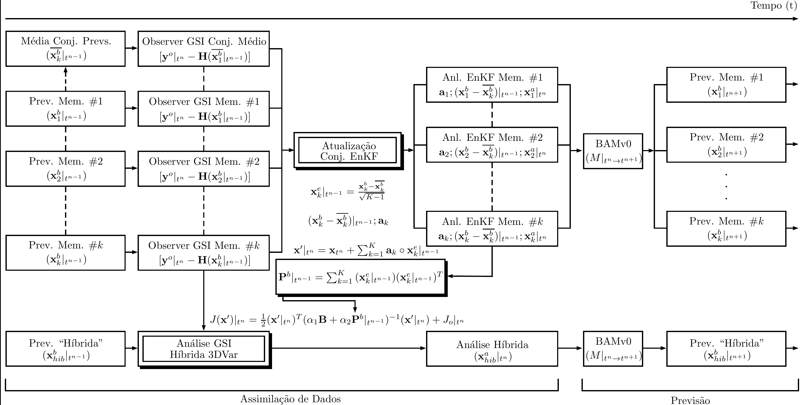
  
---

<!-- Scoped style -->

# Métodos Híbridos (Ensemble-Variacional)

 

## **4. 3DVar híbrido baseado no modelo BAM e no GSI**

 
 

- 👷🏼 Estabelecimento de um sistema híbrido 3DVar baseado no modelo BAM e no GSI
  1. 🧮 Cálculo de uma matriz $\mathbf{B}$ climatológica baseada nos pares de previsões do modelo BAM
  2. 🎛️ Habilitar o uso dos sistemas EnKF e EnSRF dentro do framework variacional do GSI
    - Ajustes e adaptações no código do pré-processamento do BAM e GSI
    - Cálculo da média do conjunto para uso pelo GSI
    - Scripts para a realização do ciclo de assimilação e outros artefatos
  3. 🛠️ Produção de um primeiro conjunto de previsões de curto prazo para a inicialização do ciclo de assimilação de dados híbrido
  
---

<!-- Scoped style -->

# Métodos Híbridos (Ensemble-Variacional)

 

## **4. 3DVar híbrido baseado no modelo BAM e no GSI**

 

### 4.1 Determinação do conjunto de previsões inicial

 

- Utilização de técnica baseada no _Poor man's ensemble_
  1) Parte-se de uma análise determinística de resolução maior ou igual à resolução de interesse e realizam-se previsões a cada 12 horas para um período de 30 dias
  2) Do conjunto de 60 previsões (2 previsões por dia), seleciona-se um subconjunto de previsões que representará o tamanho do conjunto
  3) Renomeia-se os arquivos de forma que todos sejam válidos para o mesmo horário de previsão
  4) Altera-se a data interna dos arquivos de forma que todos sejam efetivamente válidos para o horário de previsão desejado
* Desta forma criou-se um conjunto de 40 previsões iniciais
  
---

<!-- Scoped style -->

# Métodos Híbridos (Ensemble-Variacional)

 

## **4. 3DVar híbrido baseado no modelo BAM e no GSI**

 

### 4.2 Cálculo da matriz $\mathbf{B}$
 
- Utilização do método NMC
  * 1460 pares de previsões de 48 e 24 horas na resolução TQ0299L064 ($\approx$ 45 km de resolução espacial horizontal e 28 níveis verticais em coordenadas sigma)
  * Comparação com a matriz $\mathbf{B}$ estática do NCEP
  * Apenas para os testes com observação única e comparação com a análise do NCEP
  
- Testes com o ciclo do sistema 3DVar híbrido foram feitos na resolução TQ0062L028 ($\approx$ 200 km de resolução espacial horizontal e 28 níveis verticais em coordenada sigma)
  * Decisão tomada devido ao tempo para a realização dos experimentos e custo computacional (processamento e armazenamento)
 
---

<!-- _footer: "" -->

<!-- Scoped style -->

# Métodos Híbridos (Ensemble-Variacional)

 

## **4. 3DVar híbrido baseado no modelo BAM e no GSI**

 

### 4.2 Cálculo da matriz $\mathbf{B}$
 
- Desvio-padrão - $\psi$ 
 

  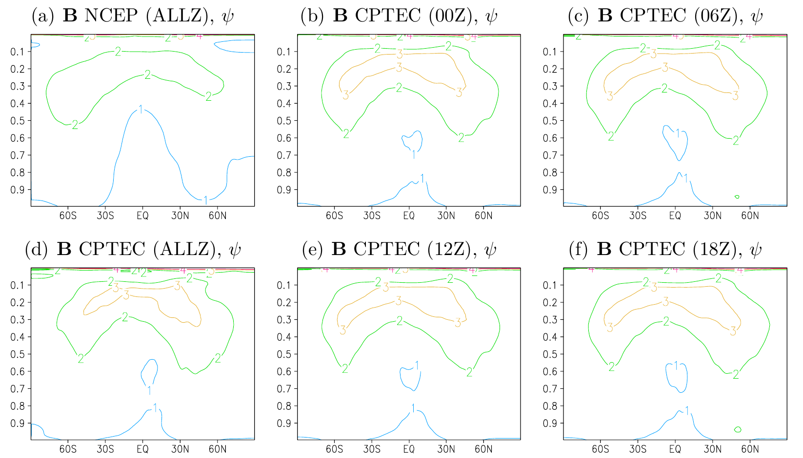

 
 
---

<!-- _footer: "" -->

<!-- Scoped style -->

# Métodos Híbridos (Ensemble-Variacional)

 

## **4. 3DVar híbrido baseado no modelo BAM e no GSI**

 

### 4.2 Cálculo da matriz $\mathbf{B}$
 
- Desvio-padrão - $\chi$ 
 

  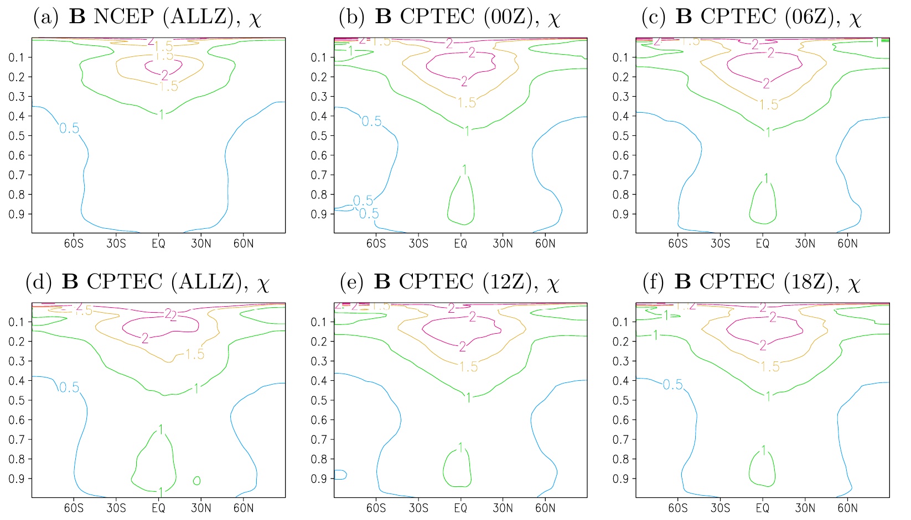

  
 
---

<!-- _footer: "" -->

<!-- Scoped style -->

# Métodos Híbridos (Ensemble-Variacional)

 

## **4. 3DVar híbrido baseado no modelo BAM e no GSI**

 

### 4.2 Cálculo da matriz $\mathbf{B}$
 
- Desvio-padrão - $T$ 
 

  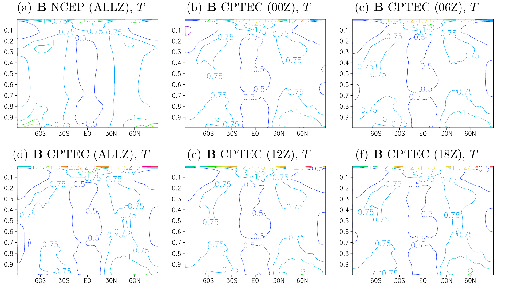

   

---

<!-- _footer: "" -->

<!-- Scoped style -->

# Métodos Híbridos (Ensemble-Variacional)

 

## **4. 3DVar híbrido baseado no modelo BAM e no GSI**

 

### 4.2 Cálculo da matriz $\mathbf{B}$
 
- Desvio-padrão - $q$ 
 

  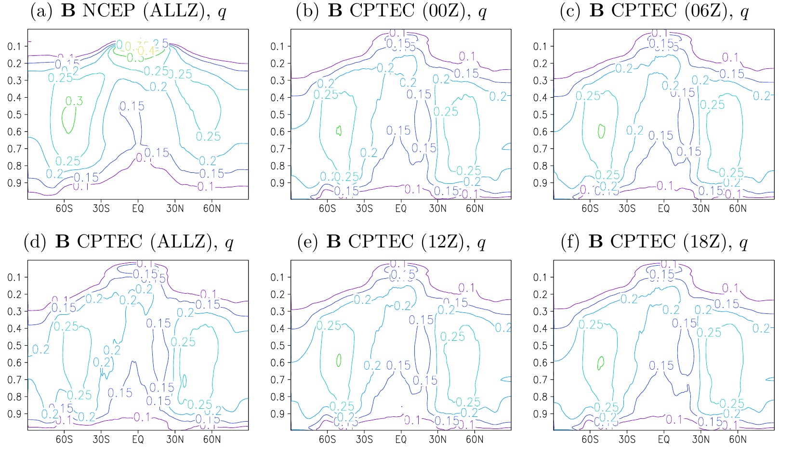

   
 
---

<!-- _footer: "" -->

<!-- Scoped style -->

# Métodos Híbridos (Ensemble-Variacional)

 

## **4. 3DVar híbrido baseado no modelo BAM e no GSI**

 

### 4.2 Cálculo da matriz $\mathbf{B}$
 
- Desvio-padrão - $ps$ 
 

  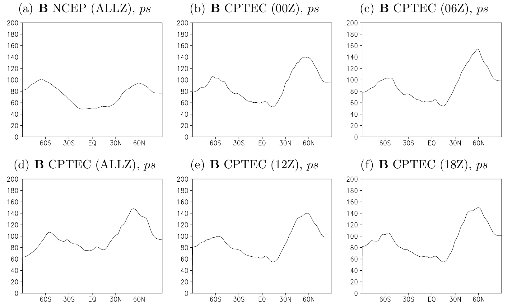

   
 
---

<!-- _footer: "" -->

<!-- Scoped style -->

# Métodos Híbridos (Ensemble-Variacional)

 

## **4. 3DVar híbrido baseado no modelo BAM e no GSI**

 

### 4.2 Cálculo da matriz $\mathbf{B}$
 
- Desvio-padrão - $oz$ e $cw$

 

  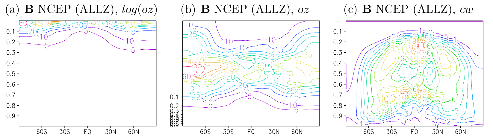

 
 
---

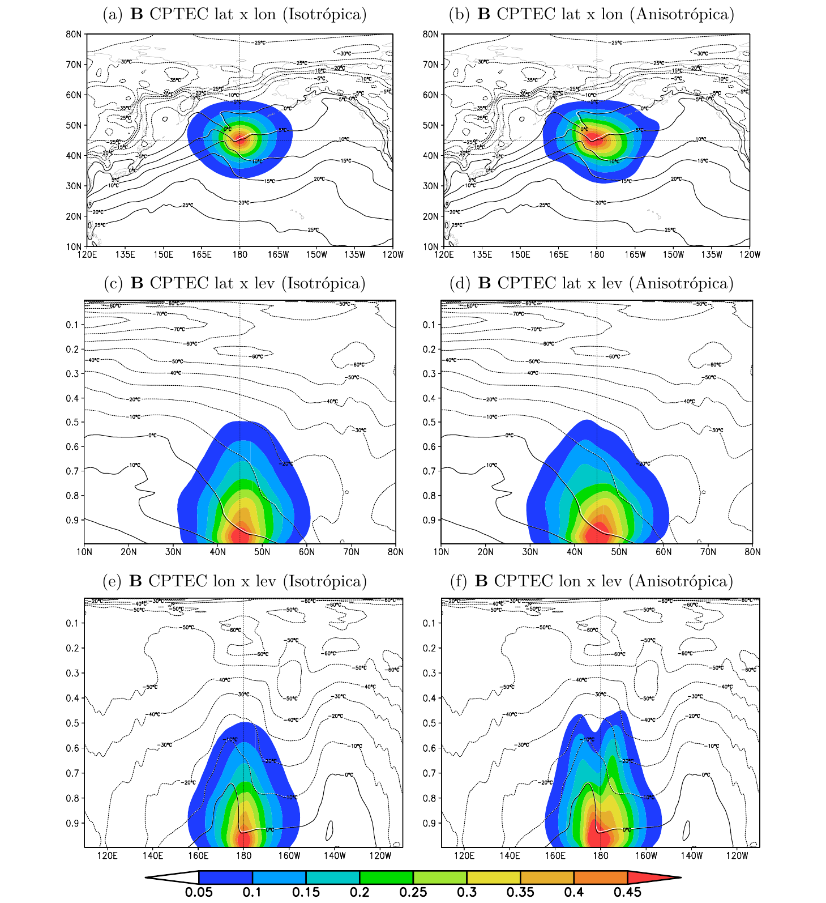

<!-- Scoped style -->

# Métodos Híbridos (Ensemble-Variacional)

 

## **4. 3DVar híbrido baseado no modelo BAM e no GSI**

 

### 4.3 Experimentos com observação única 
 
- Observação sintética de $u$
  - Posicionada na coordenada (lat,lon) 0,45N, 1000 hPa
  - Erro da observação: 1 $ms^{-1}$
  - Inovação: 1 $ms^{-1}$
  - Verificação do campo de $T$
  
---

<!-- Scoped style -->

# Métodos Híbridos (Ensemble-Variacional)

 

## **4. 3DVar híbrido baseado no modelo BAM e no GSI**

 

### 4.4 Experimentos com o sistema 3DVar híbrido
 
  
 

- Testes com a aplicação da nova matriz $\mathbf{B}$ 
  - REF: BAM com a análise do NCEP
  - 3DVar: BAM com a análise do 3DVar puro (100% $\mathbf{B}$ climatológica)
  - EnKF50(75): BAM com a análise do 3DVar híbrido com 50(75%) de contribuição do EnKF para a amtriz $\mathbf{B}$ climatológica
  - EnSRF50(75): BAM com a análise do 3DVar híbrido com 50(75%) de contribuição do EnSRF para a amtriz $\mathbf{B}$ climatológica
  

| Experimento | Ajuste das Covariâncias          | Descrição                 |
|-------------|----------------------------------|---------------------------|
| REF         | --                               | --                        |
| 3DVar       | --                               | $\mathbf{B}$ (730 pares)  |
| EnKF50      | 50% Estático ($\alpha_{1}=0,5$)  | $\mathbf{B}$ (40 membros) |
| EnKF75      | 75% Estático ($\alpha_{1}=0,25$) | $\mathbf{B}$ (40 membros) |
| EnSRF50     | 50% Estático ($\alpha_{1}=0,5$)  | $\mathbf{B}$ (40 membros) |
| EnSRF75     | 75% Estático ($\alpha_{1}=0,25$) | $\mathbf{B}$ (40 membros) |

 
 
---

<!-- _footer: "" -->

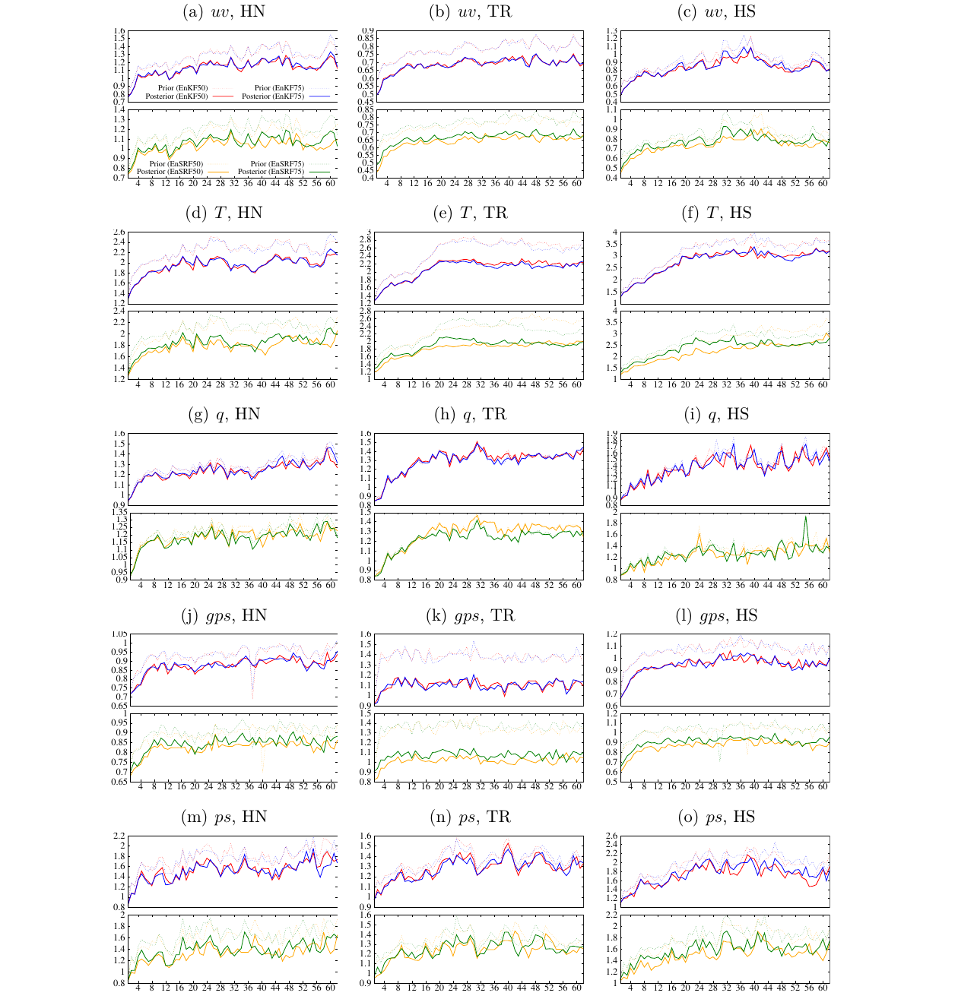

<!-- Scoped style -->

# Métodos Híbridos (Ensemble-Variacional)

 

## **4. 3DVar híbrido baseado no modelo BAM e no GSI**

 

### 4.4 Experimentos com o sistema 3DVar híbrido
 
 

- Verificação da inovação dos conjuntos de análises e previsões

$$
IC = \frac{\sigma[\mathbf{y}^{o}-\mathbf{H}(\mathbf{x}_{k}^{b})]}{\sqrt{S + R}}
$$

- Onde:
  - $\sigma[\mathbf{y}^{o}-\mathbf{H}(\mathbf{x}_{k}^{b})]$ é o desvio-padrão da inovação
  - $\sqrt{S + R}$ é o espalhamento total
    - $S$ é o espalhamento
    - $R$ é o erro da observação

---

<!-- _footer: "" -->

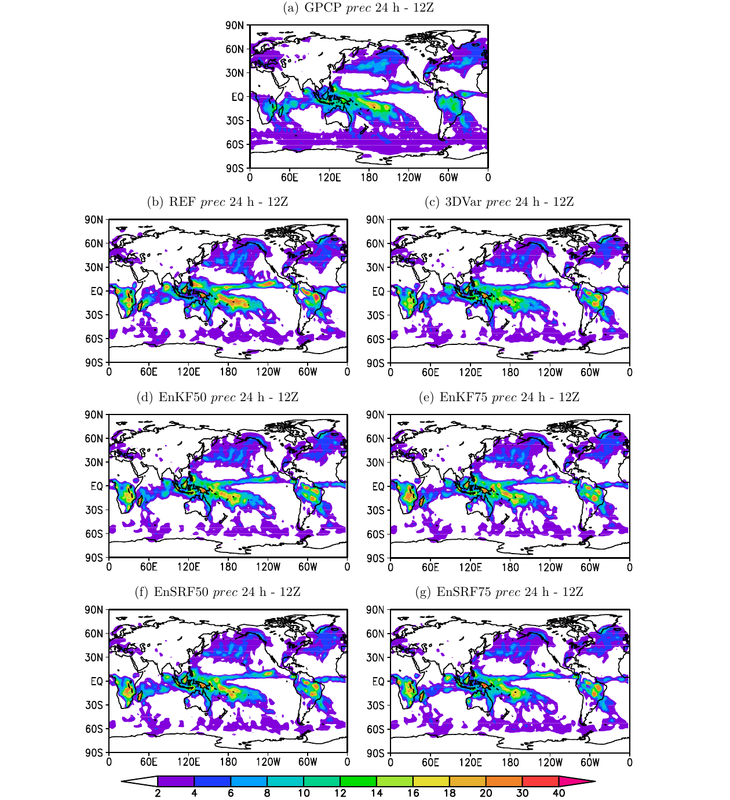

<!-- Scoped style -->

# Métodos Híbridos (Ensemble-Variacional)

 

## **4. 3DVar híbrido baseado no modelo BAM e no GSI**

 

### 4.4 Experimentos com o sistema 3DVar híbrido
 
 
    
 

- Comparação dos campos de precipitação de 24 horas (às 12Z) dos experimentos em relação à precipitação do GPCP 
- Médias espaciais sobre o domínio global das previsões de 24 horas de precipitação total às 12Z (mm/mês)

| Experimento | $\mu$ |
|-------------|-------|
| GPCPv2.2    | 2,7197|
| REF         | 2,9718|
| 3DVar       | 2,6098|
| EnKF50      | **2,7034**|
| EnKF75      | 2,6730|
| EnSRF50     | **2,7045**|
| EnSRF75     | 2,5618|

 
---

<!-- Scoped style -->

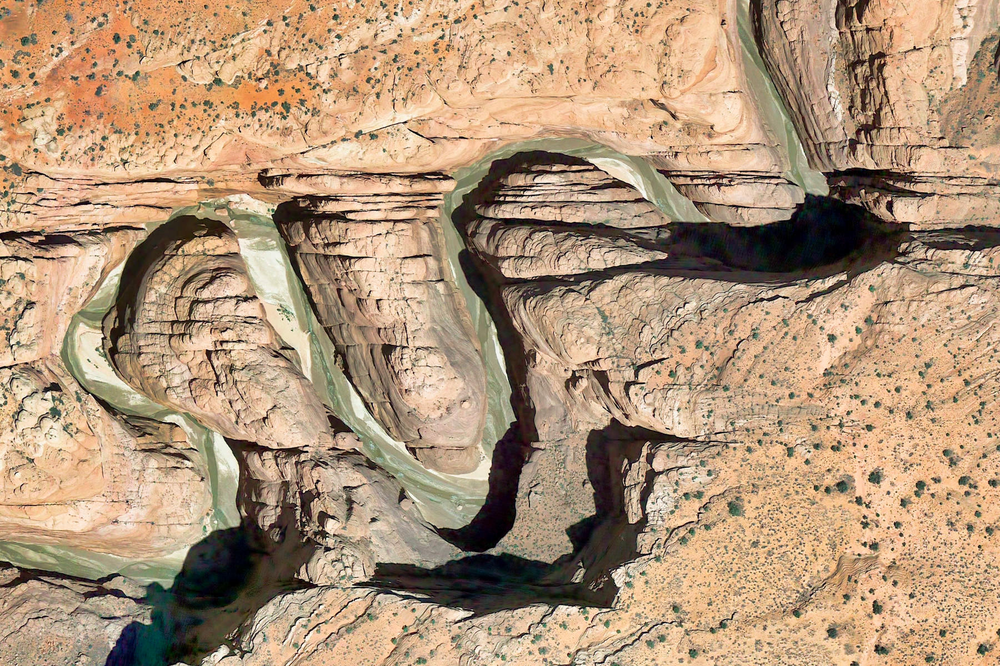

# :thinking: Dúvidas

 
 
 
 
 
 
 

:link: https://cfbastarz.github.io/met563-3/
:octopus: https://github.com/cfbastarz/MET563-3
:email: carlos.bastarz@inpe.br

 
 
 
 
 

👉 This work is licensed under <a href="https://creativecommons.org/licenses/by-nc-sa/4.0/">CC BY-NC-SA 4.0</a>

