<!-- _footer: "" -->


<!-- Scoped style -->
<style scoped>
section {
  font-size: 21px;
}
span.date {
  font-size: 15px;
}
span.program {
  font-size: 18px;
}
</style>

<style>
span.footnote {
    border-top: 0.1em dotted #555;
    font-size: 60%;
    margin-top: auto;
    position:absolute;
    bottom:0;
    width:100%;
    height:60px;    
}

span.footnote2 {
    border-top: 0.1em dotted #555;
    font-size: 60%;
    margin-top: auto;
    position:absolute;
    bottom:0;
    width:100%;
    height:90px;    
}
</style>

# **Introdução à Assimilação de Dados (MET 563-3)**

### Histórico da Assimilação de Dados - Cressman (1959)

<p>Dr. Carlos Frederico Bastarz
<br />
Dr. Dirceu Luis Herdies
<br />
<br />
<span class="program">Programa de Pós-Graduação em Meteorologia (PGMET) do INPE</span>
<br />
<br />
<span class="date">01 de Outubro de 2025</span>
</p>

---


<!-- Scoped style -->
<style scoped>
section {
  font-size: 21px;
}
.columns {
  display: grid;
  grid-template-columns: repeat(2, minmax(0, 1fr));
  gap: 1rem;
}
</style>

# Histórico da Assimilação de Dados

<br />

## **Retomando...**

<br />

- Década de 1950: primeiras previsões numéricas do tempo
- Limitações computacionais inviabilizavam métodos mais precisos
- Bergthórsson e Döös (1955)
  * Primeira formulação prática de análise objetiva
- Cressman (1959)
  * Propõe correções sucessivas com raio de influência decrescente

---

<!-- _footer: "" -->

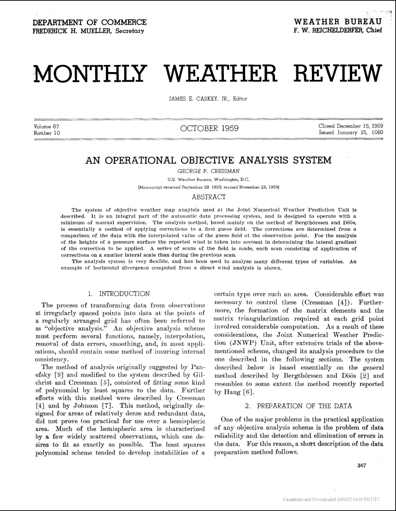

<!-- Scoped style -->
<style scoped>
section {
  font-size: 20px;
}
.columns {
  display: grid;
  grid-template-columns: repeat(2, minmax(0, 1fr));
  gap: 1rem;
}
</style>

# Histórico da Assimilação de Dados

## **_An Operational Objective Analysis System_ (Cressman, 1959)**

- É o Método de Correções Sucessivas 
1. Inicia-se com um campo de background 
2. Utiliza-se as observações distribuídas de forma irregular no espaço
3. Ajusta-se iterativamente o background em direção às observações:
   * Inicia-se com raio de influência grande
   * Reduz-se o raio de influência até que o campo de background convirja para as observações
- https://journals.ametsoc.org/view/journals/mwre/87/10/1520-0493_1959_087_0367_aooas_2_0_co_2.xml   

---

<!-- _footer: "" -->

<!-- Scoped style -->
<style scoped>
section {
  font-size: 20px;
}
.columns {
  display: grid;
  grid-template-columns: repeat(2, minmax(0, 1fr));
  gap: 1rem;
}
</style>

# Histórico da Assimilação de Dados

## **_An Operational Objective Analysis System_ (Cressman, 1959)**

### Detalhes da formulação (seguindo Kalnay, 2003)

$$
f^{n+1}_{i} = f^{n}_{i} + \Bigg[ \frac{\sum^{K^{n}_{i}}_{k=1}w^{n}_{ik}(f^{O}_{k}-f^{n}_{k})}{\sum^{K^{n}_{i}}_{k=1}w^{n}_{ik}+\varepsilon^{2}} \Bigg]\quad \text{ou} \quad f^{n+1}_{i} = f^{n}_{i} + W(f^{O}_{k}-f^{n}_{k})\quad \text{,} \quad W = \frac{\sum^{K^{n}_{i}}_{k=1}w^{n}_{ik}}{\sum^{K^{n}_{i}}_{k=1}w^{n}_{ik}+\varepsilon^{2}}
$$

<div class="columns">
<div>

- Onde,
  - $f^{n+1}_{i}$ é a enésima estimativa no ponto de grade $i$
  * $f^{O}_{k}$ é a k-ésima observação ao redor do ponto de grade $i$
  * $f^{n}_{k}$ é o valor do enésimo campo de background no ponto de observação $k$
  * $K^{n}_{i}$ é o número de observações dentro da distância $R^{n}$ do ponto de grade $i$
  * $\varepsilon^{2}$ é a estimativa da razão entre a variância do erro da observação e o da variância do erro do background

</div>
<div>

<br />

<div align="center">
  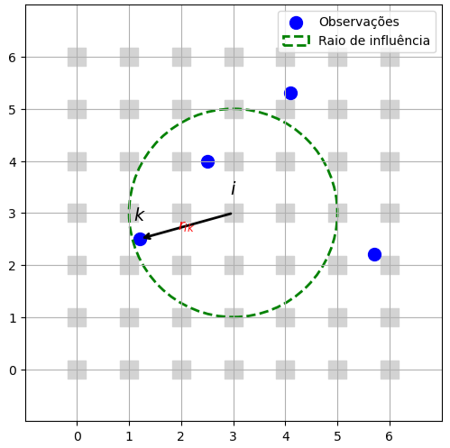
</div>

</div>
</div>  
  
---

<!-- _footer: "" -->

<!-- Scoped style -->
<style scoped>
section {
  font-size: 21px;
}
.columns {
  display: grid;
  grid-template-columns: repeat(2, minmax(0, 1fr));
  gap: 1rem;
}
</style>

# Histórico da Assimilação de Dados

<br />

## **_An Operational Objective Analysis System_ (Cressman, 1959)**

<br />


<div class="columns">
<div>

- No Método de Correções Sucessivas de Cressman, os pesos $w^{n}_{ik}$ são definidos como:
  
$$
\begin{cases}
w^{n}_{ik} = \dfrac{R^{2}_{n} - r_{ik}^{2}}{R^{2}_{n} + r_{ik}^{2}}, & r_{ik}^{2} \leq R^{2}_{n} \\
w^{n}_{ik} = 0, & r_{ik}^{2} \gt R^{2}_{n}
\end{cases}
$$

<br />

- Onde,
  - $r_{ik}^{2}$ é o quadrado da distância entre um ponto de observação $r_{k}$ e um ponto de grade $r_{i}$
  * $R^{2}_{n}$ é o quadrado do enésimo raio de influência

* Observações mais próximas têm maior peso

</div>
<div>

<br />
<br />

<div align="center">
  
</div>

</div>
</div>

---

<!-- _footer: "" -->

<!-- Scoped style -->
<style scoped>
section {
  font-size: 21px;
}
.columns {
  display: grid;
  grid-template-columns: repeat(2, minmax(0, 1fr));
  gap: 1rem;
}
</style>

# Histórico da Assimilação de Dados

<br />
<br />

## **_An Operational Objective Analysis System_ (Cressman, 1959)**

<br />

<div class="columns">
<div>

<br />

### Exemplo 1D

<br />

- Considere um modelo matemático simples:

$$
f(x) = \sin(x) + \varepsilon, \quad \varepsilon \sim \mathcal{N}(0, \sigma^2), \quad -\pi \le x \le \pi
$$

- A função seno com a adição de um ruído normalmente distribuído

</div>
<div>

<div align="center">
  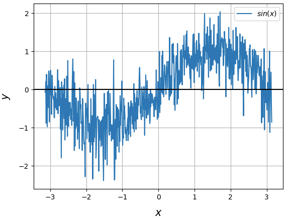
</div> 

</div>
</div> 

---

<!-- Scoped style -->
<style scoped>
section {
  font-size: 21px;
}
.columns {
  display: grid;
  grid-template-columns: repeat(2, minmax(0, 1fr));
  gap: 1rem;
}
</style>

# Histórico da Assimilação de Dados

<br />
<br />

## **_An Operational Objective Analysis System_ (Cressman, 1959)**

<br />

### Exemplo 1D

<br />

```
x = np.arange(-np.pi, np.pi, 0.01)
xb_seno = np.sin(x)
```

- Outra forma de acrescentar o ruído:

```
sigma = 0.5  
#ruido = np.random.randn(len(x)) * sigma 
ruido = np.random.randn(*x.shape) * sigma 👈

xb = xb_seno + ruido
```

---

<!-- Scoped style -->
<style scoped>
section {
  font-size: 21px;
}
.columns {
  display: grid;
  grid-template-columns: repeat(2, minmax(0, 1fr));
  gap: 1rem;
}
</style>

# Histórico da Assimilação de Dados

<br />
<br />

## **_An Operational Objective Analysis System_ (Cressman, 1959)**

<br />

### Exemplo 1D

<br />

```
# Posições

obs_pos = np.array([-2.2, -2.1, -2.0, -1.8, 0.9, 1, 2, 3])

# Valores medidos

obs_vals = np.array([-2.2, -1.8, 0.9, 0, 1, 2, 3, 4])
```

---

<!-- Scoped style -->
<style scoped>
section {
  font-size: 21px;
}
.columns {
  display: grid;
  grid-template-columns: repeat(2, minmax(0, 1fr));
  gap: 1rem;
}
</style>

# Histórico da Assimilação de Dados

<br />
<br />

## **_An Operational Objective Analysis System_ (Cressman, 1959)**

<br />

### Exemplo 1D

<br />

```
# Função peso de Cressman

def weight(r, R):
    w = (R**2 - r**2) / (R**2 + r**2 + 1e-12) 👈
    w[r >= R] = 0.0
    return w
```

* Note que estamos utilizando um ruído extra ($\varepsilon^{2} = 10^{-12}$), o qual pode ser omitido - o que acontece nesse caso?

---

<!-- Scoped style -->
<style scoped>
section {
  font-size: 21px;
}
.columns {
  display: grid;
  grid-template-columns: repeat(2, minmax(0, 1fr));
  gap: 1rem;
}
</style>

# Histórico da Assimilação de Dados

<br />
<br />

## **_An Operational Objective Analysis System_ (Cressman, 1959)**

<br />

### Exemplo 1D

<br />

```
# Raios das passagens sucessivas

radii = [3.0, 2.0, 1.0, 0.5, 0.25, 0.175]
```

---

<!-- Scoped style -->
<style scoped>
section {
  font-size: 21px;
}
.columns {
  display: grid;
  grid-template-columns: repeat(2, minmax(0, 1fr));
  gap: 1rem;
}
</style>

# Histórico da Assimilação de Dados

<br />
<br />

## **_An Operational Objective Analysis System_ (Cressman, 1959)**

<br />

### Exemplo 1D

```
xa = xb.copy()

for R in radii:
    increments = np.zeros_like(xa)
    denom = np.zeros_like(xa)
    for xo, yo in zip(obs_pos, obs_vals):
        r = np.abs(x - xo)
        w = weight(r, R)
        increments += w * (yo - xa)
        denom += w
    # evita a divisão por zero
    mask = denom > 0
    xa[mask] += increments[mask] / denom[mask]
```    

---

<!-- Scoped style -->
<style scoped>
section {
  font-size: 21px;
}
.columns {
  display: grid;
  grid-template-columns: repeat(2, minmax(0, 1fr));
  gap: 1rem;
}
</style>

# Histórico da Assimilação de Dados

<br />

## **_An Operational Objective Analysis System_ (Cressman, 1959)**

### Exemplo 1D

- O que acontece quando escolhemos apenas 1 raio? $R = 3,0$

<div align="center">
  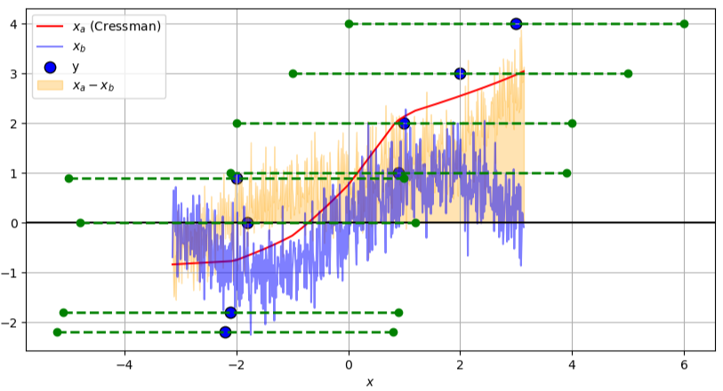
</div>

---

<!-- Scoped style -->
<style scoped>
section {
  font-size: 21px;
}
.columns {
  display: grid;
  grid-template-columns: repeat(2, minmax(0, 1fr));
  gap: 1rem;
}
</style>

# Histórico da Assimilação de Dados

<br />

## **_An Operational Objective Analysis System_ (Cressman, 1959)**

### Exemplo 1D

- O que acontece quando escolhemos apenas 1 raio? $R = 2,0$

<div align="center">
  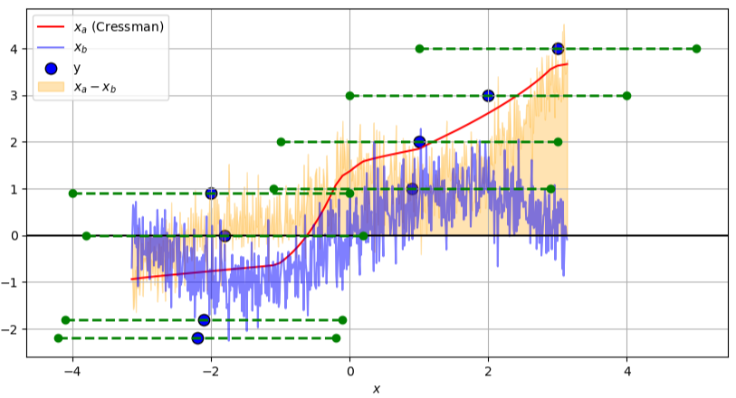
</div>

---

<!-- Scoped style -->
<style scoped>
section {
  font-size: 21px;
}
.columns {
  display: grid;
  grid-template-columns: repeat(2, minmax(0, 1fr));
  gap: 1rem;
}
</style>

# Histórico da Assimilação de Dados

<br />

## **_An Operational Objective Analysis System_ (Cressman, 1959)**

### Exemplo 1D

- O que acontece quando escolhemos apenas 1 raio? $R = 1,0$

<div align="center">
  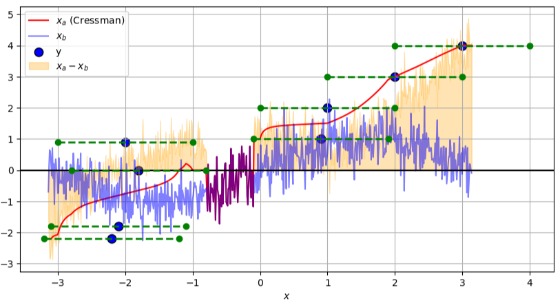
</div>

---

<!-- Scoped style -->
<style scoped>
section {
  font-size: 21px;
}
.columns {
  display: grid;
  grid-template-columns: repeat(2, minmax(0, 1fr));
  gap: 1rem;
}
</style>

# Histórico da Assimilação de Dados

<br />

## **_An Operational Objective Analysis System_ (Cressman, 1959)**

### Exemplo 1D

- O que acontece quando escolhemos apenas 1 raio? $R = 0,5$

<div align="center">
  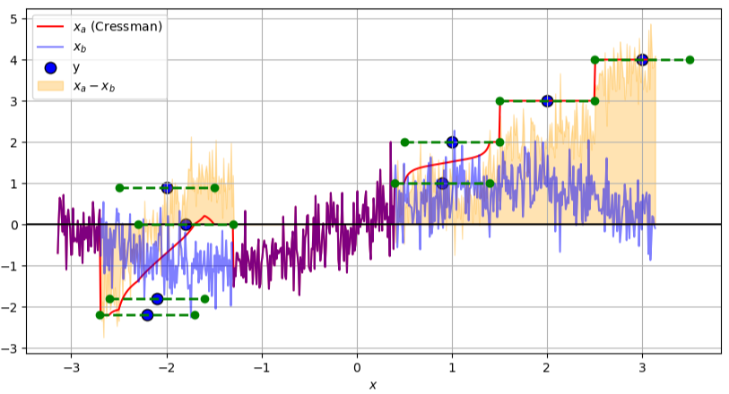
</div>

---

<!-- Scoped style -->
<style scoped>
section {
  font-size: 21px;
}
.columns {
  display: grid;
  grid-template-columns: repeat(2, minmax(0, 1fr));
  gap: 1rem;
}
</style>

# Histórico da Assimilação de Dados

<br />

## **_An Operational Objective Analysis System_ (Cressman, 1959)**

### Exemplo 1D

- O que acontece quando escolhemos apenas 1 raio? $R = 0,25$

<div align="center">
  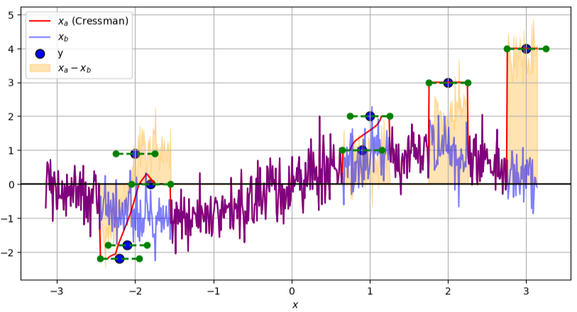
</div>

---

<!-- Scoped style -->
<style scoped>
section {
  font-size: 21px;
}
.columns {
  display: grid;
  grid-template-columns: repeat(2, minmax(0, 1fr));
  gap: 1rem;
}
</style>

# Histórico da Assimilação de Dados

<br />

## **_An Operational Objective Analysis System_ (Cressman, 1959)**

### Exemplo 1D

- O que acontece quando escolhemos apenas 1 raio? $R = 0,175$

<div align="center">
  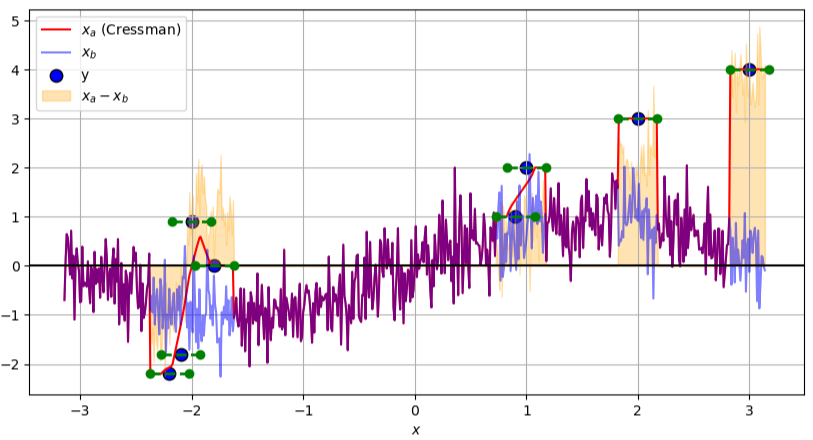
</div>

---

<!-- Scoped style -->
<style scoped>
section {
  font-size: 21px;
}
.columns {
  display: grid;
  grid-template-columns: repeat(2, minmax(0, 1fr));
  gap: 1rem;
}
</style>

# Histórico da Assimilação de Dados

<br />

## **_An Operational Objective Analysis System_ (Cressman, 1959)**

### Exemplo 1D

- O que acontece quando escolhemos apenas 2 raios? $R = [3.0, 2.0]$

<div align="center">
  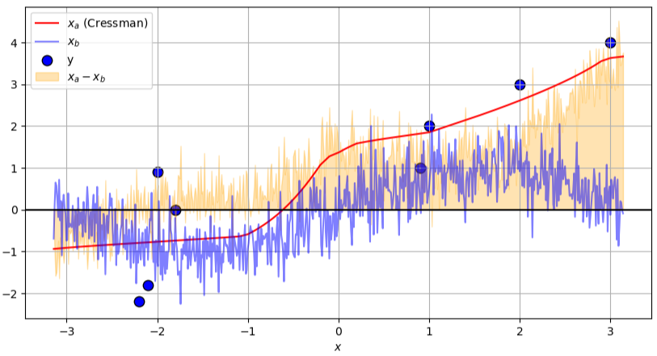
</div>

---

<!-- Scoped style -->
<style scoped>
section {
  font-size: 21px;
}
.columns {
  display: grid;
  grid-template-columns: repeat(2, minmax(0, 1fr));
  gap: 1rem;
}
</style>

# Histórico da Assimilação de Dados

<br />

## **_An Operational Objective Analysis System_ (Cressman, 1959)**

### Exemplo 1D

- O que acontece quando escolhemos 3 raios? $R = [3.0, 2.0, 1.0]$

<div align="center">
  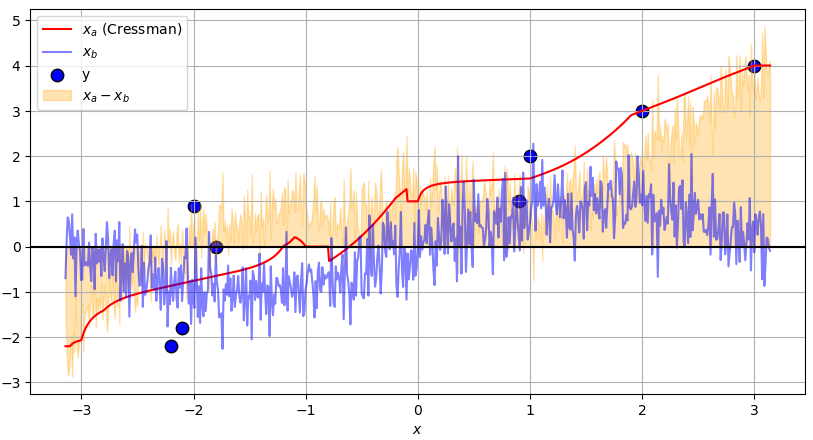
</div>

---

<!-- Scoped style -->
<style scoped>
section {
  font-size: 21px;
}
.columns {
  display: grid;
  grid-template-columns: repeat(2, minmax(0, 1fr));
  gap: 1rem;
}
</style>

# Histórico da Assimilação de Dados

<br />

## **_An Operational Objective Analysis System_ (Cressman, 1959)**

### Exemplo 1D

- O que acontece quando escolhemos 4 raios? $R = [3.0, 2.0, 1.0, 0.5]$

<div align="center">
  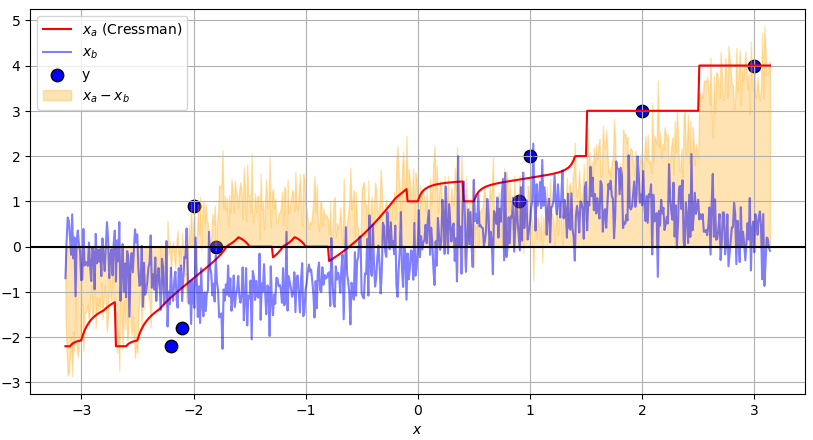
</div>

---

<!-- Scoped style -->
<style scoped>
section {
  font-size: 21px;
}
.columns {
  display: grid;
  grid-template-columns: repeat(2, minmax(0, 1fr));
  gap: 1rem;
}
</style>

# Histórico da Assimilação de Dados

<br />

## **_An Operational Objective Analysis System_ (Cressman, 1959)**

### Exemplo 1D

- O que acontece quando escolhemos 5 raios? $R = [3.0, 2.0, 1.0, 0.5, 0.25]$

<div align="center">
  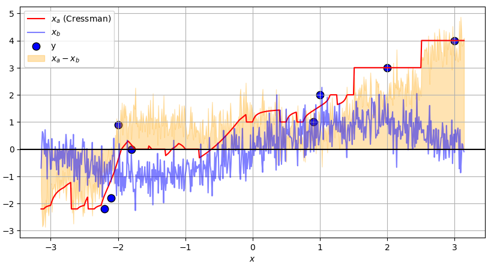
</div>

---

<!-- Scoped style -->
<style scoped>
section {
  font-size: 21px;
}
.columns {
  display: grid;
  grid-template-columns: repeat(2, minmax(0, 1fr));
  gap: 1rem;
}
</style>

# Histórico da Assimilação de Dados

<br />

## **_An Operational Objective Analysis System_ (Cressman, 1959)**

### Exemplo 1D

- O que acontece quando escolhemos 6 raios? $R = [3.0, 2.0, 1.0, 0.5, 0.25, 0.75]$

<div align="center">
  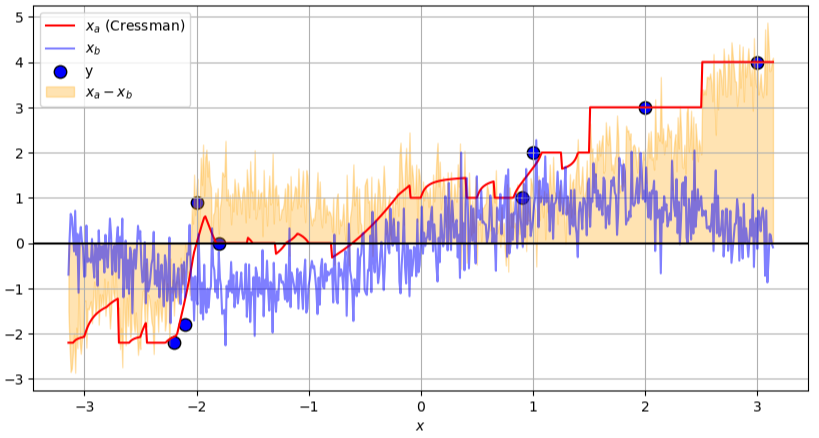
</div>

---

<!-- Scoped style -->
<style scoped>
section {
  font-size: 21px;
}
.columns {
  display: grid;
  grid-template-columns: repeat(2, minmax(0, 1fr));
  gap: 1rem;
}
</style>

# Histórico da Assimilação de Dados

<br />

## **_An Operational Objective Analysis System_ (Cressman, 1959)**

<div class="columns">
<div>

<br />

### Exemplo 2D

- Considere um modelo matemático simples:

$$
f(x, y) = \sin(x) + \varepsilon, \quad \varepsilon \sim \mathcal{N}(0, \sigma^2), \quad -\pi \le x \le \pi, \quad -\pi \le y \le \pi
$$

- A função seno com a adição de um ruído normalmente distribuído
- Definimos um plano Cartesiano de 100 pontos onde esta função será aplicada
- 👉 Utilizando `ruido = np.random.randn(*LON.shape) * sigma`


</div>
<div>

<div align="center">
  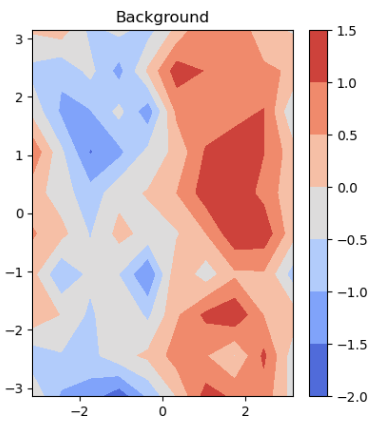
</div> 

</div>
</div> 


---

<!-- Scoped style -->
<style scoped>
section {
  font-size: 21px;
}
.columns {
  display: grid;
  grid-template-columns: repeat(2, minmax(0, 1fr));
  gap: 1rem;
}
</style>

# Histórico da Assimilação de Dados

<br />

## **_An Operational Objective Analysis System_ (Cressman, 1959)**

<br />

### Exemplo 2D

- Definimos dois vetores com o domínio para $x$ e $y$
- Definimos uma malha a partir dos valores do domínio

```
lon = np.linspace(-np.pi, np.pi, 10)
lat = np.linspace(-np.pi, np.pi, 10)

LON, LAT = np.meshgrid(lon, lat)
```

---

<!-- Scoped style -->
<style scoped>
section {
  font-size: 21px;
}
.columns {
  display: grid;
  grid-template-columns: repeat(2, minmax(0, 1fr));
  gap: 1rem;
}
</style>

# Histórico da Assimilação de Dados

<br />

## **_An Operational Objective Analysis System_ (Cressman, 1959)**

<br />

### Exemplo 2D

- Aplicamos a função $\sin$ para os valores do domínio
- Definimos um ruído
- Somamos o ruído à função

```
xb_seno = np.sin(LON)

sigma = 0.5  
ruido = np.random.randn(*LON.shape) * sigma

xb = xb_seno + ruido
```

---

<!-- Scoped style -->
<style scoped>
section {
  font-size: 21px;
}
.columns {
  display: grid;
  grid-template-columns: repeat(2, minmax(0, 1fr));
  gap: 1rem;
}
</style>

# Histórico da Assimilação de Dados

<br />

## **_An Operational Objective Analysis System_ (Cressman, 1959)**

### Exemplo 2D

- Definição das posições e valores das observações

```
# Posições

obs_locs = np.array([[-2.2, -1],
                     [-2.1,  0.5],
                     [-2.0, -0.5],
                     [-1.8,  2],
                     [ 0.9, -2.8],
                     [ 1.0,  1.0],
                     [ 2.0,  0.0],
                     [ 3.0,  0.5]])      

# Valores medidos

obs_vals = np.array([-1.0, -1.5, -2.0, -1.0, 1.0, 0.0, 0.5, 0.0]) 
```

---

<!-- Scoped style -->
<style scoped>
section {
  font-size: 21px;
}
.columns {
  display: grid;
  grid-template-columns: repeat(2, minmax(0, 1fr));
  gap: 1rem;
}
</style>

# Histórico da Assimilação de Dados

<br />

## **_An Operational Objective Analysis System_ (Cressman, 1959)**

<br />

### Exemplo 2D

- Definição dos pesos dados em função da distância entre o ponto a ser analisado e as observações
- O peso será zero quando a observação estiver fora do raio de influência

```
def weight(dx, dy, R):
    r2 = dx**2 + dy**2
    R2 = R**2
    w = (R2 - r2) / (R2 + r2 + 1e-12) 👈
    w[r2 >= R2] = 0.0 👈 zero fora do raio 
    return w
```    

---

<!-- Scoped style -->
<style scoped>
section {
  font-size: 21px;
}
.columns {
  display: grid;
  grid-template-columns: repeat(2, minmax(0, 1fr));
  gap: 1rem;
}
</style>

# Histórico da Assimilação de Dados

<br />

## **_An Operational Objective Analysis System_ (Cressman, 1959)**

<br />

### Exemplo 2D

- Definimos um vetor com os valores dos raios de influência
- Observe que, neste exemplo, os valores são adimensionais

```
radii = [3.0, 2.5, 2.0, 1.5, 1.0, 0.5] # passos sucessivos
```

---

<!-- _footer: "" -->

<!-- Scoped style -->
<style scoped>
section {
  font-size: 21px;
}
.columns {
  display: grid;
  grid-template-columns: repeat(2, minmax(0, 1fr));
  gap: 1rem;
}
</style>

# Histórico da Assimilação de Dados

<br />

## **_An Operational Objective Analysis System_ (Cressman, 1959)**

<br />

### Exemplo 2D

- Iniciamos a análise como sendo o background
- Para cada raio de influência, para cada observação, calculamos os pesos de acordo com o valor do raio de influência

```
xa = xb.copy()

for R in radii:
    inc = np.zeros_like(xa)
    denom = np.zeros_like(xa)
    for (xo, yo), obs in zip(obs_locs, obs_vals):
        dx = LON - xo
        dy = LAT - yo
        w = weight(dx, dy, R)
        inc += w * (obs - xa)
        denom += w
    mask = denom > 0
    xa[mask] += inc[mask] / denom[mask]
```

---

<!-- Scoped style -->
<style scoped>
section {
  font-size: 21px;
}
.columns {
  display: grid;
  grid-template-columns: repeat(2, minmax(0, 1fr));
  gap: 1rem;
}
</style>

# Histórico da Assimilação de Dados

<br />

## **_An Operational Objective Analysis System_ (Cressman, 1959)**


### Exemplo 2D

- O que acontece quando escolhemos apenas 1 raio? $R = 3.0$

<br />

<div align="center">
  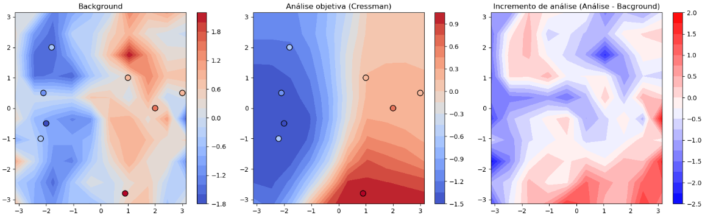
</div>

---

<!-- Scoped style -->
<style scoped>
section {
  font-size: 21px;
}
.columns {
  display: grid;
  grid-template-columns: repeat(2, minmax(0, 1fr));
  gap: 1rem;
}
</style>

# Histórico da Assimilação de Dados

<br />

## **_An Operational Objective Analysis System_ (Cressman, 1959)**

### Exemplo 2D

- O que acontece quando escolhemos apenas 1 raio? $R = 2.0$

<br />

<div align="center">
  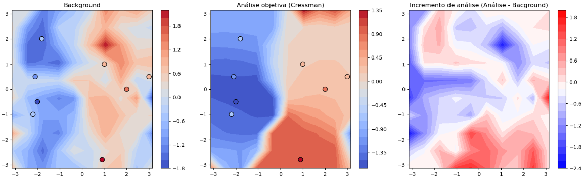
</div>

---

<!-- Scoped style -->
<style scoped>
section {
  font-size: 21px;
}
.columns {
  display: grid;
  grid-template-columns: repeat(2, minmax(0, 1fr));
  gap: 1rem;
}
</style>

# Histórico da Assimilação de Dados

<br />

## **_An Operational Objective Analysis System_ (Cressman, 1959)**

### Exemplo 2D

- O que acontece quando escolhemos apenas 1 raio? $R = 1.0$

<br />

<div align="center">
  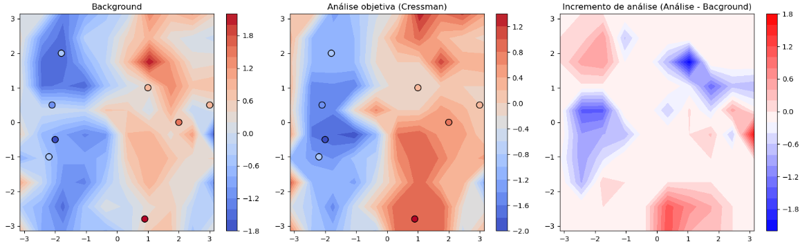
</div>

---

<!-- Scoped style -->
<style scoped>
section {
  font-size: 21px;
}
.columns {
  display: grid;
  grid-template-columns: repeat(2, minmax(0, 1fr));
  gap: 1rem;
}
</style>

# Histórico da Assimilação de Dados

<br />

## **_An Operational Objective Analysis System_ (Cressman, 1959)**

### Exemplo 2D

- O que acontece quando escolhemos apenas 1 raio? $R = 0.5$

<br />

<div align="center">
  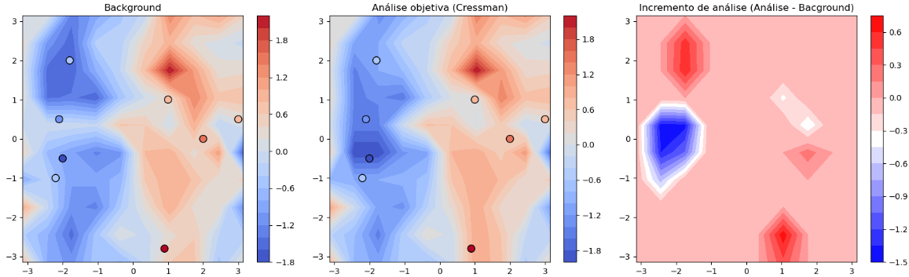
</div>

---

<!-- Scoped style -->
<style scoped>
section {
  font-size: 21px;
}
.columns {
  display: grid;
  grid-template-columns: repeat(2, minmax(0, 1fr));
  gap: 1rem;
}
</style>

# Histórico da Assimilação de Dados

<br />

## **_An Operational Objective Analysis System_ (Cressman, 1959)**

### Exemplo 2D

- O que acontece quando escolhemos apenas 1 raio? $R = 0.25$

<br />

<div align="center">
  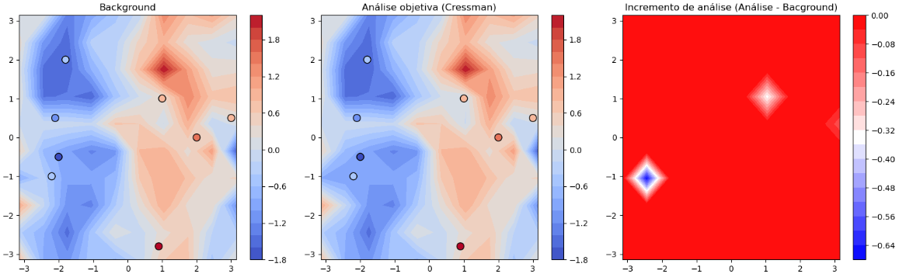
</div>

---

<!-- Scoped style -->
<style scoped>
section {
  font-size: 21px;
}
.columns {
  display: grid;
  grid-template-columns: repeat(2, minmax(0, 1fr));
  gap: 1rem;
}
</style>

# Histórico da Assimilação de Dados

<br />

## **_An Operational Objective Analysis System_ (Cressman, 1959)**

### Exemplo 2D

- O que acontece quando escolhemos apenas 1 raio? $R = 0.175$

<br />

<div align="center">
  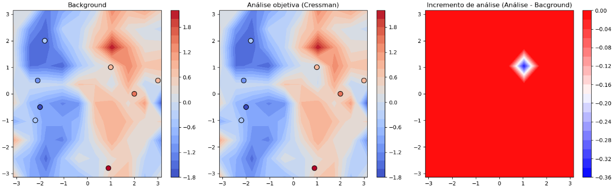
</div>

---

<!-- Scoped style -->
<style scoped>
section {
  font-size: 21px;
}
.columns {
  display: grid;
  grid-template-columns: repeat(2, minmax(0, 1fr));
  gap: 1rem;
}
</style>

# Histórico da Assimilação de Dados

<br />

## **_An Operational Objective Analysis System_ (Cressman, 1959)**

### Exemplo 2D

- O que acontece quando escolhemos apenas 2 raios? $R = [3.0, 2.0]$

<br />

<div align="center">
  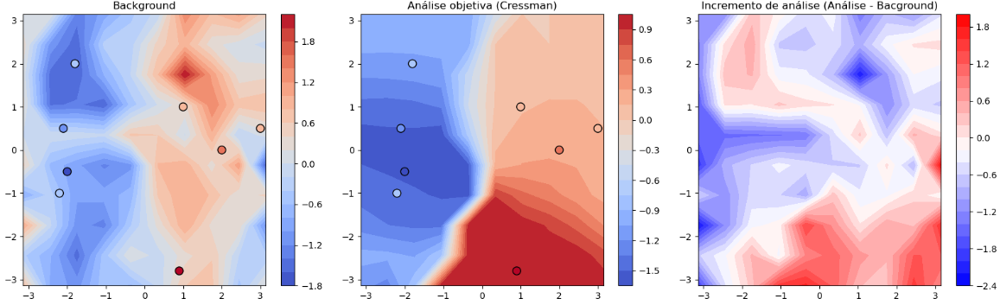
</div>

---

<!-- Scoped style -->
<style scoped>
section {
  font-size: 21px;
}
.columns {
  display: grid;
  grid-template-columns: repeat(2, minmax(0, 1fr));
  gap: 1rem;
}
</style>

# Histórico da Assimilação de Dados

<br />

## **_An Operational Objective Analysis System_ (Cressman, 1959)**

### Exemplo 2D

- O que acontece quando escolhemos 3 raios? $R = [3.0, 2.0, 1.0]$

<br />

<div align="center">
  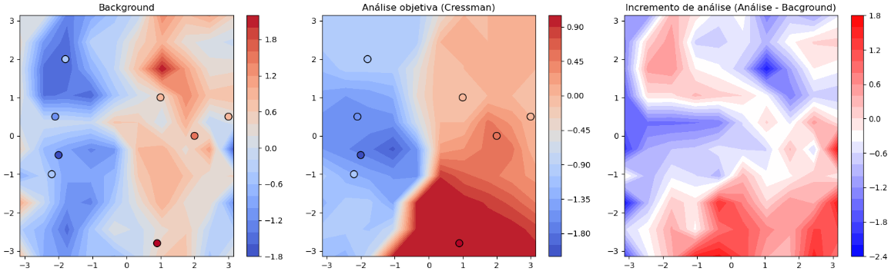
</div>

---

<!-- Scoped style -->
<style scoped>
section {
  font-size: 21px;
}
.columns {
  display: grid;
  grid-template-columns: repeat(2, minmax(0, 1fr));
  gap: 1rem;
}
</style>

# Histórico da Assimilação de Dados

<br />

## **_An Operational Objective Analysis System_ (Cressman, 1959)**

### Exemplo 2D

- O que acontece quando escolhemos 4 raios? $R = [3.0, 2.0, 1.0, 0.5]$

<br />

<div align="center">
  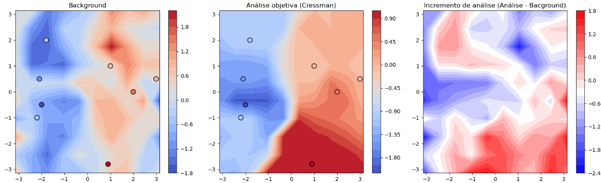
</div>

---

<!-- Scoped style -->
<style scoped>
section {
  font-size: 21px;
}
.columns {
  display: grid;
  grid-template-columns: repeat(2, minmax(0, 1fr));
  gap: 1rem;
}
</style>

# Histórico da Assimilação de Dados

<br />

## **_An Operational Objective Analysis System_ (Cressman, 1959)**

### Exemplo 2D

- O que acontece quando escolhemos 5 raios? $R = [3.0, 2.0, 1.0, 0.5, 0.25]$

<br />

<div align="center">
  
</div>

---

<!-- Scoped style -->
<style scoped>
section {
  font-size: 21px;
}
.columns {
  display: grid;
  grid-template-columns: repeat(2, minmax(0, 1fr));
  gap: 1rem;
}
</style>

# Histórico da Assimilação de Dados

<br />

## **_An Operational Objective Analysis System_ (Cressman, 1959)**

### Exemplo 2D

- O que acontece quando escolhemos 6 raios? $R = [3.0, 2.0, 1.0, 0.5, 0.25, 0.175]$

<br />

<div align="center">
  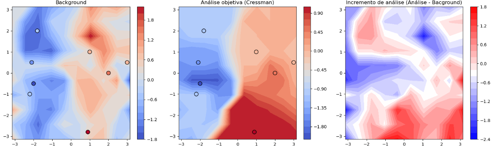
</div>

---

<!-- Scoped style -->
<style scoped>
section {
  font-size: 21px;
}
.columns {
  display: grid;
  grid-template-columns: repeat(2, minmax(0, 1fr));
  gap: 1rem;
}
</style>

# Histórico da Assimilação de Dados

<br />

## **_An Operational Objective Analysis System_ (Cressman, 1959)**

<br />

🎲 Notebook com <a href="#" target="_blank">Atividade Prática 4</a>

<br />

- Insights e questões interessantes que surgiram durante a aula 💡:
  * 💭 Como generalizar a determinação do raio de influência nos pontos de grade a serem analisados?
  * 💭 Como fazer com que os raios de influência possam ser distintos entre os pontos de grade?
    * A densidade de observações ao redor de cada ponto de grade seria um meio para isto?
  * 💭 Como fica a assimilação das observações na vertical? Os métodos empíricos que vimos até agora, contabilizam a estrutura vertical do modelo ou apenas a estrutura horizontal?
  * 💭 Como devem ser definidos os valores dos raios de influência?
    * A resolução do modelo seria um critério a ser utilizado?

---

<!-- Scoped style -->
<style scoped>
section {
  font-size: 21px;
}
</style>


# :thinking: Dúvidas

<br />
<br />
<br />
<br />
<br />
<br />
<br />

:link: https://cfbastarz.github.io/met563-3/
:octopus: https://github.com/cfbastarz/MET563-3
:email: carlos.bastarz@inpe.br
