<!-- _footer: "" -->


<!-- Scoped style -->
<style scoped>
section {
  font-size: 21px;
}
span.date {
  font-size: 15px;
}
span.program {
  font-size: 18px;
}
</style>

<style>
span.footnote {
    border-top: 0.1em dotted #555;
    font-size: 60%;
    margin-top: auto;
    position:absolute;
    bottom:0;
    width:100%;
    height:60px;    
}

span.footnote2 {
    border-top: 0.1em dotted #555;
    font-size: 60%;
    margin-top: auto;
    position:absolute;
    bottom:0;
    width:100%;
    height:90px;    
}
</style>

# **Introdução à Assimilação de Dados (MET 563-3)**

### Histórico da Assimilação de Dados - Gandin (1963)

<p>Dr. Carlos Frederico Bastarz
<br />
Dr. Dirceu Luis Herdies
<br />
<br />
<span class="program">Programa de Pós-Graduação em Meteorologia (PGMET) do INPE</span>
<br />
<br />
<span class="date">15 de Outubro de 2025</span>
<br />
<br />
<span class="date">Com conteúdo parcial das notas de aulas de <a href="https://maths.ucd.ie/~plynch/UCD_Home_Page.html" target="blank_">Peter Lynch</a> - <i>University College Dublin</i> 🍀
</p>

---

<!-- Scoped style -->
<style scoped>
section {
  font-size: 21px;
}
</style>

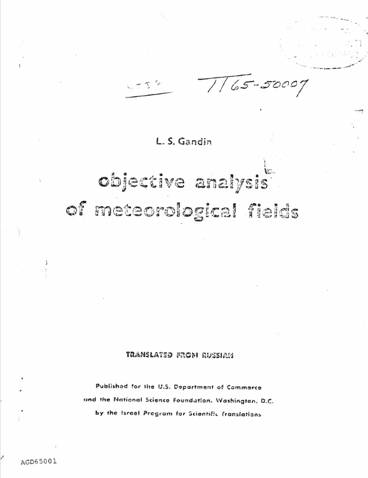

# Histórico da Assimilação de Dados

<br />

## **_Objective Analysis of Meteorological Fields_ (Gandin, 1963)**

* 👉 Primeiro trabalho a formular o problema da análise objetiva utilizando estatística
  * Até aqui, os esquemas de análise objetiva eram empíricos!
  * Lev Gandin partiu do princípio que a análise possui erros e que, portanto, as previsões e as observações posuem erros com média, variância/covariância e correlação conhecidos
* [https://www.scribd.com/document/515206963/Objective-Analysis-of-Meteorological-Fields](https://www.scribd.com/document/515206963/Objective-Analysis-of-Meteorological-Fields)

---

<!-- _footer: "" -->

<!-- Scoped style -->
<style scoped>
section {
  font-size: 21px;
}
</style>

# Histórico da Assimilação de Dados

<br />

## **_Objective Analysis of Meteorological Fields_ (Gandin, 1963)**

<br >

### Formalização Estatística

<br />

* O campo meteorológico é uma variável aleatória com estrutura de covariância conhecida
* Os erros de observação são aleatórios, não correlacionados e de variância conhecida
* O BLUE<sup>&#128312;</sup> do campo em um ponto qualquer é dado por uma combinação linear das observações disponíveis
* Uso de funções de correlação ou covariância espacial:
  * Descrevem a relação entre dois pontos no espaço
  * Permite representar matematicamente a ideia de que pontos mais próximos tendem a ter valores mais semelhantes
  
<span class="footnote">
<sup>&#128312;</sup>BLUE: <i>Best Linear Unbiased Estimator</i><br />
</span>
  
---

<!-- _footer: "" -->

<!-- Scoped style -->
<style scoped>
section {
  font-size: 21px;
}
</style>

# Histórico da Assimilação de Dados

<br />

## **_Objective Analysis of Meteorological Fields_ (Gandin, 1963)**

<br />

### Suposições Principais

- Objetivo destas suposições:
  - Viabilizar a aplicação do método nos computadores da época<sup>&#128312;</sup>

* 👉 Isotropia e homogeneidade das correlações
* 👉 Funções de correlação com decaimento exponencial simples
* 👉 Raio de influência - limita o número de observações consideradas ao redor de cada ponto de grade (escala de correlação)

* A interpolação ótima é um esquema de análise multivariado
* Durante das décadas de 1980 e 1990, foi operacional em diversos centros (inclusive no CPTEC)

<span class="footnote">
<sup>&#128312;</sup>Por questões práticas, muitas destas suposições ainda podem ser válidas<br />
</span>

---

<!-- Scoped style -->
<style scoped>
section {
  font-size: 21px;
}
</style>

# Histórico da Assimilação de Dados

<br />

## **_Objective Analysis of Meteorological Fields_ (Gandin, 1963)**

### Equação Fundamental

<br />

$$
\mathbf{x}_{a} = \mathbf{x}_{b} + \mathbf{W}(\mathbf{y} - H\mathbf{x}_{b})
$$

* Onde:

  * $\mathbf{x}_{a}$ é o vetor de análise (estado estimado)
  * $\mathbf{x}_{b}$ é o vetor de _background_ ou _first guess_
  * $\mathbf{y}$ é o vetor de observações
  * $\mathbf{W}$ é a matriz de peso (ou ganho)
  * $H$ é o operador observação não linear (transforma o espaço do modelo para o espaço físico das observações)

* 👉 Esta equação é resolvida de forma analítica

---

<!-- Scoped style -->
<style scoped>
section {
  font-size: 21px;
}
</style>

# Histórico da Assimilação de Dados

<br />

## **_Objective Analysis of Meteorological Fields_ (Gandin, 1963)**

<br />

### Matriz de Peso

<br />

- A matriz $\mathbf{W}$ determina quanto cada obvservação deve corrigir o campo de previsão:

<br />

$$
\mathbf{W} = \mathbf{BH}^{\text{T}}(\mathbf{HBH}^{\text{T}}+\mathbf{R})^{-1}
$$

<br />

* Onde:

  * $\mathbf{B}$ é a matriz de covariância dos erros de previsão (ela é constante)
  * $\mathbf{R}$ é a matriz de covariância dos erros de observação

* Note que $\mathbf{H}$ é linear!

---

<!-- Scoped style -->
<style scoped>
section {
  font-size: 21px;
}
</style>

# Histórico da Assimilação de Dados

<br />

## **_Objective Analysis of Meteorological Fields_ (Gandin, 1963)**

<br />

### Matriz de Peso

- A matriz $\mathbf{W}$ determina quanto cada observação deve corrigir o campo de previsão:

<br />

$$
\mathbf{W} = \mathbf{BH}^{\text{T}}(\mathbf{HBH}^{\text{T}}+\mathbf{R})^{-1}
$$

<br />

* $\mathbf{B}$ representa como os erros do modelo estão correlacionados espacialmente, ou seja, como uma correção em um ponto se propaga na vizinhança
* $\mathbf{R}$ representa a confiabilidade das observações (instrumentos, localização etc)
* O termo $(\mathbf{HBH}^{\text{T}}+\mathbf{R})^{-1}$ funciona como um filtro estatístico que pondera o peso relativo do modelo e das observações - 👉 e o termo $\mathbf{BH}^{\text{T}}$?
  
---

<!-- _footer: "" -->

<!-- Scoped style -->
<style scoped>
section {
  font-size: 21px;
}
</style>

# Histórico da Assimilação de Dados

<br />

## **_Objective Analysis of Meteorological Fields_ (Gandin, 1963)**

<br />

### Operador Observação

<br />

- Também chamado de _forward operator_ $H(\mathbf{x}_{b})$:
  * Permite obter o **_first guess_ das observações**
  * Realiza interpolações espaciais das previsões para o ponto das observações
  * Realiza transformações das variáveis de estado do modelo em quantidades observadas (e.g., o modelo de transferência radiativa CRTM<sup>&#128312;</sup>)
 
* Note que ora escrevemos $\mathbf{H}(\mathbf{x}_{b})$, ora escrevemos $H(\mathbf{x}_{b})$: 
  * 👉 $\mathbf{H}(\mathbf{x}_{b})$ é um operador linear 
  * 👉 $H(\mathbf{x}_{b})$ é um operador não linear 
 
<span class="footnote">
<sup>&#128312;</sup>CRTM: <i>Community Radiative Transfer Model</i><br />
</span> 
 
---

<!-- Scoped style -->
<style scoped>
section {
  font-size: 21px;
}
.columns {
  display: grid;
  grid-template-columns: repeat(2, minmax(0, 1fr));
  gap: 1rem;
}
</style>

# Histórico da Assimilação de Dados

<br />

## **_Objective Analysis of Meteorological Fields_ (Gandin, 1963)**

<br />  
 
<div class="columns">
<div>

### Operador Observação $\mathbf{H}$ - operador linear

<br /> 

- Exemplo de interpolação linear (considere que a observação está entre dois pontos de grade; se estivesse entre 4 pontos, então a interpolação seria bilinear)
- Considerando o exemplo de uma interpolação linear, 2 pontos de grade e 1 observação, sendo que modelo e observação representam as mesmas quantidades (e.g., temperatura)

</div>
<div>
<div align="center">
  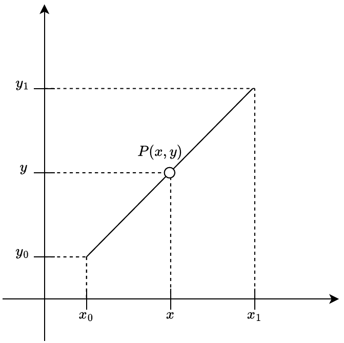
</div>

</div>
</div> 
 
---

<!-- Scoped style -->
<style scoped>
section {
  font-size: 21px;
}
.columns {
  display: grid;
  grid-template-columns: repeat(2, minmax(0, 1fr));
  gap: 1rem;
}
</style>

# Histórico da Assimilação de Dados

<br />

## **_Objective Analysis of Meteorological Fields_ (Gandin, 1963)**

<br />  
 
<div class="columns">
<div>

### Operador Observação $\mathbf{H}$ - operador linear

- Utilzando a lei de proporções entre os seguimentos de reta:

$$
  \frac{y-y_{0}}{x-x_{0}} = \frac{y_{1}-y_{0}}{x_{1}-x_{0}}
$$

- Desenvolvendo a relação e resolvendo para $y$, obtemos:

$$
  \frac{y-y_{0}}{y_{1}-y_{0}} = \frac{x-x_{0}}{x_{1}-x_{0}}
$$

</div>
<div>
<div align="center">
  
</div>

</div>
</div>  

---

<!-- Scoped style -->
<style scoped>
section {
  font-size: 21px;
}
.columns {
  display: grid;
  grid-template-columns: repeat(2, minmax(0, 1fr));
  gap: 1rem;
}
</style>

# Histórico da Assimilação de Dados

<br />

## **_Objective Analysis of Meteorological Fields_ (Gandin, 1963)**

<br />  
 
<div class="columns">
<div>

### Operador Observação $\mathbf{H}$ - operador linear

<br /> 

$$
  (y-y_{0})(x-x_{0}) = (y-y_{0})(x_{1}-x_{0})
$$

$$
  \frac{(y-y_{0})(x_{1}-x_{0})}{(x_{1}-x_{0})} = \frac{(y_{1}-y_{0})(x-x_{0})}{(x_{1}-x_{0})}
$$

$$
  y-y_{0}=(y_{1}-y_{0})\frac{(x-x_{0})}{(x_{1}-x_{0})}
$$

$$
  y=y_{0}+(y_{1}-y_{0})\frac{(x-x_{0})}{(x_{1}-x_{0})} \text{, com } x_{1} \neq {x_0}
$$

</div>
<div>
<div align="center">
  
</div>

</div>
</div>  

---


<!-- Scoped style -->
<style scoped>
section {
  font-size: 21px;
}
</style>

# Histórico da Assimilação de Dados

<br />

## **_Objective Analysis of Meteorological Fields_ (Gandin, 1963)**

<br />

### Operador Observação $H$ - operador não linear
 
- Se o modelo estivesse certo, qual seria o valor observado?
  * $y = \mathbf{H(x)}$
* Considerando o exemplo da energia radiada por um corpo negro:
  * Lei de Stefan Boltzman: $E = \sigma T^4$
  * Quando mais quente for um corpo, a energia total que ele irradia aumenta com a quarta potência da temperatura
 
* Neste exemplo, definiremos a temperatura $T$ como a variável de estado (o modelo nos fornece $T$) e a energia radiada $E$ como a observação (o sensor do satélite observa $E$):
  * $E = H(T) = \sigma T^{4}$
  * A inovação $y - H(\mathbf{x}_{b})$ é então $E_{\text{observada}} - H(T_{\text{modelo}})$
 
---

<!-- Scoped style -->
<style scoped>
section {
  font-size: 21px;
}
</style>

# Histórico da Assimilação de Dados

<br />

## **_Objective Analysis of Meteorological Fields_ (Gandin, 1963)**

<br />

### Operador Observação - $H$ operador não linear

<br />

- Como $H(T) = \sigma T^{4}$ é não linear, usamos uma aproximação linear (por série de Taylor) em torno de uma temperatura de referência $T_0$:

$$
H(T) \approx H(T_{0}) + H^\prime (T_{0})(T-T_{0})
$$

Onde:

$$
H^\prime (T_{0}) = \frac{d}{dT}(\sigma T^{4})\Bigg\vert_{T_{0}} = 4\sigma T_{0}^{3}
$$

* **Nota:** a derivada $H^\prime (T_{0})$ representa o operador tangente linear e o seu transposto, $H^{\prime\text{T}} (T_{0})$ representa o operador adjunto utilizados no 4DVar - o adjunto, é o transposto do tangente linear 😱

---

<!-- Scoped style -->
<style scoped>
section {
  font-size: 21px;
}
</style>

# Histórico da Assimilação de Dados

<br />

## **_Objective Analysis of Meteorological Fields_ (Gandin, 1963)**

<br />

### Matrizes de Covariâncias 

- $\mathbf{B}$ e $\mathbf{R}$ são as matrizes de covariâncias dos erros de previsão e observação, respectivamente
  * Ambas são assumidas serem conhecidas
- $\mathbf{R}$ inclui erros dos instrumentos e de representatividade (e.g., efeitos locais) e ambos são não correlacionados
  * $\mathbf{R} = \mathbf{R}_{\text{instrumento}} + \mathbf{R}_{\text{representatividade}}$
- $\mathbf{B}$ representa a covariância dos erros de previsão, i.e., como os erros na previsão do modelo estão distrbuídos no espaço e, indiretamente, no tempo
  * $\mathbf{B}$ define o peso que cada observação terá na análise e o raio de influência das observações - por meio da **escala de correlação**

---

<!-- _footer: "" -->

<!-- Scoped style -->
<style scoped>
section {
  font-size: 21px;
}
.columns {
  display: grid;
  grid-template-columns: repeat(2, minmax(0, 1fr));
  gap: 1rem;
}
</style>

# Histórico da Assimilação de Dados

<br />

## **_Objective Analysis of Meteorological Fields_ (Gandin, 1963)**

<br />

### Matrizes de Covariâncias
  
<div class="columns">
<div>

<br />

- De forma geral, uma matriz de covariâncias é obtida pela multiplicação do vetor de erros $\epsilon$ pelo seu transposto $\epsilon^{\text{T}}$:

$$
    \epsilon =
    \begin{bmatrix} 
        \epsilon_{1} \\ 
        \epsilon_{2} \\
        \vdots  \\
        \epsilon_{n} 
    \end{bmatrix}
    
    \epsilon^{\text{T}} = [\epsilon_{1} \epsilon_{2} \dots \epsilon_{n}]
$$

</div>
<div>

<br />

- Considerando um número de casos suficientemente grande, obtemos o valor experado:

$$
\mathbf{P} = \overline{\epsilon\epsilon^{\text{T}}} =
  \begin{bmatrix} 
        \overline{\epsilon_{1}\epsilon_{1}} & \overline{\epsilon_{1}\epsilon_{2}} & \cdots & \overline{\epsilon_{1}\epsilon_{n}} \\ 
        \overline{\epsilon_{2}\epsilon_{1}} & \overline{\epsilon_{2}\epsilon_{2}} & \cdots & \overline{\epsilon_{2}\epsilon_{n}} \\ 
        \vdots & \vdots & & \vdots \\
        \overline{\epsilon_{n}\epsilon_{1}} & \overline{\epsilon_{n}\epsilon_{2}} & \cdots & \overline{\epsilon_{n}\epsilon_{n}}
    \end{bmatrix}
$$

</div>
</div>

* Por definição, matrizes de covariâncias são **Simétricas e Positivas Definidas** (SPD)
* Na diagonal principal, tem-se os elementos de variâncias $\sigma^{2}_{i} = \overline{\epsilon_{i}\epsilon_{i}}$

---

<!-- Scoped style -->
<style scoped>
section {
  font-size: 21px;
}
.columns {
  display: grid;
  grid-template-columns: repeat(2, minmax(0, 1fr));
  gap: 1rem;
}
</style>

# Histórico da Assimilação de Dados

<br />

## **_Objective Analysis of Meteorological Fields_ (Gandin, 1963)**

<br />

### Matrizes de Covariâncias

- Matriz Simétrica e Positiva Definida:
  * $\mathbf{M}$ é simétrica se $\mathbf{M} = \mathbf{M}^{\text{T}}$ 
  * $\mathbf{M}$ é positiva definida se, para qualquer vetor coluna $\mathbf{x}$, todos os seus autovalores forem positivos (i.e., a variância $\mathbf{x}^{\text{T}}\mathbf{M}\mathbf{x} > 0$ é sempre positiva)
    * Isso garante que nenhuma combinação linear entre as variáveis seja negativa e que, portanto, todas as variâncias e covariâncias serão sempre positivas
    * Além disso, há a necessidade de inversões e decomposições (e.g, Cholesky) que necessitam destas propriedades
    * Garante estabilidade numérica

---

<!-- Scoped style -->
<style scoped>
section {
  font-size: 21px;
}
.columns {
  display: grid;
  grid-template-columns: repeat(2, minmax(0, 1fr));
  gap: 1rem;
}
</style>

# Histórico da Assimilação de Dados

<br />

## **_Objective Analysis of Meteorological Fields_ (Gandin, 1963)**

<br />

### Matrizes de Covariâncias

- Dividindo-se cada elemento da matriz de covariâncias pelo produto dos desvios-padrão, obtemos a matriz de correlação:

$$
\mathbf{C} = \overline{\epsilon\epsilon^{\text{T}}} =
  \begin{bmatrix} 
        1 & \rho_{12} & \cdots & \rho_{1n} \\ 
        \rho_{21} & 1 & \cdots & \rho_{2n} \\
        \vdots & \vdots & & \vdots \\
        \rho_{n1} & \rho_{n2} & \cdots & 1 \\ 
    \end{bmatrix}
$$

- Onde:
  - $\rho_{ij} = \frac{\overline{\epsilon_{i}\epsilon_{j}}}{\sigma_{i}\sigma_{j}}$ é a correlação dos elementos $ij$ da matriz

---

<!-- Scoped style -->
<style scoped>
section {
  font-size: 21px;
}
.columns {
  display: grid;
  grid-template-columns: repeat(2, minmax(0, 1fr));
  gap: 1rem;
}
</style>

# Histórico da Assimilação de Dados

<br />

## **_Objective Analysis of Meteorological Fields_ (Gandin, 1963)**

<br />

### Matrizes de Covariâncias

- De forma prática, matrizes de covariâncias podem ser decompostas
- Um exemplo:
  - $\mathbf{P} = \mathbf{D}^{\frac{1}{2}} \mathbf{C} \mathbf{D}^{\frac{1}{2}}$
  - Onde $\mathbf{D}$ é a matriz com as variâncias:
  
  $$
  \mathbf{D} = 
  \begin{bmatrix} 
        \sigma_{1}^{2} & 0 & \cdots & 0 \\ 
        0 & \sigma_{1}^{2} & \cdots & 0 \\
        \vdots & \vdots & & \vdots \\
        0 & 0 & \cdots & \sigma_{1}^{2} \\ 
    \end{bmatrix}
  $$
  
---

<!-- _footer: "" -->

<!-- Scoped style -->
<style scoped>
section {
  font-size: 21px;
}
.columns {
  display: grid;
  grid-template-columns: repeat(2, minmax(0, 1fr));
  gap: 1rem;
}
</style>

# Histórico da Assimilação de Dados

<br />

## **_Objective Analysis of Meteorological Fields_ (Gandin, 1963)**

### Equações da Interpolação Ótima

#### Equação de Análise

- A análise é obtida adicionando-se ao campo de background o produto entre a matriz peso e a inovação:

$$
\mathbf{x}_{a} = \mathbf{x}_{b} + \mathbf{W}(\mathbf{y} - H\mathbf{x}_{b})
$$

- A matriz peso é dada pela covariâncias do erro da previsão no espaço físico ($\mathbf{BH}^{\text{T}})$ multiplicada pelo inverso da covariância do erro total (quanto maior a covariância do erro da previsão em relação à covariância do erro da observação, maior é a correção na previsão - e se $\mathbf{R}=0$?):

$$
\mathbf{W} = \mathbf{BH}^{\text{T}} (\mathbf{R} + \mathbf{HBH}^{\text{T}})^{-1}
$$

- A covariância do erro da análise é dada pela covariância do erro da previsão, reduzida por uma matriz igual à matriz identidade menos a matriz de peso

$$
\mathbf{P}_{a} = (\mathbf{I} - \mathbf{WH})\mathbf{B}
$$
  
---

<!-- Scoped style -->
<style scoped>
section {
  font-size: 21px;
}
.columns {
  display: grid;
  grid-template-columns: repeat(2, minmax(0, 1fr));
  gap: 1rem;
}
</style>

# Histórico da Assimilação de Dados

<br />

## **_Objective Analysis of Meteorological Fields_ (Gandin, 1963)**

<br />
<div class="columns">
<div>

<br />

### Exemplo 1D

<br />

- Considere um modelo matemático simples:

$$
f(x) = \sin(x) + \varepsilon, \quad \varepsilon \sim \mathcal{N}(0, \sigma^2), \quad -\pi \le x \le \pi
$$

- A função seno com a adição de um ruído normalmente distribuído

</div>
<div>

<div align="center">
  
</div> 

</div>
</div>  
  
---

<!-- Scoped style -->
<style scoped>
section {
  font-size: 21px;
}
.columns {
  display: grid;
  grid-template-columns: repeat(2, minmax(0, 1fr));
  gap: 1rem;
}
</style>

# Histórico da Assimilação de Dados

<br />

## **_Objective Analysis of Meteorological Fields_ (Gandin, 1963)**

<br />

### Exemplo 1D

<br />

```
x = np.arange(-np.pi, np.pi, 0.01)
xb_seno = np.sin(x)
```

- Outra forma de acrescentar o ruído:

```
sigma = 0.5  
ruido = np.random.randn(*x.shape) * sigma

xb = xb_seno + ruido
```
 
---

<!-- Scoped style -->
<style scoped>
section {
  font-size: 21px;
}
.columns {
  display: grid;
  grid-template-columns: repeat(2, minmax(0, 1fr));
  gap: 1rem;
}
</style>

# Histórico da Assimilação de Dados

<br />
<br />

## **_Objective Analysis of Meteorological Fields_ (Gandin, 1963)**

<br />

### Exemplo 1D

<br />

```
# Posições

obs_pos = np.array([-2.2, -2.1, -2.0, -1.8, 0.9, 1, 2, 3])

# Valores medidos

obs_vals = np.array([-2.2, -1.8, 0.9, 0, 1, 2, 3, 4])
``` 
 
---

<!-- _footer: "" -->

<!-- Scoped style -->
<style scoped>
section {
  font-size: 19px;
}
.columns {
  display: grid;
  grid-template-columns: repeat(2, minmax(0, 1fr));
  gap: 1rem;
}
</style>

# Histórico da Assimilação de Dados

<br />

## **_Objective Analysis of Meteorological Fields_ (Gandin, 1963)**

### Exemplo 1D

```
# Função peso IO

L=0.5
sigma_b=0.5
sigma_o=0.1

def weight_io(x_grid, obs_x, obs_val, xb, L=L, sigma_b=sigma_b, sigma_o=sigma_o):
    def cov(a, b): return sigma_b**2 * np.exp(-((a - b)**2)/(2*L**2))
    n = len(x_grid)
    p = len(obs_x)
    B_Ht = np.array([[cov(xi, xj) for xj in obs_x] for xi in x_grid])
    HBHt = np.array([[cov(xi, xj) for xi in obs_x] for xj in obs_x])
    R = np.eye(p) * sigma_o**2
    K = B_Ht @ np.linalg.inv(HBHt + R)
    Hxb = np.interp(obs_x, x_grid, xb)
    return xb + K @ (obs_val - Hxb)
```

* Note que estamos utilizando o modelo de covariâncias Gaussiano para $\mathbf{B}$ e $\mathbf{R}$, com média $\mu=0,5$ e desvios-padrão $\sigma_b = 0,5$ e $\sigma_o = 0,1$ 
* $L$, assim como no exemplo do método de correções sucessivas, restringe a influência das observações no ponto analisado
 
---

<!-- Scoped style -->
<style scoped>
section {
  font-size: 21px;
}
.columns {
  display: grid;
  grid-template-columns: repeat(2, minmax(0, 1fr));
  gap: 1rem;
}
</style>

# Histórico da Assimilação de Dados

<br />
<br />

## **_Objective Analysis of Meteorological Fields_ (Gandin, 1963)**

<br />

### Exemplo 1D 

<br />

```
# Cálculo da Análise - embutido na função anterior e dada por xb + K @ (obs_val - Hxb)

# Chamada da função peso (retorna o valor da análise)

xa = weight_io(x, obs_x, obs_val, xb)
```

---

<!-- Scoped style -->
<style scoped>
section {
  font-size: 21px;
}
.columns {
  display: grid;
  grid-template-columns: repeat(2, minmax(0, 1fr));
  gap: 1rem;
}
</style>

# Histórico da Assimilação de Dados

<br />
<br />

## **_Objective Analysis of Meteorological Fields_ (Gandin, 1963)**

<br />

<div class="columns">
<div>

### Exemplo 1D 

<br />

- Efeitos da escala de correlação $L$:
  - $L=0,1$
  - $\sigma_b = 0,5$ 
  - $\sigma_o = 0,1$

</div>
<div>

<br />
<br />

<div align="center">
  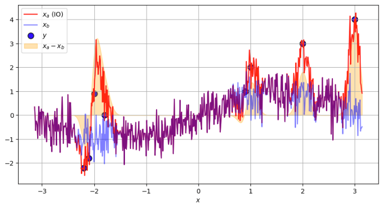
</div>

</div>
</div> 
 
---

<!-- Scoped style -->
<style scoped>
section {
  font-size: 21px;
}
.columns {
  display: grid;
  grid-template-columns: repeat(2, minmax(0, 1fr));
  gap: 1rem;
}
</style>

# Histórico da Assimilação de Dados

<br />
<br />

## **_Objective Analysis of Meteorological Fields_ (Gandin, 1963)**

<br />

<div class="columns">
<div>

### Exemplo 1D 

<br />

- Efeitos da escala de correlação $L$:
  - $L=0,2$
  - $\sigma_b = 0,5$ 
  - $\sigma_o = 0,1$

</div>
<div>

<br />
<br />

<div align="center">
  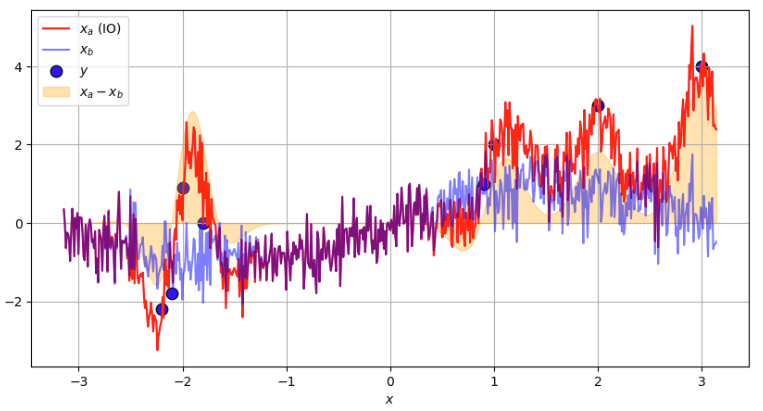
</div>

</div>
</div>  
 
---

<!-- Scoped style -->
<style scoped>
section {
  font-size: 21px;
}
.columns {
  display: grid;
  grid-template-columns: repeat(2, minmax(0, 1fr));
  gap: 1rem;
}
</style>

# Histórico da Assimilação de Dados

<br />
<br />

## **_Objective Analysis of Meteorological Fields_ (Gandin, 1963)**

<br />

<div class="columns">
<div>

### Exemplo 1D 

<br />

- Efeitos da escala de correlação $L$:
  - $L=0,3$
  - $\sigma_b = 0,5$ 
  - $\sigma_o = 0,1$

</div>
<div>

<br />
<br />

<div align="center">
  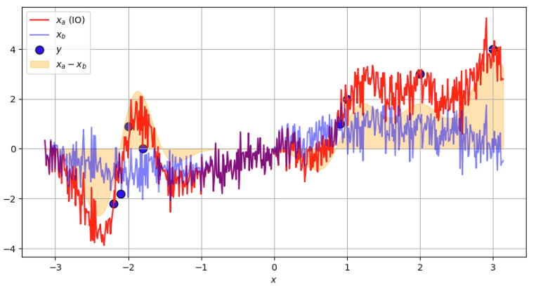
</div>

</div>
</div>   
 
---

<!-- Scoped style -->
<style scoped>
section {
  font-size: 21px;
}
.columns {
  display: grid;
  grid-template-columns: repeat(2, minmax(0, 1fr));
  gap: 1rem;
}
</style>

# Histórico da Assimilação de Dados

<br />
<br />

## **_Objective Analysis of Meteorological Fields_ (Gandin, 1963)**

<br />

<div class="columns">
<div>

### Exemplo 1D 

<br />

- Efeitos da escala de correlação $L$:
  - $L=0,4$
  - $\sigma_b = 0,5$ 
  - $\sigma_o = 0,1$

</div>
<div>

<br />
<br />

<div align="center">
  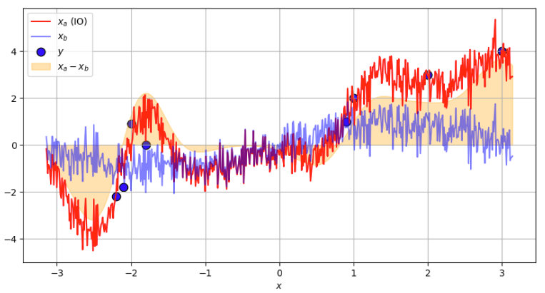
</div>

</div>
</div>   
 
---

<!-- Scoped style -->
<style scoped>
section {
  font-size: 21px;
}
.columns {
  display: grid;
  grid-template-columns: repeat(2, minmax(0, 1fr));
  gap: 1rem;
}
</style>

# Histórico da Assimilação de Dados

<br />
<br />

## **_Objective Analysis of Meteorological Fields_ (Gandin, 1963)**

<br />

<div class="columns">
<div>

### Exemplo 1D 

<br />

- Efeitos da escala de correlação $L$:
  - $L=0,5$
  - $\sigma_b = 0,5$ 
  - $\sigma_o = 0,1$

</div>
<div>

<br />
<br />

<div align="center">
  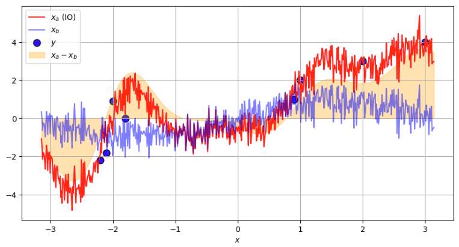
</div>

</div>
</div>  
 
---

<!-- Scoped style -->
<style scoped>
section {
  font-size: 21px;
}
.columns {
  display: grid;
  grid-template-columns: repeat(2, minmax(0, 1fr));
  gap: 1rem;
}
</style>

# Histórico da Assimilação de Dados

<br />
<br />

## **_Objective Analysis of Meteorological Fields_ (Gandin, 1963)**

<br />

<div class="columns">
<div>

### Exemplo 1D 

<br />

- Efeitos da escala de correlação $L$:
  - $L=0,6$
  - $\sigma_b = 0,5$ 
  - $\sigma_o = 0,1$

</div>
<div>

<br />
<br />

<div align="center">
  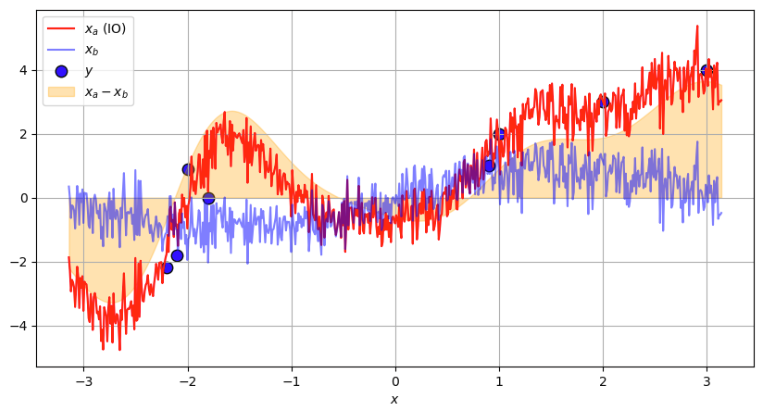
</div>

</div>
</div>

---

<!-- Scoped style -->
<style scoped>
section {
  font-size: 21px;
}
.columns {
  display: grid;
  grid-template-columns: repeat(2, minmax(0, 1fr));
  gap: 1rem;
}
</style>

# Histórico da Assimilação de Dados

<br />
<br />

## **_Objective Analysis of Meteorological Fields_ (Gandin, 1963)**

<br />

<div class="columns">
<div>

### Exemplo 1D 

<br />

- Efeitos da escala de correlação $L$:
  - $L=0,7$
  - $\sigma_b = 0,5$ 
  - $\sigma_o = 0,1$

</div>
<div>

<br />
<br />

<div align="center">
  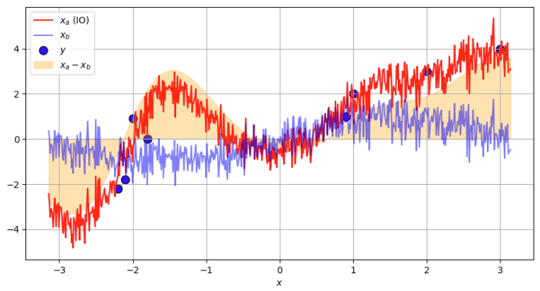
</div>

</div>
</div>

---

<!-- Scoped style -->
<style scoped>
section {
  font-size: 21px;
}
.columns {
  display: grid;
  grid-template-columns: repeat(2, minmax(0, 1fr));
  gap: 1rem;
}
</style>

# Histórico da Assimilação de Dados

<br />
<br />

## **_Objective Analysis of Meteorological Fields_ (Gandin, 1963)**

<br />

<div class="columns">
<div>

### Exemplo 1D 

<br />

- Efeitos da escala de correlação $L$:
  - $L=0,8$
  - $\sigma_b = 0,5$ 
  - $\sigma_o = 0,1$

</div>
<div>

<br />
<br />

<div align="center">
  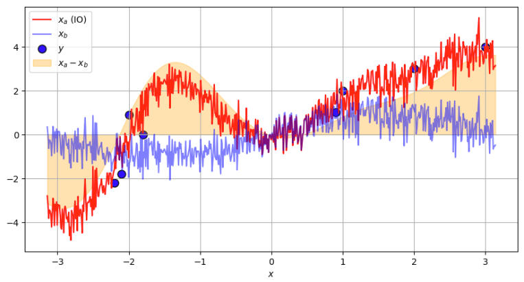
</div>

</div>
</div>

---

<!-- Scoped style -->
<style scoped>
section {
  font-size: 21px;
}
.columns {
  display: grid;
  grid-template-columns: repeat(2, minmax(0, 1fr));
  gap: 1rem;
}
</style>

# Histórico da Assimilação de Dados

<br />
<br />

## **_Objective Analysis of Meteorological Fields_ (Gandin, 1963)**

<br />

<div class="columns">
<div>

### Exemplo 1D 

<br />

- Efeitos da escala de correlação $L$:
  - $L=0,9$
  - $\sigma_b = 0,5$ 
  - $\sigma_o = 0,1$

</div>
<div>

<br />
<br />

<div align="center">
  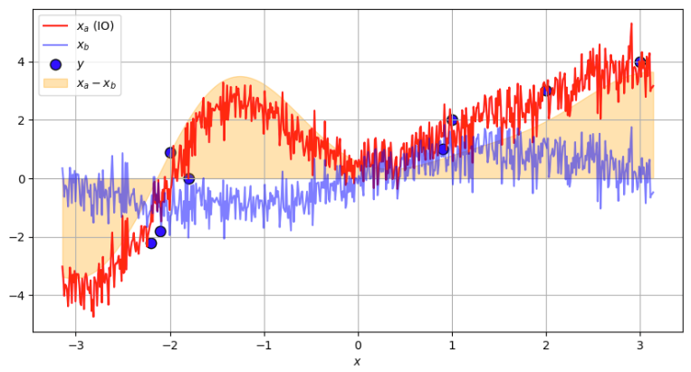
</div>

</div>
</div>

---

<!-- Scoped style -->
<style scoped>
section {
  font-size: 21px;
}
.columns {
  display: grid;
  grid-template-columns: repeat(2, minmax(0, 1fr));
  gap: 1rem;
}
</style>

# Histórico da Assimilação de Dados

<br />
<br />

## **_Objective Analysis of Meteorological Fields_ (Gandin, 1963)**

<br />

<div class="columns">
<div>

### Exemplo 1D 

<br />

- Efeitos da escala de correlação $L$:
  - $L=1,0$
  - $\sigma_b = 0,5$ 
  - $\sigma_o = 0,1$

</div>
<div>

<br />
<br />

<div align="center">
  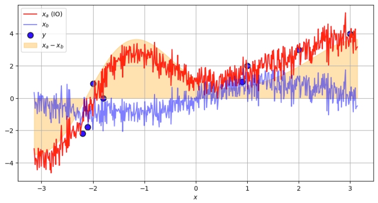
</div>

</div>
</div>
 
---

<!-- Scoped style -->
<style scoped>
section {
  font-size: 21px;
}
.columns {
  display: grid;
  grid-template-columns: repeat(2, minmax(0, 1fr));
  gap: 1rem;
}
</style>

# Histórico da Assimilação de Dados

<br />
<br />

## **_Objective Analysis of Meteorological Fields_ (Gandin, 1963)**

<br />

<div class="columns">
<div>

### Exemplo 1D 

<br />

- Efeitos da amplitude de $\sigma_b$:
  - $L=0,5$
  - $\sigma_b = 0,25$ 
  - $\sigma_o = 0,1$

</div>
<div>

<br />
<br />

<div align="center">
  
</div>

</div>
</div> 

---

<!-- Scoped style -->
<style scoped>
section {
  font-size: 21px;
}
.columns {
  display: grid;
  grid-template-columns: repeat(2, minmax(0, 1fr));
  gap: 1rem;
}
</style>

# Histórico da Assimilação de Dados

<br />
<br />

## **_Objective Analysis of Meteorological Fields_ (Gandin, 1963)**

<br />

<div class="columns">
<div>

### Exemplo 1D 

<br />

- Efeitos da amplitude de $\sigma_b$:
  - $L=0,5$
  - $\sigma_b = 0,125$ 
  - $\sigma_o = 0,1$

</div>
<div>

<br />
<br />

<div align="center">
  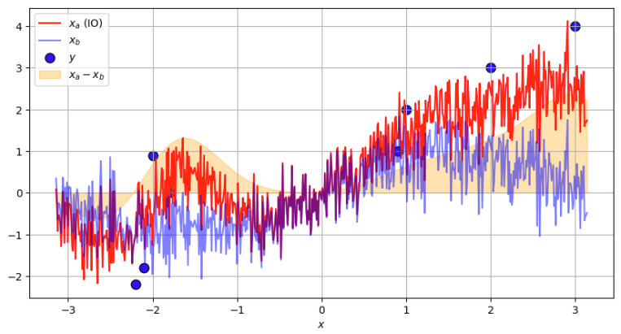
</div>

</div>
</div> 
 
---

<!-- Scoped style -->
<style scoped>
section {
  font-size: 21px;
}
.columns {
  display: grid;
  grid-template-columns: repeat(2, minmax(0, 1fr));
  gap: 1rem;
}
</style>

# Histórico da Assimilação de Dados

<br />
<br />

## **_Objective Analysis of Meteorological Fields_ (Gandin, 1963)**

<br />

<div class="columns">
<div>

### Exemplo 1D 

<br />

- Efeitos da amplitude de $\sigma_b$:
  - $L=0,5$
  - $\sigma_b = 0,125$ 
  - $\sigma_o = 0,1$

</div>
<div>

<br />
<br />

<div align="center">
  
</div>

</div>
</div>  

---

<!-- Scoped style -->
<style scoped>
section {
  font-size: 21px;
}
.columns {
  display: grid;
  grid-template-columns: repeat(2, minmax(0, 1fr));
  gap: 1rem;
}
</style>

# Histórico da Assimilação de Dados

<br />
<br />

## **_Objective Analysis of Meteorological Fields_ (Gandin, 1963)**

<br />

<div class="columns">
<div>

### Exemplo 1D 

<br />

- Efeitos da amplitude de $\sigma_o$:
  - $L=0,5$
  - $\sigma_b = 0,5$ 
  - $\sigma_o = 0,2$

</div>
<div>

<br />
<br />

<div align="center">
  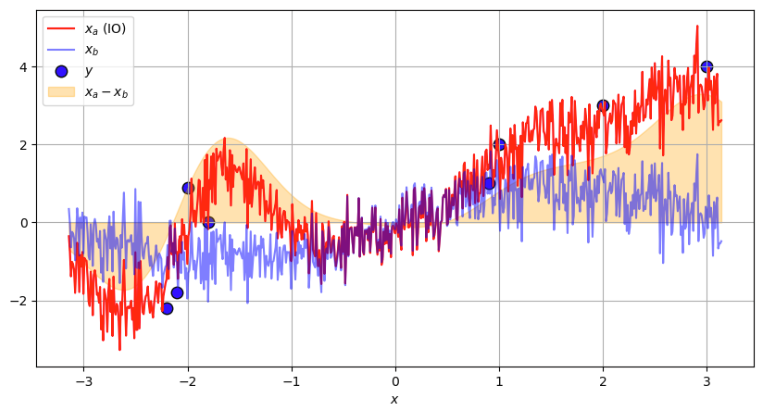
</div>

</div>
</div>  

---

<!-- Scoped style -->
<style scoped>
section {
  font-size: 21px;
}
.columns {
  display: grid;
  grid-template-columns: repeat(2, minmax(0, 1fr));
  gap: 1rem;
}
</style>

# Histórico da Assimilação de Dados

<br />
<br />

## **_Objective Analysis of Meteorological Fields_ (Gandin, 1963)**

<br />

<div class="columns">
<div>

### Exemplo 1D 

<br />

- Efeitos da amplitude de $\sigma_o$:
  - $L=0,5$
  - $\sigma_b = 0,5$ 
  - $\sigma_o = 0,3$

</div>
<div>

<br />
<br />

<div align="center">
  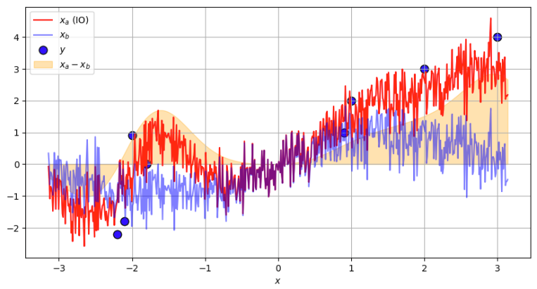
</div>

</div>
</div>  

---

<!-- Scoped style -->
<style scoped>
section {
  font-size: 21px;
}
.columns {
  display: grid;
  grid-template-columns: repeat(2, minmax(0, 1fr));
  gap: 1rem;
}
</style>

# Histórico da Assimilação de Dados

<br />
<br />

## **_Objective Analysis of Meteorological Fields_ (Gandin, 1963)**

<br />

<div class="columns">
<div>

### Exemplo 1D 

<br />

- Efeitos da amplitude de $\sigma_o$:
  - $L=0,5$
  - $\sigma_b = 0,5$ 
  - $\sigma_o = 0,4$

</div>
<div>

<br />
<br />

<div align="center">
  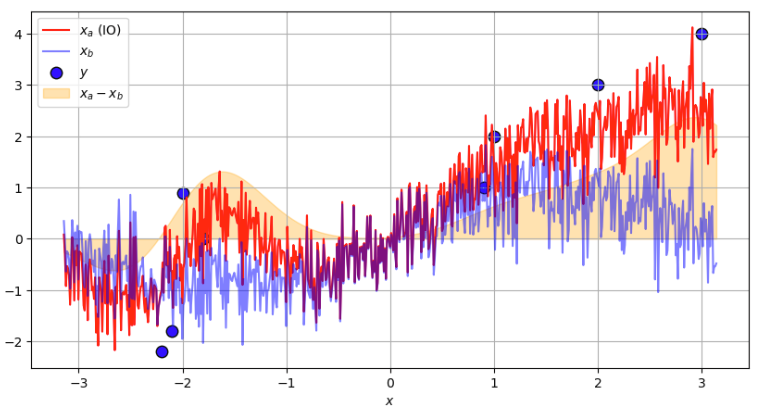
</div>

</div>
</div> 

---

<!-- Scoped style -->
<style scoped>
section {
  font-size: 21px;
}
.columns {
  display: grid;
  grid-template-columns: repeat(2, minmax(0, 1fr));
  gap: 1rem;
}
</style>

# Histórico da Assimilação de Dados

<br />
<br />

## **_Objective Analysis of Meteorological Fields_ (Gandin, 1963)**

<br />

<div class="columns">
<div>

### Exemplo 1D 

<br />

- Efeitos da amplitude de $\sigma_o$:
  - $L=0,5$
  - $\sigma_b = 0,5$ 
  - $\sigma_o = 0,5$

</div>
<div>

<br />
<br />

<div align="center">
  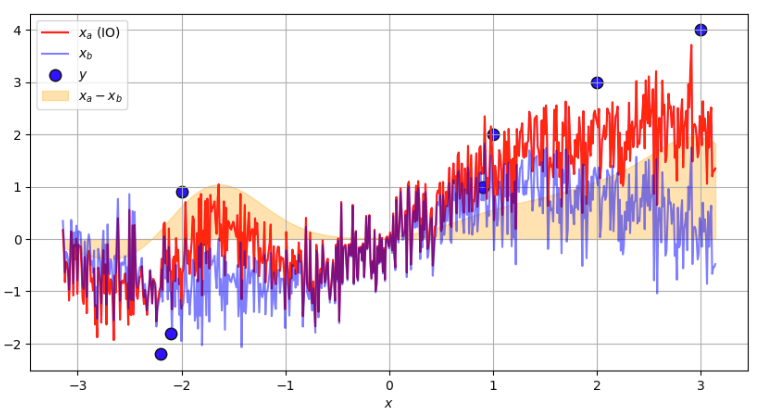
</div>

</div>
</div>

---

<!-- Scoped style -->
<style scoped>
section {
  font-size: 21px;
}
.columns {
  display: grid;
  grid-template-columns: repeat(2, minmax(0, 1fr));
  gap: 1rem;
}
</style>

# Histórico da Assimilação de Dados

<br />

## **_Objective Analysis of Meteorological Fields_ (Gandin, 1963)**

<div class="columns">
<div>

<br />

### Exemplo 2D

- Considere um modelo matemático simples:

$$
f(x, y) = \sin(x) + \varepsilon, \quad \varepsilon \sim \mathcal{N}(0, \sigma^2), \quad -\pi \le x \le \pi, \quad -\pi \le y \le \pi
$$

- A função seno com a adição de um ruído normalmente distribuído
- Definimos um plano Cartesiano de 100 pontos onde esta função será aplicada

</div>
<div>

<br />
<br />

<div align="center">
  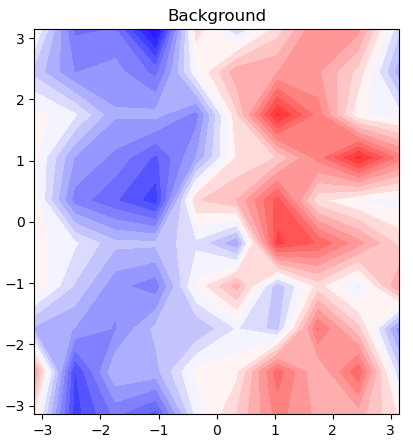
</div> 

</div>
</div> 


---

<!-- Scoped style -->
<style scoped>
section {
  font-size: 21px;
}
.columns {
  display: grid;
  grid-template-columns: repeat(2, minmax(0, 1fr));
  gap: 1rem;
}
</style>

# Histórico da Assimilação de Dados

<br />

## **_Objective Analysis of Meteorological Fields_ (Gandin, 1963)**

<br />

### Exemplo 2D

- Definimos dois vetores com o domínio para $x$ e $y$
- Definimos uma malha a partir dos valores do domínio

```
lon = np.linspace(-np.pi, np.pi, 10)
lat = np.linspace(-np.pi, np.pi, 10)

X, Y = np.meshgrid(lon, lat)
```

---

<!-- Scoped style -->
<style scoped>
section {
  font-size: 21px;
}
.columns {
  display: grid;
  grid-template-columns: repeat(2, minmax(0, 1fr));
  gap: 1rem;
}
</style>

# Histórico da Assimilação de Dados

<br />

## **_Objective Analysis of Meteorological Fields_ (Gandin, 1963)**

<br />

### Exemplo 2D

- Aplicamos a função $\sin$ para os valores do domínio
- Definimos um ruído
- Somamos o ruído à função

```
xb_seno = np.sin(X)

sigma = 0.5  
ruido = np.random.randn(*X.shape) * sigma

xb_2d = xb_seno + ruido
```

---

<!-- Scoped style -->
<style scoped>
section {
  font-size: 21px;
}
.columns {
  display: grid;
  grid-template-columns: repeat(2, minmax(0, 1fr));
  gap: 1rem;
}
</style>

# Histórico da Assimilação de Dados

<br />

## **_Objective Analysis of Meteorological Fields_ (Gandin, 1963)**

### Exemplo 2D

- Definição das posições e valores das observações

```
# Posições
obs_x = np.array([-2.2, -2.1, -2.0, -1.8, 0.9, 1.0, 2.0, 3.0])  
obs_y = np.array([ -1, 0.5, -0.5, 2, -2.8, 1.0, 0.0, 0.5]) 

# Valores medidos
obs_val = np.array([-1.0, -1.5, -2.0, -1.0, 1.0, 0.0, 0.5, 0.0]) 
```

---

<!-- _footer: "" -->

<!-- Scoped style -->
<style scoped>
section {
  font-size: 18px;
}
.columns {
  display: grid;
  grid-template-columns: repeat(2, minmax(0, 1fr));
  gap: 1rem;
}
</style>

# Histórico da Assimilação de Dados

<br />

## **_Objective Analysis of Meteorological Fields_ (Gandin, 1963)**

<br />

### Exemplo 2D

```
# Função peso IO

L=0.5
sigma_b=0.5
sigma_o=0.1

def weight_io_2d(X, Y, obs_x, obs_y, obs_val, xb, L=L, sigma_b=sigma_b, sigma_o=sigma_o):
    obs_pos = np.vstack((obs_x, obs_y)).T
    grid_pos = np.vstack((X.ravel(), Y.ravel())).T
    def cov(p1, p2): return sigma_b**2 * np.exp(-np.sum((p1 - p2)**2)/(2*L**2))
    B = np.array([[cov(p1, p2) for p2 in obs_pos] for p1 in obs_pos])
    Hx = np.array([[cov(p1, p2) for p2 in obs_pos] for p1 in grid_pos])
    R = np.eye(len(obs_x))*sigma_o**2
    K = Hx @ np.linalg.inv(B + R)
    Hxb = np.interp(obs_x, np.linspace(0, 2*np.pi, X.shape[1]), xb.mean(axis=0))
    ana = xb.ravel() + K @ (obs_val - Hxb)
    return ana.reshape(X.shape)
```

* Note que estamos utilizando o modelo de covariâncias Gaussiano para $\mathbf{B}$ e $\mathbf{R}$, com média $\mu=0,5$ e desvios-padrão $\sigma_b = 0,5$ e $\sigma_o = 0,1$ 
* $L$, assim como no exemplo do método de correções sucessivas, restringe a influência das observações no ponto analisado

---

<!-- Scoped style -->
<style scoped>
section {
  font-size: 21px;
}
.columns {
  display: grid;
  grid-template-columns: repeat(2, minmax(0, 1fr));
  gap: 1rem;
}
</style>

# Histórico da Assimilação de Dados

<br />
<br />

## **_Objective Analysis of Meteorological Fields_ (Gandin, 1963)**

<br />

### Exemplo 1D 

<br />

```
# Cálculo da Análise - embutido na função anterior e dada por xb + K @ (obs_val - Hxb)

# Chamada da função peso (retorna o valor da análise)

xa = weight_io_2d(X, Y, obs_x, obs_y, obs_val, xb_2d)
```

---

<!-- _footer: "" -->

<!-- Scoped style -->
<style scoped>
section {
  font-size: 21px;
}
.columns {
  display: grid;
  grid-template-columns: repeat(2, minmax(0, 1fr));
  gap: 1rem;
}
</style>

# Histórico da Assimilação de Dados

<br />

## **_Objective Analysis of Meteorological Fields_ (Gandin, 1963)**

### Exemplo 2D 

- Efeitos da escala de correlação $L$:
  - $L=0,1$
  - $\sigma_b = 0,5$ 
  - $\sigma_o = 0,1$
  
<div align="center">
  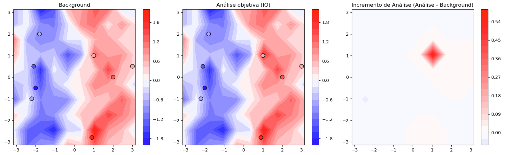
</div>

---

<!-- _footer: "" -->

<!-- Scoped style -->
<style scoped>
section {
  font-size: 21px;
}
.columns {
  display: grid;
  grid-template-columns: repeat(2, minmax(0, 1fr));
  gap: 1rem;
}
</style>

# Histórico da Assimilação de Dados

<br />

## **_Objective Analysis of Meteorological Fields_ (Gandin, 1963)**

### Exemplo 2D 

- Efeitos da escala de correlação $L$:
  - $L=0,2$
  - $\sigma_b = 0,5$ 
  - $\sigma_o = 0,1$
  
<div align="center">
  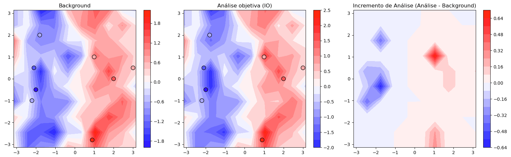
</div>

---

<!-- _footer: "" -->

<!-- Scoped style -->
<style scoped>
section {
  font-size: 21px;
}
.columns {
  display: grid;
  grid-template-columns: repeat(2, minmax(0, 1fr));
  gap: 1rem;
}
</style>

# Histórico da Assimilação de Dados

<br />

## **_Objective Analysis of Meteorological Fields_ (Gandin, 1963)**

### Exemplo 2D 

- Efeitos da escala de correlação $L$:
  - $L=0,3$
  - $\sigma_b = 0,5$ 
  - $\sigma_o = 0,1$
  
<div align="center">
  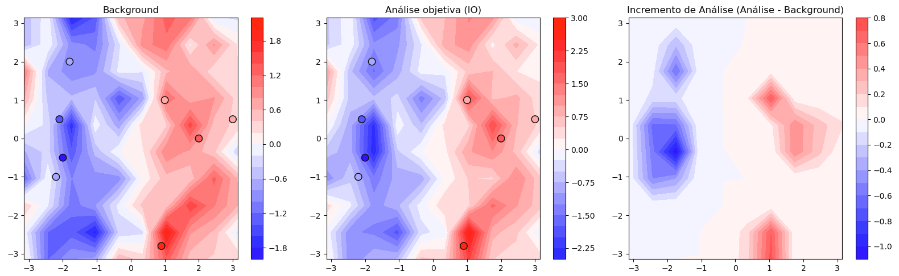
</div>

---

<!-- _footer: "" -->

<!-- Scoped style -->
<style scoped>
section {
  font-size: 21px;
}
.columns {
  display: grid;
  grid-template-columns: repeat(2, minmax(0, 1fr));
  gap: 1rem;
}
</style>

# Histórico da Assimilação de Dados

<br />

## **_Objective Analysis of Meteorological Fields_ (Gandin, 1963)**

### Exemplo 2D 

- Efeitos da escala de correlação $L$:
  - $L=0,4$
  - $\sigma_b = 0,5$ 
  - $\sigma_o = 0,1$
  
<div align="center">
  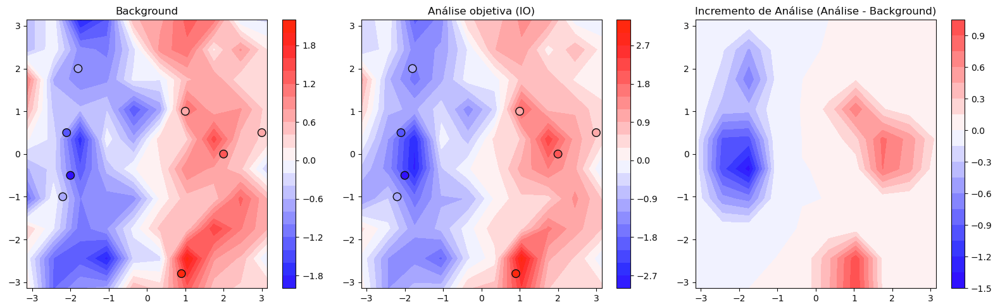
</div>

---

<!-- _footer: "" -->

<!-- Scoped style -->
<style scoped>
section {
  font-size: 21px;
}
.columns {
  display: grid;
  grid-template-columns: repeat(2, minmax(0, 1fr));
  gap: 1rem;
}
</style>

# Histórico da Assimilação de Dados

<br />

## **_Objective Analysis of Meteorological Fields_ (Gandin, 1963)**

### Exemplo 2D 

- Efeitos da escala de correlação $L$:
  - $L=0,5$
  - $\sigma_b = 0,5$ 
  - $\sigma_o = 0,1$
  
<div align="center">
  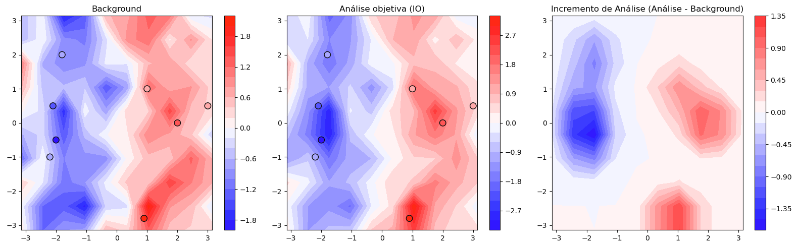
</div>

---

<!-- _footer: "" -->

<!-- Scoped style -->
<style scoped>
section {
  font-size: 21px;
}
.columns {
  display: grid;
  grid-template-columns: repeat(2, minmax(0, 1fr));
  gap: 1rem;
}
</style>

# Histórico da Assimilação de Dados

<br />

## **_Objective Analysis of Meteorological Fields_ (Gandin, 1963)**

### Exemplo 2D 

- Efeitos da escala de correlação $L$:
  - $L=0,6$
  - $\sigma_b = 0,5$ 
  - $\sigma_o = 0,1$
  
<div align="center">
  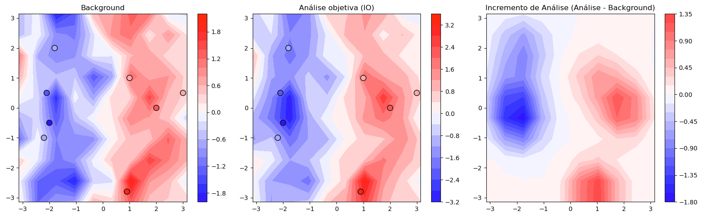
</div>

---

<!-- _footer: "" -->

<!-- Scoped style -->
<style scoped>
section {
  font-size: 21px;
}
.columns {
  display: grid;
  grid-template-columns: repeat(2, minmax(0, 1fr));
  gap: 1rem;
}
</style>

# Histórico da Assimilação de Dados

<br />

## **_Objective Analysis of Meteorological Fields_ (Gandin, 1963)**

### Exemplo 2D 

- Efeitos da escala de correlação $L$:
  - $L=0,7$
  - $\sigma_b = 0,5$ 
  - $\sigma_o = 0,1$
  
<div align="center">
  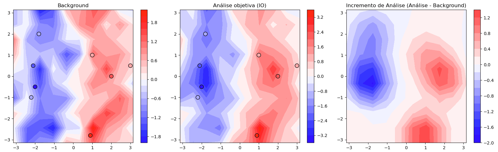
</div>

---

<!-- _footer: "" -->

<!-- Scoped style -->
<style scoped>
section {
  font-size: 21px;
}
.columns {
  display: grid;
  grid-template-columns: repeat(2, minmax(0, 1fr));
  gap: 1rem;
}
</style>

# Histórico da Assimilação de Dados

<br />

## **_Objective Analysis of Meteorological Fields_ (Gandin, 1963)**

### Exemplo 2D 

- Efeitos da escala de correlação $L$:
  - $L=0,8$
  - $\sigma_b = 0,5$ 
  - $\sigma_o = 0,1$
  
<div align="center">
  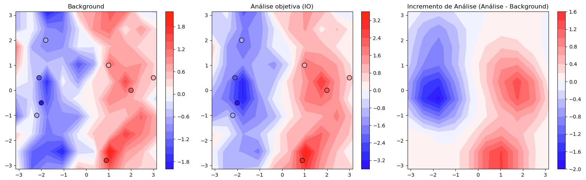
</div>

---

<!-- _footer: "" -->

<!-- Scoped style -->
<style scoped>
section {
  font-size: 21px;
}
.columns {
  display: grid;
  grid-template-columns: repeat(2, minmax(0, 1fr));
  gap: 1rem;
}
</style>

# Histórico da Assimilação de Dados

<br />

## **_Objective Analysis of Meteorological Fields_ (Gandin, 1963)**

### Exemplo 2D 

- Efeitos da escala de correlação $L$:
  - $L=0,9$
  - $\sigma_b = 0,5$ 
  - $\sigma_o = 0,1$
  
<div align="center">
  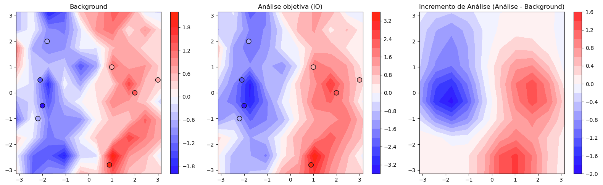
</div>

---

<!-- _footer: "" -->

<!-- Scoped style -->
<style scoped>
section {
  font-size: 21px;
}
.columns {
  display: grid;
  grid-template-columns: repeat(2, minmax(0, 1fr));
  gap: 1rem;
}
</style>

# Histórico da Assimilação de Dados

<br />

## **_Objective Analysis of Meteorological Fields_ (Gandin, 1963)**

### Exemplo 2D 

- Efeitos da escala de correlação $L$:
  - $L=1,0$
  - $\sigma_b = 0,5$ 
  - $\sigma_o = 0,1$
  
<div align="center">
  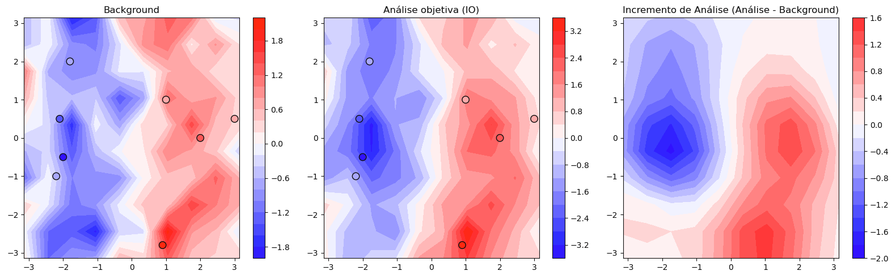
</div>

---

<!-- _footer: "" -->

<!-- Scoped style -->
<style scoped>
section {
  font-size: 21px;
}
.columns {
  display: grid;
  grid-template-columns: repeat(2, minmax(0, 1fr));
  gap: 1rem;
}
</style>

# Histórico da Assimilação de Dados

<br />

## **_Objective Analysis of Meteorological Fields_ (Gandin, 1963)**

### Exemplo 2D 

- Efeitos da amplitude de $\sigma_b$:
  - $L=0,5$
  - $\sigma_b = 0,25$ 
  - $\sigma_o = 0,1$
  
<div align="center">
  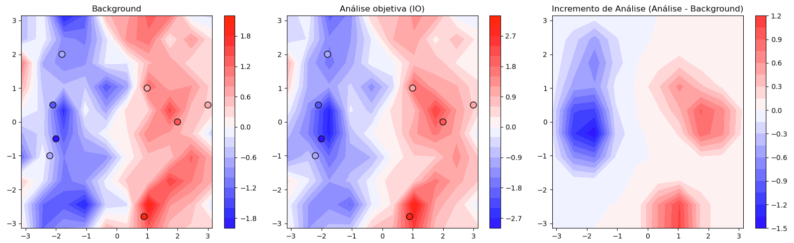
</div>

---

<!-- _footer: "" -->

<!-- Scoped style -->
<style scoped>
section {
  font-size: 21px;
}
.columns {
  display: grid;
  grid-template-columns: repeat(2, minmax(0, 1fr));
  gap: 1rem;
}
</style>

# Histórico da Assimilação de Dados

<br />

## **_Objective Analysis of Meteorological Fields_ (Gandin, 1963)**

### Exemplo 2D 

- Efeitos da amplitude de $\sigma_b$:
  - $L=0,5$
  - $\sigma_b = 0,125$ 
  - $\sigma_o = 0,1$
  
<div align="center">
  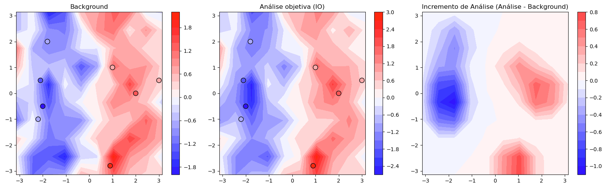
</div>

---

<!-- _footer: "" -->

<!-- Scoped style -->
<style scoped>
section {
  font-size: 21px;
}
.columns {
  display: grid;
  grid-template-columns: repeat(2, minmax(0, 1fr));
  gap: 1rem;
}
</style>

# Histórico da Assimilação de Dados

<br />

## **_Objective Analysis of Meteorological Fields_ (Gandin, 1963)**

### Exemplo 2D 

- Efeitos da amplitude de $\sigma_o$:
  - $L=0,5$
  - $\sigma_b = 0,5$ 
  - $\sigma_o = 0,2$
  
<div align="center">
  
</div>

---

<!-- _footer: "" -->

<!-- Scoped style -->
<style scoped>
section {
  font-size: 21px;
}
.columns {
  display: grid;
  grid-template-columns: repeat(2, minmax(0, 1fr));
  gap: 1rem;
}
</style>

# Histórico da Assimilação de Dados

<br />

## **_Objective Analysis of Meteorological Fields_ (Gandin, 1963)**

### Exemplo 2D 

- Efeitos da amplitude de $\sigma_o$:
  - $L=0,5$
  - $\sigma_b = 0,5$ 
  - $\sigma_o = 0,3$
  
<div align="center">
  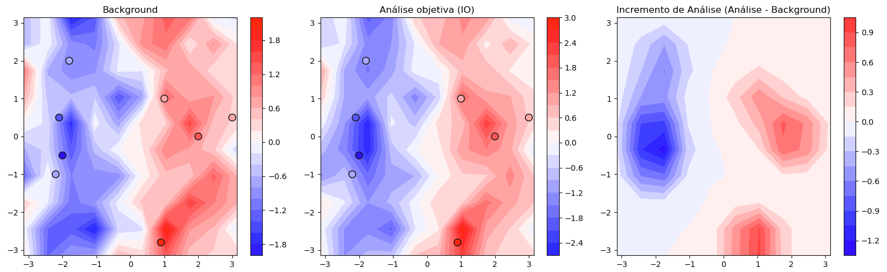
</div>

---

<!-- _footer: "" -->

<!-- Scoped style -->
<style scoped>
section {
  font-size: 21px;
}
.columns {
  display: grid;
  grid-template-columns: repeat(2, minmax(0, 1fr));
  gap: 1rem;
}
</style>

# Histórico da Assimilação de Dados

<br />

## **_Objective Analysis of Meteorological Fields_ (Gandin, 1963)**

### Exemplo 2D 

- Efeitos da amplitude de $\sigma_o$:
  - $L=0,5$
  - $\sigma_b = 0,5$ 
  - $\sigma_o = 0,4$
  
<div align="center">
  
</div>

---

<!-- _footer: "" -->

<!-- Scoped style -->
<style scoped>
section {
  font-size: 21px;
}
.columns {
  display: grid;
  grid-template-columns: repeat(2, minmax(0, 1fr));
  gap: 1rem;
}
</style>

# Histórico da Assimilação de Dados

<br />

## **_Objective Analysis of Meteorological Fields_ (Gandin, 1963)**

### Exemplo 2D 

- Efeitos da amplitude de $\sigma_o$:
  - $L=0,5$
  - $\sigma_b = 0,5$ 
  - $\sigma_o = 0,5$
  
<div align="center">
  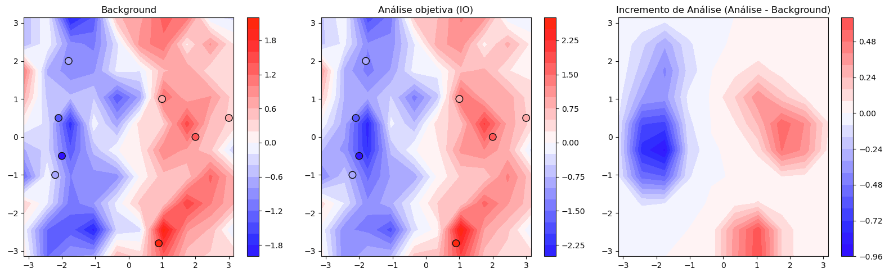
</div>

---

<!-- Scoped style -->
<style scoped>
section {
  font-size: 21px;
}
.columns {
  display: grid;
  grid-template-columns: repeat(2, minmax(0, 1fr));
  gap: 1rem;
}
</style>

# Histórico da Assimilação de Dados

<br />

## **_Objective Analysis of Meteorological Fields_ (Gandin, 1963)**

<br />

🎲 Notebook com <a href="https://colab.research.google.com/github/cfbastarz/MET563-3/blob/main/atividade_05_analise_gandin1963_1d2d.ipynb" target="_blank">Atividade Prática 5</a>

---

<!-- Scoped style -->
<style scoped>
section {
  font-size: 21px;
}
</style>


# :thinking: Dúvidas

<br />
<br />
<br />
<br />
<br />
<br />
<br />

:link: https://cfbastarz.github.io/met563-3/
:octopus: https://github.com/cfbastarz/MET563-3
:email: carlos.bastarz@inpe.br
