<!-- _footer: "" -->

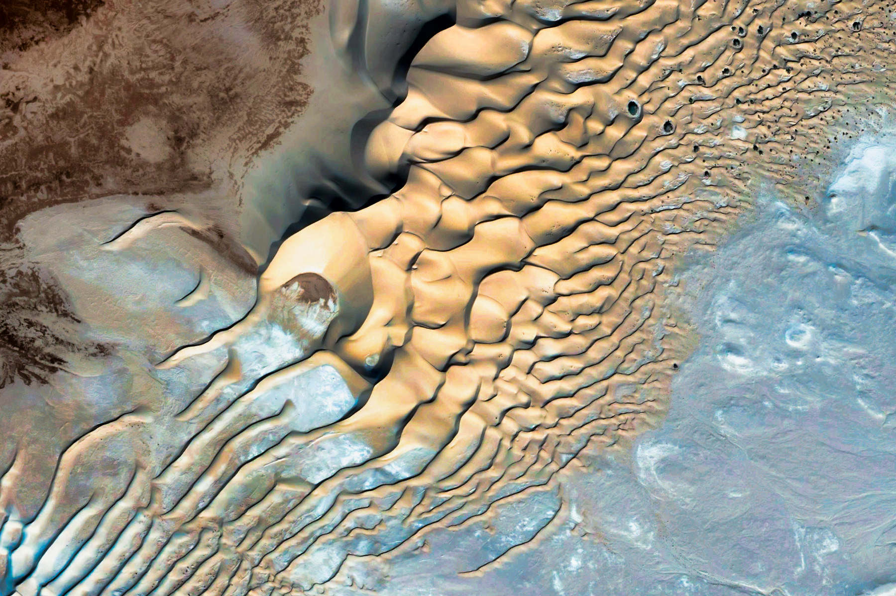

<!-- Scoped style -->
<style scoped>
section {
  font-size: 21px;
}
span.date {
  font-size: 15px;
}
span.program {
  font-size: 18px;
}
</style>

<style>
span.footnote {
    border-top: 0.1em dotted #555;
    font-size: 60%;
    margin-top: auto;
    position:absolute;
    bottom:0;
    width:100%;
    height:60px;    
}

span.footnote2 {
    border-top: 0.1em dotted #555;
    font-size: 60%;
    margin-top: auto;
    position:absolute;
    bottom:0;
    width:100%;
    height:90px;    
}
</style>

# **Introdução à Assimilação de Dados (MET 563-3)**

### Histórico da Assimilação de Dados

<p>Dr. Carlos Frederico Bastarz
<br />
Dr. Dirceu Luis Herdies
<br />
<br />
<span class="program">Programa de Pós-Graduação em Meteorologia (PGMET) do INPE</span>
<br />
<br />
<span class="date">29 de Setembro de 2025</span>
</p>

---

<!-- _class: invert -->

<!-- _backgroundColor: "#000000" -->

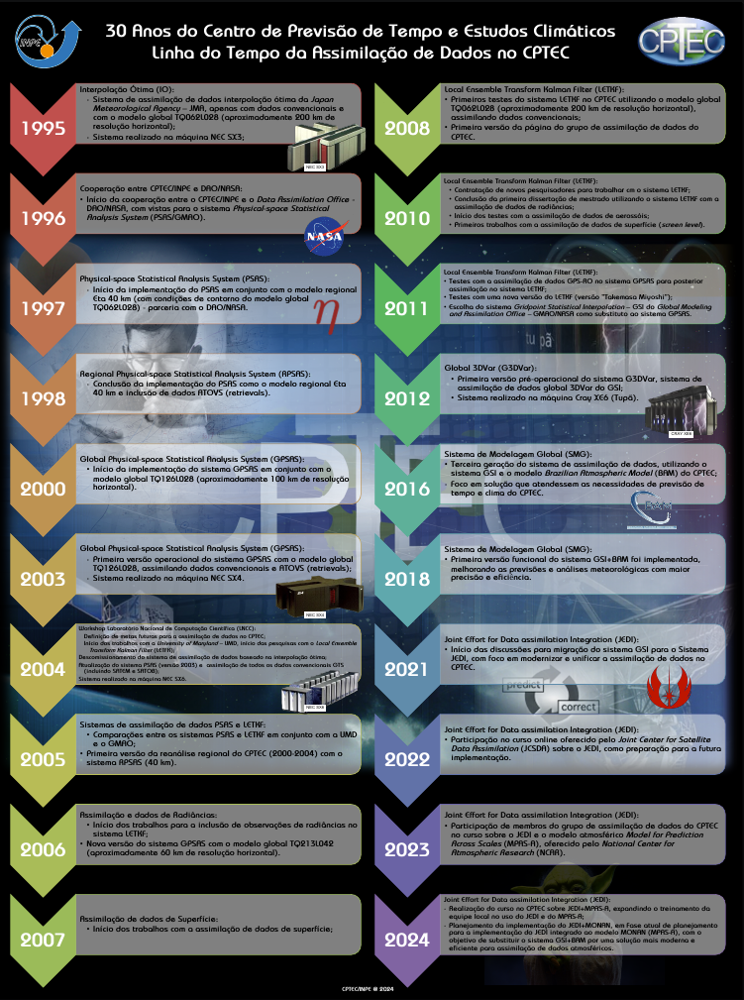

<!-- _footer: "" -->

<!-- Scoped style -->
<style scoped>
section {
  font-size: 21px;
}
.columns {
  display: grid;
  grid-template-columns: repeat(2, minmax(0, 1fr));
  gap: 1rem;
}
</style>

# Histórico da Assimilação de Dados

## **Marcos Históricos no CPTEC 🏠**

- **1995:** Primeiro sistema de AD: Interpolação Ótima
  * Sistema Japonês
- **1997:** Implementação do PSAS<sup>&#128312;</sup>
  * Parceria com o DAO<sup>&#128312;</sup>/NASA
- **2008:** Testes com o LETKF
  * Parceria com a UMD<sup>&#128312;</sup>
- **2012:** Implementação do GSI
  * Parceria com o GMAO<sup>&#128312;</sup>/NASA
- **2025:** Implementação do JEDI
  * Parceria com o NCAR

<span class="footnote2">
<sup>&#128312;</sup>PSAS: <i>Physical-space Statistical Analysis System</i>
<br />
<sup>&#128312;</sup>DAO: <i>Data Assimilation Office</i>
<br />
<sup>&#128312;</sup>UMD: <i>University of Maryland</i>
<br />
<sup>&#128312;</sup>GMAO: <i>Global Modeling and Assimilation Office</i>
</span>
  
---

<!-- _footer: "" -->

<!-- Scoped style -->
<style scoped>
section {
  font-size: 21px;
}
.columns {
  display: grid;
  grid-template-columns: repeat(2, minmax(0, 1fr));
  gap: 1rem;
}
</style>

# Histórico da Assimilação de Dados

<br />

## **Marcos Históricos no Mundo 🌎**

- **Richardson, 1922:** _Weather Prediction by Numerical Process_ (https://x.gd/4ccVg)
  * Primeira tentativa de análise objetiva manual
- **Panofsky, 1949:** _Objective Weather Map Analysis_ (https://x.gd/sBmUk) 
  * Ajuste do campo de análise por meio de um polinômio interpolador global
- **Bergthórsson e Döös, 1955:** _Numerical Weather Map Analysis_ (https://x.gd/qmxVS)
  * Combinação de background e observações
- **Cressman, 1959:** _An Operational Objective Analysis System_ (https://x.gd/DkMuD)
  * Acrescenta raio de influência
- **Gandin, 1963:** _Objective Analysis of Meteorological Fields_ (https://x.gd/TKtbo)
  * Formalização estatística
- **BLUE**<sup>&#128312;</sup> e métodos modernos
  * Modelagem explícita das estatísticas
 
<span class="footnote">
<sup>&#128312;</sup>BLUE: <i>Best Linear Unbiased Estimator</i>
</span> 
 
---

<!-- Scoped style -->
<style scoped>
section {
  font-size: 21px;
}
.columns {
  display: grid;
  grid-template-columns: repeat(2, minmax(0, 1fr));
  gap: 1rem;
}
</style>

# Histórico da Assimilação de Dados
 
<br /> 
  
<div class="columns">
<div>

## **Análise Subjetiva**

<br /> 

- Análise produzida manualmente pelo meteorologista previsor (analista) a partir de observações distribuídas irregularmente
  * Depende muito da experiência e conhecimento físico do analista sobre a atmosfera
  * Muito utilizada até a década de 1950, antes do uso dos computadores digitais para a previsão numérica de tempo
  * Resultados difíceis de reproduzir devido à subjetividade do analista

</div>
<div>

<br /> 
<br /> 
<br /> 
<br /> 

<div align="center">
  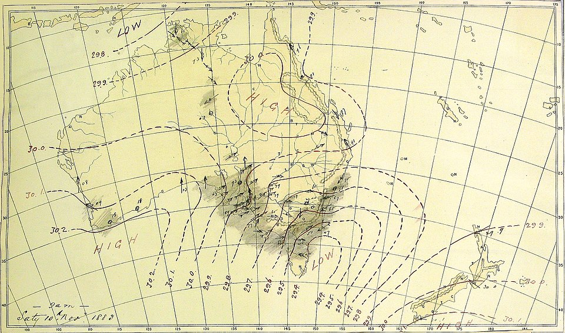
</div> 

</div>
</div>
  
---

<!-- Scoped style -->
<style scoped>
section {
  font-size: 21px;
}
.columns {
  display: grid;
  grid-template-columns: repeat(2, minmax(0, 1fr));
  gap: 1rem;
}
</style>

# Histórico da Assimilação de Dados
 
<div class="columns">
<div>

<br />

## **Análise Objetiva**

<br />

- Análise produzida por meio de algorítmos matemáticos e estatísticos para transformar dados observacionais irregulares em campos regulares (grades)
  * Utiliza métodos estatísticos, interpolação, ponderação por erro e covariância
  * Resultados podem ser reproduzíveis
  * Permite a automatização dos processos e uso em larga escala
  * Reduz a subjetividade
  * Necessidade da modelagem dos erros e correlações espaciais

</div>
<div>

<div align="center">
  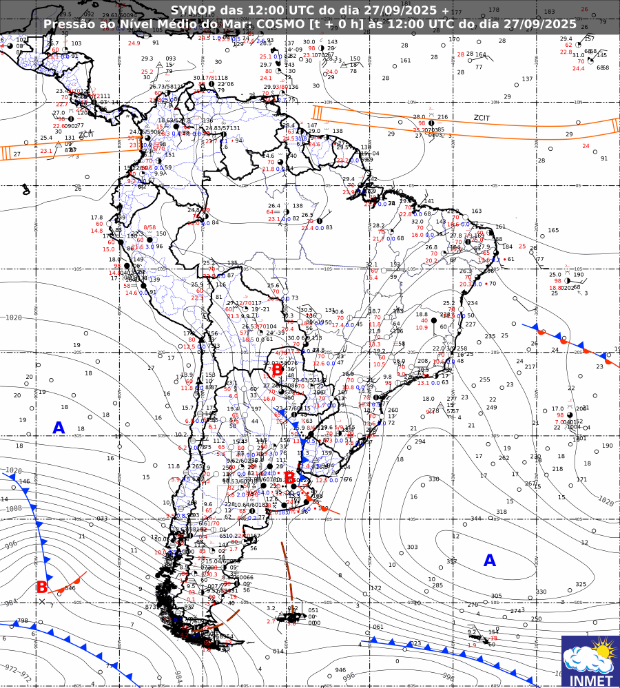
</div> 

</div>
</div>  
  
---
<!-- _footer: "" -->
<!-- Scoped style -->
<style scoped>
section {
  font-size: 21px;
}
.columns {
  display: grid;
  grid-template-columns: repeat(2, minmax(0, 1fr));
  gap: 1rem;
}
</style>

# Histórico da Assimilação de Dados

<div class="columns">
<div>

## **Lewis Fry Richardson**

- **Pioneiro da Previsão Numérica do Tempo:**
  * Propôs usar equações da dinâmica resolvidas numericamente para prever o tempo
  * Resolveu manualmente uma previsão de 6 horas para a pressão atmosférica (levou semanas); o resultado foi ruim, mas revolucionário
- **Fábricas de previsões:**
  * Imaginou centros com centenas de pessoas calculando em paralelo diferentes regiões do planeta
- **Equações numéricas:**
  * Propôs métodos iniciais de discretização das equações atmosféricas (diferenças finitas), uma das sementes do desenvolvimento posterior de modelos como ENIACC

</div>
<div>

<br />

<div align="center">
  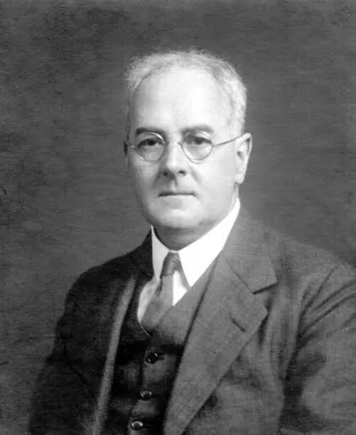
</div> 

</div>
</div>

---


<!-- _header: "https://x.gd/TWX3t" -->
<!-- _footer: "" -->

<!-- Scoped style -->
<style scoped>
section {
  font-size: 21px;
}
.columns {
  display: grid;
  grid-template-columns: repeat(2, minmax(0, 1fr));
  gap: 1rem;
}
</style>

---

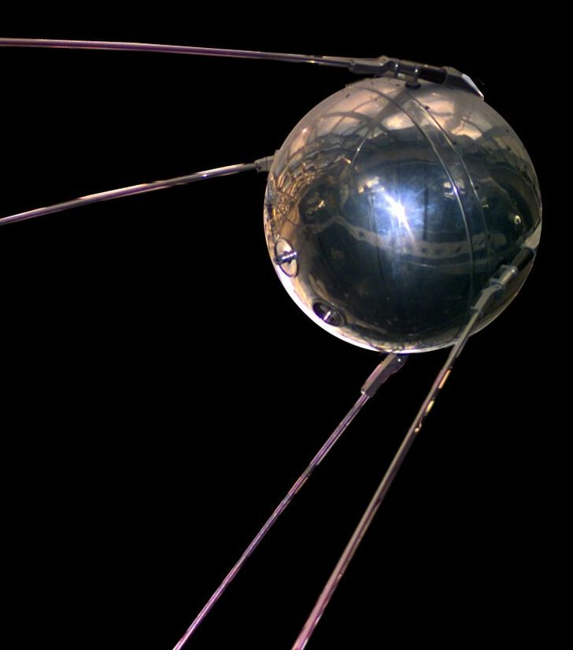

<!-- _footer: "" -->

<!-- Scoped style -->
<style scoped>
section {
  font-size: 21px;
}
.columns {
  display: grid;
  grid-template-columns: repeat(2, minmax(0, 1fr));
  gap: 1rem;
}
</style>

# Histórico da Assimilação de Dados
 
<br /> 

## **O mundo nos anos 1950**

* Pós segunda guerra mundial
* Início da guerra fria
* Primeiros computadores comerciais (UNIVAC - 1951)
  * Transistores já começaram a substituir as válvulas
* Motores a jato chegam à aviação comercial
* Corrida espacial (URSS lança o Sputnik 1 - 1957)
* Criação da NASA - 1958
* Testes com mísseis balísticos

---


<!-- _footer: "" -->

<!-- Scoped style -->
<style scoped>
section {
  font-size: 21px;
}
.columns {
  display: grid;
  grid-template-columns: repeat(2, minmax(0, 1fr));
  gap: 1rem;
}
</style>

# Histórico da Assimilação de Dados
 
<br /> 

## **Tecnologia nos anos 1950**

- Na imagem ao lado, máquina IBM 704 (1954) na NACA<sup>&#128312;</sup> 
  - Fonte: [https://en.wikipedia.org/wiki/IBM_704](https://en.wikipedia.org/wiki/IBM_704)

<span class="footnote">
<sup>&#128312;</sup>NACA: <i>National Advisory Committee for Aeronautics</i>
</span>

---


<!-- _footer: "" -->

<!-- Scoped style -->
<style scoped>
section {
  font-size: 21px;
}
.columns {
  display: grid;
  grid-template-columns: repeat(2, minmax(0, 1fr));
  gap: 1rem;
}
</style>

# Histórico da Assimilação de Dados
 
<br /> 

## **Tecnologia nos anos 1950**

- Na imagem ao lado, exemplo de máquina teletipo utilizada pela NOAA<sup>&#128312;</sup>
  - Fonte: [https://www.galleyrack.com/images/artifice/telegraphy/tty/gallery/noaa/wea01816.jpg](https://www.galleyrack.com/images/artifice/telegraphy/tty/gallery/noaa/wea01816.jpg) 

<span class="footnote">
<sup>&#128312;</sup>NOAA: <i>National Oceanic and Atmospheric Administration</i>
</span>

---

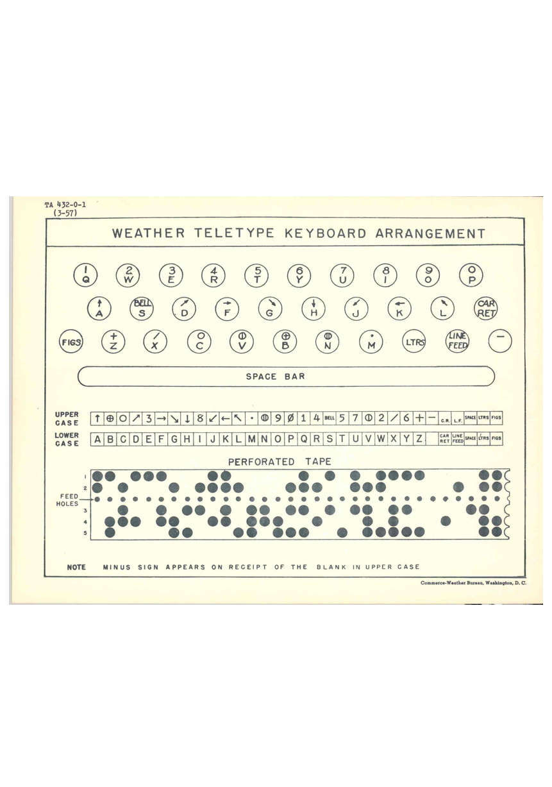

<!-- Scoped style -->
<style scoped>
section {
  font-size: 21px;
}
.columns {
  display: grid;
  grid-template-columns: repeat(2, minmax(0, 1fr));
  gap: 1rem;
}
</style>

# Histórico da Assimilação de Dados
 
<br /> 

## **Tecnologia nos anos 1950**

- Na imagem ao lado, exemplo de mapa de teclado de uma máquina teletipo para uso em previsão de tempo
  - Fonte: [https://upload.wikimedia.org/wikipedia/commons/a/a7/WeatherTeletypeChart.jpg](https://upload.wikimedia.org/wikipedia/commons/a/a7/WeatherTeletypeChart.jpg)

---

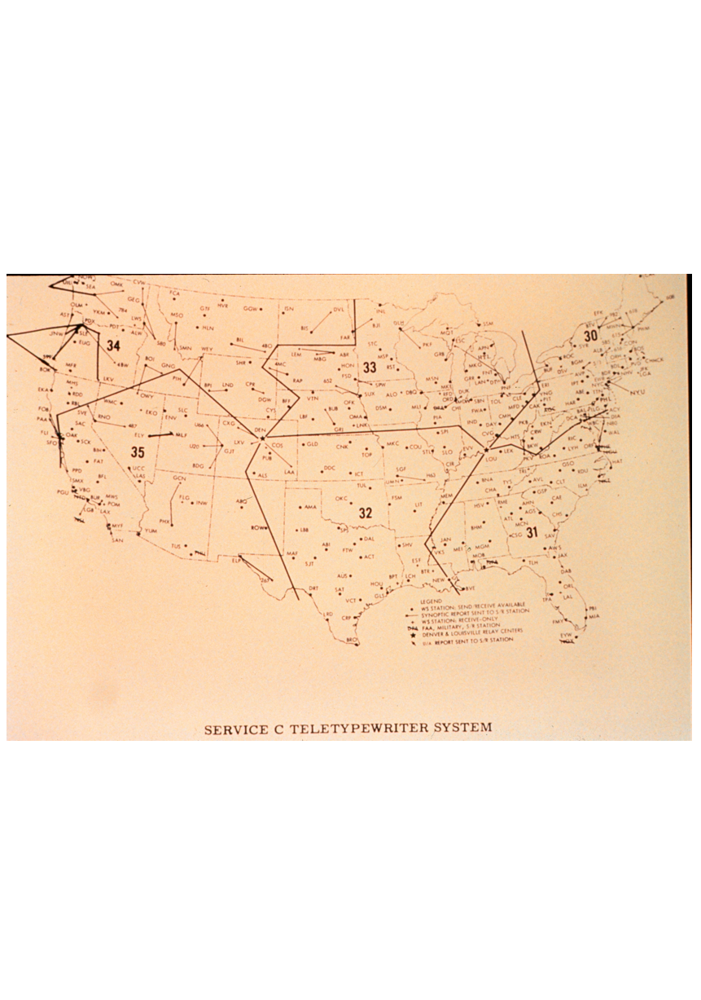


<!-- Scoped style -->
<style scoped>
section {
  font-size: 21px;
}
.columns {
  display: grid;
  grid-template-columns: repeat(2, minmax(0, 1fr));
  gap: 1rem;
}
</style>

# Histórico da Assimilação de Dados
 
<br /> 

## **Tecnologia nos anos 1950**

- Na imagem ao lado, exemplo de uma carta sinótica impressa por uma máquina teletipo
  - Fonte: [https://www.galleyrack.com/images/artifice/telegraphy/tty/gallery/noaa/wea01819.jpg](https://www.galleyrack.com/images/artifice/telegraphy/tty/gallery/noaa/wea01819.jpg)

---

<!-- _footer: "" -->

<!-- Scoped style -->
<style scoped>
section {
  font-size: 21px;
}
.columns {
  display: grid;
  grid-template-columns: repeat(2, minmax(0, 1fr));
  gap: 1rem;
}
</style>

# Histórico da Assimilação de Dados
 
<br /> 

## **Até 1954**

* Primeiros experimentos em PNT foram realizados por meio da **análise subjetiva** (interpolação manual das observações em ponto de grade)
* Primeiras tentativas de **análise objetiva** (interpolação matemática das observações):
  * Panofsky, 1949: polonômio "global" (o mesmo polinômio é usado em toda a grade)
  * Gilchrist e Cressman (1954): polinômio "local" (um polinômio é definido para cada ponto de grade)

<div class="columns">
<div>

<br />
  
## **A partir de 1955**

* Início da previsão numérica de tempo operacional
* Ano de lançamento da primeira máquina lançada pela IBM<sup>&#128312;</sup>

</div>
<div>

<br />
<br />

<div style="
  background-color: #dbf8d5; 
  color: #1d721f; 
  padding: 20px; 
  border-radius: 10px; 
  text-align: center;
  max-width: 600px;
  margin: 0 auto;
  margin-top:20px;
  font-size: 18px;
">
Como automatizar o procedimento de análise objetiva e torná-lo operacional (baixo tempo de computação e erro comparável com a da análise subjetiva)?
</div>   

</div>
</div>

<span class="footnote">
<sup>&#128312;</sup>IBM: <i>International Business Machines Corporation</i>
</span>  

---

<!-- _footer: "" -->

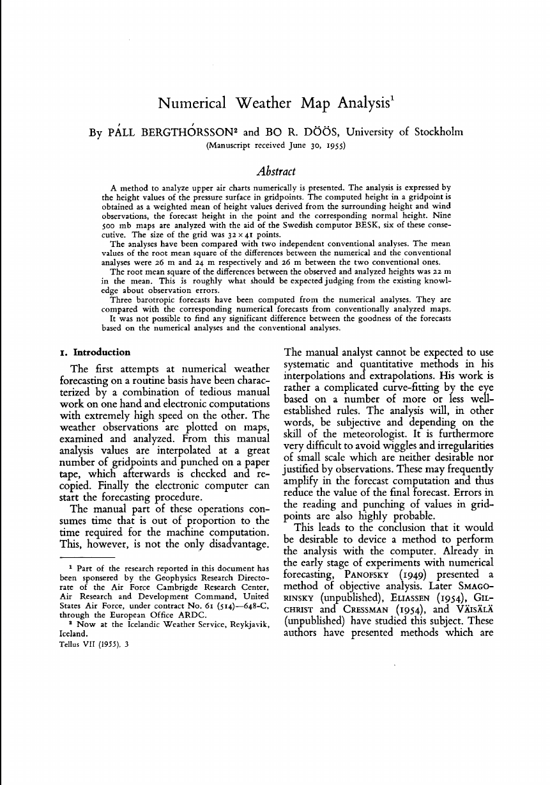

<!-- Scoped style -->
<style scoped>
section {
  font-size: 21px;
}
.columns {
  display: grid;
  grid-template-columns: repeat(2, minmax(0, 1fr));
  gap: 1rem;
}
</style>

# Histórico da Assimilação de Dados
 
## **_Numerical Weather Map Analysis_ (Bergthórsson e Döös, 1955)**

### Características Principais

* Novo método para a análise (objetiva) meteorológical espacial
* Automatiza o processo de análise objetiva de forma rápida e eficiente (se comparada com análise subjetiva convencional)
* Precursor do método de correções sucessivas
* Necessidade de um background ou climatologia ou uma combinação de ambos

---


<!-- _footer: "" -->

<!-- Scoped style -->
<style scoped>
section {
  font-size: 21px;
}
.columns {
  display: grid;
  grid-template-columns: repeat(2, minmax(0, 1fr));
  gap: 1rem;
}
</style>

# Histórico da Assimilação de Dados

## **_Numerical Weather Map Analysis_ (Bergthórsson e Döös, 1955)**

### Características Principais

* Pesos empíricos são atribuídos ao background e observações (função da distância entre o ponto de grade e ponto da observação)
* Erros não correlacionados entre background e observações
* Erro do background é homogêneo (igual em todos os pontos de grade) e a variância é independente do local
* O erro da observação é espacialmente não correlacionado (cada estação tem o seu erro) e é uma função apenas do erro do instrumento

---

<!-- _footer: "" -->

<!-- Scoped style -->
<style scoped>
section {
  font-size: 21px;
}
.columns {
  display: grid;
  grid-template-columns: repeat(2, minmax(0, 1fr));
  gap: 1rem;
}
</style>

# Histórico da Assimilação de Dados
 
## **_Numerical Weather Map Analysis_ (Bergthórsson e Döös, 1955)**

<br />

### Detalhes da formulação (seguindo Daley, 1991<sup>&#128312;</sup>)

<br />

- Considere uma única observação no ponto $\mathbf{r}_{k}$
- Considere duas estimativas de $f$ no ponto de grade $\mathbf{r}_{i}$:

$$
f_{B}(\mathbf{r}_{i})
$$

$$
f_{B}(\mathbf{r}_{i}) + [f_{O}(\mathbf{r}_{k}) - f_{B}(\mathbf{r}_{k})]
$$

- Onde,
  - $f_{B}(\mathbf{r}_{i})$ é o background no ponto de grade $\mathbf{r}_{i}$
  - $f_{O}(\mathbf{r}_{k}) - f_{B}(\mathbf{r}_{k})$ é a diferença entre a observação $f_{O}(\mathbf{r}_{k})$ e o background $f_{B}(\mathbf{r}_{k})$, sendo esta diferença constante ao longo da curva que une os pontos de grade $\mathbf{r}_{k}$ e $\mathbf{r}_{i}$  

<span class="footnote">
<sup>&#128312;</sup>Daley, R. "Atmospheric Data Analysis". Cambridge Atmospheric And Space Science Series, 1991. pp. 64-69.
</span>

---

<!-- _footer: "" -->

<!-- Scoped style -->
<style scoped>
section {
  font-size: 21px;
}
.columns {
  display: grid;
  grid-template-columns: repeat(2, minmax(0, 1fr));
  gap: 1rem;
}
</style>

# Histórico da Assimilação de Dados
 
<br /> 

## **_Numerical Weather Map Analysis_ (Bergthórsson e Döös, 1955)**

<br /> 

### Detalhes da formulação (seguindo Daley, 1991<sup>&#128312;</sup>)

- A análise de Bergthórsson e Döös combina estas duas estimativas da seguinte forma:

$$
f_{A}(\mathbf{r}_{i}) = f_{B}(\mathbf{r}_{i}) + W[f_{O}(\mathbf{r}_{k}) - f_{B}(\mathbf{r}_{k})]
$$

$$
W = \frac{E_{O}^{-2}(k)w(\mathbf{r}_{k} - \mathbf{r}_{i})}{E_{B}^{-2}+E_{O}^{-2}(k)w(\mathbf{r}_{k} - \mathbf{r}_{i})}
$$

<br />

- O que acontece quanto às posições relativas do ponto de estação e do ponto de grade:
  * Quando $\mathbf{r}_{k} = \mathbf{r}_{i}$ (pontos de grade e estação coincidem), então $w(\mathbf{r}_{k}-\mathbf{r}_{i}) = 1$
  * Quando $|\mathbf{r}_{k} - \mathbf{r}_{i}| \to \infty$ (distância entre os pontos aumenta), então $w(\mathbf{r}_{k}-\mathbf{r}_{i}) \to 0$

<span class="footnote">
<sup>&#128312;</sup>Daley, R. "Atmospheric Data Analysis". Cambridge Atmospheric And Space Science Series, 1991. pp. 64-69.
</span>

---

<!-- Scoped style -->
<style scoped>
section {
  font-size: 21px;
}
.columns {
  display: grid;
  grid-template-columns: repeat(2, minmax(0, 1fr));
  gap: 1rem;
}
</style>

# Histórico da Assimilação de Dados
 
<br /> 

## **_Numerical Weather Map Analysis_ (Bergthórsson e Döös, 1955)** 

<br />

<div class="columns">
<div>

<br />

### Exemplo 1D

<br />

- Considere um modelo matemático simples:

$$
f(\mathbf{x}) = \sin(\mathbf{x}) + \varepsilon, \quad \varepsilon \sim \mathcal{N}(0, \sigma^2), \quad -\pi \le \mathbf{x} \le \pi
$$

- A função seno com a adição de um ruído normalmente distribuído

</div>
<div>

<br />

<div align="center">
  
</div> 

</div>
</div> 

---

<!-- Scoped style -->
<style scoped>
section {
  font-size: 21px;
}
.columns {
  display: grid;
  grid-template-columns: repeat(2, minmax(0, 1fr));
  gap: 1rem;
}
</style>

# Histórico da Assimilação de Dados
 
<br /> 

## **_Numerical Weather Map Analysis_ (Bergthórsson e Döös, 1955)** 

<br /> 

### Exemplo 1D

- Dentro do domínio do nosso modelo, definimos algumas observações, junto com as suas posições (ambos arbitrários):

```
# Posições

obs_pos = np.array([-2.2, -2.1, -2.0, -1.8, 0.9, 1, 2, 3])
```

```
# Valores medidos

obs_vals = np.array([-2.2, -1.8, 0.9, 0, 1, 2, 3, 4])  
```

---

<!-- Scoped style -->
<style scoped>
section {
  font-size: 21px;
}
.columns {
  display: grid;
  grid-template-columns: repeat(2, minmax(0, 1fr));
  gap: 1rem;
}
</style>

# Histórico da Assimilação de Dados
 
<br /> 

## **_Numerical Weather Map Analysis_ (Bergthórsson e Döös, 1955)** 

<br /> 

### Exemplo 1D

- Definiremos uma função peso Gaussiana simplificada que terá o mesmo efeito proposto por Bergthórsson e Döös (1955)
- $L$ é o desvio-padrão e sua função é a de modular a influência das observações na análise

```
def weight(dx, L=L):
    return np.exp(-(dx**2)/(2*L**2))
```

---

<!-- Scoped style -->
<style scoped>
section {
  font-size: 21px;
}
.columns {
  display: grid;
  grid-template-columns: repeat(2, minmax(0, 1fr));
  gap: 1rem;
}
</style>

# Histórico da Assimilação de Dados
 
<br /> 

## **_Numerical Weather Map Analysis_ (Bergthórsson e Döös, 1955)** 

### Exemplo 1D

- Inicializamos a análise como sendo o background
- Aplicamos a função para cada observação contida dentro do domínio
- A depender o valor de $L$, a análise resultante será mais ou menos influenciada pelas observações

```
# Inicializa análise como background

xa = xb.copy()


# Aplica a correção observação por observação

for xo, yo in zip(obs_pos, obs_vals):
    dx = x - xo
    w = weight(dx, L=L)
    xa = (1-w)*xa + w*yo
```

---

<!-- Scoped style -->
<style scoped>
section {
  font-size: 21px;
}
.columns {
  display: grid;
  grid-template-columns: repeat(2, minmax(0, 1fr));
  gap: 1rem;
}
</style>

# Histórico da Assimilação de Dados
 
<br /> 

## **_Numerical Weather Map Analysis_ (Bergthórsson e Döös, 1955)** 

### Exemplo 1D

- $L = 0,01$ 

<div align="center">
  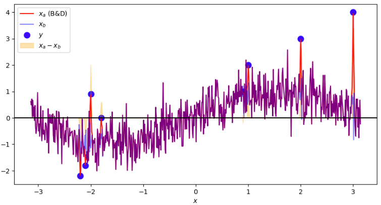
</div>

---

<!-- Scoped style -->
<style scoped>
section {
  font-size: 21px;
}
.columns {
  display: grid;
  grid-template-columns: repeat(2, minmax(0, 1fr));
  gap: 1rem;
}
</style>

# Histórico da Assimilação de Dados
 
<br /> 

## **_Numerical Weather Map Analysis_ (Bergthórsson e Döös, 1955)** 

### Exemplo 1D

- $L = 0,1$ 

<div align="center">
  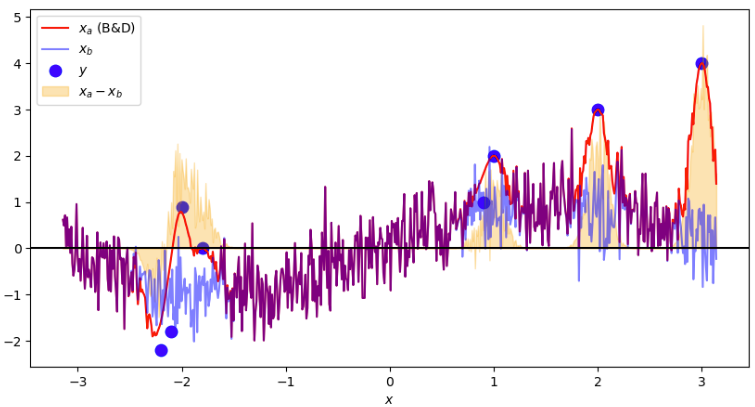
</div>

---

<!-- Scoped style -->
<style scoped>
section {
  font-size: 21px;
}
.columns {
  display: grid;
  grid-template-columns: repeat(2, minmax(0, 1fr));
  gap: 1rem;
}
</style>

# Histórico da Assimilação de Dados
 
<br /> 

## **_Numerical Weather Map Analysis_ (Bergthórsson e Döös, 1955)** 

### Exemplo 1D

- $L = 0,5$ 

<div align="center">
  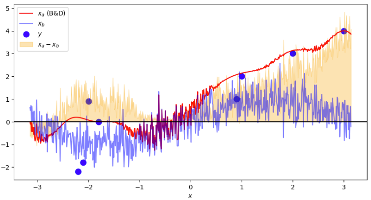
</div>

---

<!-- Scoped style -->
<style scoped>
section {
  font-size: 21px;
}
.columns {
  display: grid;
  grid-template-columns: repeat(2, minmax(0, 1fr));
  gap: 1rem;
}
</style>

# Histórico da Assimilação de Dados
 
<br /> 

## **_Numerical Weather Map Analysis_ (Bergthórsson e Döös, 1955)** 

### Exemplo 1D

- $L = 1$ 

<div align="center">
  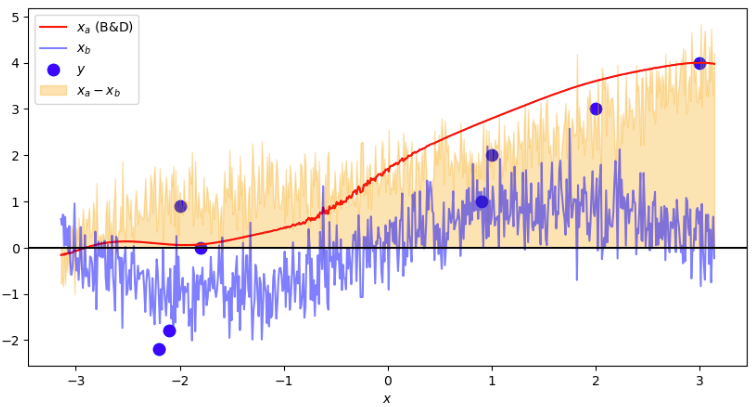
</div>

---

<!-- Scoped style -->
<style scoped>
section {
  font-size: 21px;
}
.columns {
  display: grid;
  grid-template-columns: repeat(2, minmax(0, 1fr));
  gap: 1rem;
}
</style>

# Histórico da Assimilação de Dados
 
<br /> 

## **_Numerical Weather Map Analysis_ (Bergthórsson e Döös, 1955)** 

<br />

<div class="columns">
<div>

<br />

### Exemplo 2D

<br />

- Considere um modelo matemático simples:

$$
f(\mathbf{x, y}) = \sin(\mathbf{x}) + \varepsilon, \quad \varepsilon \sim \mathcal{N}(0, \sigma^2), \quad -\pi \le \mathbf{x} \le \pi, \quad -\pi \le \mathbf{y} \le \pi
$$

- A função seno com a adição de um ruído normalmente distribuído
- Definimos um plano Cartesiano de 100 pontos onde esta função será aplicada

</div>
<div>

<div align="center">
  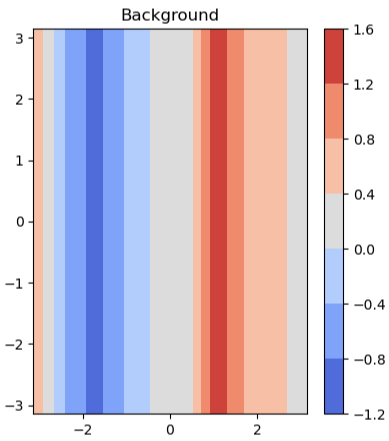
</div> 

</div>
</div> 

---

<!-- Scoped style -->
<style scoped>
section {
  font-size: 21px;
}
.columns {
  display: grid;
  grid-template-columns: repeat(2, minmax(0, 1fr));
  gap: 1rem;
}
</style>

# Histórico da Assimilação de Dados
 
<br /> 

## **_Numerical Weather Map Analysis_ (Bergthórsson e Döös, 1955)** 

<br />

### Exemplo 2D

- Iniciamos com a definição do domínio e da malha onde o modelo será aplicado:

```
lon = np.linspace(-np.pi, np.pi, 10)
lat = np.linspace(-np.pi, np.pi, 10)

LON, LAT = np.meshgrid(lon, lat)
```

---

<!-- Scoped style -->
<style scoped>
section {
  font-size: 21px;
}
.columns {
  display: grid;
  grid-template-columns: repeat(2, minmax(0, 1fr));
  gap: 1rem;
}
</style>

# Histórico da Assimilação de Dados
 
<br /> 

## **_Numerical Weather Map Analysis_ (Bergthórsson e Döös, 1955)** 

<br />

### Exemplo 2D

- Resolvemos o modelo para todos os pontos do domínio, somando o ruído normalmente distribuído ao final:

```
xb_seno = np.sin(LON)

sigma = 0.5  # desvio-padrão do ruído
ruido = np.random.randn(len(LON)) * sigma 

xb = xb_seno + ruido
```

---

<!-- Scoped style -->
<style scoped>
section {
  font-size: 21px;
}
.columns {
  display: grid;
  grid-template-columns: repeat(2, minmax(0, 1fr));
  gap: 1rem;
}
</style>

# Histórico da Assimilação de Dados
 
<br /> 

## **_Numerical Weather Map Analysis_ (Bergthórsson e Döös, 1955)** 

<br />

### Exemplo 2D

- Em seguida, determinamos junto com a sua posição, algumas observações a serem consideradas dentro do domínio:

```
# Posições

obs_locs = np.array([[-2, -2],
                    [0, 0],
                    [2, 2]])
```

```
# Valores medidos

obs_vals = np.array([-1.5, -1.0, 0.5])
```

---

<!-- Scoped style -->
<style scoped>
section {
  font-size: 21px;
}
.columns {
  display: grid;
  grid-template-columns: repeat(2, minmax(0, 1fr));
  gap: 1rem;
}
</style>

# Histórico da Assimilação de Dados
 
<br /> 

## **_Numerical Weather Map Analysis_ (Bergthórsson e Döös, 1955)** 

<br />

### Exemplo 2D

- Definiremos uma função peso Gaussiana simplificada que terá o mesmo efeito proposto por Bergthórsson e Döös (1955)
- $L$ é o desvio-padrão e sua função é a de modular a influência das observações na análise

```
def weight(dx, dy, L=L):    
    return np.exp(-(dx**2 + dy**2)/(2*L**2))
```
   
---

<!-- Scoped style -->
<style scoped>
section {
  font-size: 21px;
}
.columns {
  display: grid;
  grid-template-columns: repeat(2, minmax(0, 1fr));
  gap: 1rem;
}
</style>

# Histórico da Assimilação de Dados
 
<br /> 

## **_Numerical Weather Map Analysis_ (Bergthórsson e Döös, 1955)** 

### Exemplo 2D

- Inicializamos a análise com sendo o background
- Aplicamos a função para cada observação contida dentro do domínio
- A depender do valor de $L$, a análise resultante será mais ou menos influenciada pelas observações
  
```   
# Inicializa a análise como background

xa = xb.copy()


# Aplica a correção observação por observação

for (xo, yo), obs in zip(obs_locs, obs_vals):
    dx = LON - xo
    dy = LAT - yo
    w = weight(dx, dy, L=L) 
    xa = (1-w) * xa + w * obs
```    

---

<!-- Scoped style -->
<style scoped>
section {
  font-size: 21px;
}
.columns {
  display: grid;
  grid-template-columns: repeat(2, minmax(0, 1fr));
  gap: 1rem;
}
</style>

# Histórico da Assimilação de Dados
 
<br /> 

## **_Numerical Weather Map Analysis_ (Bergthórsson e Döös, 1955)** 

### Exemplo 2D

- $L = 0,1$

<div align="center">
  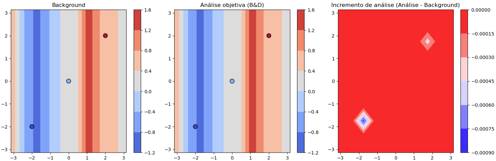
</div> 

---

<!-- Scoped style -->
<style scoped>
section {
  font-size: 21px;
}
.columns {
  display: grid;
  grid-template-columns: repeat(2, minmax(0, 1fr));
  gap: 1rem;
}
</style>

# Histórico da Assimilação de Dados
 
<br /> 

## **_Numerical Weather Map Analysis_ (Bergthórsson e Döös, 1955)** 

### Exemplo 2D

- $L = 0,5$

<div align="center">
  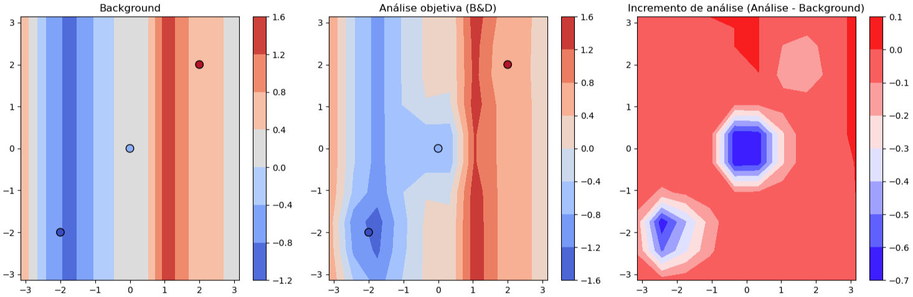
</div> 

---

<!-- Scoped style -->
<style scoped>
section {
  font-size: 21px;
}
.columns {
  display: grid;
  grid-template-columns: repeat(2, minmax(0, 1fr));
  gap: 1rem;
}
</style>

# Histórico da Assimilação de Dados
 
<br /> 

## **_Numerical Weather Map Analysis_ (Bergthórsson e Döös, 1955)** 

### Exemplo 2D

- $L = 1$

<div align="center">
  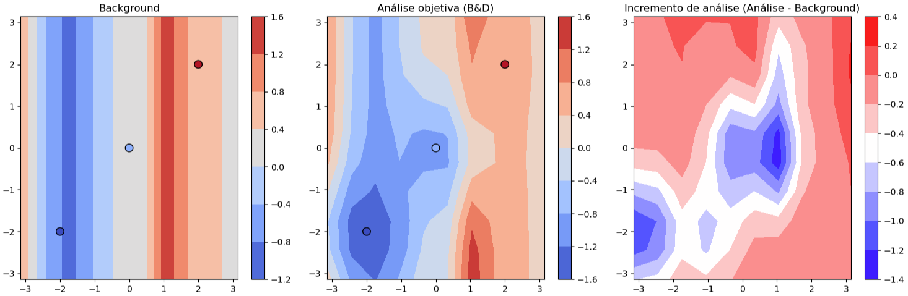
</div> 

---

<!-- Scoped style -->
<style scoped>
section {
  font-size: 21px;
}
.columns {
  display: grid;
  grid-template-columns: repeat(2, minmax(0, 1fr));
  gap: 1rem;
}
</style>

# Histórico da Assimilação de Dados
 
<br /> 

## **_Numerical Weather Map Analysis_ (Bergthórsson e Döös, 1955)** 

### Exemplo 2D

- $L = 1,5$

<div align="center">
  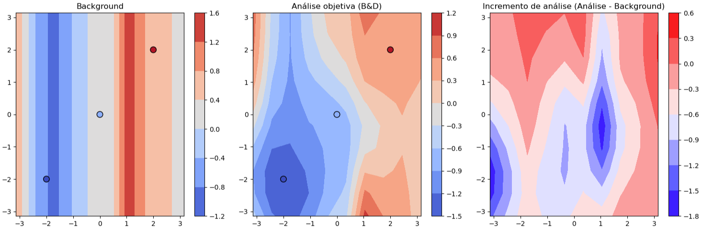
</div> 

---

<!-- Scoped style -->
<style scoped>
section {
  font-size: 21px;
}
.columns {
  display: grid;
  grid-template-columns: repeat(2, minmax(0, 1fr));
  gap: 1rem;
}
</style>

# Histórico da Assimilação de Dados
 
<br /> 

## **_Numerical Weather Map Analysis_ (Bergthórsson e Döös, 1955)** 

<br />

🎲 Notebook com <a href="https://colab.research.google.com/github/cfbastarz/MET563-3/blob/main/atividade_03_analise_bd1955_1d2d.ipynb" target="_blank">Atividade Prática 3</a>

---

<!-- Scoped style -->
<style scoped>
section {
  font-size: 21px;
}
</style>


# :thinking: Dúvidas

<br />
<br />
<br />
<br />
<br />
<br />
<br />

:link: https://cfbastarz.github.io/met563-3/
:octopus: https://github.com/cfbastarz/MET563-3
:email: carlos.bastarz@inpe.br
