<!-- _footer: "" -->


<!-- Scoped style -->
<style scoped>
section {
  font-size: 21px;
}
span.date {
  font-size: 15px;
}
span.program {
  font-size: 18px;
}
</style>

<style>
span.footnote {
    border-top: 0.1em dotted #555;
    font-size: 60%;
    margin-top: auto;
    position:absolute;
    bottom:0;
    width:100%;
    height:60px;    
}

span.footnote2 {
    border-top: 0.1em dotted #555;
    font-size: 60%;
    margin-top: auto;
    position:absolute;
    bottom:0;
    width:100%;
    height:90px;    
}
</style>

# **Introdução à Assimilação de Dados (MET 563-3)**

### Método Variacional - Parte (I)II

<p>Dr. Carlos Frederico Bastarz
<br />
Dr. Dirceu Luis Herdies
<br />
<br />
<span class="program">Programa de Pós-Graduação em Meteorologia (PGMET) do INPE</span>
<br />
<br />
<span class="date">30 de Outubro de 2025</span>
</p>


---

<!-- Scoped style -->
<style scoped>
section {
  font-size: 21px;
}
.columns {
  display: grid;
  grid-template-columns: repeat(2, minmax(0, 1fr));
  gap: 1rem;
}
</style>

# Método Variacional 

<br />

## **Sumário**

<br />

<div class="columns">
<div>

### Parte I

1. Cálculo variacional 
2. Revisão de Álgebra Linear (Matrizes) 
3. Introdução ao método 3DVar 
  3.1 Filtragem Vs. Suavização
  3.2 Histórico e desenvolvimento
  3.3 Formulação Matemática do 3DVar
  3.4 Características principais
  3.5 O Ciclo de Assimilação de Dados
  3.6 _Physical-space Statistical Analysis System_ (PSAS)
  3.7 _First Guess at Apropriate Time_ (FGAT)

</div>
<div>

### Parte II

4. Componentes 
  4.1 Método de minimização do Gradiente Descendente
  4.2 Matriz de covariâncias dos Erros de Previsão
  ~~4.3 Modelo de Transferência Radiativa~~
  ~~4.4 Controle de Qualidade~~ 
5. Visão geral sobre o método 4DVar 
6. Atividades realizadas no CPTEC com o método variacional 

</div>
</div>

---

<!-- _footer: "" -->

<!-- Scoped style -->
<style scoped>
section {
  font-size: 21px;
}
.columns {
  display: grid;
  grid-template-columns: repeat(2, minmax(0, 1fr));
  gap: 1rem;
}
</style>

# Método Variacional - Parte I

<br />

## **3. Introdução ao Método 3DVar**

<br />

* O 3DVar é uma das primeiras aplicações do cálculo variacional em meteorologia
  * **Objetivo:** combinar previsão do modelo e observações para obter a melhor estimativa do estado atmosférico
  
* **Função Custo:**
  $$
  J(\mathbf{x}) =
  \frac{1}{2}(\mathbf{x} - \mathbf{x}_b)^{\text{T}}\mathbf{B}^{-1}(\mathbf{x} - \mathbf{x}_b)

  + \frac{1}{2}[\mathbf{y}_o - H(\mathbf{x})]^{\text{T}}\mathbf{R}^{-1}[\mathbf{y}_o - H(\mathbf{x})]
  $$
* **Gradiente:**
  $$
  \nabla J(\mathbf{x}) = (\mathbf{B}^{-1}+\mathbf{H}^\text{T}\mathbf{R}^{-1}\mathbf{H})(\mathbf{x}-\mathbf{x}_b) - (\mathbf{H}^\text{T}\mathbf{R}^{-1}) [\mathbf{y}_{o}-H(\mathbf{x}_b)] = 0
  $$
* **Solução Analítica Exata:**<sup>&#128312;</sup>
  $$
  \mathbf{x}_a = \mathbf{x}_b + \mathbf{W}[\mathbf{y}_o - H(\mathbf{x}_b)], \quad \mathbf{W} = \mathbf{BH}^{\text{T}}(\mathbf{HBH}^{\text{T}}+\mathbf{R})^{-1}
  $$
  
<span class="footnote">
👉 O 3DVar foi implementado operacionalmente no ECMWF em 1996 e foi substituído pelo 4DVar em 1997; 👉 No CPTEC, o 3DVar começou a ser aplicado em 1997
<br />
<sup>&#128312;</sup>Utilizando a identidade de Sherman-Morrison-Woodburry
</span>

---

<!-- Scoped style -->
<style scoped>
section {
  font-size: 21px;
}
.columns {
  display: grid;
  grid-template-columns: repeat(2, minmax(0, 1fr));
  gap: 1rem;
}
</style>

# Método Variacional - Parte I

<br />

## **3. Introdução ao Método 3DVar**

<br />

### 3.1 Filtragem Vs. Suavização

<br />

- **Filtragem:**
  * Quando o estado do sistema é atualizado a cada passo de tempo, incorporando novas informações (e.g., IO, 3DVar, EnKF)
  
- **Suavização:**
  * Quando a atualização do estado do sistema depende de toda a informação, durante todo o período de atualização (e.g., 4DVar)

- **4DDA:**
  * _Four Dimentional Data Assimilation_ - leva em conta a variação temporal e espacial dos dados observados durante um intervalo de tempo (e.g., FGAT, 4DVar)
  
---

<!-- _footer: "" -->

<!-- Scoped style -->
<style scoped>
section {
  font-size: 21px;
}
.columns {
  display: grid;
  grid-template-columns: repeat(2, minmax(0, 1fr));
  gap: 1rem;
}
</style>

# Método Variacional - Parte I

<br />

## **3. Introdução ao Método 3DVar**

<br />

### 3.2 Histórico e Desenvolvimento

<br />

* Décadas de 1970–1980: Ideia variacional começa a ser aplicada à meteorologia
* Década de 1990: implementação do 3DVar no ECMWF e do PSAS<sup>&#128312;</sup> na NASA
* Motivação: superar as limitações da Interpolação Ótima
  * IO: Atualiza o background ponto a ponto, combinações locais entre previsão e observação 
  * 3DVar: Minimiza a função custo de forma global e possui estrutura matricial
  * 4DVar: Extende o 3DVar no tempo e considera a dinâmica do modelo
  
<span class="footnote2">
<sup>&#128312;</sup>PSAS: <i>Physical-space Statistical Analysis System</i>
</span>

---

<!-- _footer: "" -->

<!-- Scoped style -->
<style scoped>
section {
  font-size: 18px;
}
.columns {
  display: grid;
  grid-template-columns: repeat(2, minmax(0, 1fr));
  gap: 1rem;
}
</style>

# Método Variacional - Parte I

<br />

## **3. Introdução ao Método 3DVar**

<br />

### 3.2 Histórico e Desenvolvimento

<div class="columns">
<div>

- Evolução do skill da previsão da altura geopotencial em 500 hPa:
  * No início dos anos 1980, a previsão de 7 dias para o Hemisfério Norte, o skill da previsão não chegava a 50%, sendo inferior a 40% no Hemisfério Sul
  * Com o tempo, a diferença do skill entre os hemisférios diminuiu drasticamente, sendo muito próximos a partir dos anos 2000
  * Apenas a partir da metade dos anos 1990, a previsão de 10 dias começa a atingir algum skill (~30%)...
  * Atualmente, a previsão de 10 dias já alcança skill de 50% para ambos os hemisférios
  * Embora a melhoria tenha sido importante, parece que o skill das previsões mais curtas está alcançando o seu limite - **por que?**

</div>
<div>

<br />
<br />


<div align="center">
  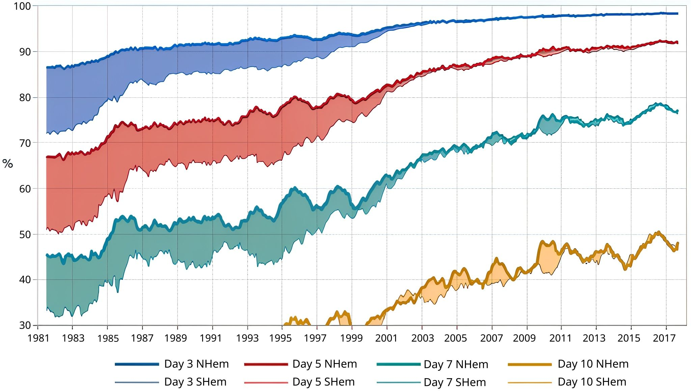
</div>

</div>
</div>

---

<!-- _footer: "" -->

<!-- Scoped style -->
<style scoped>
section {
  font-size: 17px;
}
.columns {
  display: grid;
  grid-template-columns: repeat(2, minmax(0, 1fr));
  gap: 1rem;
}
</style>

# Método Variacional - Parte I

<br />

## **3. Introdução ao Método 3DVar**

### 3.3 Formulação Matemática do 3DVar<sup>&#128312;</sup>    
  
- Hipóteses:
  * O erro do background $\epsilon_b = x_b - x_t$ ($x_t$ é o estado verdadeiro, gaussiano - média zero e covariância $\mathbf{B}$)
      $$
        p(x_t|x_b) \propto \text{exp} \bigg[-\frac{1}{2}(x_t - x_b)^\text{T}\mathbf{B}^{-1}(x_t-x_b)\bigg]
      $$
      
  * O erro da observação $\epsilon_o = y_o - H(x_t)$ (gaussiano - média zero e covariância $\mathbf{R}$)    
      $$
        p(y_o|x_b) \propto \text{exp} \bigg\{-\frac{1}{2}[y_o-H(x_t)]^\text{T}\mathbf{R}^{-1}[y_o-H(x_t)]\bigg\}
      $$  
    
* Pelo Teorema de Bayes, temos:

    $$
      p(x|y_o) \propto p(y_o|x)p(x)
    $$      

  * Onde:
    * $p(y_o|x)$ é a verossimilhança
    * $p(x)$ é a probabilidade à priori (background)
    * $p(x|y_o)$ é a probabilidade à posteriori (o que queremos maximizar)
  
<span class="footnote">
<sup>&#128312;</sup>🚨 Notação simplificada 🚨
</span>

---

<!-- _footer: "" -->

<!-- Scoped style -->
<style scoped>
section {
  font-size: 19px;
}
.columns {
  display: grid;
  grid-template-columns: repeat(2, minmax(0, 1fr));
  gap: 1rem;
}
</style>

# Método Variacional - Parte I

<br />

## **3. Introdução ao Método 3DVar**

<br />

### 3.3 Formulação Matemática do 3DVar

<br />

- A função de verossimilhança expressa o quanto as observações $y_o$ são prováveis dado um estado do $x$: $L(x) = p(y_o|x)$  
  
* Substituindo as expressões gaussianas dos erros do background $p(x_t|x_b)$ e das observações $p(y_o|x_t)$, obtemos:

    $$
    p(x|y_o) \propto \text{exp}\bigg[-\frac{1}{2}(x-x_b)^\text{T}\mathbf{B}^{-1}(x-x_b)\bigg]\text{exp}\bigg\{ -\frac{1}{2}[y_o-H(x)]^\text{T}\mathbf{R}^{-1}[y-H(x)] \bigg\}
    $$

* Maximizar $p(x|y_o)$ significa obter o estado mais provável e é o mesmo que minimizar o negativo do logartímo dessa probabilidade (o que garante que estaremos minimizando o funcional):

    $$
    J(x) = -\text{ln }p(x|y_0)
    $$

    $$
    J(x)=-\frac{1}{2}(x-x_b)^\text{T}\mathbf{B}^{-1}(x-x_b) -\frac{1}{2}[y_o-H(x)]^\text{T}\mathbf{R}^{-1}[y-H(x)] 
    $$

* Portanto, quando consideramos erros gaussianos e estimativa de máxima verossiilhança, essencialmente, estamos fazendo o mesmo que a estimativa de variância mínima 🤯
  
    
---

<!-- Scoped style -->
<style scoped>
section {
  font-size: 21px;
}
.columns {
  display: grid;
  grid-template-columns: repeat(2, minmax(0, 1fr));
  gap: 1rem;
}
</style>

# Método Variacional - Parte I

<br />

## **3. Introdução ao Método 3DVar**

<br />

### 3.4 Características principais

<br />
<br />

* **Três dimensões espaciais** (sem dependência temporal)
* **Estacionário:** $\mathbf{B}$ fixa no tempo (matriz "estática" ou "climatológica")
* **Análise síncrona:** usa observações de um único instante (e.g., centradas na janela de 6 horas)
* **Métodos de minimização**: gradiente descendente, gradiente conjugado
* **Robusto** e adequado para assimilar milhões de observações em alta resolução espacial
  * Mas temporalmente inconsistente

---

<!-- Scoped style -->
<style scoped>
section {
  font-size: 21px;
}
.columns {
  display: grid;
  grid-template-columns: repeat(2, minmax(0, 1fr));
  gap: 1rem;
}
</style>

# Método Variacional - Parte I

<br />

## **3. Introdução ao Método 3DVar**

<br />

### 3.5 O ciclo de asssimilação de dados

<br />
<br />

<div align="center">
  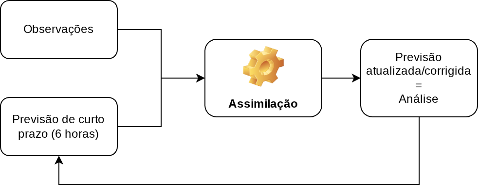
</div>

---

<!-- _footer: "" -->

<!-- Scoped style -->
<style scoped>
section {
  font-size: 21px;
}
.columns {
  display: grid;
  grid-template-columns: repeat(2, minmax(0, 1fr));
  gap: 1rem;
}
</style>

# Método Variacional - Parte I

<br />

## **3. Introdução ao Método 3DVar**

<br />

### 3.5 O ciclo de asssimilação de dados

<div class="columns">
<div>

* 🏃🏽‍♂️‍➡️ O ciclo se inicia com uma previsão de curto prazo (_first guess_ ou _background_), tipicamente de 6 horas
* 👉 As observações são utilizadas para atualizar/corrigir a previsão de curto prazo
  * 🌎 No método variacional, essa atualização/correção é feita a partir da minimização da função custo
* ✅ Ao final deste processo, obtém-se um estado atualizado denominado de análise, o qual é válido para o mesmo horário de referência das observações

</div>
<div>

<br />
<br />
<br />

<div align="center">
  
</div>

</div>
</div>

---

<!-- Scoped style -->
<style scoped>
section {
  font-size: 21px;
}
.columns {
  display: grid;
  grid-template-columns: repeat(2, minmax(0, 1fr));
  gap: 1rem;
}
</style>

# Método Variacional - Parte I

<br />

## **3. Introdução ao Método 3DVar**

### 3.5 O ciclo de asssimilação de dados

<br />

<div class="columns">
<div>

- Exemplo:
  - Sistema de Modelagem Numérica e Assimilação de dados (SMNA)
  - SMNA = BAM + GSI
  - 3DVar + FGAT
  - TQ2099L064 (~ 45km de res. horizontal e 64 níveis, coord. vert. híbrida)
  - Operacional XC50

</div>
<div>

<div align="center">
  
</div> 

</div>
</div>


---

<!-- _footer: "" -->

<!-- Scoped style -->
<style scoped>
section {
  font-size: 19px;
}
.columns {
  display: grid;
  grid-template-columns: repeat(2, minmax(0, 1fr));
  gap: 1rem;
}
</style>

# Método Variacional - Parte I

<br />

## **3. Introdução ao Método 3DVar**

<br />

<div class="columns">
<div>

### 3.6 _Physical-Space Statistical Analysis System_ (PSAS)

- Introduzido pelo DAO<sup>&#128312;</sup> (atualmente GMAO<sup>&#128312;</sup> da NASA) em meados dos anos 1990
  * Arlindo da Silva e Ricardo Todling (dois brasileiros) participaram do seu desenvolvimento
  * Foi desenvolvido para substituir o esquema de IO utilizado com o modelo GEOS da NASA
  * É um algorítmo variacional com características de IO

</div>
<div>

* Premissas (à época):
  * Utilizar o mesmo modelo de covariâncias dos erros de observação e previsão da IO, mas resolver a equação de análise globalmente
  * Permitir maior flexibilidade na modelagem da covariância dos erros de observação e previsão - a formulação da equação de análise no espaço físico das observações permite a representação das covariâncias anisotrópicas e dependentes do fluxo atmosférico
  * Permitir a assimilação de novos tipo de dados não convencionais
  * Permitir novos avanços nas metodologias de assimilação de dados

</div>
</div> 
 
<span class="footnote">
<sup>&#128312;</sup>DAO: <i>Data Assimilation Office</i>
<br />
<sup>&#128312;</sup>GMAO: <i>Global Modeling and Assimilation Office</i>


</span> 
 
---

<!-- Scoped style -->
<style scoped>
section {
  font-size: 21px;
}
.columns {
  display: grid;
  grid-template-columns: repeat(2, minmax(0, 1fr));
  gap: 1rem;
}
</style>

# Método Variacional - Parte I

<br />

## **3. Introdução ao Método 3DVar**

<br />

### 3.6 _Physical-Space Statistical Analysis System_ (PSAS)

<br /> 

- Equação de análise (semelhante à da IO):
$$
\delta\mathbf{x}_a = (\mathbf{B}\mathbf{H}^\text{T})(\mathbf{R}+\mathbf{HBH}^\text{T})^{-1}\delta\mathbf{y}_o
$$
- A solução é separada em duas etapas:
  1) Resolver a parte do peso e da inovação:
  
      $$
      \mathbf{w}=(\mathbf{R}+\mathbf{HBH}^\text{T})^{-1}\delta\mathbf{y}_o
      $$
    
  2) Resolver o incremente de análise:
  
      $$
      \delta\mathbf{x}_a = (\mathbf{B}\mathbf{H}^\text{T})\mathbf{w}
      $$

---

<!-- Scoped style -->
<style scoped>
section {
  font-size: 19px;
}
.columns {
  display: grid;
  grid-template-columns: repeat(2, minmax(0, 1fr));
  gap: 1rem;
}
</style>

# Método Variacional - Parte I

<br />

## **3. Introdução ao Método 3DVar**

<br />

### 3.6 _Physical-Space Statistical Analysis System_ (PSAS)   
   
<br />   
   
- Como o PSAS é um método variacional, $\delta\mathbf{x}_a$ é resolvida através da minimização da função custo:

$$
J(\mathbf{w})=\frac{1}{2}\mathbf{w}^\text{T}(\mathbf{R} + \mathbf{HBH}^\text{T})\mathbf{w}-\mathbf{w}^\text{T}[\mathbf{y}_o-H(\mathbf{x}_b)]
$$
      
* Note que, em comparação com o 3DVar tradicional, o termo $\mathbf{w}^\text{T}(\mathbf{R} + \mathbf{HBH}^\text{T})\mathbf{w}$ é equivalente a $(\mathbf{x} - \mathbf{x}_b)^{\text{T}}\mathbf{B}^{-1}(\mathbf{x} - \mathbf{x}_b)$
  * No PSAS, a análise é resolvida no espaço físico (espaço das observações)!
* Se o número de observações é muito menor do que número de graus de liberdade do modelo, o PSAS resolve a análise da mesma forma que o 3DVar, só que de forma mais rápida
  * 3DVar: resolve a análise no espaço do modelo (analisa muito mais pontos do que o PSAS)
  * PSAS: resolve a análise no espaço da observação (analise menos pontos do que o 3DVar - se não houverem muitas observações)

---

<!-- Scoped style -->
<style scoped>
section {
  font-size: 20px;
}
.columns {
  display: grid;
  grid-template-columns: repeat(2, minmax(0, 1fr));
  gap: 1rem;
}
</style>

# Método Variacional - Parte I

<br />

## **3. Introdução ao Método 3DVar**

<div class="columns">
<div>

### 3.7 _First Guess at Apropriate Time_ (FGAT)

- FGAT é uma extensão do 3DVar para observações distribuídas no tempo
  * O background é interpolado no tempo da observação
  * Função custo continua 3D, pois não evolui a correção do background ao longo do tempo
- Melhora a sincronia temporal das observações:
  * Principalmente das observações que não estão no tempo da análise (observações não convencionais)
  * Exige que o first guess seja particionado na janela de assimilação

</div>
<div>

<br />
<br />

$$
J(\mathbf{x}) = \frac{1}{2}(\mathbf{x} - \mathbf{x}_b(t_{0}))^T \mathbf{B}^{-1} (\mathbf{x} - \mathbf{x}_b(t_{0})) + \frac{1}{2}\sum_i [\mathbf{y}_i - H_i(\mathbf{x}(t_i))]^T \mathbf{R}_i^{-1} [\mathbf{y}_i - H_i(\mathbf{x}(t_i))]
$$

<br />
  
<div align="center">
  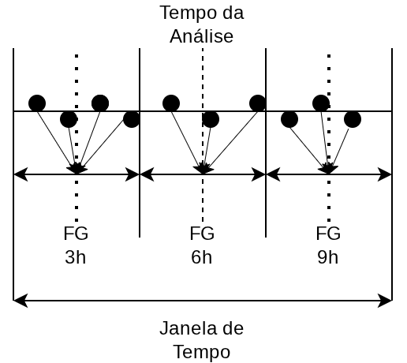
</div>

</div>
</div> 

---

<!-- _footer: "" -->

<!-- Scoped style -->
<style scoped>
section {
  font-size: 21px;
}
.columns {
  display: grid;
  grid-template-columns: repeat(2, minmax(0, 1fr));
  gap: 1rem;
}
</style>

# Método Variacional - Parte II

<br />

## **4. Componentes**

<br />

### 4.1 Método de minimização do Gradiente Descendente

<br />

<div class="columns">
<div>

- Técnica iterativa para encontrar o mínimo de uma função
  * Se estivéssemos percorrendo um vale, o gradiente<sup>&#128312;</sup> da função que descreve esse vale indicaria a direção de subida mais íngrime
  * Então, para descer o vale, deveríamos percorrer a direção oposta ao gradiente

</div>
<div>

* Se $J(\mathbf{x})$ é o funcional que queremos minimizar, $\nabla J$ é um vetor de derivadas parciais:

  $$
  \nabla J(\mathbf{x}) = \begin{bmatrix}
    \frac{\partial J}{x_1} \\
    \frac{\partial J}{x_1} \\
    \vdots \\
    \frac{\partial J}{x_n} \\
  \end{bmatrix}
  $$

</div>
</div>  
  
<span class="footnote2">
<sup>&#128312;</sup>O gradiente de uma função contínua, aponta para a direção onde a função cresce mais rápido
</span>

---

<!-- Scoped style -->
<style scoped>
section {
  font-size: 21px;
}
.columns {
  display: grid;
  grid-template-columns: repeat(2, minmax(0, 1fr));
  gap: 1rem;
}
</style>

# Método Variacional - Parte II

<br />

## **4. Componentes**

<br />

### 4.1 Método de minimização do Gradiente Descendente

<br />

- O método iterativo atualiza a estimativa da solução com base no passo anterior, da seguinte forma:

$$
\mathbf{x}_{k+1} = \mathbf{x}_{k} - \alpha \nabla J(\mathbf{x}_k)
$$

<p style="text-align: center;">ou</p>

$$
\mathbf{x}_{k} = \mathbf{x}_{k-1} - \alpha \nabla J(\mathbf{x}_{k-1})
$$

* Onde:
  * $\mathbf{x}_k$ é a estimativa da solução no passo atual
  * $\alpha$ é a taxa de atualização (controla o tamanho da descida)
  * $\nabla J(\mathbf{x}_k)$ é o gradiente calculado no passo $k$ 

---

<!-- _footer: "" -->

<!-- Scoped style -->
<style scoped>
section {
  font-size: 21px;
}
.columns {
  display: grid;
  grid-template-columns: repeat(2, minmax(0, 1fr));
  gap: 1rem;
}
</style>

# Método Variacional - Parte II

<br />

## **4. Componentes**

<br />

### 4.1 Método de minimização do Gradiente Descendente

#### **Um exemplo simples<sup>&#128312;</sup>**

<div class="columns">
<div>

* Seja a função contínua real $y = f(x) = x^{2}-4x+2$
* A derivada primeira de $y$ é dada por: $y^{\prime} = 2x - 4$
  
* Fazendo $y^{\prime}=0$, obtemos:

  $$
  \begin{align}
  2x - 4 = 0 \\
  2x = 4 \\
  x = \frac{4}{2} = 2
  \end{align}
  $$

</div>
<div>

* Substituindo $x = 2$ na função original, obtemos $y = -2$

* Logo, os valores de $x=2$ e $y=-2$ encontrados, são as coordenadas do vértice da parábola definida pela função original.

</div>
</div>

<span class="footnote2">
<sup>&#128312;</sup>Baseado em https://medium.com/@rrfd/what-is-a-cost-function-gradient-descent-examples-with-python-16273460d634
</span>

---

<!-- _footer: "" -->

<!-- Scoped style -->
<style scoped>
section {
  font-size: 21px;
}
.columns {
  display: grid;
  grid-template-columns: repeat(2, minmax(0, 1fr));
  gap: 1rem;
}
</style>

# Método Variacional - Parte II

<br />

## **4. Componentes**

<br />

### 4.1 Método de minimização do Gradiente Descendente

#### **Um exemplo simples**

<div class="columns">
<div>

<br />
<br />
<br />
<br />

- Os valores de $x=2$ e $y=-2$ encontrados, são as coordenadas do vértice da parábola definida pela função original

</div>
<div>

<div align="center">
  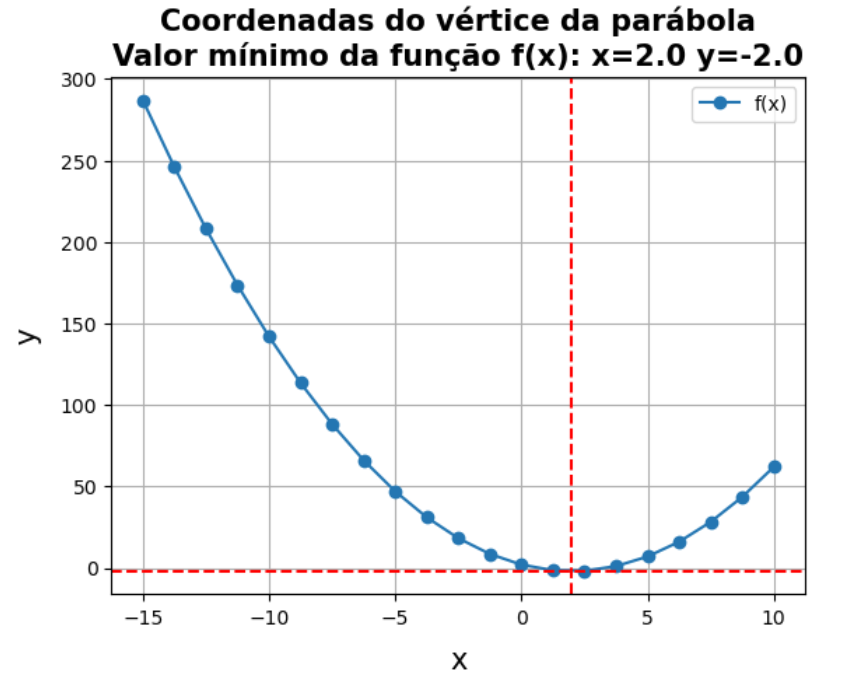
</div>

</div>
</div>

---

<!-- _footer: "" -->

<!-- Scoped style -->
<style scoped>
section {
  font-size: 21px;
}
.columns {
  display: grid;
  grid-template-columns: repeat(2, minmax(0, 1fr));
  gap: 1rem;
}
</style>

# Método Variacional - Parte II

<br />

## **4. Componentes**

<br />

### 4.1 Método de minimização do Gradiente Descendente

#### **Um exemplo simples**

- Definição da função $y=f(x)$ original:

```
# Definimos uma função que irá retornar
# o valor de f(x) para uma lista de valores
def func_y(x):
    return x**2 - 4*x + 2
```

---

<!-- Scoped style -->
<style scoped>
section {
  font-size: 21px;
}
.columns {
  display: grid;
  grid-template-columns: repeat(2, minmax(0, 1fr));
  gap: 1rem;
}
.github-code {
  font-family: ui-monospace, SFMono-Regular, Menlo, Consolas, monospace;
  font-size: 0.7em;
  background-color: #323742;
  color: #f6f8fa;
  padding: 0.2em 0.4em;
  border-radius: 6px;
}
</style>

# Método Variacional - Parte II

<br />

## **4. Componentes**

<br />

### 4.1 Método de minimização do Gradiente Descendente

#### **Um exemplo simples**

<div class="columns">
<div>

<br />
<br />
<br />

- Função para calcular o gradiente descendente de $f(x)$:
  * <span class="github-code">epoch</span> indexa o tempo
  * <span class="github-code">learning_rate</span> é o valor de $\alpha$

</div>
<div>

```
def gradient_descent_x(previous_x, learning_rate, epoch):
    
    x_gd = []
    y_gd = []

    x_gd.append(previous_x)
    y_gd.append(func_y(previous_x))

    for i in range(epoch):
        current_x = previous_x - learning_rate * (2*previous_x - 4)
        x_gd.append(current_x)
        y_gd.append(func_y(current_x))
        
        previous_x = current_x

    return x_gd, y_gd
```

</div>
</div> 

---

<!-- Scoped style -->
<style scoped>
section {
  font-size: 21px;
}
.columns {
  display: grid;
  grid-template-columns: repeat(2, minmax(0, 1fr));
  gap: 1rem;
}
.github-code {
  font-family: ui-monospace, SFMono-Regular, Menlo, Consolas, monospace;
  font-size: 0.95em;
  background-color: #323742;
  color: #f6f8fa;
  padding: 0.2em 0.4em;
  border-radius: 6px;
}
</style>

# Método Variacional - Parte II

<br />

## **4. Componentes**

<br />

### 4.1 Método de minimização do Gradiente Descendente

#### **Um exemplo simples**

<br />
<br />

<div class="columns">
<div>

- Iniciamos a descida com um chute inicial para $x$ ($x_0 = 4$)
* Faremos o mesmo com o valor de $\alpha$, ajustando-o para $\alpha=0,15$ (faremos com que a taxa de atualização seja de 15%)
* Faremos um total de 10 iterações

</div>
<div>

<br />

```
x0 = 4 

learning_rate = 0.15

epoch = 10 

gd = gradient_descent_x(x0,learning_rate, epoch)
```

</div>
</div>

---

<!-- Scoped style -->
<style scoped>
section {
  font-size: 21px;
}
.columns {
  display: grid;
  grid-template-columns: repeat(2, minmax(0, 1fr));
  gap: 1rem;
}
.github-code {
  font-family: ui-monospace, SFMono-Regular, Menlo, Consolas, monospace;
  font-size: 0.95em;
  background-color: #323742;
  color: #f6f8fa;
  padding: 0.2em 0.4em;
  border-radius: 6px;
}
</style>

# Método Variacional - Parte II

<br />

## **4. Componentes**

### 4.1 Método de minimização do Gradiente Descendente

#### **Um exemplo simples**

<div class="columns">
<div>

- Valores de $x$ ao longo das iterações:

```
xgd = gd[0]
xgd
[4,
 3.4,
 2.98,
 2.686,
 2.4802,
 2.33614,
 2.235298,
 2.1647086,
 2.11529602,
 2.0807072140000002,
 2.0564950498]
 ```

</div>
<div>

- Valores de $y$ ao longo das iterações:

```
ygd = gd[1]
ygd
[2,
 -0.040000000000000924,
 -1.0396,
 -1.5294040000000004,
 -1.7694079599999997,
 -1.8870099003999998,
 -1.9446348511959997,
 -1.9728710770860403,
 -1.9867068277721591,
 -1.9934863456083578,
 -1.9968083093480953]
```

</div>
</div>

---

<!-- _footer: "" -->

<!-- Scoped style -->
<style scoped>
section {
  font-size: 21px;
}
.columns {
  display: grid;
  grid-template-columns: repeat(2, minmax(0, 1fr));
  gap: 1rem;
}
.github-code {
  font-family: ui-monospace, SFMono-Regular, Menlo, Consolas, monospace;
  font-size: 0.95em;
  background-color: #323742;
  color: #f6f8fa;
  padding: 0.2em 0.4em;
  border-radius: 6px;
}
</style>

# Método Variacional - Parte II

<br />

## **4. Componentes**

### 4.1 Método de minimização do Gradiente Descendente

#### **Um exemplo simples**

<div align="center">
  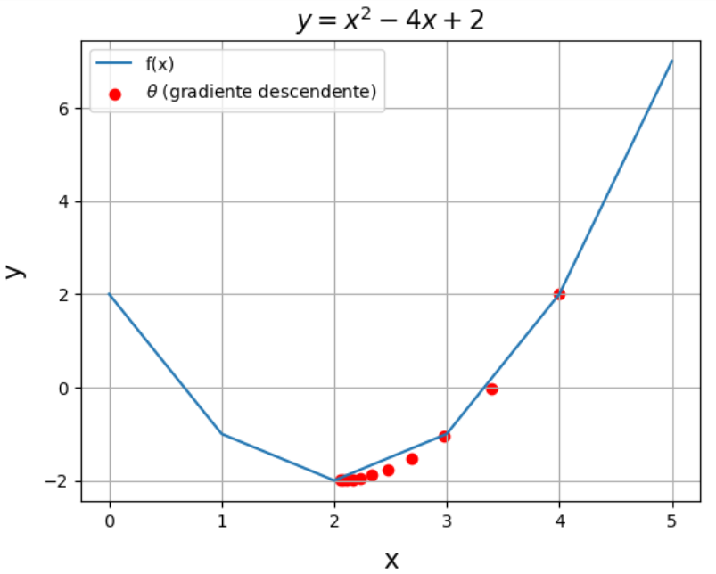
</div>

---

<!-- Scoped style -->### Método de minimização do Gradiente Descendente

<style scoped>
section {
  font-size: 21px;
}
.columns {
  display: grid;
  grid-template-columns: repeat(2, minmax(0, 1fr));
  gap: 1rem;
}
.github-code {
  font-family: ui-monospace, SFMono-Regular, Menlo, Consolas, monospace;
  font-size: 0.95em;
  background-color: #323742;
  color: #f6f8fa;
  padding: 0.2em 0.4em;
  border-radius: 6px;
}
</style>

# Método Variacional - Parte II

<br />

## **4. Componentes**

<br />

<div class="columns">
<div>

### 4.1 Método de minimização do Gradiente Descendente

<br />

#### **Um exemplo mais complicado**

- Seja a função real $z = f(x,y) = 4x^2 + 2y^2 - 2xy$
* A derivada primeira de $z$ em relação a $x$ é dada por: $\frac{dz}{dx} = 8x - 2y$
* A derivada primeira de $z$ em relação a $y$ é dada por: $\frac{dz}{dy} = 4y - 2x$

</div>
<div>

<div align="center">
  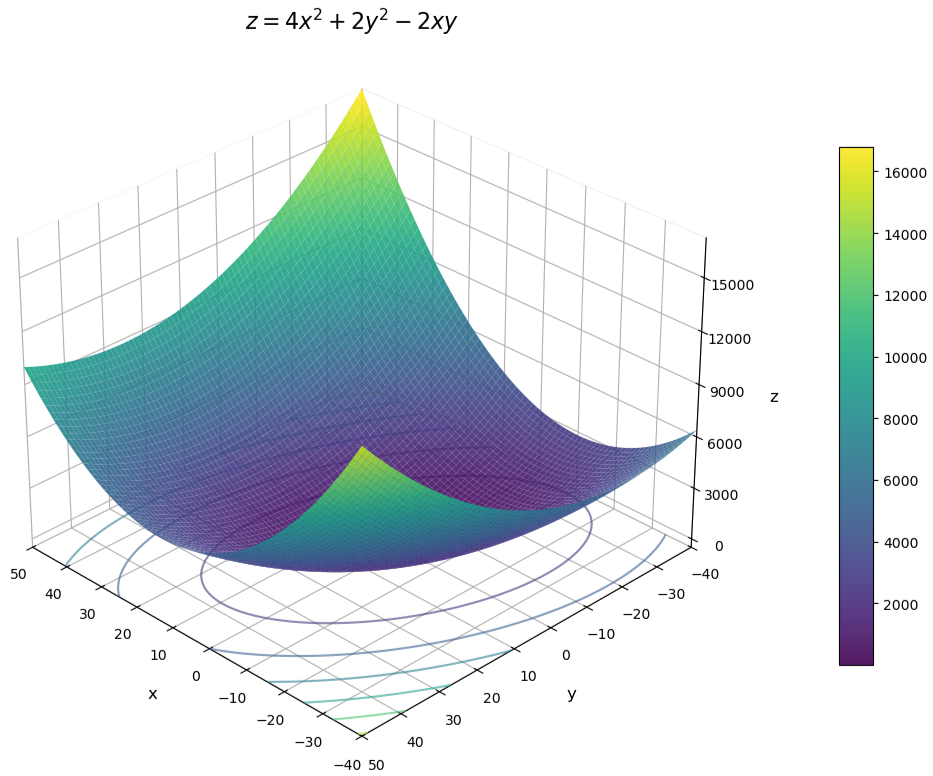
</div>

</div>
</div>

---

<!-- Scoped style -->
<style scoped>
section {
  font-size: 21px;
}
.columns {
  display: grid;
  grid-template-columns: repeat(2, minmax(0, 1fr));
  gap: 1rem;
}
.github-code {
  font-family: ui-monospace, SFMono-Regular, Menlo, Consolas, monospace;
  font-size: 0.95em;
  background-color: #323742;
  color: #f6f8fa;
  padding: 0.2em 0.4em;
  border-radius: 6px;
}
</style>

# Método Variacional - Parte II

<br />

## **4. Componentes**

<br />

<div class="columns">
<div>

### 4.1 Método de minimização do Gradiente Descendente

#### **Um exemplo mais complicado**

<br />

- Definição da função $z=f(x,y)$ original:

```
# A função abaixo, calcula o valor de f(x,y)
def func_z(x,y):
    return 4*x**2 + 2*y**2 - 2*x*y
```

</div>
<div>

<br />
<br />
<br />
<br />

- Cálculo da derivada primeira de $z$ em relação a $x$ e $y$:

```
# A função a seguir, calcula o valor da derivada de z em função de x
def dx(x,y):
    return 8*x - 2*y

# Cálculo da derivada de z em função de y
def dy(x,y):
    return 4*y - 2*x
```

</div>
</div>

---

<!-- Scoped style -->
<style scoped>
section {
  font-size: 18px;
}
.columns {
  display: grid;
  grid-template-columns: repeat(2, minmax(0, 1fr));
  gap: 1rem;
}
.github-code {
  font-family: ui-monospace, SFMono-Regular, Menlo, Consolas, monospace;
  font-size: 0.95em;
  background-color: #323742;
  color: #f6f8fa;
  padding: 0.2em 0.4em;
  border-radius: 6px;
}
</style>

# Método Variacional - Parte II

<br />

## **4. Componentes**

<br />

<div class="columns">
<div>

### 4.1 Método de minimização do Gradiente Descendente

<br />

#### **Um exemplo mais complicado**

<br />

- Função para calcular o gradiente descendente de $f(x,y)$:
  * Iniciamos a descida com chute inicial para $x$ e $y$ ($x_0 = 30$ e $y_0 = 40$)
  * Faremos o mesmo com o valor de $\alpha$, ajustando-o para $\alpha=0,05$ (faremos com que a taxa de atualização seja de 5%)
  * Faremos um total de 100 iterações

</div>
<div>

```
theta_x = 30
theta_y = 40

alpha = 0.05
    
epoch = 100

def gradient_descent_xy(theta_x,theta_y,alpha,epoch):
    
    grad_x = [] 
    grad_y = []

    grad_x.append(theta_x)
    grad_y.append(theta_y)

    for i in range(epoch):
        current_theta_x = theta_x - alpha * dx(theta_x,theta_y)
        current_theta_y = theta_y - alpha * dy(theta_x,theta_y)
        grad_x.append(current_theta_x)
        grad_y.append(current_theta_y)

        theta_x = current_theta_x
        theta_y = current_theta_y
    
    return theta_x, theta_y, grad_x, grad_y
```

</div>
</div>

---

<!-- Scoped style -->
<style scoped>
section {
  font-size: 21px;
}
.columns {
  display: grid;
  grid-template-columns: repeat(2, minmax(0, 1fr));
  gap: 1rem;
}
.github-code {
  font-family: ui-monospace, SFMono-Regular, Menlo, Consolas, monospace;
  font-size: 0.95em;
  background-color: #323742;
  color: #f6f8fa;
  padding: 0.2em 0.4em;
  border-radius: 6px;
}
</style>

# Método Variacional - Parte II

<br />

## **4. Componentes**

<br />

### 4.1 Método de minimização do Gradiente Descendente

#### **Um exemplo mais complicado**

<div class="columns">
<div>

- Valores de $x$ ao longo das iterações:

```
gd2[2]
[30,
 22.0,
 16.7,
 13.04,
 10.407,
 ...
 1.173016304018012e-06, 
 9.87000969415312e-07,
 8.304836942929711e-07,
 6.987867163849628e-07,
 5.879740666212515e-07]
```

</div>
<div>

- Valores de $y$ ao longo das iterações:

```
gd2[3]
[40,
 35.0,
 30.2,
 25.83,
 21.967999999999996,
 ...
 2.831911870045047e-06,
 2.382831126437839e-06,
 2.004964998091802e-06,
 1.6870203679027387e-06,
 1.4194949659606872e-06] 
```

</div>
</div>

---

<!-- Scoped style -->
<style scoped>
section {
  font-size: 21px;
}
.columns {
  display: grid;
  grid-template-columns: repeat(2, minmax(0, 1fr));
  gap: 1rem;
}
.github-code {
  font-family: ui-monospace, SFMono-Regular, Menlo, Consolas, monospace;
  font-size: 0.95em;
  background-color: #323742;
  color: #f6f8fa;
  padding: 0.2em 0.4em;
  border-radius: 6px;
}
</style>

# Método Variacional - Parte II

<br />

## **4. Componentes**

<div class="columns">
<div>

### 4.1 Método de minimização do Gradiente Descendente

<br />

#### **Um exemplo mais complicado**

<br />

Em breve...

🎲 Notebook com <a href="https://colab.research.google.com/github/cfbastarz/MET563-3/blob/main/atividade_04_analise_cressman1959_1d2d.ipynb" target="_blank">Atividade Prática 6</a>

</div>
<div>

<div align="center">
  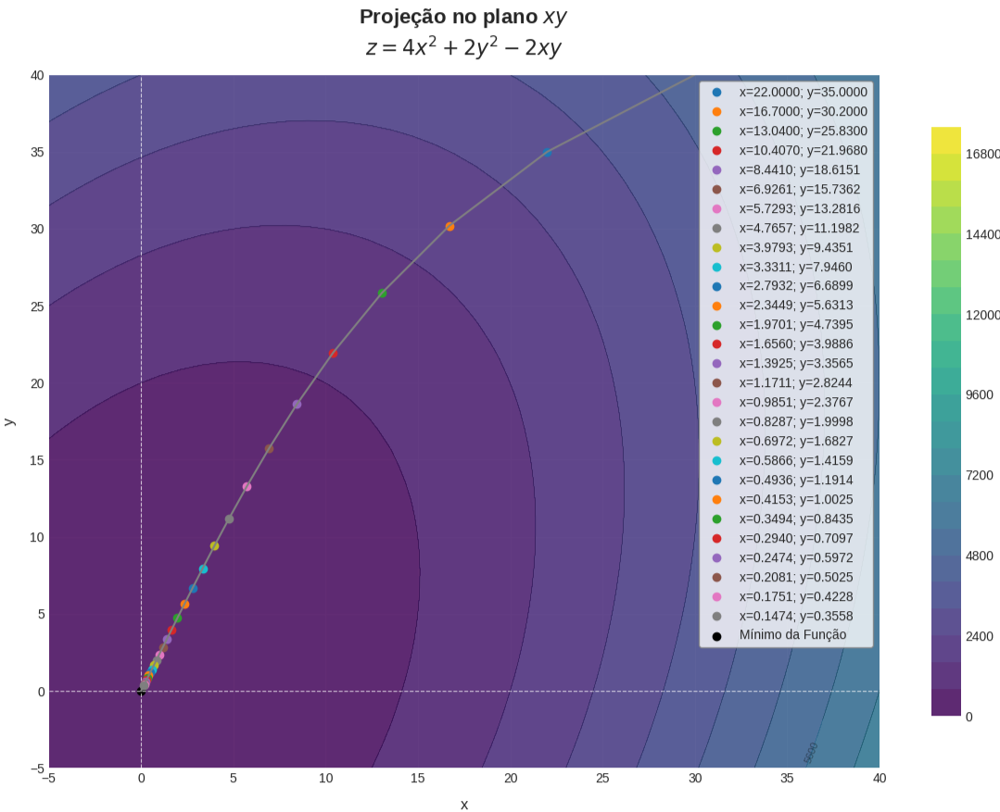
</div>

</div>
</div>

---


<!-- Scoped style -->
<style scoped>
section {
  font-size: 21px;
}
.columns {
  display: grid;
  grid-template-columns: repeat(2, minmax(0, 1fr));
  gap: 1rem;
}
</style>

# Método Variacional - Parte II

<br />

## **4. Componentes**

<br />

### 4.2 Matriz de covariâncias dos Erros de Previsão

<br />

- Fontes de incerteza são uma característica instrínseca a qualquer sistema dinâmico
* Na década de 1960, Edward N. Lorenz, mostrou que a atmosfera possui previsibilidade de suas semanas
  * Experimentos gêmeos ♊
  
* Desafio:
  * Como fazer com que os modelos atuais possam prever bem dentro deste limite (e além dele)?

---

<!-- Scoped style -->
<style scoped>
section {
  font-size: 21px;
}
.columns {
  display: grid;
  grid-template-columns: repeat(2, minmax(0, 1fr));
  gap: 1rem;
}
</style>

# Método Variacional - Parte II

<br />

## **4. Componentes**

<br />

### 4.2 Matriz de covariâncias dos Erros de Previsão  
  
- Os modelos de Previsão Numérica de Tempo (PNT) são realizados dentro de uma estrutura de modelagem que compreende:
  1) Modelo numérico
  2) Observações
  3) Sistema de assimilação de dados
  * 👉 A boa análise é o resultado da conjugação destes 3 fatores
  
* Tarefa da modelagem e assimilação de dados:
  * Uma vez estabelecido o processo de modelagem, as fontes de incerteza devem ser abordadas para que o seu impacto seja mínimo
  
---

<!-- _footer: "" -->

<!-- Scoped style -->
<style scoped>
section {
  font-size: 20px;
}
.columns {
  display: grid;
  grid-template-columns: repeat(2, minmax(0, 1fr));
  gap: 1rem;
}
</style>

# Método Variacional - Parte II

<br />

## **4. Componentes**

### 4.2 Matriz de covariâncias dos Erros de Previsão 

- Em geral, as fontes de incerteza do processo de modelagem são representadas por:
  * Modelo numérico (e.g., dinâmica e física)
  * Observações (e.g., medição, instrumento, grau de processamento)
  * Sistema de assimilação de dados (e.g., operadores de observação, modelos adjunto e tangente linear, tamanho do conjunto de um ensemble)

* A matriz de covariâncias dos erros de previsão ($\mathbf{B}$), representa a covariância do "erro" (uma estimativa) do modelo
  
* Na assimilação de dados, estes erros são modelados em matrizes de covariâncias que tratam das relações espaço-tempoerais entre as quantidades observadas e diagnosticadas/prognosticadas

* Função custo 3DVar:

  $$
  J(\mathbf{x}) = \frac{1}{2} (\mathbf{x} - \mathbf{x}^{b})^{T} \mathbf{B}^{-1} (\mathbf{x} - \mathbf{x}^{b}) + \frac{1}{2} [\mathbf{y}^{o} - {\mathbf{H}}(\mathbf{x})]^{T} \mathbf{R}^{-1} [\mathbf{y}^{o} - {\mathbf{H}}(\mathbf{x})]
  $$
  
---

<!-- _footer: "" -->

<!-- Scoped style -->
<style scoped>
section {
  font-size: 20px;
}
.columns {
  display: grid;
  grid-template-columns: repeat(2, minmax(0, 1fr));
  gap: 1rem;
}
</style>

# Método Variacional - Parte II

<br />

## **4. Componentes**

### 4.2 Matriz de covariâncias dos Erros de Previsão 

- Em geral, as fontes de incerteza do processo de modelagem são representadas por:
  - Modelo numérico (e.g., dinâmica e física)
  - Observações (e.g., medição, instrumento, grau de processamento)
  - Sistema de assimilação de dados (e.g., operadores de observação, modelos adjunto e tangente linear, tamanho do conjunto de um ensemble)

- A matriz de covariâncias dos erros de previsão ($\mathbf{B}$), representa a covariância do "erro" (uma estimativa) do modelo
  
- Na assimilação de dados, estes erros são modelados em matrizes de covariâncias que tratam das relações espaço-tempoerais entre as quantidades observadas e diagnosticadas/prognosticadas

- Função custo 3DVar:

  $$
  J(\mathbf{x}) = \frac{1}{2} (\mathbf{x} - \mathbf{x}^{b})^{T} {\color{red}{\mathbf{B}^{-1}}} (\mathbf{x} - \mathbf{x}^{b}) + \frac{1}{2} [\mathbf{y}^{o} - {\color{green}{\mathbf{H}}}(\mathbf{x})]^{T} {\color{blue}{\mathbf{R}^{-1}}} [\mathbf{y}^{o} - {\color{green}{\mathbf{H}}}(\mathbf{x})]
  $$
  
---

<!-- Scoped style -->
<style scoped>
section {
  font-size: 18px;
}
.columns {
  display: grid;
  grid-template-columns: repeat(2, minmax(0, 1fr));
  gap: 1rem;
}
</style>

# Método Variacional - Parte II

<br />

## **4. Componentes**

### 4.2 Matriz de covariâncias dos Erros de Previsão 

<br />
  
<div class="columns">
<div>

#### **Importância da matriz $\mathbf{B}$**
  
- Considerando a assimilação de uma única variável, podemos escrever o operador observação linearizado $\mathbf{H}$ como:

  $$
  \mathbf{H}=[0,\dots,0,1,0,\dots,0]
  $$

* Partindo-se da equação geral da análise $\mathbf{x}^{a} = \mathbf{x}^{b} + (\mathbf{B}^{-1} + \mathbf{H}^{T}\mathbf{R}^{-1}\mathbf{H})^{-1}(\mathbf{H}^{T}\mathbf{R}^{-1})[\mathbf{y}^{o} - \mathbf{H}(\mathbf{x}^{b})]$, obtemos:

  $$
  \begin{align}
      (\mathbf{B}^{-1} + \mathbf{H}^{T}\mathbf{R}^{-1}\mathbf{H})(\mathbf{x}^{a} - \mathbf{x}^{b}) & = (\mathbf{H}^{T}\mathbf{R}^{-1})[\mathbf{y}^{o} - \mathbf{H}(\mathbf{x}^{b})] \\
      \mathbf{x}^{a} - \mathbf{x}^{b} & = \frac{\mathbf{H}^{T}\mathbf{R}^{-1}[\mathbf{y}^{o} - \mathbf{H}(\mathbf{x}^{b})]}{\mathbf{B}^{-1} + \mathbf{H}^{T}\mathbf{R}^{-1}\mathbf{H}}
  \end{align}
  $$

</div>
<div>

* Multiplicando-se e dividindo-se por $\mathbf{B}$ o lado direito, obtemos:

  $$
    \begin{align}
      \mathbf{x}^{a} - \mathbf{x}^{b} & = \frac{\mathbf{B}\mathbf{H}^{T}\mathbf{R}^{-1}[\mathbf{y}^{o} - \mathbf{H}(\mathbf{x}^{b})]}{1 + \mathbf{B}\mathbf{H}^{T}\mathbf{R}^{-1}\mathbf{H}} \\
      \mathbf{x}^{a} - \mathbf{x}^{b} & = \frac{\mathbf{B}\mathbf{H}^{T}\mathbf{R}^{-1}[\mathbf{y}^{o} - \mathbf{H}(\mathbf{x}^{b})]}{\frac{\mathbf{R} + \mathbf{H}\mathbf{B}\mathbf{H}^{T}}{\mathbf{R}}} \\
      \mathbf{x}^{a} - \mathbf{x}^{b} & = \frac{\mathbf{B}\mathbf{H}^{T}[\mathbf{y}^{o} - \mathbf{H}(\mathbf{x}^{b})]}{\mathbf{R} + \mathbf{H}\mathbf{B}\mathbf{H}^{T}}
    \end{align}
  $$
  
* Como a suposição inicial foi a de que há apenas uma observação e apenas um ponto de grade a ser analisado,  os termos $\mathbf{y}^{o} - \mathbf{H}(\mathbf{x}^{b})$ e $\mathbf{R} + \mathbf{H}\mathbf{B}\mathbf{H}^{T}$ são escalares. Com isso, pode-se afirmar que:

  $$
  \mathbf{x}^{a}-\mathbf{x}^{b} \propto \mathbf{BH}^{T}
  $$

</div>
</div>

---

<!-- Scoped style -->
<style scoped>
section {
  font-size: 18px;
}
.columns {
  display: grid;
  grid-template-columns: repeat(2, minmax(0, 1fr));
  gap: 1rem;
}
</style>

# Método Variacional - Parte II

<br />

## **4. Componentes**

### 4.2 Matriz de covariâncias dos Erros de Previsão 

<br />

#### **Forma idealizada da matriz $\mathbf{B}$**

<div class="columns">
<div>

<br />

- Estruturas da matriz $\mathbf{B}$:
  *  Variâncias
  *  Covariâncias
  *  Autocovariâncias

* Neste caso (modelo espectral):
  * $\psi$ é a função de corrente
  * $\chi$ é a parte desbalanceada da velocidade potencial
  * $T$ é a parte desbalanceada da temperatura
  * $ps$ é a parte desbalanceada da pressão em superfície

</div>
<div>

<div align="center">
  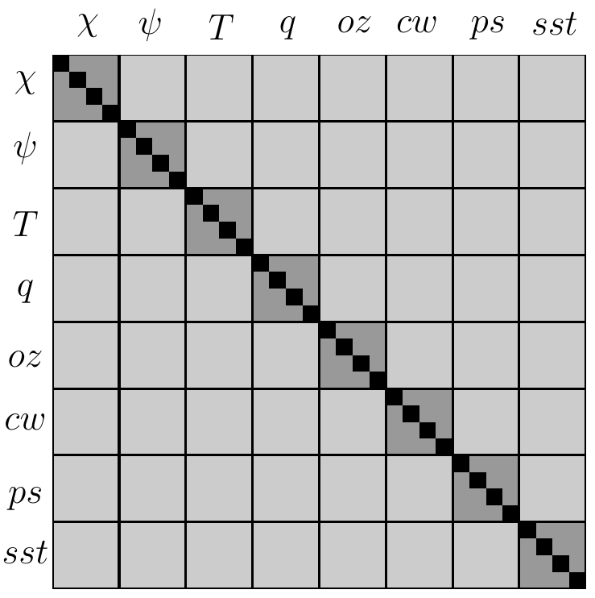
</div>

</div>
</div>

---

<!-- Scoped style -->
<style scoped>
section {
  font-size: 18px;
}
.columns {
  display: grid;
  grid-template-columns: repeat(2, minmax(0, 1fr));
  gap: 1rem;
}
</style>

# Método Variacional - Parte II

<br />

## **4. Componentes**

### 4.2 Matriz de covariâncias dos Erros de Previsão 

<br />

#### **Forma idealizada da matriz $\mathbf{B}$**

- Devido ao tamanho das variáveis do modelo, o tamanho completo de uma matriz B é extremamente grande. Normalmente, ela é da ordem de $10^6 \times 10^6$, o que, em sua forma atual, não pode ser armazenado em nenhum computador
- Esse problema é simplificado por meio do uso de um conjunto ideal de variáveis de análise, sobre as quais a análise é realizada
  * Essas variáveis são geralmente chamadas de "variáveis de controle"
- As variáveis de controle são escolhidas de forma que as correlações cruzadas entre elas sejam mínimas
  * Isso implica em menos termos fora da diagonal em em $\mathbf{B}$
  * Dessa forma remove-se a dependência cruzada entre essas variáveis
- O balanço entre as variáveis de análise (como os campos de massa e vento) é obtido com coeficientes de regressão pré-calculados
- Os erros de previsão são modelados como uma distribuição Gaussiana, com variâncias e parâmetros de escala de comprimento (lengthscale) pré-computados para cada uma das variáveis de controle da análise

---

<!-- _footer: "" -->

<!-- Scoped style -->
<style scoped>
section {
  font-size: 21px;
}
.columns {
  display: grid;
  grid-template-columns: repeat(2, minmax(0, 1fr));
  gap: 1rem;
}
</style>

# Método Variacional - Parte II

<br />

## **4. Componentes**

### 4.2 Matriz de covariâncias dos Erros de Previsão 

<br />

#### **Método NMC**

- Cálculo da matriz $\mathbf{B}$ - Método NMC<sup>&#128312;</sup>
  * Preconiza que as correlações espaciais dos erros do modelo são semelhantes às correlações entre as previsões de 48 e 24 horas
  * Amplamente utilizado e aplicado em métodos variacionais
  * Facilidade de acesso aos pares de previsões de 48 e 24 horas

<span class="footnote2">
<sup>&#128312;</sup>NMC: <i>National Modeling Center</i> (Parish e Derber, 1992: <i>The National Meteorological Center's Spectral Statistical-Interpolation Analysis System</i> - <a href="https://x.gd/eMZTK" target=_blank>link</a>)
</span>

---

<!-- Scoped style -->
<style scoped>
section {
  font-size: 21px;
}
.columns {
  display: grid;
  grid-template-columns: repeat(2, minmax(0, 1fr));
  gap: 1rem;
}
</style>

# Método Variacional - Parte II

<br />

## **4. Componentes**

### 4.2 Matriz de covariâncias dos Erros de Previsão 

<br />

#### **Método NMC - considerações**

- O método NMC preconiza que a correlação espacial dos erros do modelo são semelhantes à correlação espacial das diferenças entre as previsões de 48 e 24 horas
  * Para um modelo regional, pode-se considerar a diferença entre as previsões de 24 e 12 horas - **por quê?**
  * **Suposição:** crescimento linear dos erros de previsão durante as primeiras horas de previsão (similar ao método de perturbação da previsão por conjuntos utilizando EOFs)
* Exemplo de par de previsões válido (modelo BAM):
  * GFCTCPT<span style="color: red;">2013122418</span><span style="color: blue;">2013122618</span>F.fct.TQ0299L064 (previsão 48 horas)
  * GFCTCPT<span style="color: red;">2013122518</span><span style="color: blue;">2013122618</span>F.fct.TQ0299L064 (previsão 24 horas)

---

<!-- Scoped style -->
<style scoped>
section {
  font-size: 18px;
}
.columns {
  display: grid;
  grid-template-columns: repeat(2, minmax(0, 1fr));
  gap: 1rem;
}
</style>

# Método Variacional - Parte II

<br />

## **4. Componentes**

### 4.2 Matriz de covariâncias dos Erros de Previsão 

<br />

#### **Método NMC - algorítmo**

1. Leitura do cabeçalho dos arquivos espectrais a fim de se determinar quantos pares estão disponíveis para o processamento (nesta etapa, são lidos a data, o horário da previsão e o tipo de coordenada vertical – neste caso, sigma puro)
2) Leitura dos pares propriamente ditos e conversão para ponto de grade
3) Leitura e organização dos pares de previsões de 48 e 24 horas
4) Remoção de viés (em toda a coluna vertical)
5) Cálculo das matrizes de balanço que permitirão as transformações entre função de corrente ($\psi$) e as componentes desbalanceadas de velocidade potencial ($\chi$), pressão em superfície ($p$) e temperatura ($T$)
6) Cálculo das variâncias dos erros de cada uma das variáveis de controle ($\psi$, $\chi$, $q$, $oz$, $cw$, $p$)
7) Cálculo dos comprimentos de correlação verticais (em unidades inversas em ponto de grade)
8) Cálculo dos comprimentos de correlação horizontais (em km)
  
---

<!-- _footer: "" -->

<!-- Scoped style -->
<style scoped>
section {
  font-size: 19px;
}
.columns {
  display: grid;
  grid-template-columns: repeat(2, minmax(0, 1fr));
  gap: 1rem;
}
.github-code {
  font-family: ui-monospace, SFMono-Regular, Menlo, Consolas, monospace;
  font-size: 0.95em;
  background-color: #323742;
  color: #f6f8fa;
  padding: 0.2em 0.4em;
  border-radius: 6px;
}
</style>

# Método Variacional - Parte II

<br />

## **4. Componentes**

### 4.2 Matriz de covariâncias dos Erros de Previsão 

<br />

#### **Método NMC - algorítmo**

- O fluxo atmosférico pode ser decomposto em duas componentes:
  1) Balanceada (i.e., baixa frequência - _slow manifold_)
  2) Não balanceada (i.e., alta frequência)

* No GSI, as variáveis de controle são $\psi$, $Tv_u$, $\chi_u$, $ps_u$, $RH_{q1,q2}$, $oz$, $cw$ e $sst$
  * O balanço entre estas duas componentes é dado por de matrizes que projetam a função de corrente sobre a parte balanceada de $Tv_b$, $\chi_b$, $ps_b$:
    * <span class="github-code">agvin</span>: $Tv_b = \mathbf{G}\psi \to Tv = Tv_u + \mathbf{G}\psi$ 
    * <span class="github-code">bgvin</span>: $\chi_b = \mathbf{c}\psi \to \chi = \chi_u + \mathbf{c}\psi$
    * <span class="github-code">wgvin</span>: $ps_b = \mathbf{w}\psi \to ps = ps_u + \mathbf{w}\psi$
* $\psi$ define boa parte do incremento de análise para $Tv_b$, $\chi_b$, $ps_b$
* $\mathbf{G}$, $\mathbf{c}$ e $\mathbf{w}$ contabilizam as correlações entre $\psi$ e $Tv_b$, $\chi_b$, $ps_b$, respectivamente
 
---

<!-- _footer: "" -->

<!-- Scoped style -->
<style scoped>
section {
  font-size: 19px;
}
.columns {
  display: grid;
  grid-template-columns: repeat(2, minmax(0, 1fr));
  gap: 1rem;
}
.github-code {
  font-family: ui-monospace, SFMono-Regular, Menlo, Consolas, monospace;
  font-size: 0.95em;
  background-color: #323742;
  color: #f6f8fa;
  padding: 0.2em 0.4em;
  border-radius: 6px;
}
</style>

# Método Variacional - Parte II

<br />

## **4. Componentes**

### 4.2 Matriz de covariâncias dos Erros de Previsão 

<br />

#### **Método NMC - exemplo da contribuição de $\psi$ para $Tv$**
 
<br /> 
 
<div align="center">
  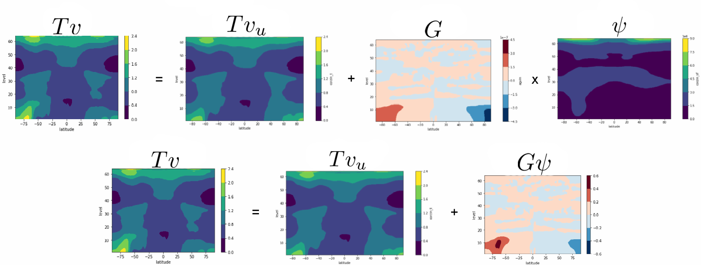
</div> 
 
---

<!-- Scoped style -->
<style scoped>
section {
  font-size: 21px;
}
.columns {
  display: grid;
  grid-template-columns: repeat(2, minmax(0, 1fr));
  gap: 1rem;
}
</style>

# Método Variacional - Parte II

<br />

## **4. Componentes**

### 4.2 Matriz de covariâncias dos Erros de Previsão 

<br />

<div class="columns">
<div>

<br />

#### **Método NMC - verificação**

- Inspeção visual das estruturas da matriz calculada
- Comparação com uma matriz de referência
- Para a matriz $\mathbf{B}$ global do GSI, pode-se utilizar o software [GSIBerror](https://gad-dimnt-cptec.github.io/GSIBerror/)
  * 🚗 Test drive disponível no [Google Colab](https://colab.research.google.com/github/GAD-DIMNT-CPTEC/GSIBerror/blob/main/notebooks/read_gsi_berror_python-class-final-en.ipynb)

</div>
<div>

<video width="560" height="315" controls>
  <source src="./figs/gsiberror.mp4" type="video/mp4">
  Seu navegador não suporta vídeo.
</video>

</div>
</div>
 
---

<!-- Scoped style -->
<style scoped>
section {
  font-size: 21px;
}
.columns {
  display: grid;
  grid-template-columns: repeat(2, minmax(0, 1fr));
  gap: 1rem;
}
</style>

# Método Variacional - Parte II

<br />

## **4. Componentes**

### 4.2 Matriz de covariâncias dos Erros de Previsão 

<br />

#### **Método NMC - exemplos**

<br />

<div align="center">
  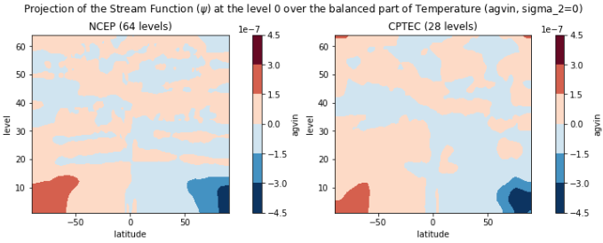
</div>
 
---

<!-- Scoped style -->
<style scoped>
section {
  font-size: 21px;
}
.columns {
  display: grid;
  grid-template-columns: repeat(2, minmax(0, 1fr));
  gap: 1rem;
}
</style>

# Método Variacional - Parte II

<br />

## **4. Componentes**

### 4.2 Matriz de covariâncias dos Erros de Previsão 

<br />

#### **Método NMC - exemplos**

<br />

<div align="center">
  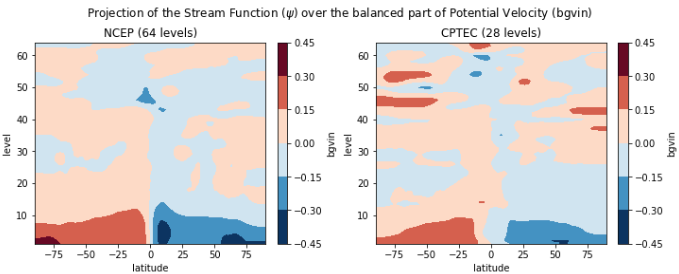
</div> 

---

<!-- Scoped style -->
<style scoped>
section {
  font-size: 21px;
}
.columns {
  display: grid;
  grid-template-columns: repeat(2, minmax(0, 1fr));
  gap: 1rem;
}
</style>

# Método Variacional - Parte II

<br />

## **4. Componentes**

### 4.2 Matriz de covariâncias dos Erros de Previsão 

<br />

#### **Método NMC - exemplos**

<br />

<div align="center">
  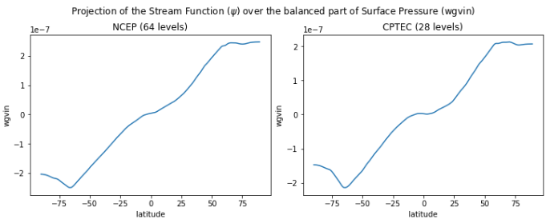
</div>

---

<!-- Scoped style -->
<style scoped>
section {
  font-size: 21px;
}
.columns {
  display: grid;
  grid-template-columns: repeat(2, minmax(0, 1fr));
  gap: 1rem;
}
</style>

# Método Variacional - Parte II

<br />

## **4. Componentes**

### 4.2 Matriz de covariâncias dos Erros de Previsão 

<br />

#### **Método NMC - exemplos**

<br />

<div align="center">
  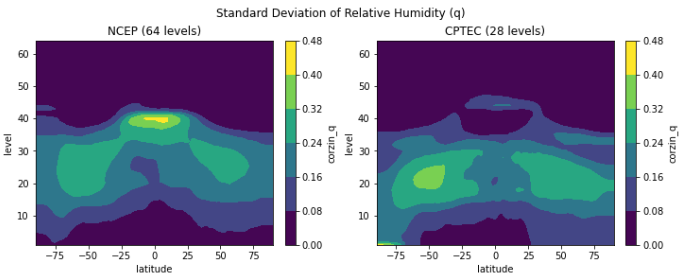
</div>

---

<!-- Scoped style -->
<style scoped>
section {
  font-size: 21px;
}
.columns {
  display: grid;
  grid-template-columns: repeat(2, minmax(0, 1fr));
  gap: 1rem;
}
</style>

# Método Variacional - Parte II

<br />

## **4. Componentes**

### 4.2 Matriz de covariâncias dos Erros de Previsão 

<br />

#### **Método NMC - exemplos**

<br />

<div align="center">
  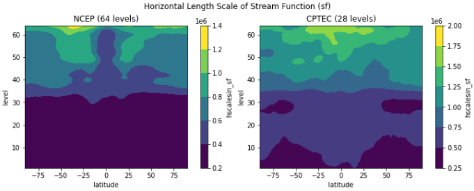
</div>

---

<!-- Scoped style -->
<style scoped>
section {
  font-size: 21px;
}
.columns {
  display: grid;
  grid-template-columns: repeat(2, minmax(0, 1fr));
  gap: 1rem;
}
</style>

# Método Variacional - Parte II

<br />

## **4. Componentes**

### 4.2 Matriz de covariâncias dos Erros de Previsão 

<br />

#### **Método NMC - exemplos**

<br />

<div align="center">
  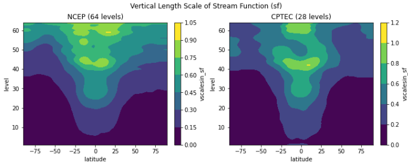
</div>

---

<!-- Scoped style -->
<style scoped>
section {
  font-size: 20px;
}
.columns {
  display: grid;
  grid-template-columns: repeat(2, minmax(0, 1fr));
  gap: 1rem;
}
</style>

# Método Variacional - Parte II

<br />

## **5. Visão geral sobre o método 4DVar**

<br />

- O 4DVar é uma extensão do método 3DVar
  * Permite que sejam assimiladas observações distribuídas dentro de um intervalo de tempo ($t_0,t_n$), considerando a dinâmica do modelo 💡
  * A função custo inclui um termo que mede a distância em relação ao background no início do intervalo ($t_0$) e o somatório (ao longo do tempo) para cada incremento de observação no seu tempo
  
    $$
    J[\mathbf{x}(t_0)] = \frac{1}{2}[\mathbf{x}(t_0) - \mathbf{x}_b(t_{0})]^T \mathbf{B}_{0}^{-1} [\mathbf{x}(t_0) - \mathbf{x}_b(t_{0})] + \frac{1}{2}\sum_{i=0}^{N} [\mathbf{y}_i - H(\mathbf{x}_i)]^T \mathbf{R}_i^{-1} [\mathbf{y}_i - H(\mathbf{x}i)]
    $$

* A variável de controle é o estado inicial do modelo (variáveis de estado) no tempo $t_0$, i.e., $\mathbf{x}(t_0)$
* A análise, no final do intervalo de tempo, é dado pela integração do modelo, i.e., $\mathbf{x}(t_n) = M_0[\mathbf{x}(t_0)]$
  * Isto significa que o modelo é usado como _strong constraint_, i.e., a análise deve satisfazer as equações do modelo
 
---

<!-- _footer: "" -->

<!-- Scoped style -->
<style scoped>
section {
  font-size: 18px;
}
.columns {
  display: grid;
  grid-template-columns: repeat(2, minmax(0, 1fr));
  gap: 1rem;
}
</style>

# Método Variacional - Parte II
  
<div class="columns">
<div>

<br />

## **5. Visão geral sobre o método 4DVar**

<br />

- No 4DVar, o modelo tangente linear representa a linearização do modelo não linear
  * Propaga as diferenças entre o modelo e o estado verdadeiro (perturbações) ao longo do tempo (**como o erro se propaga no tempo?**)
  
    $$
    \begin{align}
    \mathbf{x}_{t+1} &= M(\mathbf{x}_t) \\
    \delta\mathbf{x}_{t+1} &= \mathbf{M}_{t}\delta\mathbf{x}_t
    \end{align}
    $$
  
  * 👉 $M_t$ é o Jacobiano de $\mathbf{M}$

* O modelo adjunto, é o transposto do modelo tangente linear
  * Faz o processo inverso, ou seja, propaga a sensibilidade - do tempo futuro para o passado (**como a observação corrige o estado inicial?** 🤯)
* No 4DVar, a matriz $\mathbf{B}$ é fixa no tempo (tal como no 3DVar), mas as covariâncias são propagadas de forma imlícita pelo modelo

</div>
<div>

<br />
<br />
<br />
<br />

<video width="570" height="330" controls>
  <source src="./figs/4dvar.mp4" type="video/mp4">
  Seu navegador não suporta vídeo.
</video>  

<div style="
  background-color: #f8d7da; 
  color: #721c24; 
  padding: 20px; 
  border-radius: 10px; 
  text-align: center;
  max-width: 600px;
  margin: 0 auto;
  margin-top:20px;
  font-size: 18px;
">
Video sobre os 20 anos de operações do 4DVar no ECMWF: <a href="https://www.youtube.com/watch?v=9c4kXW7btBE" target="_blank">link</a>
</div>

</div>
</div>  
  
---

<!-- Scoped style -->
<style scoped>
section {
  font-size: 21px;
}
.columns {
  display: grid;
  grid-template-columns: repeat(2, minmax(0, 1fr));
  gap: 1rem;
}
</style>

# Método Variacional - Parte II

<br />

## **6. Atividades realizadas no CPTEC com o método variacional**

<br />

- Projetos operacionais desenvolvidos/aplicados no CPTEC utilizando o 3DVar:
  * RPSAS (~2000): Regional PSAS
    * Utilizava o modelo regional Eta e o sistema de assimilação de dados PSAS
  * GPSAS (~2000): Global PSAS
    * Utilizava o modelo global MCGA e o sistema de assimilação de dados PSAS
  * G3DVar (~2010):
    * Utilizava o modelo global MCGA e o sistema de assimilação de dados GSI
  * SMNA (~2020): Sistema de Modelagem Numérica e Assimilação de dados
    * Utiliza o modelo global BAM e o sistema de assimilação de dados GSI
  * MONAN+JEDI (a partir de 2024): próxima geração do sistema de assimilação de dados do CPTEC
    * Utiliza o modelo multiescalas MONAN e o sistema de assimilação de dados JEDI

---

<!-- Scoped style -->
<style scoped>
section {
  font-size: 21px;
}
</style>


# :thinking: Dúvidas

<br />
<br />
<br />
<br />
<br />
<br />
<br />

:link: https://cfbastarz.github.io/met563-3/
:octopus: https://github.com/cfbastarz/MET563-3
:email: carlos.bastarz@inpe.br

