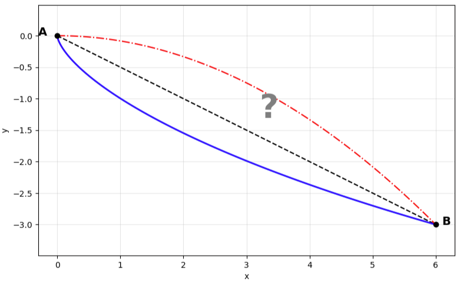

<!-- _footer: "" -->

<!-- Scoped style -->

# **Introdução à Assimilação de Dados (MET 563-3)**

### Método Variacional - Parte I

Dr. Carlos Frederico Bastarz
 
Dr. Dirceu Luis Herdies
 
 
Programa de Pós-Graduação em Meteorologia (PGMET) do INPE
 
 
20 de Outubro de 2025

---

<!-- Scoped style -->

# Método Variacional

 

## **Sumário**

 

### Parte I

1. O que é método variacional?
2. Revisão de Álgebra Linear (Matrizes)
3. Introdução ao método 3DVar
  3.1 Histórico e desenvolvimento
  3.2 Características principais
  3.3 _Physical-space Statistical Analysis System_ (PSAS)
  3.4 _First Guess at Apropriate Time_ (FGAT)

### Parte II

4. Componentes
  4.1 Método de minimização da função custo do 3DVar
  4.2 Matriz de covariâncias dos Erros de Previsão
  4.3 Modelo de Transferência Radiativa
  4.4 Controle de Qualidade
5. Visão geral sobre o método 4DVar
6. Atividades realizadas no CPTEC com o método 3DVar

---

<!-- Scoped style -->

# Método Variacional - Parte I

 

## **1. O que é o método variacional?**

* Surge no século XVII com o matemático suíço Jean Bernoulli com a proposição do seguinte problema: 
  * _Entre dois pontos, sendo um mais alto do que o outro, qual é a forma da rampa pela qual um corpo desce mais rápido, apenas sob a ação da gravidade e sem atrito?_
  
     
  
    

      
    
  

---

<!-- _footer: "" -->

<!-- Scoped style -->

# Método Variacional - Parte I

 

## **1. O que é o método variacional?**

 

* 🎲 Este problema ficou conhecido como o **Problema da Braquistócrona** (a curva descrita pela trajetória do corpo) e emprega a equação de Euler-Lagrange para a sua solução
* 💡 Inseriu uma nova ideia na matemática: ao invés de se buscar um número que minimiza uma expressão, busca-se uma função (que descreve a forma da curva)
* ⏳ O tempo total de descida do corpo pode ser descrito como uma integral que depende dessa função e o cálculo variacional permite determinar qual função faz essa integral ser mínima
* 👉 A essência do cálculo variacional é encontrar uma função que minimiza ou maximiza um funcional, ou seja, uma expressão que associa um número a cada função possível

---

<!-- Scoped style -->

# Método Variacional - Parte I

## **1. O que é o método variacional?**

### Um exemplo simples

- Entre todos os caminhos $y(x)$ que ligam os pontos de coordenadas $(x_{1},y_{1})$ e $(x_{2},y_{2})$, encontre aquele que minimiza o comprimento da curva
  1) Para resolver este problema, primeiro temos que definir o nosso funcional:
      * O comprimento $L$ da curva é $L[y] = \int_{x_{1}}^{x_{2}}{\sqrt{1 + (y\prime)^{2}}}dx$, com $y\prime = \frac{dy}{dx}$
  2) Definido o funcional $L[y]$, aplicamos a equação de Euler-Lagrange:
      * $F(x,y,y\prime) = \sqrt{1 + (y\prime)^{2}}$
      * A equação de Euler-Lagrange é $\frac{d}{dx}(\frac{\partial F}{\partial y\prime}) - \frac{\partial F}{\partial y} = 0$
      * Como $F$ não depende diretamente de $y$, o segundo termo ($\frac{\partial F}{\partial y}$) é zero: $\frac{d}{dx}(\frac{y\prime}{\sqrt{1 + (y\prime)^{2}}}) = 0$
  3) Se a derivada é nula, então temos uma constante $\frac{y\prime}{\sqrt{1 + (y\prime)^{2}}} = C$, o que implica que $y\prime$ é uma constante e que portanto, $y(x)$ é linear, ou seja, $y(x) = ax + b$
  4) Logo, a função $y(x)$ que minimiza o comprimento da curva dado pelo funcional $L[y]$ é uma reta

---

<!-- _class: invert -->

<!-- _backgroundColor: "#000000" -->

<!-- _footer: "" -->

<!-- Scoped style -->

# Método Variacional - Parte I

 

## **1. O que é o método variacional?**

 

### O Problema da braquistócrona

- _Entre dois pontos, sendo um mais alto do que o outro, qual é a forma da rampa pela qual um corpo desce mais rápido, apenas sob a ação da gravidade e sem atrito?_
  

<video width="640" height="360" controls>
  <source src="./figs/SixSequentialCycloids.mp4" type="video/mp4">
  Seu navegador não suporta vídeo.
</video>  

<video width="640" height="360" controls>
  <source src="./figs/BrachistochroneCurvesWithTimers.mp4" type="video/mp4">
  Seu navegador não suporta vídeo.
</video> 

---

<!-- Scoped style -->

# Método Variacional - Parte I

 

## **1. O que é o método variacional?**

### O Problema da braquistócrona
  

- O tempo de descida do corpo sobre a **curva de tempo mais curto**, considera a conversão de energia potencial em energia cinética: $v = \sqrt{2gy}$

- Onde:
  - $y$ é a altura medida do ponto mais alto
  - $g$ é a aceleração da gravidade
  
* O tempo de deslocamento infinitesimal é $dt = \frac{ds}{v}$, ao longo do comprimento de arco $ds$ dado por:

  $$
  ds = \sqrt{1 + \bigg( \frac{dy}{dx} \bigg)^{2}}dx
  $$  
  

* O tempo total de descida, é dado pela interal (do ponto $A$ ao ponto $B$):

  $$
  T = \int_{A}^{B}{\frac{\sqrt{1 + (y\prime)^{2}}}{\sqrt{2gy}}}dx
  $$

  - Onde:

    - $y\prime = \frac{dy}{dx}$ é a variação da altura

  
  
---

<!-- Scoped style -->

# Método Variacional - Parte I

 

## **1. O que é o método variacional?**

 

### O Problema da braquistócrona

 

- O problema do cálculo variacional é encontrar a função $y(x)$ que minimiza a integral funcional:

$$
T[y] = \int F(y,y\prime)dx
$$
  
- Onde:
  - $F(y,y\prime) = \frac{\sqrt{1+(y\prime)^{2}}}{\sqrt{2gy}}$

* Aplica-se a equação de Euler-Lagrange $\frac{d}{dx}\big(\frac{\partial F}{\partial y\prime}\big) - \frac{\partial F}{\partial y} = 0$, a partir da qual obtém-se uma equação diferencial cuja solução é a curva cicloide:

* Forma paramétrica da ciclóide:

  $$
  \begin{cases}
      x = R(\theta - \text{sin} \theta) \\
      y = R(1 - \text{cos} \theta)
  \end{cases}
  $$

  - Onde:
    - $R$ é o raio do círculo que gera a ciclóide
    - $\theta$ é o ângulo da curva

---

<!-- Scoped style -->

# Método Variacional - Parte I

 

## **2. Revisão de Álgebra Linear (Matrizes)**
  
- Matriz é um conjunto retangular de informações arranjado em linhas e colunas
- Os itens individuais de uma matriz são chamados de elementos
- Por exemplo, uma matriz retangular $\mathbf{A}_{m \times n}$, com $m$ linhas e $n$ colunas:

 

$$
\mathbf{A} = 
\begin{bmatrix}
a_{11} & a_{12} & \cdots & a_{1n} \\
a_{21} & a_{22} & \cdots & a_{2n} \\
\vdots & \vdots & \ddots & \vdots \\
a_{m1} & a_{m2} & \cdots & \textcolor{red}{a_{mn}}
\end{bmatrix}
$$
  
---

<!-- Scoped style -->

# Método Variacional - Parte I

 

## **2. Revisão de Álgebra Linear (Matrizes)**

- Matrizes de mesmo tamanho podem ser adicionadas ou subtraídas elemento por elemento
- Multiplicação de matrizes é possível desde que o número de colunas da primeira matriz, seja igaul ao número de linhas da segunda matriz
- O tamanho de uma matriz é definido como o número de linhas e colunas que ela contém
- Uma matriz com $m$ linhas é $n$ colunas é chamada matriz $m \times n$, onde $m$ e $n$ são chamados de dimensões da matriz
- Uma matriz $3 \times 2$:

$$
\mathbf{A} = 
\begin{bmatrix}
9 & 10 \\
-3 & -4 \\
0 & 5,87
\end{bmatrix}
$$
  
---

<!-- Scoped style -->

# Método Variacional - Parte I

 

## **2. Revisão de Álgebra Linear (Matrizes)**

- Matrizes com uma única linha são chamadas de vetor linha e matrizes com uma única coluna, são chamadas de vetor coluna
- Matrizes com o mesmo número de linhas e colunas, são chamadas de matrizes quadradas
- Exemplos:
  

$$
\mathbf{x} = 
\begin{bmatrix}
x_{1} & x_{2} & x_{3} & \dots & x_{n} 
\end{bmatrix}
$$
  
$$
\mathbf{x} = 
\begin{bmatrix}
x_{1} \\
x_{2} \\
x_{3} \\
\vdots \\
x_{n} 
\end{bmatrix}
$$

 
 

$$
\mathbf{A} = 
\begin{bmatrix}
1 & -10 & -9,1 & 0 \\
45 & 0,01 & -0.8 & 3 \\
-11 & -90 & 11 & -3 \\
3,14 & 11.1 & 1 & 6
\end{bmatrix}
$$

 
  
---

<!-- Scoped style -->

# Método Variacional - Parte I

 

## **2. Revisão de Álgebra Linear (Matrizes)**

- Os subscritos, normalmente representados por $i,j$, correspondem à posição de uma dado elemento dentro da matriz:
- Por exemplo, o elemento $\mathbf{A}_{3,2} = 11$
  
   
  
$$
\mathbf{A} = 
\begin{bmatrix}
1 & -10 & -9,1 & 0 \\
45 & 0,01 & -0.8 & 3 \\
-11 & -90 & \textcolor{red}{11} & -3 \\
3,14 & 11.1 & 1 & 6
\end{bmatrix}
$$

---

<!-- Scoped style -->

# Método Variacional - Parte I

 

## **2. Revisão de Álgebra Linear (Matrizes)**

### Adição de matrizes

 

$$
\mathbf{A} + \mathbf{B} = 
\begin{bmatrix}
a_{11} & a_{12} & \cdots & a_{1n} \\
a_{21} & a_{22} & \cdots & a_{2n} \\
\vdots & \vdots & \ddots & \vdots \\
a_{m1} & a_{m2} & \cdots & a_{mn}
\end{bmatrix} 
+
\begin{bmatrix}
b_{11} & b_{12} & \cdots & b_{1n} \\
b_{21} & b_{22} & \cdots & b_{2n} \\
\vdots & \vdots & \ddots & \vdots \\
b_{m1} & b_{m2} & \cdots & b_{mn}b
\end{bmatrix}
=
\begin{bmatrix}
a_{11}+b_{11} & a_{12}+b_{12} & \cdots & a_{1n}+b_{1n} \\
a_{21}+b_{21} & a_{22}+b_{22} & \cdots & a_{2n}+b_{2n} \\
\vdots & \vdots & \ddots & \vdots \\
a_{m1}+b_{m1} & a_{m2}+b_{m2} & \cdots & a_{mn}+b_{mn}
\end{bmatrix}
$$

 

$$
\mathbf{A} + \mathbf{B} = 
\begin{bmatrix}
9 & 10 \\
-3 & -4 \\
0 & 5,87
\end{bmatrix}
+
\begin{bmatrix}
0 & -3 \\
4 & 7 \\
9 & -3,1
\end{bmatrix}
=
\begin{bmatrix}
9+0 & 10-3 \\
-3+4 & -4+7 \\
0+9 & 5,87-3,1
\end{bmatrix}
=
\begin{bmatrix}
9 & 7 \\
1 & 3 \\
9 & 2,77      
\end{bmatrix}
$$

---

<!-- Scoped style -->

# Método Variacional - Parte I

 

## **2. Revisão de Álgebra Linear (Matrizes)**

### Transposição de matrizes

- A transposição de uma matriz representa a reflexão em relação à sua diagonal principal, que se inicia no canto superior esquerdo
- Se $\mathbf{A}$ é uma matriz $n \times m$, então a sua transposta é a $\mathbf{A}^{\text{T}}$ de dimensões $m \times n$:

 

$$
\mathbf{A} = 
\begin{bmatrix}
a_{11} & a_{12} & \cdots & a_{1n} \\
a_{21} & a_{22} & \cdots & a_{2n} \\
\vdots & \vdots & \ddots & \vdots \\
a_{m1} & a_{m2} & \cdots & a_{mn}
\end{bmatrix}
$$

$$
\mathbf{A}^{\text{T}} = 
\begin{bmatrix}
a_{11} & a_{21} & \cdots & a_{m1} \\
a_{12} & a_{22} & \cdots & a_{m2} \\
\vdots & \vdots & \ddots & \vdots \\
a_{1n} & a_{2n} & \cdots & a_{nm}
\end{bmatrix}
$$

  
---

<!-- Scoped style -->

# Método Variacional - Parte I

 

## **2. Revisão de Álgebra Linear (Matrizes)**

### Transposição de matrizes

- Propriedades:

$$
(\mathbf{A^{\text{T}}})^{\text{T}} = \mathbf{A}
$$
$$
(\mathbf{A} + \mathbf{B})^{\text{T}} = \mathbf{A}^\text{T} + \mathbf{B}^\text{T} 
$$
$$
(\mathbf{A}\mathbf{B})^\text{T}=\mathbf{B}^{T}\mathbf{A}^\text{T}
$$
$$
(\mathbf{A}^\text{T})^{-1}=(\mathbf{A}^{-1})^\text{T}
$$

$$
\mathbf{a}\cdot\mathbf{b}=\mathbf{a}^\text{T}\mathbf{b}
$$
$$
\text{det}(\mathbf{A}^\text{T})=\text{det}(\mathbf{A})
$$
$$
(c\mathbf{A})^\text{T}=c\mathbf{A}^\text{T}
$$

---

<!-- Scoped style -->

# Método Variacional - Parte I

## **2. Revisão de Álgebra Linear (Matrizes)**

### Multiplicação de matrizes

- Multiplicação entre duas matrizes só é possível se o número de colunas da matriz à esquerda for igual ao número de linhas da matriz à direita:

$$
[\mathbf{A}\mathbf{B}]_{i,j} = a_{i,1}b_{1,j} + a_{i,2}b_{2,j} + \dots + a_{i,n}b_{n,j} = \sum_{r=1}^{n}{a_{i,r}b_{r,j}}
$$

$$
\mathbf{A} =
\begin{bmatrix}
\color{blue}{a_{11}} & \color{blue}{a_{12}} & \cdots & \color{blue}{a_{1n}} \\
a_{21} & a_{22} & \cdots & a_{2n} \\
\vdots & \vdots & \ddots & \vdots \\
a_{m1} & a_{m2} & \cdots & a_{mn}
\end{bmatrix}, 
\quad
\mathbf{B} =
\begin{bmatrix}
\color{green}{b_{11}} & b_{12} & \cdots & b_{1p} \\
\color{green}{b_{21}} & b_{22} & \cdots & b_{2p} \\
\vdots & \vdots & \ddots & \vdots \\
\color{green}{b_{n1}} & b_{n2} & \cdots & b_{np}
\end{bmatrix}
$$

$$
\mathbf{C} = \mathbf{AB} =
\begin{bmatrix}
c_{11} & \cdots & \color{red}{c_{1j}} & \cdots & c_{1p} \\
\vdots &        & \vdots &        & \vdots \\
c_{i1} & \cdots & \color{red}{c_{ij}} & \cdots & c_{ip} \\
\vdots &        & \vdots &        & \vdots \\
c_{m1} & \cdots & c_{mp} & \cdots & c_{mp}
\end{bmatrix}
$$

$$
\color{red}{c_{ij}} = 
\color{blue}{a_{i1}, a_{i2}, \dots, a_{in}} \cdot 
\color{green}{\begin{bmatrix}b_{1j} \\ b_{2j} \\ \vdots \\ b_{nj}\end{bmatrix}}
= a_{i1}b_{1j} + a_{i2}b_{2j} + \dots + a_{in}b_{nj}
$$

---

<!-- Scoped style -->

# Método Variacional - Parte I

 

## **2. Revisão de Álgebra Linear (Matrizes)**

 

### Multiplicação de matrizes

- Propriedades:

$$
\mathbf{A}\mathbf{B}\neq\mathbf{B}\mathbf{A}
$$
$$
\mathbf{A}(\mathbf{B}\mathbf{C})=(\mathbf{A}\mathbf{B})\mathbf{C}
$$
$$
\text{tr}(\mathbf{A}\mathbf{B})=\text{det}(\mathbf{A})\text{det}\mathbf{B}
$$
$$
\mathbf{A}(\mathbf{B}+\mathbf{C}) = \mathbf{A}\mathbf{B}+\mathbf{A}\mathbf{C}, \quad (\mathbf{A}+\mathbf{B})\mathbf{C} = \mathbf{A}\mathbf{C} + \mathbf{B}\mathbf{C}
$$

$$
\lambda(\mathbf{A}\mathbf{B})=(\lambda\mathbf{A})\mathbf{B}
$$
$$
(\mathbf{A}\mathbf{B})^\text{T} = \mathbf{B}^\text{T} \mathbf{A}^\text{T}
$$
$$
\mathbf{A}\mathbf{A}^{-1} = \mathbf{A}^{-1}\mathbf{A} = \mathbf{I}
$$
$$
\mathbf{A}\mathbf{I}=\mathbf{I}\mathbf{A}=\mathbf{A}
$$

---

<!-- Scoped style -->

# Método Variacional - Parte I

 

## **2. Revisão de Álgebra Linear (Matrizes)**

 

### Tipos de matrizes

- Diagonal:

$$
\begin{bmatrix}
a_{11} & 0 & 0 \\
0 & a_{22} & 0 \\
0 & 0 & a_{33}
\end{bmatrix}
$$

- Triangular inferior:

$$
\begin{bmatrix}
a_{11} & 0 & 0 \\
a_{21} & a_{22} & 0 \\
a_{31} & a_{32} & a_{33}
\end{bmatrix}
$$

- Triangular superior:

$$
\begin{bmatrix}
a_{11} & a_{12} & a_{13} \\
0 & a_{22} & a_{a23} \\
0 & 0 & a_{33}
\end{bmatrix}
$$

- Identidade:

$$
\mathbf{I}_{1} = [1], \quad

\mathbf{I}_{2} = 
\begin{bmatrix}
1 & 0 \\
0 & 1 
\end{bmatrix}, \quad

\mathbf{I}_{3} = 
\begin{bmatrix}
1 & 0 & 0 \\
0 & 1 & 0 \\
0 & 0 & 1
\end{bmatrix} \quad,\quad \dots \quad, \quad

\mathbf{I}_{n} = 
\begin{bmatrix}
1 & 0 & \cdots & 0 \\
0 & 1 & \cdots & 0 \\
\vdots & \vdots & \ddots & \vdots \\
0 & 0 & \cdots & 1
\end{bmatrix}
$$

---

<!-- Scoped style -->

# Método Variacional - Parte I

 

## **2. Revisão de Álgebra Linear (Matrizes)**

 

### Tipos de matrizes

- Simétrica ($\mathbf{A}$ deve ser quadrada):

$$
\mathbf{A} = \mathbf{A}^\text{T}
\begin{bmatrix}
1 & -10 & -9,1 & 0 \\
45 & 0,01 & -0.8 & 3 \\
-11 & -90 & 11 & -3 \\
3,14 & 11.1 & 1 & 6
\end{bmatrix}
$$

 

- Inversível (se $\text{det}(\mathbf{A})=0$, $\mathbf{A}$ não é inversível):

$$
\mathbf{A}\mathbf{B}=\mathbf{B}\mathbf{A}=\mathbf{I}_{n}
$$

$$
\mathbf{A}^{-1} = 
\begin{bmatrix}
a & b \\
c & d
\end{bmatrix}^{-1} = 
\frac{1}{\text{det}(\mathbf{A})}
\begin{bmatrix}
d & -b \\
-c & a
\end{bmatrix} = 
\frac{1}{ad-bc}
\begin{bmatrix}
d & -b \\
-c & a
\end{bmatrix}
$$

$$
\mathbf{A}^{-1} = 
\begin{bmatrix}
a & b & c \\
d & e & f \\
g & h & k
\end{bmatrix}^{-1} = 
\frac{1}{\text{det}(\mathbf{A})} \text{adj}(\mathbf{A})
$$

Onde:

$$
\text{adj}(\mathbf{A}) = \text{Cof}(\mathbf{A})^\text{T} =
\begin{bmatrix}
C_{11} & C_{21} & C_{31} \\
C_{12} & C_{22} & C_{32} \\
C_{13} & C_{23} & C_{33}
\end{bmatrix}
$$

---

<!-- Scoped style -->

# Método Variacional - Parte I

 

## **2. Revisão de Álgebra Linear (Matrizes)**

 

### 🎲 Exercícios

1. Adição de matrizes 3 x 3

    - Sejam $\mathbf{A} = \begin{pmatrix} 2 & 0 & 1 \\ 1 & -1 & 3 \\ 0 & 4 & 2 \end{pmatrix}, \quad
    \mathbf{B} = \begin{pmatrix} 1 & 2 & 0 \\ 0 & 3 & -1 \\ 5 & 1 & 2 \end{pmatrix}$, calcule $\mathbf{A}+\mathbf{B}$
 
2) Multiplicação de matrizes 3 x 3

    - Sejam $\mathbf{A} = \begin{pmatrix} 2 & 0 & 1 \\ 1 & -1 & 3 \\ 0 & 4 & 2 \end{pmatrix}, \quad
      \mathbf{B} = \begin{pmatrix} 1 & 2 & 0 \\ 0 & 3 & -1 \\ 5 & 1 & 2 \end{pmatrix}$, calcule $\mathbf{A}\cdot\mathbf{B}$
  
---

<!-- Scoped style -->

# Método Variacional - Parte I

 

## **2. Revisão de Álgebra Linear (Matrizes)**

 

### 🎲 Exercícios

3. Determinante de matriz 3 x 3
  
    - Calcule o determinante de $\mathbf{C} = \begin{pmatrix} 2 & 0 & 1 \\ -1 & 3 & 2 \\ 0 & 4 & -1 \end{pmatrix}$
  
4) Inversa de matriz 2 x 2
  
    - Seja $\mathbf{D} = \begin{pmatrix} 2 & 1 \\ 3 & 2 \end{pmatrix}$, enconte $\mathbf{D}^{-1}$, se existir
  
---

<!-- Scoped style -->

# Método Variacional - Parte I

 

## **2. Revisão de Álgebra Linear (Matrizes)**

 

### 🟰 Respostas  

1. Adição de matrizes 3 x 3

    - Sejam $\mathbf{A} = \begin{pmatrix} 2 & 0 & 1 \\ 1 & -1 & 3 \\ 0 & 4 & 2 \end{pmatrix}, \quad
    \mathbf{B} = \begin{pmatrix} 1 & 2 & 0 \\ 0 & 3 & -1 \\ 5 & 1 & 2 \end{pmatrix}$, calcule $\mathbf{A}+\mathbf{B}$
  
     
  
    * 👉 $\mathbf{A} + \mathbf{B} = \begin{pmatrix} 2+1 & 0+2 & 1+0 \\ 1+0 & -1+3 & 3-1 \\ 0+5 & 4+1 & 2+2 \end{pmatrix} =
\begin{pmatrix} 3 & 2 & 1 \\ 1 & 2 & 2 \\ 5 & 5 & 4 \end{pmatrix}$
  
---

<!-- Scoped style -->

# Método Variacional - Parte I

 

## **2. Revisão de Álgebra Linear (Matrizes)**

 

### 🟰 Respostas  

2. Multiplicação de matrizes 3 x 3

    - Sejam $\mathbf{A} = \begin{pmatrix} 2 & 0 & 1 \\ 1 & -1 & 3 \\ 0 & 4 & 2 \end{pmatrix}, \quad
      \mathbf{B} = \begin{pmatrix} 1 & 2 & 0 \\ 0 & 3 & -1 \\ 5 & 1 & 2 \end{pmatrix}$, calcule $\mathbf{A}\cdot\mathbf{B}$

     
  
    * 👉 $\mathbf{A}\cdot\mathbf{B} =
\begin{pmatrix} 
2\cdot1 + 0\cdot0 + 1\cdot5 & 2\cdot2 + 0\cdot3 + 1\cdot1 & 2\cdot0 + 0\cdot(-1) + 1\cdot2 \\
1\cdot1 + (-1)\cdot0 + 3\cdot5 & 1\cdot2 + (-1)\cdot3 + 3\cdot1 & 1\cdot0 + (-1)\cdot(-1) + 3\cdot2 \\
0\cdot1 + 4\cdot0 + 2\cdot5 & 0\cdot2 + 4\cdot3 + 2\cdot1 & 0\cdot0 + 4\cdot(-1) + 2\cdot2
\end{pmatrix} =
\begin{pmatrix} 7 & 5 & 2 \\ 16 & 2 & 7 \\ 10 & 14 &  0 \end{pmatrix}$  
      
---

<!-- _footer: "" -->

<!-- Scoped style -->

# Método Variacional - Parte I

 

## **2. Revisão de Álgebra Linear (Matrizes)**

 

### 🟰 Respostas  

3. Determinante de matriz 3 x 3
  
    - Calcule o determinante&#128312; de $\mathbf{C} = \begin{pmatrix} 2 & 0 & 1 \\ -1 & 3 & 2 \\ 0 & 4 & -1 \end{pmatrix}$
    
     
  
    * 👉 $\det(\mathbf{C}) = \{[2\cdot3\cdot(-1)] + [0\cdot2\cdot0] + [1\cdot(-1)\cdot4]\} - \{[0\cdot3\cdot1] + [4\cdot2\cdot2] + [(-1)\cdot(-1)\cdot0]\}$
    * 👉 $\det(\mathbf{C}) = -10 - 16$
    * 👉 $\det(\mathbf{C}) = -26$

&#128312;Utilizando a regra de Sarrus
 
    
---

<!-- Scoped style -->

# Método Variacional - Parte I

 

## **2. Revisão de Álgebra Linear (Matrizes)**

 

### 🟰 Respostas     
   
4. Inversa de matriz 2 x 2
  
    - Seja $\mathbf{D} = \begin{pmatrix} 2 & 1 \\ 3 & 2 \end{pmatrix}$, enconte $\mathbf{D}^{-1}$, se existir   

     
  
    * 👉 $\text{det}({\mathbf{H}}) = 2\cdot2-1\cdot3=4-3=1$
    * 👉 $\mathbf{H}^{-1} = \begin{pmatrix} 2 & -1 \\ -3 & 2 \end{pmatrix}$
    
---

<!-- Scoped style -->

# :thinking: Dúvidas

 
 
 
 
 
 
 

:link: https://cfbastarz.github.io/met563-3/
:octopus: https://github.com/cfbastarz/MET563-3
:email: carlos.bastarz@inpe.br
