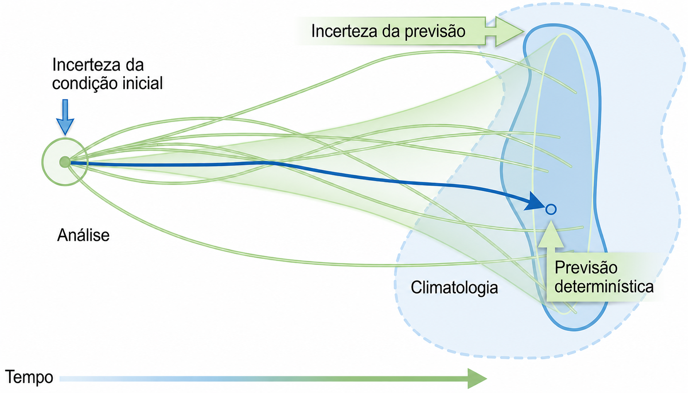
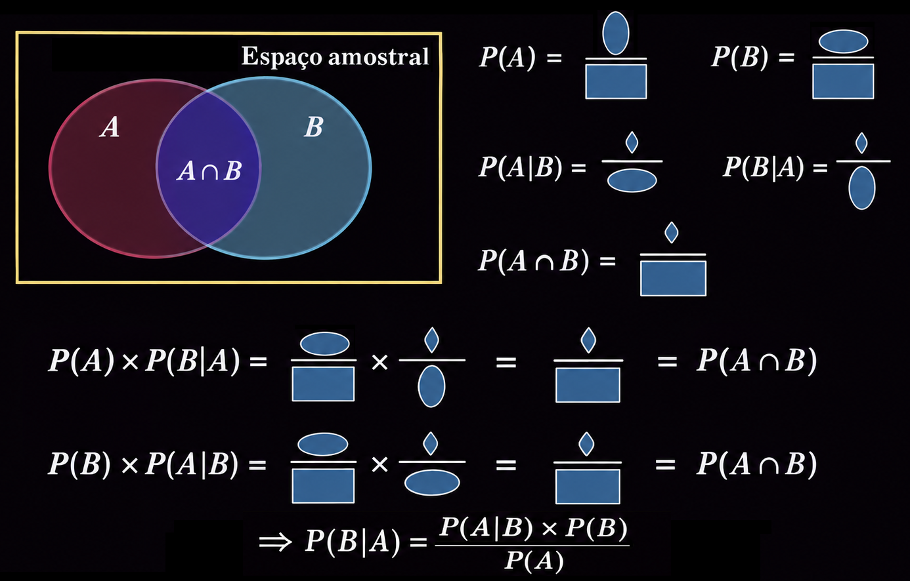

<!-- _footer: "" -->


<!-- Scoped style -->
<style scoped>
section {
  font-size: 21px;
}
span.date {
  font-size: 15px;
}

span.program {
  font-size: 18px;
}
</style>

<style>
span.footnote {
    border-top: 0.1em dotted #555;
    font-size: 60%;
    margin-top: auto;
    position:absolute;
    bottom:0;
    width:100%;
    height:60px;    
}
</style>

<br />

# **Introdução à Assimilação de Dados (MET 563-3)**

### Métodos Baseados em Conjuntos

<br />
<p>Dr. Carlos Frederico Bastarz
<br />
<br />
<br />
<span class="program">Programa de Pós-Graduação em Meteorologia (PGMET) do INPE</span>
<br />
<br />
<span class="date">12 de Agosto de 2026</span>
<br />
<br />
🥷  🐦
</p>

---


<!-- Scoped style -->
<style scoped>
section {
  font-size: 21px;
}
</style>

# Métodos Baseados em Conjuntos

<br />

## **Sumário**

<br />
<br />

1. Filtro de Kalman linear
2. Método de Monte Carlo
3. Ensembles
4. Ensemble Kalman Filter
  4.1 Histórico e desenvolvimento
  4.2 Características principais
  4.3 _Inflation_
  4.4 Localização
5. Atividade - Filtro de Bayes Recursivo

---


<!-- Scoped style -->
<style scoped>
section {
  font-size: 19px;
}
.columns {
  display: grid;
  grid-template-columns: repeat(2, minmax(0, 1fr));
  gap: 1rem;
}
</style>

# Métodos Baseados em Conjuntos

<br />

## **1. Filtro de Kalman linear**

<br />
<br />

<div class="columns">
<div>

* 💭 O Filtro de Kalman calcula analiticamente a atualização do estado e da covariância, assumindo
  * Linearidade
  * Ruído gaussiano
  
* ⚙️ Processo é realizado em duas etapas
  1. Previsão
  2. Correção

</div>
<div>

* 1️⃣ Na etapa de **previsão**
  * Ocorre a extrapolação do estado do modelo e da incerteza

* 2️⃣ Na etapa da **correção**
  * Ocorre o cálculo da matriz ganho de Kalman
  * Ocorre a atualização da estimativa do estado com as observações
  * Ocorre a atualização da estimativa da incerteza

</div>
</div>

---

<!-- Scoped style -->
<style scoped>
section {
  font-size: 19px;
}
.columns {
  display: grid;
  grid-template-columns: repeat(2, minmax(0, 1fr));
  gap: 1rem;
}
</style>

# Métodos Baseados em Conjuntos

<br />

## **1. Filtro de Kalman linear**
 
<br /> 

<div class="columns">
<div>

- **1️⃣ Etapa de previsão**
  - 👉 Extrapolação do estado do modelo e da incerteza
  
  $$
  \mathbf{x}_{k}^{b} = \mathbf{M}_{k-1}(\mathbf{x}_{k-1}^{a})+\mathbf{w}_{k-1}
  $$
  
  $$
  \mathbf{P}^{b}_{k} = \mathbf{M}_{k-1}\mathbf{P}_{k-1}^{a}\mathbf{M}_{k-1}^{\text{T}}+\mathbf{Q}_{k-1}
  $$
  
  - Onde:
    - $\mathbf{x}_{k}^{b}$ é o vetor background no tempo $k$
    - $\mathbf{M}_{k-1}$ é o modelo de previsão (linear), integrado do tempo $k-1$ até $k$
    - $\mathbf{x}_{k-1}^{a}$ é o vetor análise no tempo $k-1$
    - $\mathbf{w}_{k-1}$ é o erro do modelo, com covariância $\mathbf{Q}_{k-1}$
    - $\mathbf{P}_{k}^{b}$ é a covariância do background no tempo $k$
  
</div>
<div>


- **2️⃣ Etapa da correção**
  - 👉 Cálculo da matriz ganho de Kalman (matriz peso, tal como na Interpolação Ótima)
  
  $$
  \mathbf{K}_{k}=\mathbf{P}_{k}^{b}\mathbf{H}_{k}^{\text{T}}(\mathbf{H}_{k}\mathbf{P}_{k}^{b}\mathbf{H}_{k}^{\text{T}}+\mathbf{R}_{k})^{-1}
  $$
  
  - 👉 Atualização da estimativa do estado com as observações
  
  $$
  \mathbf{x}_{k}^{a}=\mathbf{x}_{k}^{b}+\mathbf{K}_{k}[\mathbf{y}_{k}-\mathbf{H}_{k}(\mathbf{x}_{k}^{b})]
  $$
  
  - 👉 Atualização da estimativa da incerteza
  
  $$
  \mathbf{P}_{k}^{a}=(\mathbf{I}-\mathbf{K}_{k}\mathbf{H}_{k})\mathbf{P}_{k}^{b}
  $$

  - Onde:
    - $\mathbf{x}_{k}^{b}$ é o vetor análise no tempo $k$
    - $\mathbf{P}_{k}^{a}$ é a covariância da análise no tempo $k$
  
</div>
</div> 

---

<!-- Scoped style -->
<style scoped>
section {
  font-size: 19px;
}
.columns {
  display: grid;
  grid-template-columns: repeat(2, minmax(0, 1fr));
  gap: 1rem;
}
</style>

# Métodos Baseados em Conjuntos

<br />

## **1. Filtro de Kalman linear**

<br />

- ✅ Vantagens do Filtro de Kalman linear
  * Além de estimar o estado do sistema (análise), estima analiticamente a covariância (incerteza)
    * Permite quantificar a confiança na análise
    
      $$
      \mathbf{x}_{k}^{a}=\mathbf{x}_{k}^{b}+\mathbf{K}_{k}[\mathbf{y}_{k}-\mathbf{H}_{k}(\mathbf{x}_{k}^{b})], \quad \mathbf{P}_{k}^{a}=(\mathbf{I}-\mathbf{K}_{k}\mathbf{H}_{k})\mathbf{P}_{k}^{b}
      $$
    
    * A matriz $\mathbf{K}$ (ganho de Kalman) ajusta a contribuição do modelo e da observação
    
<br />

* ❌ Limitações do Filtro de Kalman linear
  * Não é adequado para sistemas de alta dimensão (e.g., atmosfera, oceano), pois as matrizes de covariâncias ($\mathbf{P}^{b}$ e $\mathbf{P}^{a}$) são explícitas e enormes
  * Requer que o modelo dinâmico seja **linear**

---


<!-- Scoped style -->
<style scoped>
section {
  font-size: 21px;
}
.columns {
  display: grid;
  grid-template-columns: repeat(2, minmax(0, 1fr));
  gap: 1rem;
}
.github-code {
  font-family: ui-monospace, SFMono-Regular, Menlo, Consolas, monospace;
  font-size: 0.95em;
  background-color: #323742;
  color: #f6f8fa;
  padding: 0.2em 0.4em;
  border-radius: 6px;
}
</style>

# Métodos Baseados em Conjuntos

<br />

## **2. Método Monte Carlo**

<br />

* O método Monte Carlo foi introduzido nos anos 1940
  * John von Neumman, durante o desenvolvimento do projeto Manhattan (bomba atômica 💣)

<br />
  
* **Premissa**
  * 💡 Se não é possível calcular algo diretamente, pode-se estimar o resultado por meio de simulações aleatórias
  * 👉 Envolve qualquer método estatístico baseado em amostragem massiva para obter resultados numéricos
  
---

<!-- Scoped style -->
<style scoped>
section {
  font-size: 21px;
}
.columns {
  display: grid;
  grid-template-columns: repeat(2, minmax(0, 1fr));
  gap: 1rem;
}
.github-code {
  font-family: ui-monospace, SFMono-Regular, Menlo, Consolas, monospace;
  font-size: 0.95em;
  background-color: #323742;
  color: #f6f8fa;
  padding: 0.2em 0.4em;
  border-radius: 6px;
}
</style>

# Métodos Baseados em Conjuntos

<br />

## **2. Método Monte Carlo**

<br />

<div class="columns">
<div>

<br />

- 🎲 Exemplo simples
  - Estimar o valor de $\pi$ contando quantos pontos caem dentro de um quadrado que contém um círculo inscrito 
  * A razão entre os pontos dentro do círculo de raio 1 e a área do quadrado de lado 2 é $\approx \frac{\pi}{4}$
  * Portanto $\pi$ é proporcional à razão de pontos dentro do círculo e dentro do quadrado

</div>
<div>

<br />

<div align="center">
  
</div>

</div>
</div>  
  
---

<!-- Scoped style -->
<style scoped>
section {
  font-size: 21px;
}
.columns {
  display: grid;
  grid-template-columns: repeat(2, minmax(0, 1fr));
  gap: 1rem;
}
.github-code {
  font-family: ui-monospace, SFMono-Regular, Menlo, Consolas, monospace;
  font-size: 0.95em;
  background-color: #323742;
  color: #f6f8fa;
  padding: 0.2em 0.4em;
  border-radius: 6px;
}
</style>

# Métodos Baseados em Conjuntos

<br />

## **2. Método Monte Carlo**
  
<br />  
  
<div class="columns">
<div>

  - 🥧 Estimativa do valor de $\pi$
  
    ```python
    import numpy as np

    np.random.seed(42)
    
    N = 1000000
    x = np.random.rand(N)
    y = np.random.rand(N)
    dentro_circulo = (x**2 + y**2) <= 1

    estima_pi = 4 * np.sum(dentro_circulo) / N
    print(estima_pi)
    ```  
  
</div>
<div style="margin-left:110px; margin-top:-50px;">

- 📊 Resultados

  | Valores de <span class="github-code">N</span> | Valores de $\pi$ |
  |-----------------------------------------------|------------------|
  | 1                                             | 0,0              |
  | 10                                            | 2,8              |
  | 100                                           | 3,2              |
  | 1.000                                         | 3,112            |
  | 10.000                                        | 3,1556           |
  | 100.000                                       | 3,1376           |
  | **1.000.000**                                     | **3,141864**         |
  | 10.000.000                                    | 3,1415772        |

</div>
</div>
   
---

<!-- Scoped style -->
<style scoped>
section {
  font-size: 19px;
}
.columns {
  display: grid;
  grid-template-columns: repeat(2, minmax(0, 1fr));
  gap: 1rem;
}
</style>

# Métodos Baseados em Conjuntos

<br />

## **3. Ensembles**

- Ensembles ou conjuntos (de análises ou previsões) representam **múltiplas simulações** para a mesma data alvo
  - 🎯 O objetivo é tentar **amostrar a incerteza** das previsões do modelo 

<div align="center">
  
</div>

---

<!-- Scoped style -->
<style scoped>
section {
  font-size: 19px;
}
.columns {
  display: grid;
  grid-template-columns: repeat(2, minmax(0, 1fr));
  gap: 1rem;
}
</style>

# Métodos Baseados em Conjuntos

<br />

## **3. Ensembles**

- Diferentes técnicas podem ser utilizadas para se construir um ensemble
  * 👉 O mais simples: utilizar previsões de diferentes modelos (superensemble)
    * A desvantagem: pós-processar diferentes previsões de diferentes modelos
  * 👉 O mais complexo: utilizar assimilação de dados
    * A vantagem: fornece um ensemble de análises e previsões
  * Outras técnicas:
    * _Poor man's ensemble_: utiliza análises defasadas para gerar um ensemble inicial de previsões
    * Perturbação de física: utiliza diferentes parametrizações físicas do modelo para construir o ensemble
    * EOF: Funções Ortogonais Empíricas, utilizado pelo CPTEC
    * _Singular Vectors_: utilizado pelo ECMWF
    * _Bred Vectors_: utilizado pelo NCEP (passado)
    * 🤌 EnKF: Ensemble Kalman Filter para assimilação de dados (e técnicas derivadas)

---

<!-- _footer: "" -->

<!-- Scoped style -->
<style scoped>
section {
  font-size: 19px;
}
.columns {
  display: grid;
  grid-template-columns: repeat(2, minmax(0, 1fr));
  gap: 1rem;
}
</style>

# Métodos Baseados em Conjuntos

## **3. Ensembles**

- **Benefícios**
  - Em geral, a média de um ensemble (bem construído) fornece uma boa estimativa em relação à previsão determinística (o skill tende a ser melhor)
  - Fornece também a incerteza da previsão (_spread_ ou espalhamento do ensemble)
  
<br />
  
<div align="center">
  
</div>

---

<!-- Scoped style -->
<style scoped>
section {
  font-size: 21px;
}
.columns {
  display: grid;
  grid-template-columns: repeat(2, minmax(0, 1fr));
  gap: 1rem;
}
</style>

# Métodos Baseados em Conjuntos

## **3. Ensembles**

- **Desafios**
  * Custo computacional (relação tamanho do ensemble X resolução espacial)
  * Armazenamento
  * Subestimativa da incerteza (_undersampling_) devido ao tamanho do ensemble
  * Acurácia e precisão
 
    <br />
    
    <div align="center">
      
    </div> 

    <br />

* 🧠 Qual destas situações é acurada e precisa?

---

<!-- Scoped style -->
<style scoped>
section {
  font-size: 21px;
}
.columns {
  display: grid;
  grid-template-columns: repeat(2, minmax(0, 1fr));
  gap: 1rem;
}
</style>

# Métodos Baseados em Conjuntos

## **3. Ensembles**

- As previsões de um modelo numérico podem conter viés e erros sistemáticos
  * O viés é uma medida do erro aleatório do modelo e está relacionado com a precisão na representação dos estados do modelo
    * 👉 Pode-se corrigir as previsões no pós-processamento
  * O erro sistemático está relacionado com a acurácia com a qual um modelo numérico representa estes estados
    * 👉 Deve-se corrigir o modelo antes que as previsões sejam feitas
    
  <br />
    
  <div align="center">
    
  </div>     

---

<!-- Scoped style -->
<style scoped>
section {
  font-size: 18px;
}
.columns {
  display: grid;
  grid-template-columns: repeat(2, minmax(0, 1fr));
  gap: 1rem;
}
</style>

# Métodos Baseados em Conjuntos

<br />

## **4. Ensemble Kalman Filter**

<br />

### 4.1 Histórico e desenvolvimento

- 📖 O Kalman Filter linear foi introduzido em 1960:
  * _A New Approach to Linear Filtering and Prediction Problems_ (Kalman, 1960)
  * 👉 https://x.gd/VlIfX
- 📖 O Ensemble Kalman Filter foi introduzido em 1994:
  * _Sequential data assimilation with a nonlinear quasi-geostrophic model using Monte Carlo methods to forecast error statistics_ (Evensen, 1994)
  * 👉 https://x.gd/VsQ1V
- 💾 Com a evolução dos computadores e o aumento da complexidade do sistema de observação global, novas técnicas derivadas do EnKF surgiram:
  * EnSRF - _Ensemble Square Root Filter_
  * ETKF - _Ensemble Transform Kalman Filter_
  * LETKF - _Local Ensemble Transform Kalman Filter_
  * e muitos outros...

---

<!-- Scoped style -->
<style scoped>
section {
  font-size: 19px;
}
.columns {
  display: grid;
  grid-template-columns: repeat(2, minmax(0, 1fr));
  gap: 1rem;
}
</style>

# Métodos Baseados em Conjuntos

<br />

## **4. Ensemble Kalman Filter**

<br />

### 4.2 Características principais

<br />

- 👉 O Filtro de Kalman por conjunto é um filtro do tipo Monte Carlo
  * Assume que os erros são gaussianos
  * Assume que as relações entre os estados são lineares
  * Usa as matrizes de covariâncias para quantificar as incertezas
  
* 💔 **O problema**
  * Em sistemas reais (e.g., atmosfera, oceano), é impossível armazenar e propagar a matriz de covariâncias completa  
 
* 💡 **A solução**
  * Ao invés de armazenar as matrizes de covariâncias (teóricas) gigantes, o EnKF estima estas matrizes a partir de um conjunto de amostras (ensemble)
 
---

<!-- Scoped style -->
<style scoped>
section {
  font-size: 19px;
}
.columns {
  display: grid;
  grid-template-columns: repeat(2, minmax(0, 1fr));
  gap: 1rem;
}
</style>

# Métodos Baseados em Conjuntos

<br />

## **4. Ensemble Kalman Filter**

<br />

### 4.2 Características principais

<br />

- O EnKF foi desenvolvido mantendo as principais características do filtro de Kalman linear, mas com as diferenças
  * 👉 Estimativa das covariâncias feita com base nos membros do ensemble e não via matriz explícitas
  * 👉 Matriz ganho de Kalman é conceitualmente igual, mas também calculada a partir do ensemble
      
    $$
    \mathbf{K}_{k}=\mathbf{P}_{k}^{b}\mathbf{H}_{k}^{\text{T}}(\mathbf{H}_{k}\mathbf{P}_{k}^{b}\mathbf{H}_{k}^{\text{T}}+\mathbf{R}_{k})^{-1}
    $$
    
  * 💡 A propagação das covariâncias é feita pela propagação do ensemble
  * 💡 Permite tratar a não linearidade, pois cada membro do ensemble pode evoluir pelo modelo não linear completo  
  
  * O EnKF original é estocástico, no sentido de que as observações são perturbadas para gerar um conjunto de análises
    
---

<!-- Scoped style -->
<style scoped>
section {
  font-size: 18px;
}
</style>

# Métodos Baseados em Conjuntos

<br />

## **4. Ensemble Kalman Filter**

<br />

### 4.2 Características principais

<br />

- No EnKF, a covariância dos erros de previsão ($\mathbf{P}^{b}_{k} = \mathbf{M}_{k-1}\mathbf{P}_{k-1}^{a}\mathbf{M}_{k-1}^{\text{T}}+\mathbf{Q}_{k-1}$) é substituída pela covariância do conjunto
  
  $$
  \mathbf{P}_{k}^{b} = \frac{1}{N-1} \mathbf{X}_{k}^{b}(\mathbf{X}_{k}^{b})^{\text{T}}
  $$
  
  * Onde:
    * $\mathbf{X}_{k}^{b}$ é a matriz de perturbação do ensemble (desvio em relação à média)
      * $\mathbf{X}_{k}^{b(i)} = \mathbf{x}_{k}^{b(i)} - \bar{\mathbf{x}}_{k}^{b}$
      * $\bar{\mathbf{x}}_{k}^{b} = \frac{1}{N} \sum_{i=1}^{N}{\mathbf{x}_{k}^{b(i)}}$

  * 🧠 Por que $\mathbf{P}^{b}$ é calculada considerando $N-1$ membros (correção de Bessel)?
    * Usaríamos $N$ no demoninador se conhecêssemos a verdadeira média da distribuição...
    * Usamos $N-1$ quando a média é estimada a partir dos próprios $N$ membros, produzindo uma estimativa não viesada da covariância 
  
---

<!-- Scoped style -->
<style scoped>
section {
  font-size: 20px;
}
</style>

# Métodos Baseados em Conjuntos

<br />

## **4. Ensemble Kalman Filter**

<br />

### 4.2 Características principais

<br />

- Erro do modelo X Erro da previsão
* Na equação da covariância do erro da previsão

  <br />

    $$
    \mathbf{P}^{b}_{k} = \mathbf{M}_{k-1}\mathbf{P}_{k-1}^{a}\mathbf{M}_{k-1}^{\text{T}}+\mathbf{Q}_{k-1}
    $$
  
  <br /> 
 
* Os termos $\mathbf{P}^{b}$ e $\mathbf{Q}$ são semelhantes, mas possuem significados diferentes
  * $\mathbf{P}^{b}$ representa a covariância total da incerteza do modelo (o quanto o EnKF confia nas previsões)
  * $\mathbf{Q}$ representa o erro introduzido pelo modelo (parametrizações, método numérico etc)
 
---

<!-- Scoped style -->
<style scoped>
section {
  font-size: 19px;
}
</style>

# Métodos Baseados em Conjuntos

<br />

## **4. Ensemble Kalman Filter**

### 4.2 Características principais

- ⏬ Se o conjunto for pequeno, as covariâncias são subestimadas
* ⏫ Quanto maior o conjunto, melhor será a representação das covariâncias
  * 🧠 Qual é o tamanho ideal de um conjunto para que se tenha a melhor estimativa das covariâncias do ("erro") do modelo?    
* Perturbação das observações
  * Cada observação $\mathbf{y}_k$ é perturbada com um ruído aleatório, extraído da distribuição do erro de observação com covariância $\mathbf{R}_k$
  
    $$
    \mathbf{y}_{k}^{(i)} = \mathbf{y}_{k} + \epsilon_{k}^{(i)}, \quad \epsilon_{k}^{(i)} \sim \mathcal{N}(0,\mathbf{R}_{k})
    $$
  
  * Cada membro $i$ do ensemble recebe uma versão ligeiramente diferente das observações reais
  * O ruído $\epsilon_{k}^{(i)}$ é independente entre os membros e com média zero e covariância $\mathbf{R}_{k}$
  * 💡 Isso é o que garante que o EnKF não colapse, pois garante a dispersão (da covariância) do ensemble
 
---

<!-- Scoped style -->
<style scoped>
section {
  font-size: 21px;
}
</style>

# Métodos Baseados em Conjuntos

<br />

## **4. Ensemble Kalman Filter**

<br />

### 4.3 _Inflation_

<br />

- 🏃‍♂️‍➡️ No ciclo de assimilação de dados do EnKF, as observações são utilizadas para corrigir o estado do modelo
  * 💡 Mas o EnKF perturba o modelo para amostrar a sua incerteza 
  * 🃏 Ambiguidade
    * Ao mesmo tempo que se perturba do estado, tenta-se corrigi-lo
  * 👉 Então, ao longo do tempo, a tendência é a de que a incerteza do EnKF seja cada vez mais subestimada, de forma que seja necessário inflar o spread (espalhamento ou incerteza) do conjunto 
 
---

<!-- _footer: "" -->

<!-- Scoped style -->
<style scoped>
section {
  font-size: 18px;
}
.columns {
  display: grid;
  grid-template-columns: repeat(2, minmax(0, 1fr));
  gap: 1rem;
}
</style>

# Métodos Baseados em Conjuntos

<br />

<div class="columns">
<div>

## **4. Ensemble Kalman Filter**

<br />

### 4.3 _Inflation_

<br />

- No EnKF, $\mathbf{P}^f$ é estimada a partir de um número finito de membros
  * Como consequência, a estimativa da incerteza do modelo é subestimada
  * Isso faz com que o filtro confie mais nas previsões e menos nas observações!
  * Problemas podem ocorrer com a divergência do filtro 
    * ⏳ Com o tempo, o modelo se afasta das observações 
  * 💡 O _inflation_ é um mecanismo artificial para aumentar a variância do ensemble
  
      $$
      \mathbf{x}_{i}^{\text{I}} = \bar{\mathbf{x}} + \sqrt{\lambda} (\mathbf{x}_{i} - \bar{\mathbf{x}})
      $$
  
</div>
<div>

<br />
<br />
<br />
<br />

* Cada membro é "inflado" em torno da média do ensemble ➡️ é empírico!

* Onde:
  * $\mathbf{x}_{i}^{\text{I}}$ é o membro do ensemble com variância inflada
  * $\bar{\mathbf{x}}$ é a média do ensemble
  * $\lambda$ é o fator de inflação ($\lambda \in \mathbb{R}$)
* $\lambda = 1$: não inflaciona o ensemble
* $\lambda > 1$: aumenta a dispersão do ensemble ➡️ aumenta a incerteza ➡️ aumenta a variância
* $\lambda < 1$: diminui a dispersão do ensemble ➡️ diminui a incerteza ➡️ diminui a variância

* Se o ensemble for pequeno, maior é o valor de $\lambda$

</div>
</div> 
 
---

<!-- _transition: drop -->

<!-- Scoped style -->
<style scoped>
section {
  font-size: 21px;
}
</style>

# Métodos Baseados em Conjuntos

<br />

## **4. Ensemble Kalman Filter**

### 4.3 Localização

- A localização é utilizada para compensar o efeito cíclico de correções sobre o espalhamento do conjunto de previsões devido ao seu tamanho, para evitar
  * Covariâncias espúrias
    * Se o ensemble for pequeno, a amostragem das covariâncias é ruim, o que faz com que covariâncias distantes não reflitam as relações físicas reais
  * Custo computacional alto
    * A localização limita a covariância entre variáveis de estado que estão muito longe umas das outras
      
      $$
      \mathbf{P}_{f}^{\text{L}} = \mathbf{P}_{f} \circ \mathbf{L}
      $$

    * Onde:
      * $\mathbf{L}$ é uma função de correlação (funciona como um raio de influência)
  
---

<!-- _footer: "" -->

<!-- Scoped style -->
<style scoped>
section {
  font-size: 21px;
}
p {
  text-align: center;
  font-size: 100px;
}
</style>

<br />
<br />
  
**Ninja Vs. Codorna**

🥷  🐦

---

<!-- _transition: drop -->

<!-- _footer: "" -->

<!-- Scoped style -->
<style scoped>
section {
  font-size: 21px;
}
.columns {
  display: grid;
  grid-template-columns: repeat(2, minmax(0, 1fr));
  gap: 1rem;
}
</style>

# Métodos Baseados em Conjuntos

<br />

## **5. Atividade - Filtro de Bayes Recursivo**

<div class="columns">
<div>

<br />
<br />
<br />
<br />
<br />

<!--  -->
<div style="
  text-align: center;
  max-width: 600px;
  margin: 0 auto;
  margin-top:0px;
  font-size: 40px;
  font-weight: bold;
">
Ninja Vs. Codorna

🥷  🐦
</div>

</div>
<div>

<br />
<br />

* Uma codorna :bird: pia no meio da mata
* Um ninja 🥷 escuta...
* A codorna pia mais uma vez
* O ninja escuta novamente...
* O ninja quer saber **onde está a codorna**
* A codorna pia novamente...
* E ela faz isso mais 100 vezes

</div>
</div>  
  
---

<!-- _footer: "" -->

<!-- Scoped style -->
<style scoped>
section {
  font-size: 21px;
}
p {
  text-align: center;
  font-size: 60px;
}
</style>

<br />
<br />
  
**Pergunta** 

Será o ninja capaz de descobrir a posição da codorna no meio da mata?

🤔

---

<!-- _class: invert -->

<!-- _backgroundColor: "#000000" -->

<!-- _footer: "" -->

<!-- Scoped style -->
<style scoped>
section {
  font-size: 19px;
}
.columns {
  display: grid;
  grid-template-columns: repeat(2, minmax(0, 1fr));
  gap: 1rem;
}
</style>

# Métodos Baseados em Conjuntos

<br />

## **5. Atividade - Filtro de Bayes Recursivo**

<br />

**Teorema de Bayes**

<div align="center">
  
</div>

---

<!-- Scoped style -->
<style scoped>
section {
  font-size: 21px;
}
</style>

# Métodos Baseados em Conjuntos

<br />

## **5. Atividade - Filtro de Bayes Recursivo**

<br />

**Teorema de Bayes**

$$
p(h|d) = \frac{p(d|h)p(h)}{p(d)}
$$

- Onde:
  - $h$: é uma hipótese
  - $d$: é o dado observado (uma informação observada, é o que se sabe)
  - $p(h|d)$: é o **_posterior_** (é a probabilidade da hipotese considerando que o dado observado é verdadeiro)
  - $p(h)$: é o **_prior_** (é a probabilidade da hipótese ser verdadeira)
  - $p(d)$: é a probabilidade do dado observado ser verdadeiro (é uma constante de normalização)
  - $p(d|h)$: é a **verossimilhança** (é a probabilidade do dado observado ser verdadeiro considerando que a hipótese é verdadeira)

---

<!-- _footer: "" -->

<!-- Scoped style -->
<style scoped>
section {
  font-size: 21px;
}
</style>

# Métodos Baseados em Conjuntos

<br />

## **5. Atividade - Filtro de Bayes Recursivo**

<br />

### Exemplo de Inferência Bayesiana (ou Filtro Bayesiano)

<br />

- Kalnay (2002)<sup>&#128312;</sup>: dadas duas observações independentes $T_{1}$ e $T_{2}$, as quais são assumidas possuírem distribuição normal e erros com desvios-padrão $\sigma_{1}$ e $\sigma_{2}$, qual é o valor mais provável de $T$? Neste caso, define-se a análise como sendo o valor mais provável de $T$ dadas as observações e as suas estatísticas de erro:

$$
p(T|T_{1},T_{2}) = \frac{p(T)p(T_{1},T_{2}|T)}{p(T_{1},T_{2})}
$$
  
<span class="footnote">
<sup>&#128312;</sup>Kalnay, E. (2002). Atmospheric Modeling, Data Assimilation and Predictability. Cambridge: Cambridge University Press.
</span>  
  
---

<!-- _footer: "" -->

<!-- Scoped style -->
<style scoped>
section {
  font-size: 18px;
}
</style>


# Métodos Baseados em Conjuntos

<br />

## **5. Atividade - Filtro de Bayes Recursivo**
  
- Distribuição Normal - ou Gaussiana

$$
p_{\sigma_{1}}(T_{1}|T) = \frac{1}{\sqrt{2\pi}\sigma_{1}}{e}^{-\frac{(T_{1}-T)^{2}}{2\sigma_{1}^{2}}}
$$
  

$$
p_{\sigma_{2}}(T_{2}|T) = \frac{1}{\sqrt{2\pi}\sigma_{2}}{e}^{-\frac{(T_{2}-T)^{2}}{2\sigma_{2}^{2}}}
$$  
  
- O valor de $T$ que maximiza a verossimilhança das observações $T_{1}$ e $T_{2}$ é obtido maximizando a densidade de probabilidade conjunta das observações condicionadas a $T$:

$$
p_{\sigma_{1}}(T_{1}|T)p_{\sigma_{2}}(T_{2}|T) = \frac{1}{2\pi\sigma_{1}\sigma_{2}}{e}^{-\frac{(T_{1}-T)^{2}}{2\sigma_{1}^{2}}-\frac{(T_{2}-T)^{2}}{2\sigma_{2}^{2}}}
$$
  
---

<!-- _footer: "" -->

<!-- Scoped style -->
<style scoped>
section {
  font-size: 19px;
}
.columns {
  display: grid;
  grid-template-columns: repeat(2, minmax(0, 1fr));
  gap: 1rem;
}
</style>

<div class="columns">
<div>

# Métodos Baseados em Conjuntos

<br />

## **5. Atividade - Filtro de Bayes Recursivo**

<br />
<br />
<br />

- Teorema de Bayes

$$
p(h|d)=\frac{p(d|h)p(h)}{p(d)}
$$

- Distribuição Gaussiana

$$
p_{\sigma_{1}}(T_{1}|T) = \frac{1}{\sqrt{2\pi}\sigma_{1}}{e}^{-\frac{(T_{1}-T)^{2}}{2\sigma_{1}^{2}}}
$$

</div>
<div>

<div align="center">
  
</div>


</div>
</div>

---

<!-- Scoped style -->
<style scoped>
section {
  font-size: 21px;
}
p {
  text-align: center;
  font-size: 100px;
}
</style>

# Métodos Baseados em Conjuntos

<br />

## **5. Atividade - Filtro de Bayes Recursivo**

<br />

### Inferência Bayesiana Recursiva (ou "Filtro de Bayes Recursivo")

<br />

* Um ninja ouve o canto intermitente de uma codorna (ela está parada)
* A cada canto, ele tenta descobrir a posição da codorna
  * 🧠 Como o ninja pode inferir a posição da codorna?

<br />

* Um outro problema real poderia ser: ajustar um modelo aos valores observados a cada ciclo de análise 
  * 🧠 Como isso pode ser feito de forma iterativa?
  
---


<!-- Scoped style -->
<style scoped>
section {
  font-size: 19px;
}
</style>

# Métodos Baseados em Conjuntos

<br />

## **5. Atividade - Filtro de Bayes Recursivo**
  
### Inferência Bayesiana Recursiva (ou "Filtro de Bayes Recursivo")
  
- Método Monte Carlo
  - 🔴 posição real da codorna
  - ➕ posição da codorna, segundo o ninja ($N=100$)
  
* A cada canto da codorna, o ninja tenta descobrir a posição real da ave
* O ninja pode modelar a situação e, com um número finito de tentativas, pode estimar a posição mais provável da codorna
  
---

<!-- _footer: "" -->

<!-- Scoped style -->
<style scoped>
section {
  font-size: 19px;
}
.columns {
  display: grid;
  grid-template-columns: repeat(2, minmax(0, 1fr));
  gap: 1rem;
}
.github-code {
  font-family: ui-monospace, SFMono-Regular, Menlo, Consolas, monospace;
  font-size: 0.7em;
  background-color: #323742;
  color: #f6f8fa;
  padding: 0.2em 0.4em;
  border-radius: 6px;
}
</style>

# Métodos Baseados em Conjuntos

<br />

## **5. Atividade - Filtro de Bayes Recursivo**
  
<br />

<div class="columns">
<div>

### Inferência Bayesiana Recursiva (ou "Filtro de Bayes Recursivo")

<br />
<br />

<video width="500" controls>
  <source src="./figs/bayes_recursivo.mp4" type="video/mp4">
  Seu navegador não suporta vídeo.
</video>

</div>
<div>

- Para cada posição inferida pelo ninja, a "função iterativa de Bayes", calcula a verossimilhança da posição:

```python
m[i,j] =  norm * np.exp(np.matmul(-(x[:,n] - me), np.matmul(inv, (x[:,n] - me) / 2.)))
```

- Ou seja, 

$$
p_{\sigma_{1}}(T_{1}|T) = \frac{1}{\sqrt{2\pi}\sigma_{1}}{e}^{-\frac{(T_{1}-T)^{2}}{2\sigma_{1}^{2}}}
$$

* A melhor estimativa obtida pelo ninja utilizando-se a inferência Bayesiana recursiva, é chamada de "Estimativa de Máxima Verossimilhança" e representa o valor mais provável a ser obtido (cores mais quentes na superfície) da posição da codorna

</div>
</div>
 
---

<!-- Scoped style -->
<style scoped>
section {
  font-size: 21px;
}
.columns {
  display: grid;
  grid-template-columns: repeat(2, minmax(0, 1fr));
  gap: 1rem;
}
</style>

# Métodos Baseados em Conjuntos

<br />

## **5. Atividade - Filtro de Bayes Recursivo**

<br />

🎲 Notebook com <a href="https://colab.research.google.com/github/cfbastarz/MET563-3/blob/main/atividade_07_filtro_bayes_recursivo.ipynb" target="_blank">Atividade Prática</a> 

---

<!-- Scoped style -->
<style scoped>
section {
  font-size: 21px;
}
</style>


# :thinking: Dúvidas

<br />
<br />
<br />
<br />
<br />
<br />
<br />

:link: https://cfbastarz.github.io/met563-3/
:octopus: https://github.com/cfbastarz/MET563-3
:email: carlos.bastarz@inpe.br

<br />
<br />
<br />
<br />
<br />

<p style="font-size:13px;">
👉 This work is licensed under <a href="https://creativecommons.org/licenses/by-nc-sa/4.0/">CC BY-NC-SA 4.0</a>
<p>
